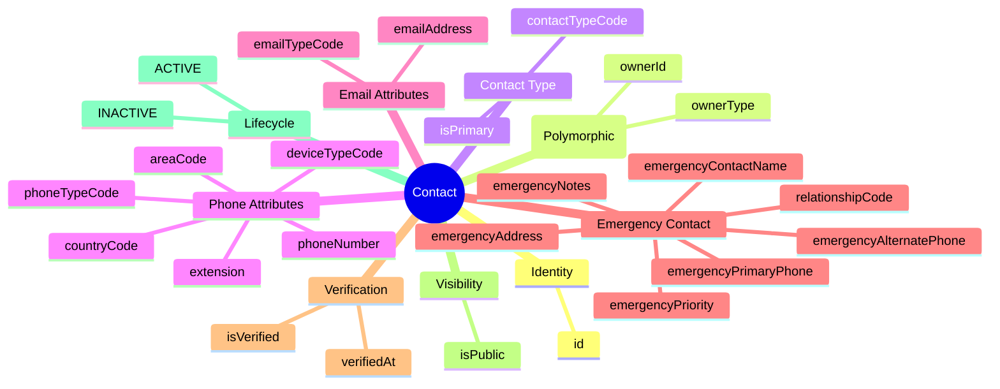
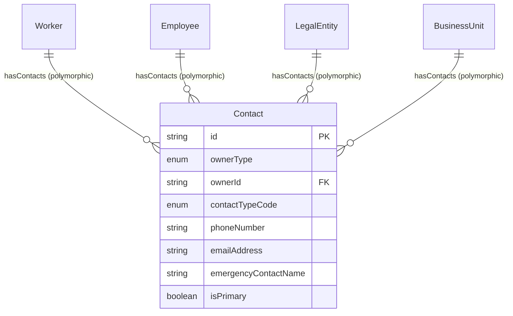
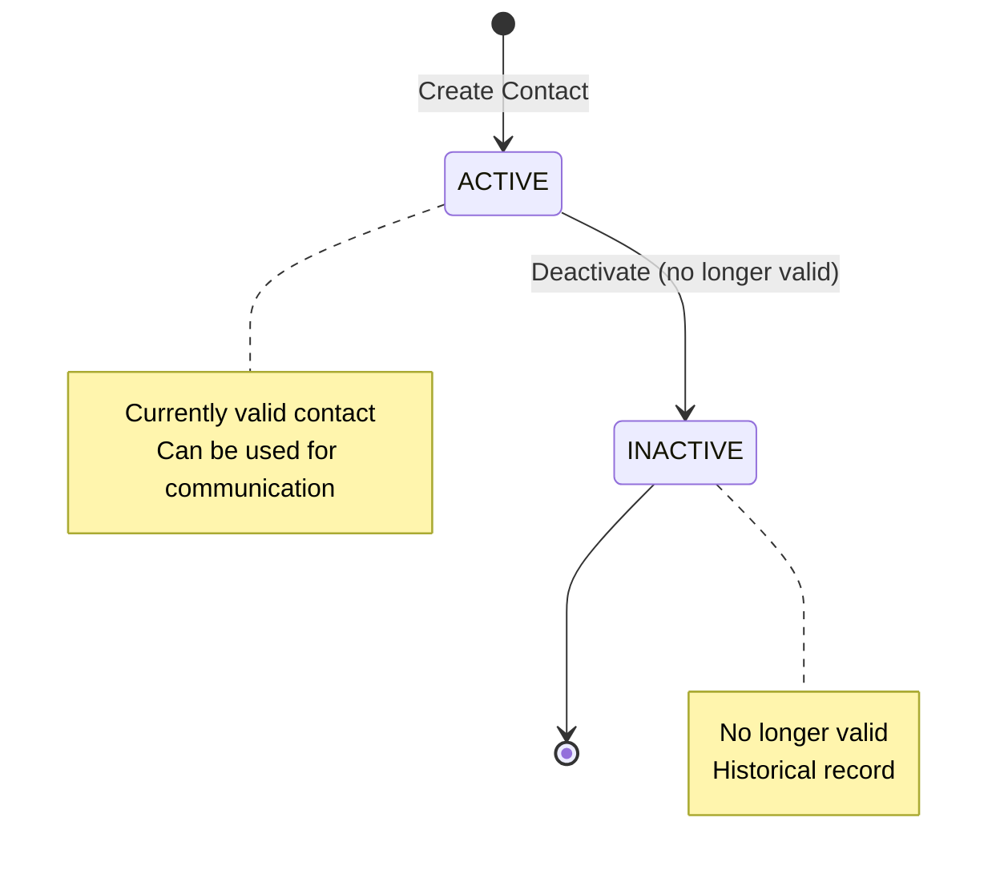

# Entity: Contact

## 1. Overview

The **Contact** entity stores communication information including phone numbers, email addresses, and emergency contacts. It is a **polymorphic entity** with **type-specific attributes** - different attributes are used depending on contactTypeCode (PHONE, EMAIL, or EMERGENCY_CONTACT).

**Key Concept**:
```
Contact = Polymorphic owner + Type-specific attributes
- PHONE: phoneNumber, phoneTypeCode, deviceTypeCode
- EMAIL: emailAddress, emailTypeCode
- EMERGENCY_CONTACT: emergencyContactName, relationshipCode, emergencyPrimaryPhone
```



**Design Rationale**:
- **Polymorphic Owner**: Same entity for Worker, Employee, LegalEntity, BusinessUnit contacts
- **Type-Specific Attributes**: Different attributes based on contactTypeCode
- **VN Phone Format**: Support for VN mobile (10 digits) and landline formats
- **Emergency Contact**: Full emergency contact info (name, relationship, phones, address)

---

## 2. Attributes

### 2.1 Identity Attributes

| Attribute | Type | Required | Description |
|-----------|------|----------|-------------|
| id | string | ✓ | Unique internal identifier (UUID) |

### 2.2 Owner Reference (Polymorphic)

| Attribute | Type | Required | Description |
|-----------|------|----------|-------------|
| ownerType | enum | ✓ | WORKER, EMPLOYEE, LEGAL_ENTITY, BUSINESS_UNIT |
| ownerId | string | ✓ | Reference to owner entity |

### 2.3 Contact Type

| Attribute | Type | Required | Description |
|-----------|------|----------|-------------|
| contactTypeCode | enum | ✓ | PHONE, EMAIL, EMERGENCY_CONTACT |
| isPrimary | boolean | ✓ | Primary contact flag |

### 2.4 Phone Attributes (when contactTypeCode = PHONE)

| Attribute | Type | Required | Description |
|-----------|------|----------|-------------|
| phoneTypeCode | enum | ✓* | HOME, MOBILE, WORK, FAX, OTHER |
| phoneNumber | string | ✓* | Complete phone number |
| countryCode | string | | Country dialing code (+84) |
| areaCode | string | | Area code (landlines) |
| extension | string | | Phone extension |
| deviceTypeCode | enum | | MOBILE, LANDLINE |

*Required if contactTypeCode = PHONE

### 2.5 Email Attributes (when contactTypeCode = EMAIL)

| Attribute | Type | Required | Description |
|-----------|------|----------|-------------|
| emailTypeCode | enum | ✓* | HOME, WORK, OTHER |
| emailAddress | string | ✓* | Email address |

*Required if contactTypeCode = EMAIL

### 2.6 Emergency Contact Attributes (when contactTypeCode = EMERGENCY_CONTACT)

| Attribute | Type | Required | Description |
|-----------|------|----------|-------------|
| emergencyContactName | string | ✓* | Contact person name |
| relationshipCode | enum | ✓* | SPOUSE, PARENT, CHILD, SIBLING, FRIEND, OTHER |
| emergencyPrimaryPhone | string | ✓* | Primary phone |
| emergencyAlternatePhone | string | | Alternate phone |
| emergencyAddress | string | | Contact address |
| emergencyPriority | integer | | Priority (1, 2, 3...) |
| emergencyNotes | string | | Special instructions |

*Required if contactTypeCode = EMERGENCY_CONTACT

### 2.7 Verification

| Attribute | Type | Required | Description |
|-----------|------|----------|-------------|
| isVerified | boolean | ✓ | Contact verified? |
| verifiedAt | datetime | | Verification timestamp |

### 2.8 Visibility

| Attribute | Type | Required | Description |
|-----------|------|----------|-------------|
| isPublic | boolean | ✓ | Publicly visible? |

### 2.9 Audit Attributes

| Attribute | Type | Required | Description |
|-----------|------|----------|-------------|
| createdAt | datetime | ✓ | Record creation timestamp |
| updatedAt | datetime | ✓ | Last modification timestamp |
| createdBy | string | ✓ | User who created record |
| updatedBy | string | ✓ | User who last modified |

---

## 3. Relationships



### Related Entities

No explicit relationships defined (polymorphic owner handled via ownerType + ownerId).

---

## 4. Lifecycle



### State Descriptions

| State | Description | Allowed Operations |
|-------|-------------|-------------------|
| **ACTIVE** | Currently valid contact | Can deactivate |
| **INACTIVE** | No longer valid | Read-only, historical |

### Transition Rules

| From | To | Trigger | Guard Condition |
|------|-----|---------|--------------------|
| ACTIVE | INACTIVE | deactivate | Contact no longer valid |

---

## 5. Business Rules Reference

### Validation Rules
- **OnePrimaryContactPerTypePerOwner**: At most ONE primary contact of each type per owner (WARNING)
- **PhoneAttributesRequired**: If PHONE, phoneTypeCode and phoneNumber required
- **EmailAttributesRequired**: If EMAIL, emailTypeCode and emailAddress required
- **EmergencyContactAttributesRequired**: If EMERGENCY_CONTACT, name/relationship/phone required
- **EmailFormatValidation**: Email must be valid format

### Business Constraints
- **VNPhoneFormatValidation**: VN mobile should be 10 digits (09x, 03x, 07x, 08x) (WARNING)
- **WorkerEmergencyContactRequired**: Worker should have emergency contact (WARNING)

### Contact Types

**Phone Types**:
| Code | Description | VN Example |
|------|-------------|------------|
| HOME | Home phone | 028-1234-5678 (landline) |
| MOBILE | Mobile/Cell | 0901234567 (10 digits) |
| WORK | Work phone | 028-9876-5432 |
| FAX | Fax number | 028-1111-2222 |
| OTHER | Other | - |

**Email Types**:
| Code | Description |
|------|-------------|
| HOME | Personal email |
| WORK | Work email |
| OTHER | Other |

**Relationship Types** (Emergency Contact):
| Code | VN Name |
|------|---------|
| SPOUSE | Vợ/Chồng |
| PARENT | Cha/Mẹ |
| CHILD | Con |
| SIBLING | Anh/Chị/Em |
| FRIEND | Bạn bè |
| OTHER | Khác |

### VN Phone Format
- **Country Code**: +84
- **Mobile**: 09x, 03x, 07x, 08x (10 digits total)
  - Example: 0901234567
- **Landline**: Area code + number
  - Example: 028-1234-5678 (TP.HCM)

### Related Business Rules Documents
- See `[[contact-management.brs.md]]` for complete business rules catalog
- See `[[vn-phone-validation.brs.md]]` for VN phone format validation
- See `[[emergency-contact-procedures.brs.md]]` for emergency contact procedures

---

## 6. Use Cases

### Use Case 1: Worker Mobile Phone (VN)

```yaml
Contact:
  id: "contact-001"
  ownerType: "WORKER"
  ownerId: "worker-001"
  contactTypeCode: "PHONE"
  isPrimary: true
  phoneTypeCode: "MOBILE"
  phoneNumber: "0901234567"
  countryCode: "+84"
  deviceTypeCode: "MOBILE"
  isVerified: true
```

### Use Case 2: Employee Work Email

```yaml
Contact:
  id: "contact-002"
  ownerType: "EMPLOYEE"
  ownerId: "emp-001"
  contactTypeCode: "EMAIL"
  isPrimary: true
  emailTypeCode: "WORK"
  emailAddress: "nguyen.van.a@company.com"
  isVerified: true
  isPublic: true  # Visible in company directory
```

### Use Case 3: Emergency Contact

```yaml
Contact:
  id: "contact-003"
  ownerType: "WORKER"
  ownerId: "worker-001"
  contactTypeCode: "EMERGENCY_CONTACT"
  isPrimary: true
  emergencyContactName: "Nguyễn Thị B"
  relationshipCode: "SPOUSE"
  emergencyPrimaryPhone: "0909876543"
  emergencyAlternatePhone: "028-1234-5678"
  emergencyAddress: "456 Lê Lợi, Quận 1, TP.HCM"
  emergencyPriority: 1
  emergencyNotes: "Gọi vào giờ hành chính"
```

### Use Case 4: Legal Entity Contact

```yaml
# Company Phone
Contact_Phone:
  ownerType: "LEGAL_ENTITY"
  ownerId: "le-001"
  contactTypeCode: "PHONE"
  phoneTypeCode: "WORK"
  phoneNumber: "028-1234-5678"
  isPrimary: true

# Company Email
Contact_Email:
  ownerType: "LEGAL_ENTITY"
  ownerId: "le-001"
  contactTypeCode: "EMAIL"
  emailTypeCode: "WORK"
  emailAddress: "info@company.com"
  isPrimary: true
  isPublic: true
```

---

*Document Status: APPROVED - Based on Oracle HCM, SAP SuccessFactors, Workday patterns*  
*VN Phone Format: Mobile 10 digits (09x, 03x, 07x, 08x)*
