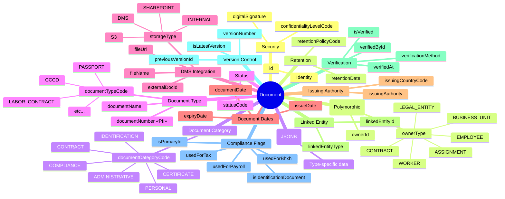
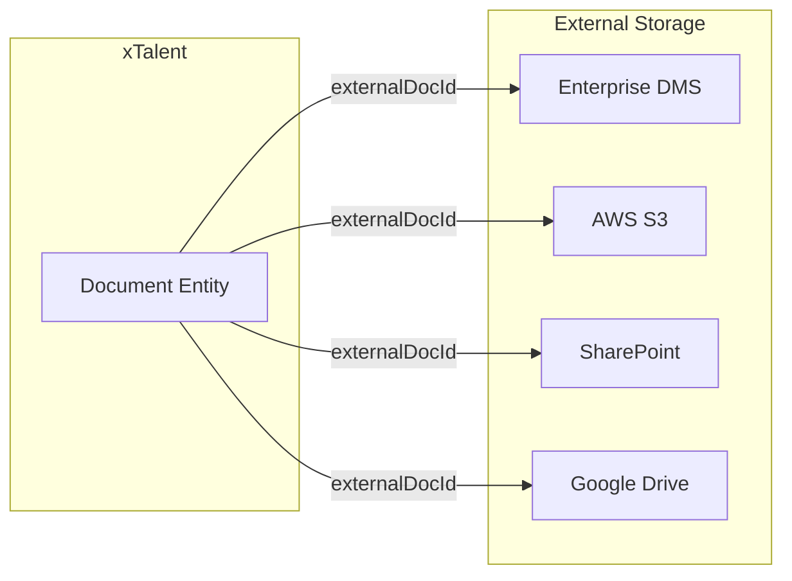
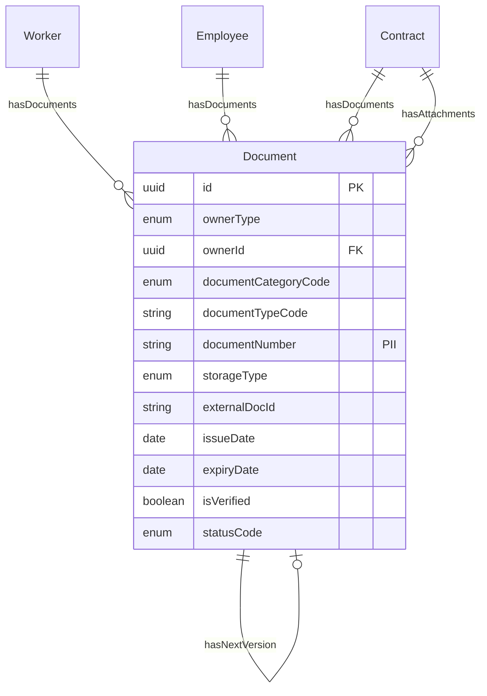

# Entity: Document

## 1. Overview

**Document** is the **Universal Document Registry** for all file attachments in xTalent. It stores document metadata and links to external DMS (Document Management System) or file storage.

**Key Concept:**
```
Document = Metadata Registry + DMS Link

Document DOES NOT store file content directly.
Document stores:
- Metadata (type, dates, verification status)
- Link to external storage (DMS, S3, SharePoint)

This replaces:
- Identification entity (deprecated)
- Separate contract attachment handling
- Certificate/qualification file storage
```



**Design Rationale:**
- **Single Source of Truth**: One entity for all documents
- **DMS Integration**: Link to external storage, not embedded files
- **Replaces Identification**: CCCD, Passport, Work Permit are document types
- **Version Control**: Track document versions with previousVersionId chain
- **VN Compliance**: Retention policies, verification workflow

---

## 2. Document Categories & Types

### 2.1 IDENTIFICATION Documents

| Type Code | Vietnamese | Description | Expiry Required |
|-----------|------------|-------------|-----------------|
| CCCD | Căn cước công dân | 12-digit citizen ID | No (permanent) |
| CMND | Chứng minh nhân dân | 9-digit legacy ID | No |
| PASSPORT | Hộ chiếu | Passport | Yes (10 years) |
| WORK_PERMIT | Giấy phép lao động | Work permit (foreigners) | Yes (max 2 years) |
| VISA | Thị thực | Entry visa | Yes |
| DRIVER_LICENSE | Giấy phép lái xe | Driver license | Yes |
| BHXH_BOOK | Sổ BHXH | Social insurance book | No |

### 2.2 CONTRACT Documents

| Type Code | Vietnamese | Description |
|-----------|------------|-------------|
| LABOR_CONTRACT | Hợp đồng lao động | Employment contract |
| PROBATION_CONTRACT | Hợp đồng thử việc | Probation contract |
| CONTRACT_APPENDIX | Phụ lục hợp đồng | Contract appendix |
| CONTRACT_RENEWAL | Gia hạn hợp đồng | Contract renewal |
| TERMINATION_AGREEMENT | Thỏa thuận chấm dứt HĐ | Termination agreement |

### 2.3 COMPLIANCE Documents

| Type Code | Vietnamese | Description |
|-----------|------------|-------------|
| TAX_CODE_REG | Đăng ký mã số thuế | Tax code registration |
| BHXH_REGISTRATION | Đăng ký BHXH | Social insurance registration |
| WORK_PERMIT_EXEMPTION | Miễn giấy phép lao động | Work permit exemption |

### 2.4 CERTIFICATE Documents

| Type Code | Vietnamese | Description |
|-----------|------------|-------------|
| BACHELOR_DEGREE | Bằng đại học | Bachelor's degree |
| MASTER_DEGREE | Bằng thạc sĩ | Master's degree |
| DOCTORATE_DEGREE | Bằng tiến sĩ | Doctorate degree |
| PROFESSIONAL_LICENSE | Chứng chỉ hành nghề | Professional license |
| TRAINING_CERTIFICATE | Chứng chỉ đào tạo | Training certificate |

### 2.5 ADMINISTRATIVE Documents

| Type Code | Vietnamese | Description | Retention |
|-----------|------------|-------------|-----------|
| RESIGNATION_LETTER | Đơn xin nghỉ việc | Resignation letter | 10 years |
| TERMINATION_DECISION | Quyết định nghỉ việc | Termination decision | 10 years |
| TRANSFER_ORDER | Quyết định điều chuyển | Transfer order | 10 years |
| PROMOTION_ORDER | Quyết định bổ nhiệm | Promotion order | 10 years |
| DISCIPLINARY_NOTICE | Quyết định kỷ luật | Disciplinary notice | 10 years |

---

## 3. DMS Integration

Document supports integration with external Document Management Systems:



### Storage Types

| storageType | Description | externalDocId Format |
|-------------|-------------|----------------------|
| INTERNAL | xTalent file storage | /files/2026/01/doc-123.pdf |
| DMS | Enterprise DMS | DMS-DOC-12345 |
| S3 | AWS S3 bucket | s3://xtalent-docs/worker/123/cccd.pdf |
| AZURE_BLOB | Azure Blob Storage | https://account.blob.core.windows.net/... |
| SHAREPOINT | SharePoint Online | https://tenant.sharepoint.com/sites/.../doc.pdf |
| GOOGLE_DRIVE | Google Drive | 1234567890abcdef |

---

## 4. Use Cases

### Use Case 1: CCCD (Citizen ID)

```yaml
Document:
  id: "doc-001"
  ownerType: "WORKER"
  ownerId: "worker-001"
  documentCategoryCode: "IDENTIFICATION"
  documentTypeCode: "CCCD"
  documentName: "CCCD - Nguyễn Văn A"
  documentNumber: "012345678901"  # Encrypted
  documentNumberMasked: "****8901"
  issueDate: "2020-05-15"
  expiryDate: null  # CCCD is permanent
  issuingAuthority: "Cục Cảnh sát QLHC về TTXH"
  issuingCountryCode: "VN"
  storageType: "S3"
  externalDocId: "s3://xtalent-docs/worker/001/cccd-front.pdf"
  isVerified: true
  verifiedAt: "2024-01-10T10:00:00Z"
  verificationMethod: "OCR_SCAN"
  isIdentificationDocument: true
  isPrimaryId: true
  usedForBhxh: true
  usedForTax: true
  statusCode: "VERIFIED"
  metadata:
    fullNameOnDocument: "NGUYỄN VĂN A"
    dateOfBirthOnDocument: "1990-01-15"
    genderOnDocument: "MALE"
    permanentAddressOnDocument: "123 Nguyễn Trãi, Q1, TPHCM"
```

### Use Case 2: Labor Contract (Attached to Contract Entity)

```yaml
Document:
  id: "doc-002"
  ownerType: "CONTRACT"
  ownerId: "contract-001"
  documentCategoryCode: "CONTRACT"
  documentTypeCode: "LABOR_CONTRACT"
  documentName: "HĐ Lao động - NV00123 - 2024"
  documentDate: "2024-01-15"
  storageType: "DMS"
  externalDocId: "DMS-HD-2024-00123"
  isVerified: true
  confidentialityLevelCode: "CONFIDENTIAL"
  statusCode: "VERIFIED"
  retentionPolicyCode: "VN_CONTRACT_10Y"
  metadata:
    contractNumber: "HD-2024-00123"
    signedByEmployee: true
    signedByEmployer: true
    signatureDate: "2024-01-15"
```

### Use Case 3: Contract Appendix (Salary Adjustment)

```yaml
Document:
  id: "doc-003"
  ownerType: "CONTRACT"
  ownerId: "contract-001"
  linkedEntityType: "CONTRACT"
  linkedEntityId: "contract-001"  # Links to parent contract
  documentCategoryCode: "CONTRACT"
  documentTypeCode: "CONTRACT_APPENDIX"
  documentName: "Phụ lục HĐ - Điều chỉnh lương - 2025"
  documentDate: "2025-01-01"
  storageType: "DMS"
  externalDocId: "DMS-PL-2025-00001"
  statusCode: "VERIFIED"
  versionNumber: 1
  metadata:
    appendixNumber: "PL-01/2025"
    changeType: "SALARY_ADJUSTMENT"
    previousSalary: 20000000
    newSalary: 25000000
    effectiveDate: "2025-01-01"
```

---

## 5. Relationships



---

## 6. Vietnam Compliance

### Retention Requirements

| Document Type | Retention Period | Legal Reference |
|---------------|------------------|-----------------|
| Identity docs (CCCD) | Employment + 5 years | Bộ Luật Lao động |
| Labor contracts | 10 years after termination | Bộ Luật Lao động Điều 14 |
| Tax documents | 5 years | Luật Thuế TNCN |
| BHXH records | Permanent | Luật BHXH |
| Work permits | Employment duration | NĐ 70/2023 |

---

*Document Status: DRAFT v2.0.0*  
*Refactored as Universal Document Registry*  
*Replaces: Identification.onto.md (deprecated)*
