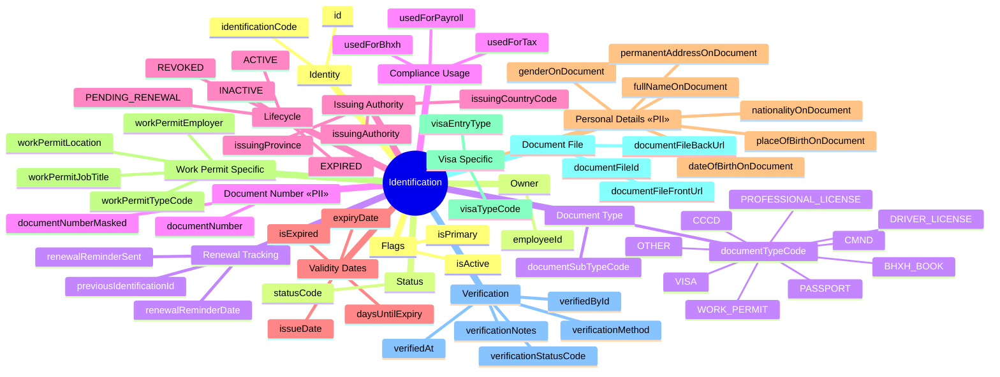
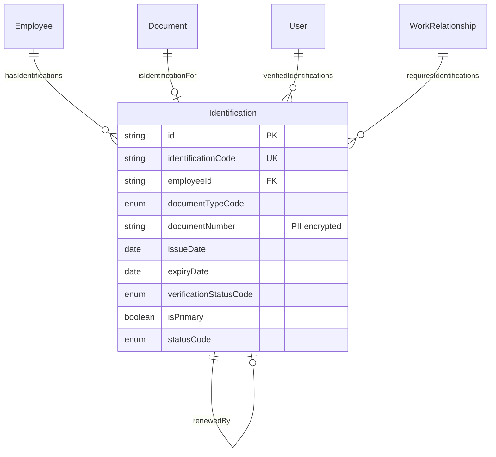
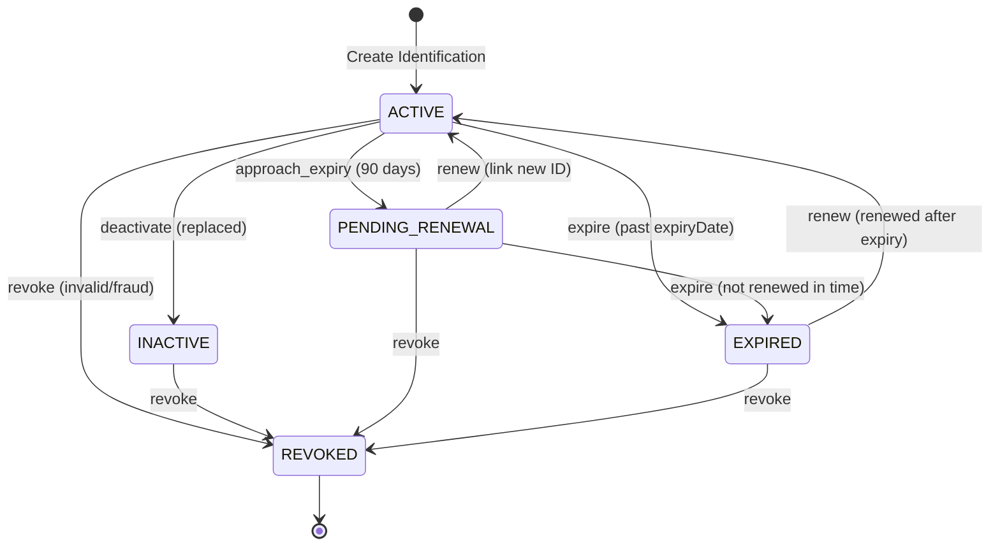

# Entity: Identification

## 1. Overview

**Identification** entity quản lý các giấy tờ tùy thân của nhân viên, bao gồm CCCD, CMND, Hộ chiếu, Giấy phép lao động, v.v. Đây là entity quan trọng cho:
- **Compliance** - BHXH registration, Tax registration, Work permit tracking
- **PII Protection** - Encrypted storage, Masked display, Access logging
- **Foreign Worker Management** - Work permit validity, Visa tracking

**Key Concept**:
```
Identification = Legal identity document with validity tracking
Employee may have multiple Identifications (CCCD, Passport, Work Permit)
One primary per type for official use
```



**Design Rationale**:
- **Multiple Types per Employee**: One employee may have CCCD, Passport, Work Permit
- **PII First-Class**: Document numbers encrypted, masked for display
- **Work Permit Focus**: Vietnam foreign worker compliance (NĐ 70/2023)
- **Expiry Tracking**: Proactive renewal reminders
- **Verification Workflow**: Track who verified and how

---

## 2. Attributes

### 2.1 Identity Attributes

| Attribute | Type | Required | Description | DB Column |
|-----------|------|----------|-------------|-----------|
| id | string | ✓ | Unique internal identifier | person.identification.id |
| identificationCode | string | ✓ | Business code (ID-XX-NNNNNNNNNNNN) | person.identification.code |

### 2.2 Owner Reference

| Attribute | Type | Required | Description | DB Column |
|-----------|------|----------|-------------|-----------|
| employeeId | string | ✓ | Employee who owns this ID | person.identification.employee_id → employment.employee.id |

### 2.3 Document Type

| Attribute | Type | Required | Description |
|-----------|------|----------|-------------|
| documentTypeCode | enum | ✓ | CCCD, CMND, PASSPORT, WORK_PERMIT, VISA, BHXH_BOOK, DRIVER_LICENSE, PROFESSIONAL_LICENSE, OTHER |
| documentSubTypeCode | string | | Sub-classification |

**Document Type Reference**:

| Code | Vietnamese | Description | Expiry Required |
|------|------------|-------------|-----------------|
| CCCD | Căn cước công dân | Citizen ID (chip) | No (permanent) |
| CMND | Chứng minh nhân dân | Legacy ID card | No |
| PASSPORT | Hộ chiếu | Passport | Yes (10 years) |
| WORK_PERMIT | Giấy phép lao động | Work permit for foreigners | Yes (max 2 years) |
| VISA | Thị thực | Entry visa | Yes |
| BHXH_BOOK | Sổ BHXH | Social insurance book | No |
| DRIVER_LICENSE | Giấy phép lái xe | Driver license | Yes |
| PROFESSIONAL_LICENSE | Chứng chỉ hành nghề | Professional license | Varies |

### 2.4 Document Number (PII)

| Attribute | Type | Required | Description | PII |
|-----------|------|----------|-------------|-----|
| documentNumber | string | ✓ | Official document number (encrypted) | ✓ |
| documentNumberMasked | string | | Masked for display (****1234) | |

**Format Examples**:
| Type | Format | Example |
|------|--------|---------|
| CCCD | 12 digits | 001234567890 |
| CMND | 9 digits | 123456789 |
| Passport (VN) | 1 letter + 7 digits | B1234567 |
| Work Permit | Variable | WP-2026-001234 |

### 2.5 Issuing Authority

| Attribute | Type | Required | Description |
|-----------|------|----------|-------------|
| issuingCountryCode | string | ✓ | ISO 3166-1 alpha-2 (default: VN) |
| issuingAuthority | string | | Authority name |
| issuingProvince | string | | Province/State |

### 2.6 Validity Dates

| Attribute | Type | Required | Description |
|-----------|------|----------|-------------|
| issueDate | date | ✓ | Date issued |
| expiryDate | date | Conditional | Required for PASSPORT, WORK_PERMIT, VISA, DRIVER_LICENSE |
| isExpired | boolean | ✓ | Computed: expiryDate < today |
| daysUntilExpiry | integer | | Computed: days until expiry |

### 2.7 Personal Details (PII)

| Attribute | Type | Required | Description | PII |
|-----------|------|----------|-------------|-----|
| fullNameOnDocument | string | | Name on document | ✓ |
| dateOfBirthOnDocument | date | | DOB on document | ✓ |
| genderOnDocument | enum | | MALE, FEMALE, OTHER, UNKNOWN | |
| nationalityOnDocument | string | | ISO country code | |
| placeOfBirthOnDocument | string | | Place of birth | ✓ |
| permanentAddressOnDocument | string | | Permanent address (CCCD) | ✓ |

### 2.8 Work Permit Specific

| Attribute | Type | Required | Description |
|-----------|------|----------|-------------|
| workPermitTypeCode | enum | | TYPE_A (Manager), TYPE_B (Expert), TYPE_C (Technical), TYPE_D (Labor) |
| workPermitJobTitle | string | | Job title on permit |
| workPermitEmployer | string | | Employer on permit |
| workPermitLocation | string | | Authorized location |

### 2.9 Verification

| Attribute | Type | Required | Description |
|-----------|------|----------|-------------|
| verificationStatusCode | enum | ✓ | PENDING, VERIFIED, INVALID, EXPIRED, REVOKED |
| verifiedAt | datetime | | Verification timestamp |
| verifiedById | string | | Verifier user ID |
| verificationMethod | enum | | MANUAL_CHECK, OCR_SCAN, API_VERIFICATION, NOTARIZED_COPY |
| verificationNotes | string | | Verification notes |

### 2.10 Flags & Status

| Attribute | Type | Required | Description |
|-----------|------|----------|-------------|
| isPrimary | boolean | ✓ | Primary ID for this type? |
| isActive | boolean | ✓ | Currently active? |
| statusCode | enum | ✓ | ACTIVE, INACTIVE, PENDING_RENEWAL, EXPIRED, REVOKED |

### 2.11 Compliance Usage

| Attribute | Type | Required | Description |
|-----------|------|----------|-------------|
| usedForBhxh | boolean | ✓ | Used for BHXH registration? |
| usedForTax | boolean | ✓ | Used for tax registration? |
| usedForPayroll | boolean | ✓ | Used for payroll/bank verification? |

### 2.12 Audit Attributes

| Attribute | Type | Required | Description |
|-----------|------|----------|-------------|
| createdAt | datetime | ✓ | Record creation timestamp |
| updatedAt | datetime | ✓ | Last modification timestamp |
| createdBy | string | ✓ | Creator user ID |
| updatedBy | string | ✓ | Last modifier user ID |

---

## 3. Relationships



### Related Entities

| Entity | Relationship | Cardinality | Description |
|--------|--------------|-------------|-------------|
| [[Employee]] | belongsToEmployee | N:1 | Owner of identification |
| [[Document]] | hasDocumentFile | 1:1 | Scanned copy |
| [[User]] | verifiedByUser | N:1 | Who verified |
| [[Identification]] | renewsFrom / renewedBy | N:1 / 1:1 | Renewal chain |
| [[WorkRelationship]] | forWorkRelationship | N:1 | Work permit for WR |

---

## 4. Lifecycle



| State | Business Meaning | System Impact |
|-------|------------------|---------------|
| **ACTIVE** | Valid and in use | Can be used for compliance |
| **PENDING_RENEWAL** | Near expiry, needs renewal | Sends reminder notifications |
| **EXPIRED** | Past expiry date | Cannot be used (compliance warning) |
| **INACTIVE** | Replaced by newer document | Historical record only |
| **REVOKED** | Invalid (lost, stolen, fraud) | Flagged for security |

---

## 5. Business Rules Reference

### Vietnam Regulations

| Rule | Reference | Description |
|------|-----------|-------------|
| CCCD Mandatory | Civil Law | All VN citizens must have CCCD |
| Work Permit Foreign | NĐ 70/2023 | Foreign workers must have valid permit |
| Renewal Window | NĐ 70/2023 | Work permit renewal 5-45 days before expiry |
| Max Duration | NĐ 70/2023 | Work permit max 2 years |
| BHXH Registration | BHXH Law | CCCD/CMND needed for registration |

### Related Business Rules

- [[Identification.brs.md]] - Document validation rules
- [[ForeignWorker.brs.md]] - Work permit requirements
- [[BHXH.brs.md]] - Social insurance ID requirements

---

## 6. PII Handling

### Data Classification

| Field | Classification | Storage | Display |
|-------|----------------|---------|---------|
| documentNumber | SENSITIVE | AES-256 Encrypted | Masked (****XXXX) |
| fullNameOnDocument | PII | Encrypted | Full (authorized only) |
| dateOfBirthOnDocument | PII | Encrypted | Full (authorized only) |
| permanentAddressOnDocument | PII | Encrypted | Masked |
| documentFileFrontUrl | PII | Access controlled | Authorized only |

### Access Control

| Role | View | Edit | Verify | Revoke |
|------|------|------|--------|--------|
| Employee (self) | ✓ | ✓ (create) | | |
| HR Admin | ✓ | ✓ | ✓ | ✓ |
| Manager | ✓ (team) | | | |
| Payroll Admin | ✓ (partial) | | | |
| Auditor | ✓ | | | |

---

## 7. Vietnam Regulatory Notes

### Nghị định 70/2023/NĐ-CP - Giấy phép lao động

> - Thời hạn giấy phép lao động tối đa 02 năm
> - Gia hạn trước 05-45 ngày trước khi hết hạn
> - Phải phù hợp với hợp đồng lao động và vị trí công việc
> - Các trường hợp miễn giấy phép lao động theo Điều 152 BLLĐ

### Căn cước công dân (CCCD)

> - Thay thế CMND từ 2021
> - Cookie chip chứa thông tin sinh trắc
> - Không có thời hạn (permanent)
> - 12 số theo cấu trúc: XXX-Y-ZZ-NNNNNN
>   - XXX: Mã tỉnh nơi đăng ký khai sinh
>   - Y: Giới tính + thế kỷ sinh
>   - ZZ: Năm sinh (2 số cuối)
>   - NNNNNN: Số ngẫu nhiên
