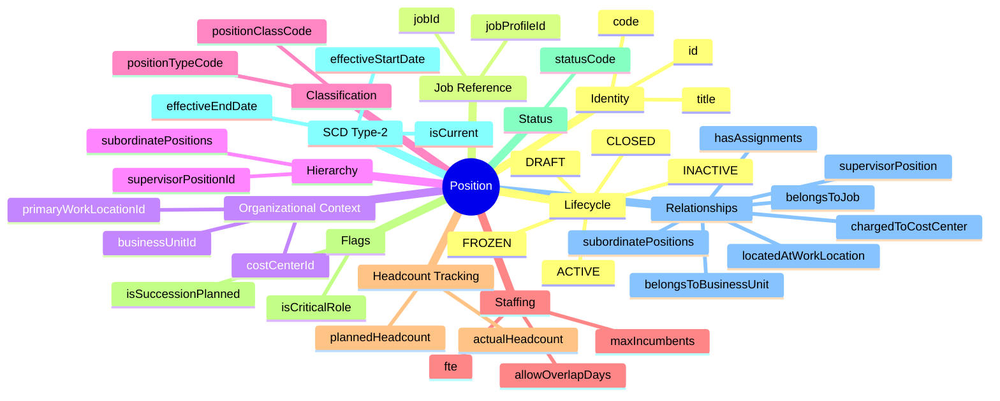
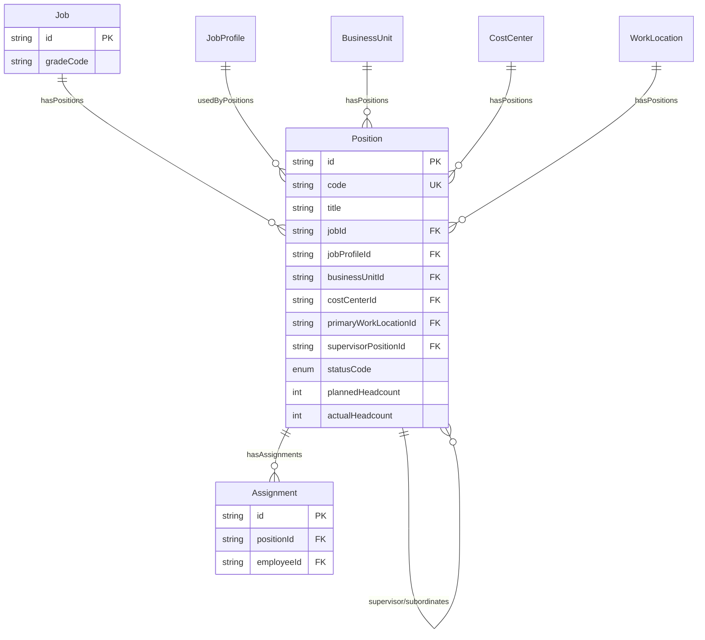
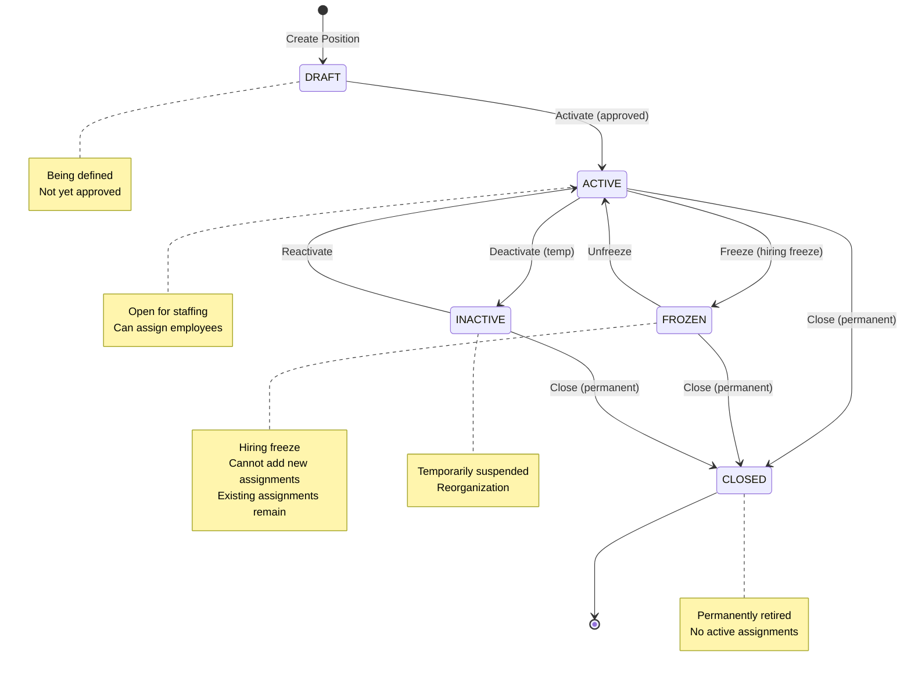

# Entity: Position

## 1. Overview

**Position** represents a specific "chair" in the organization that an employee can sit in. It is an instance of a [[Job]], belonging to a specific [[BusinessUnit]], with defined reporting relationships (org chart), and headcount tracking (planned vs actual).

**Key Concept**:
```
Position = "Chair" (instance of Job)
Job → Position = Template → Instance
Position Hierarchy = Org Chart
Assignment = Employee placed in Position
```



### Industry Alignment

| Vendor | Pattern | xTalent Equivalent |
|--------|---------|-------------------|
| Oracle HCM | Position (with Job reference) | Position → Job |
| SAP SuccessFactors | Position (MDF Object) | Position with effectiveDate |
| Workday | Position (links to Job Profile) | Position + JobProfile optional |

### Position vs Job

| Aspect | Job | Position |
|--------|-----|----------|
| **Nature** | Template/Classification | Instance/Chair |
| **Multiplicity** | One Job → Many Positions | One Position → One (or few) Employees |
| **Hierarchy** | Job Family/Group | Org Chart (reports-to) |
| **Headcount** | N/A | Planned vs Actual |
| **Compensation** | Grade/Level (via Job) | Inherited from Job |

---

## 2. Attributes

### 2.1 Identity

| Attribute | Type | Required | Description |
|-----------|------|----------|-------------|
| id | string | ✓ | Unique identifier (UUID) |
| code | string | ✓ | Position code (unique) |
| title | string | ✓ | Position title |

### 2.2 Job Reference

| Attribute | Type | Required | Description |
|-----------|------|----------|-------------|
| **jobId** | string | ✓ | FK → [[Job]]. Required for grade/level (TR integration) |
| jobProfileId | string | | FK → [[JobProfile]]. Optional detailed description |

**TR Integration Path**:
```
Position → Job → job.gradeCode → TR.GradeVersion → PayRange
```

### 2.3 Organizational Context

| Attribute | Type | Required | Description |
|-----------|------|----------|-------------|
| **businessUnitId** | string | ✓ | FK → [[BusinessUnit]]. Owner department |
| costCenterId | string | | FK → [[CostCenter]]. Financial tracking |
| primaryWorkLocationId | string | | FK → [[WorkLocation]]. Primary location |

### 2.4 Hierarchy

| Attribute | Type | Required | Description |
|-----------|------|----------|-------------|
| supervisorPositionId | string | | FK → [[Position]] (self-ref). Reports-to |

### 2.5 Classification

| Attribute | Type | Required | Description |
|-----------|------|----------|-------------|
| positionClassCode | enum | | REGULAR, MANAGER, EXECUTIVE, SPECIALIST, SUPPORT, CONSULTANT, TRAINEE |
| positionTypeCode | enum | ✓ | FULL_TIME, PART_TIME, CONTRACT, TEMPORARY, INTERN |

### 2.6 Staffing

| Attribute | Type | Required | Description |
|-----------|------|----------|-------------|
| fte | decimal | | Full-Time Equivalent (0.0 - 1.0) |
| maxIncumbents | integer | ✓ | Max employees (1 = standard, >1 = shared) |
| allowOverlapDays | integer | | Handover overlap days |

### 2.7 Headcount Tracking

| Attribute | Type | Required | Description |
|-----------|------|----------|-------------|
| plannedHeadcount | integer | ✓ | Target/budgeted headcount |
| actualHeadcount | integer | | Current assignments (derived) |

**Derived Fields**:
- `isVacant = actualHeadcount < plannedHeadcount`
- `vacancyCount = plannedHeadcount - actualHeadcount`

### 2.8 Flags

| Attribute | Type | Required | Description |
|-----------|------|----------|-------------|
| isCriticalRole | boolean | ✓ | Key role for organization? |
| isSuccessionPlanned | boolean | ✓ | Has succession plan? |

### 2.9 Status

| Attribute | Type | Required | Description |
|-----------|------|----------|-------------|
| statusCode | enum | ✓ | DRAFT, ACTIVE, FROZEN, INACTIVE, CLOSED |

### 2.10 SCD Type-2

| Attribute | Type | Required | Description |
|-----------|------|----------|-------------|
| effectiveStartDate | date | ✓ | Position becomes effective |
| effectiveEndDate | date | | Position expires |
| isCurrent | boolean | ✓ | Current version flag |

---

## 3. Relationships



### Related Entities

| Entity | Relationship | Cardinality | Description |
|--------|--------------|-------------|-------------|
| [[Job]] | belongsToJob | N:1 | Job template (required) |
| [[JobProfile]] | hasJobProfile | N:1 | Detailed description (optional) |
| [[BusinessUnit]] | belongsToBusinessUnit | N:1 | Owner department (required) |
| [[CostCenter]] | chargedToCostCenter | N:1 | Financial tracking |
| [[WorkLocation]] | locatedAtWorkLocation | N:1 | Primary work location |
| [[Position]] | supervisorPosition | N:1 | Reports-to (self-ref) |
| [[Position]] | subordinatePositions | 1:N | Direct reports (self-ref) |
| [[Assignment]] | hasAssignments | 1:N | Employee assignments |

---

## 4. Lifecycle



### State Descriptions

| State | Description | Can Assign? |
|-------|-------------|-------------|
| **DRAFT** | Being defined, not approved | ❌ |
| **ACTIVE** | Open for staffing | ✅ |
| **FROZEN** | Hiring freeze, no new assignments | ❌ |
| **INACTIVE** | Temporarily suspended | ❌ |
| **CLOSED** | Permanently retired | ❌ |

---

## 5. Business Rules Reference

### Validation Rules
- **UniqueCodeGlobally**: Code unique across all positions
- **JobRequired**: Every position must reference a Job
- **BusinessUnitRequired**: Every position must belong to a BU
- **FTERange**: FTE between 0.0 and 1.0
- **HeadcountConsistency**: actual ≤ planned × maxIncumbents (WARNING)
- **SupervisorNotSelf**: Position cannot report to itself
- **SupervisorMustBeActive**: Supervisor must be ACTIVE (WARNING)

### Business Constraints
- **ClosedPositionNoAssignments**: CLOSED position has no active assignments
- **FrozenPositionNoNewAssignments**: Cannot assign to FROZEN position
- **CriticalRoleSuccession**: Critical roles should have succession plan (INFO)

### Position Types

| Type | Description | FTE Typical |
|------|-------------|-------------|
| FULL_TIME | Standard full-time | 1.0 |
| PART_TIME | Part-time reduced hours | 0.5 |
| CONTRACT | Fixed-term contract | 1.0 |
| TEMPORARY | Temporary/seasonal | 0.5-1.0 |
| INTERN | Internship/trainee | 0.5-1.0 |

### Example: Position Creation

```yaml
Position:
  code: "POS-DEV-001"
  title: "Senior Software Engineer - Backend Team"
  jobId: "job-senior-dev"           # Links to Job
  businessUnitId: "bu-engineering"  # Engineering Department
  costCenterId: "cc-dev"            # Development cost center
  primaryWorkLocationId: "wl-etown-f5"
  supervisorPositionId: "POS-TL-001"  # Reports to Team Lead
  positionClassCode: "SPECIALIST"
  positionTypeCode: "FULL_TIME"
  fte: 1.0
  maxIncumbents: 1
  plannedHeadcount: 1
  statusCode: "ACTIVE"
  isCriticalRole: true
  isSuccessionPlanned: false        # WARNING: should add succession plan
```

---

*Document Status: APPROVED*  
*Based on: Oracle HCM Position, SAP SuccessFactors Position, Workday Position*  
*TR Integration: Position → Job → gradeCode → TR.GradeVersion*
