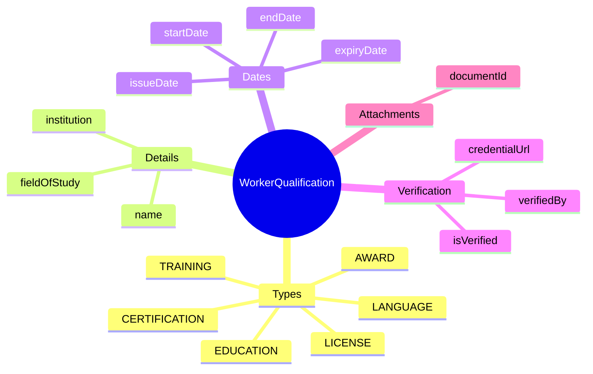
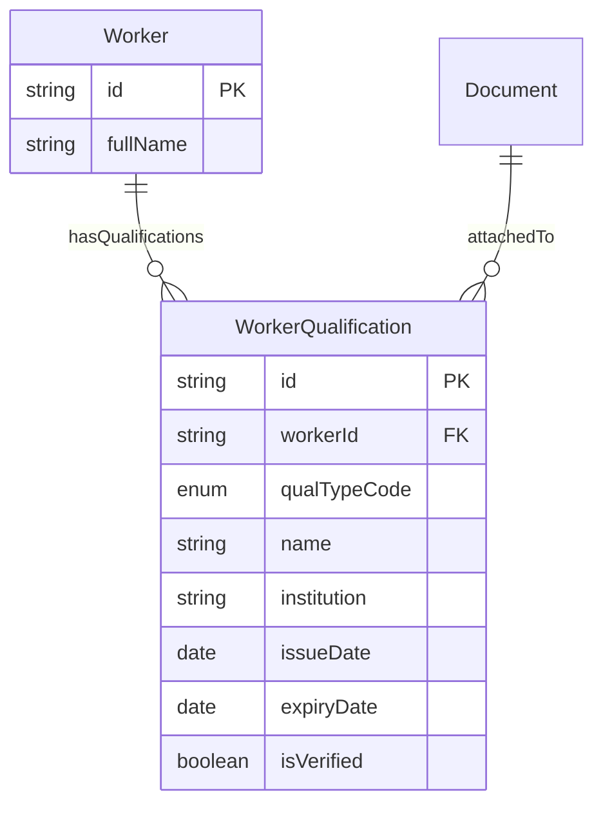

# Entity: WorkerQualification

## 1. Overview

**WorkerQualification** stores educational credentials, professional certifications, licenses, language proficiencies, and other formal qualifications earned by a worker.

**Key Distinction**:
```
WorkerSkill = What you CAN DO (abilities, proficiency)
WorkerQualification = What you HAVE EARNED (degrees, certs, licenses)
```



### Qualification Types

| Type | Description | Example |
|------|-------------|---------|
| **EDUCATION** | Academic degrees | Bachelor of CS, MBA |
| **CERTIFICATION** | Professional certs | AWS SA, PMP, CPA |
| **LICENSE** | Professional licenses | CPA License, Medical License |
| **LANGUAGE** | Language proficiency | IELTS 7.5, JLPT N1 |
| **AWARD** | Awards and honors | Employee of the Year |
| **TRAINING** | Training programs | Leadership Development Program |

---

## 2. Attributes

### Identity & Type

| Attribute | Type | Required | Description |
|-----------|------|----------|-------------|
| id | string | ✓ | Unique identifier (UUID) |
| workerId | string | ✓ | FK → [[Worker]] |
| qualTypeCode | enum | ✓ | EDUCATION, CERTIFICATION, etc. |

### Details

| Attribute | Type | Required | Description |
|-----------|------|----------|-------------|
| name | string | ✓ | Qualification name |
| institution | string | | Issuing organization |
| fieldOfStudy | string | | Major/field (education) |
| levelOrScore | string | | Grade/score/level |

### Dates

| Attribute | Type | Required | Description |
|-----------|------|----------|-------------|
| startDate | date | | Program start |
| endDate | date | | Completion date |
| issueDate | date | | Award/issue date |
| expiryDate | date | | Expiration (certs) |

### Verification

| Attribute | Type | Required | Description |
|-----------|------|----------|-------------|
| credentialId | string | | External cert number |
| credentialUrl | string | | Verification URL |
| isVerified | boolean | ✓ | Verified by HR? |

---

## 3. Relationships



---

## 4. Use Cases

### Education - Bachelor Degree

```yaml
WorkerQualification:
  workerId: "worker-001"
  qualTypeCode: "EDUCATION"
  name: "Bachelor of Computer Science"
  institution: "VNU - University of Science"
  fieldOfStudy: "Computer Science"
  startDate: "2015-09-01"
  endDate: "2019-06-15"
  issueDate: "2019-07-01"
  levelOrScore: "3.6 GPA"
  gradeCode: "EXCELLENT"
  isVerified: true
  verifiedBy: "hr-admin-001"
  verifiedDate: "2020-01-15"
  metadata:
    honors: "Cum Laude"
    thesis: "Machine Learning in NLP"
```

### Certification - AWS

```yaml
WorkerQualification:
  workerId: "worker-001"
  qualTypeCode: "CERTIFICATION"
  name: "AWS Solutions Architect - Professional"
  institution: "Amazon Web Services"
  issueDate: "2024-03-15"
  expiryDate: "2027-03-15"
  credentialId: "AWS-SAP-12345"
  credentialUrl: "https://www.credly.com/badges/xxx"
  isVerified: true
  verifiedBy: "system"
  metadata:
    examScore: 850
    validationNumber: "XXXXXXXXXX"
```

### Language - IELTS

```yaml
WorkerQualification:
  workerId: "worker-001"
  qualTypeCode: "LANGUAGE"
  name: "IELTS Academic"
  institution: "British Council"
  issueDate: "2023-06-20"
  expiryDate: "2025-06-20"
  levelOrScore: "7.5"
  metadata:
    listening: 8.0
    reading: 7.5
    writing: 7.0
    speaking: 7.5
```

---

*Document Status: APPROVED*  
*References: [[Worker]], [[Document]], [[WorkerSkill]]*
