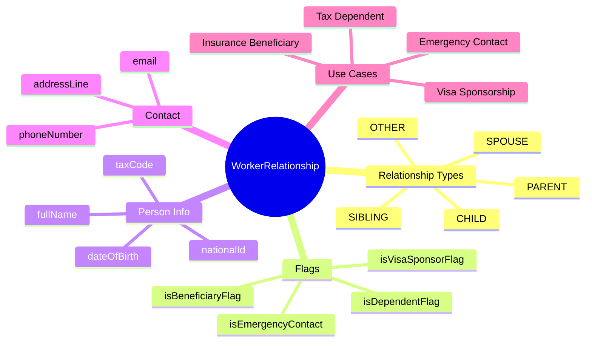
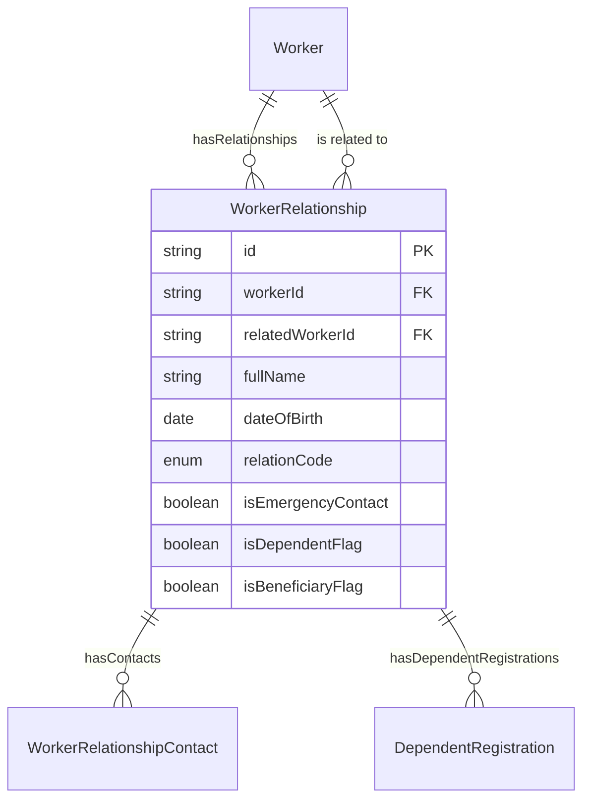
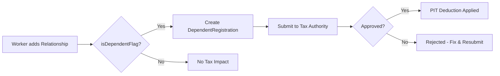

# Entity: WorkerRelationship

## 1. Overview

**WorkerRelationship** stores information about a worker's family members, emergency contacts, dependents, and beneficiaries. This entity supports multiple use cases across HR operations.



### Use Cases

| Use Case | Flags | Purpose |
|----------|-------|---------|
| **Emergency Contact** | isEmergencyContact = true | Who to call in emergencies |
| **Tax Dependent** | isDependentFlag = true | PIT deduction registration |
| **Insurance Beneficiary** | isBeneficiaryFlag = true | Life insurance, estate |
| **Visa Sponsorship** | isVisaSponsorFlag = true | Expat family relocation |

### Relationship Types (Vietnamese)

| Code | English | Vietnamese |
|------|---------|------------|
| SPOUSE | Spouse | Vợ/Chồng |
| CHILD | Child | Con |
| PARENT | Parent | Bố/Mẹ |
| SIBLING | Sibling | Anh/Chị/Em |
| GRANDPARENT | Grandparent | Ông/Bà |
| GRANDCHILD | Grandchild | Cháu |
| IN_LAW | In-law | Bố/Mẹ/Anh/Chị vợ/chồng |
| GUARDIAN | Guardian | Người giám hộ |
| DOMESTIC_PARTNER | Domestic Partner | Người chung sống |

---

## 2. Attributes

### Identity

| Attribute | Type | Required | Description |
|-----------|------|----------|-------------|
| id | string | ✓ | Unique identifier (UUID) |
| workerId | string | ✓ | FK → [[Worker]] |
| relatedWorkerId | string | | FK → [[Worker]] (if also employee) |

### Person Info

| Attribute | Type | Required | Description |
|-----------|------|----------|-------------|
| fullName | string | | Full name |
| dateOfBirth | date | | DOB |
| gender | enum | | MALE, FEMALE, OTHER |
| nationalId | string | | CCCD/CMND |
| taxCode | string | | MST cá nhân |

### Relationship

| Attribute | Type | Required | Description |
|-----------|------|----------|-------------|
| relationCode | enum | ✓ | SPOUSE, CHILD, PARENT, etc. |
| relationDescription | string | | Detailed description |

### Flags

| Attribute | Type | Required | Description |
|-----------|------|----------|-------------|
| isEmergencyContact | boolean | ✓ | Emergency contact? |
| emergencyContactPriority | integer | | 1 = primary |
| isDependentFlag | boolean | ✓ | Tax dependent? |
| isBeneficiaryFlag | boolean | ✓ | Insurance beneficiary? |
| beneficiaryPercentage | decimal | | % allocation |
| isVisaSponsorFlag | boolean | | Visa sponsorship? |

---

## 3. Relationships



---

## 4. Use Cases

### Emergency Contact - Spouse

```yaml
WorkerRelationship:
  workerId: "worker-001"
  fullName: "Nguyễn Thị B"
  dateOfBirth: "1992-05-15"
  gender: "FEMALE"
  relationCode: "SPOUSE"
  isEmergencyContact: true
  emergencyContactPriority: 1
  isDependentFlag: false
  isBeneficiaryFlag: true
  beneficiaryPercentage: 50
  phoneNumber: "+84-909-123-456"
  email: "nguyenthib@email.com"
  effectiveStartDate: "2018-01-15"
  isCurrent: true
  metadata:
    marriageDate: "2018-01-15"
```

### Tax Dependent - Child

```yaml
WorkerRelationship:
  workerId: "worker-001"
  fullName: "Nguyễn Văn C"
  dateOfBirth: "2020-03-10"
  gender: "MALE"
  relationCode: "CHILD"
  isEmergencyContact: false
  isDependentFlag: true
  isBeneficiaryFlag: true
  beneficiaryPercentage: 25
  nationalId: null  # child, not yet issued
  effectiveStartDate: "2020-03-10"
  isCurrent: true
  metadata:
    birthCertificateNumber: "XXXX-YYYY"
```

### Parent - Tax Dependent

```yaml
WorkerRelationship:
  workerId: "worker-001"
  fullName: "Nguyễn Văn A Sr."
  dateOfBirth: "1955-08-20"
  gender: "MALE"
  nationalId: "024055012345"
  taxCode: "8012345678"
  relationCode: "PARENT"
  relationDescription: "Father"
  isEmergencyContact: false
  isDependentFlag: true  # Registered for PIT deduction
  isBeneficiaryFlag: false
  effectiveStartDate: "2024-01-01"
  isCurrent: true
  metadata:
    incomeStatus: "No income"
    residingWith: true
```

---

## 5. Tax Dependent Registration Flow



---

*Document Status: APPROVED*  
*References: [[Worker]], [[DependentRegistration]], [[WorkerRelationshipContact]]*
