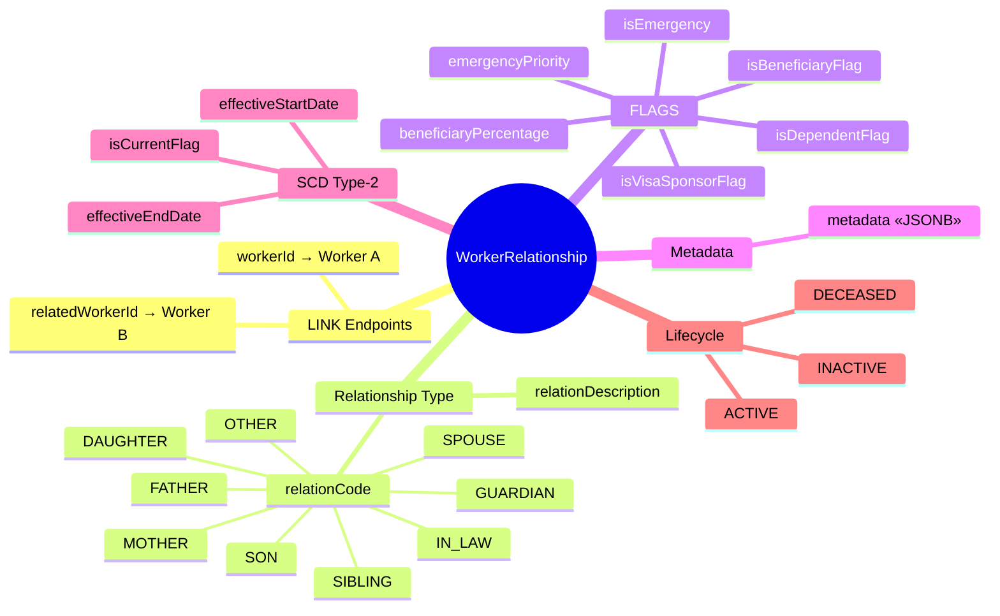

# Entity: WorkerRelationship

## 1. Overview

**WorkerRelationship** is a **PURE LINK (association) entity** that connects two Workers. It does NOT store PII - all person information lives on the Worker entity.

**Design Principle**:
```
WorkerRelationship = LINK between two Workers + FLAGS

- workerId → Subject Worker (A)
- relatedWorkerId → Related Worker (B)
- relationCode → What B is to A (e.g., SPOUSE)
- Flags → What role B plays for A (emergency, dependent, beneficiary)

PII Location:
- Name, DOB, gender → Worker entity
- Phone, email → Contact entity (belongs to Worker)
- Address → Address entity (belongs to Worker)
```



**Key Design Decision**:
> Every related person MUST be a Worker in the system.
> If you have PII (name, DOB, phone), first create a Worker, then create the relationship.
> Contact info is fetched from the related Worker's Contact records.

---

## 2. Attributes

### 2.1 Identity

| Attribute | Type | Required | Description | DB Column |
|-----------|------|----------|-------------|-----------|
| id | UUID | ✓ | Unique identifier | person.worker_relationship.id |

### 2.2 Link Endpoints

| Attribute | Type | Required | Description | DB Column |
|-----------|------|----------|-------------|-----------|
| workerId | UUID | ✓ | Subject worker (A) | person.worker_relationship.worker_id |
| relatedWorkerId | UUID | ✓ | Related worker (B) | person.worker_relationship.related_worker_id |

### 2.3 Relationship Type

| Attribute | Type | Required | Description |
|-----------|------|----------|-------------|
| relationCode | enum | ✓ | Type of relationship (SPOUSE, FATHER, MOTHER, etc.) |
| relationDescription | string | | Additional description |

**Relation Codes (Vietnamese)**:

| Code | English | Vietnamese |
|------|---------|------------|
| SPOUSE | Spouse | Vợ/Chồng |
| FATHER | Father | Cha/Bố |
| MOTHER | Mother | Mẹ |
| SON | Son | Con trai |
| DAUGHTER | Daughter | Con gái |
| BROTHER | Brother | Anh/Em trai |
| SISTER | Sister | Chị/Em gái |
| GRANDFATHER | Grandfather | Ông |
| GRANDMOTHER | Grandmother | Bà |
| GRANDSON | Grandson | Cháu trai |
| GRANDDAUGHTER | Granddaughter | Cháu gái |
| FATHER_IN_LAW | Father-in-law | Bố chồng/vợ |
| MOTHER_IN_LAW | Mother-in-law | Mẹ chồng/vợ |
| GUARDIAN | Guardian | Người giám hộ |
| DOMESTIC_PARTNER | Domestic Partner | Người chung sống |
| OTHER | Other | Khác |

### 2.4 Flags

| Attribute | Type | Required | Default | Description |
|-----------|------|----------|---------|-------------|
| isEmergency | boolean | ✓ | false | Is B emergency contact for A? |
| emergencyPriority | integer | | | Priority (1 = primary) |
| isDependentFlag | boolean | ✓ | false | Is B financial dependent of A? |
| isBeneficiaryFlag | boolean | ✓ | false | Is B beneficiary of A? |
| beneficiaryPercentage | decimal | | | % of benefits |
| isVisaSponsorFlag | boolean | | false | Is A sponsoring B for visa? |

### 2.5 SCD Type-2

| Attribute | Type | Required | Description |
|-----------|------|----------|-------------|
| effectiveStartDate | date | ✓ | When relationship becomes effective |
| effectiveEndDate | date | | When relationship ends |
| isCurrentFlag | boolean | ✓ | Is current version? |

---

## 3. Relationships


### How to Get Emergency Contact Info

```sql
-- Get emergency contacts for Worker A with their contact info
SELECT 
    rw.first_name || ' ' || rw.last_name AS contact_name,
    wr.relation_code,
    wr.emergency_priority,
    c.contact_value AS phone
FROM person.worker_relationship wr
JOIN person.worker rw ON rw.id = wr.related_worker_id
LEFT JOIN person.contact c ON c.worker_id = rw.id 
    AND c.contact_type_code = 'MOBILE' 
    AND c.is_primary = true
WHERE wr.worker_id = 'worker-a-id'
  AND wr.is_emergency = true
  AND wr.is_current_flag = true
ORDER BY wr.emergency_priority;
```

---

## 4. Lifecycle


| State | Business Meaning | System Impact |
|-------|------------------|---------------|
| **ACTIVE** | Current, valid relationship | Used for emergency, dependent, beneficiary |
| **INACTIVE** | Relationship ended (e.g., divorce) | Historical, not used for active lookups |
| **DECEASED** | Related person has passed away | Update beneficiary allocations |

---

## 5. Use Cases

### Use Case 1: Spouse as Emergency Contact

```yaml
# Worker A: Nguyễn Văn A (employee)
# Worker B: Nguyễn Thị B (A's wife, also in system)

WorkerRelationship:
  id: "wr-001"
  workerId: "worker-a-id"
  relatedWorkerId: "worker-b-id"
  relationCode: "SPOUSE"
  isEmergency: true
  emergencyPriority: 1
  isDependentFlag: false  # Wife has own income
  isBeneficiaryFlag: true
  beneficiaryPercentage: 50
  metadata:
    marriageDate: "2018-01-15"
  effectiveStartDate: "2018-01-15"
  isCurrentFlag: true
```

### Use Case 2: Child as Tax Dependent

```yaml
# Worker A: Nguyễn Văn A (employee)
# Worker C: Nguyễn Văn C (A's child, created as Worker)

WorkerRelationship:
  id: "wr-002"
  workerId: "worker-a-id"
  relatedWorkerId: "worker-c-id"
  relationCode: "SON"
  isEmergency: false
  isDependentFlag: true  # Child is dependent for tax
  isBeneficiaryFlag: true
  beneficiaryPercentage: 25
  effectiveStartDate: "2020-03-10"
  isCurrentFlag: true
```

### Use Case 3: Parent as Emergency Contact

```yaml
# Worker A: Nguyễn Văn A (employee)
# Worker D: Nguyễn Văn D (A's father)

WorkerRelationship:
  id: "wr-003"
  workerId: "worker-a-id"
  relatedWorkerId: "worker-d-id"
  relationCode: "FATHER"
  isEmergency: true
  emergencyPriority: 2  # Secondary emergency contact
  isDependentFlag: true  # Father has no income
  isBeneficiaryFlag: false
  effectiveStartDate: "2024-01-01"
  isCurrentFlag: true
```

---

## 6. Data Flow

### Creating a Related Person


### Fetching Emergency Contacts


---

## 7. Business Rules Reference

| Rule | Description |
|------|-------------|
| **UniqueRelationshipPair** | No duplicate active relationships |
| **SpouseUnique** | Max 1 current spouse |
| **BeneficiaryPercentageTotal** | Sum ≤ 100% |
| **NoSelfRelationship** | Cannot relate to self |
| **AtLeastOneEmergencyContact** | Every employee should have emergency contact |

### Related Documents

- [[Worker.onto.md]] - Person information
- [[Contact.onto.md]] - Contact information
- [[DependentRegistration.flow.md]] - Tax dependent registration flow

---

*Document Status: DRAFT v2.0.0*  
*Refactored: Removed inline PII, converted to pure LINK pattern*  
*References: DBML 1.Core.V4 lines 640-656*
