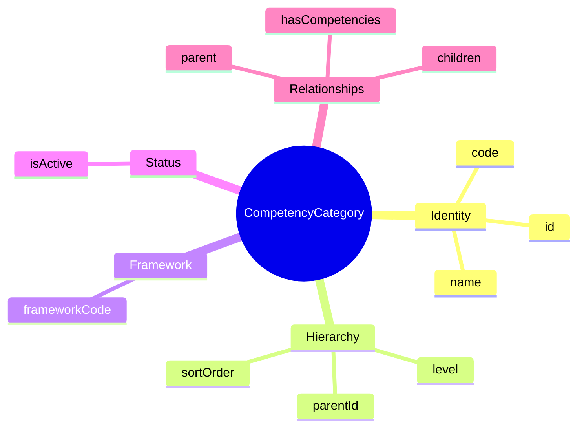
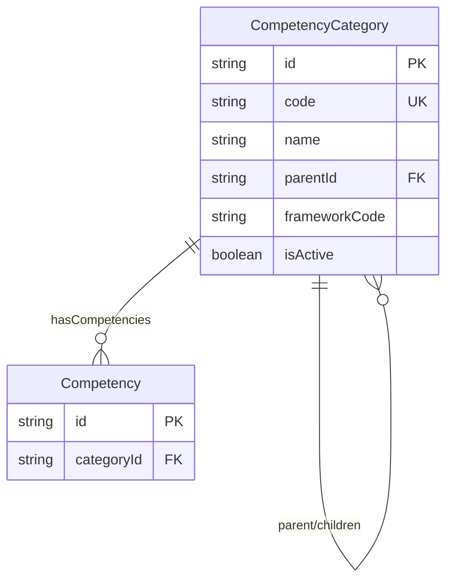

# Entity: CompetencyCategory

## 1. Overview

**CompetencyCategory** provides a hierarchical taxonomy for organizing Competencies. Competencies represent behavioral traits and soft skills (HOW you work), as opposed to Skills (WHAT you do).



### Competency vs Skill

| Aspect | Skill | Competency |
|--------|-------|------------|
| **Nature** | Technical ability | Behavioral trait |
| **Question** | "What can you do?" | "How do you do it?" |
| **Measurement** | Objective (tests, certs) | Subjective (ratings, 360) |
| **Example** | Java, Excel, SQL | Leadership, Communication |

### Example Hierarchy

```
Core Values (Framework: COMPANY_CORE)
├── Integrity
│   ├── Ethical Behavior
│   └── Transparency
├── Innovation
│   ├── Creativity
│   └── Risk Taking
└── Customer Focus
    ├── Client Orientation
    └── Service Excellence

Leadership (Framework: LEADERSHIP_PIPELINE)
├── People Management
│   ├── Coaching
│   ├── Delegation
│   └── Team Building
├── Strategic Thinking
│   ├── Vision Setting
│   └── Long-term Planning
└── Decision Making
    ├── Critical Thinking
    └── Problem Solving

Execution (Framework: COMPANY_CORE)
├── Results Orientation
│   ├── Accountability
│   └── Goal Achievement
├── Time Management
│   └── Prioritization
└── Quality Focus
    └── Attention to Detail
```

---

## 2. Attributes

### Identity

| Attribute | Type | Required | Description |
|-----------|------|----------|-------------|
| id | string | ✓ | Unique identifier (UUID) |
| code | string | ✓ | Category code |
| name | string | ✓ | Display name |
| nameVn | string | | Vietnamese name |

### Hierarchy & Framework

| Attribute | Type | Required | Description |
|-----------|------|----------|-------------|
| parentId | string | | FK → self |
| level | integer | | Depth (1 = root) |
| frameworkCode | string | | Competency framework |

---

## 3. Relationships



---

## 4. Use Cases

### Core Values Category

```yaml
CompetencyCategory:
  code: "CORE_VALUES"
  name: "Core Values"
  nameVn: "Giá trị Cốt lõi"
  parentId: null
  level: 1
  frameworkCode: "COMPANY_CORE"
  isActive: true
```

### Leadership Category

```yaml
CompetencyCategory:
  code: "PEOPLE_MGMT"
  name: "People Management"
  nameVn: "Quản lý Con người"
  parentId: "cat-leadership"
  level: 2
  frameworkCode: "LEADERSHIP_PIPELINE"
  sortOrder: 1
  isActive: true
```

---

*Document Status: APPROVED*  
*References: [[Competency]], [[Worker]], [[JobProfile]]*
