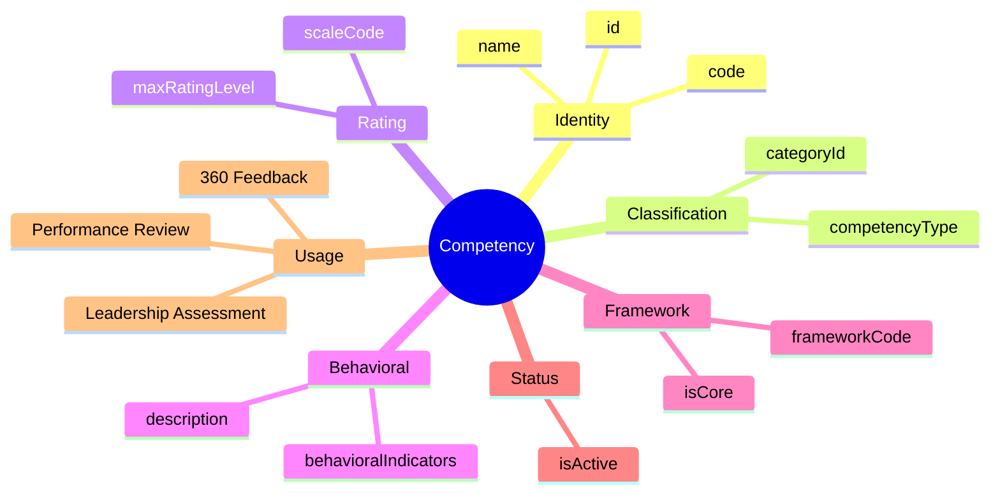
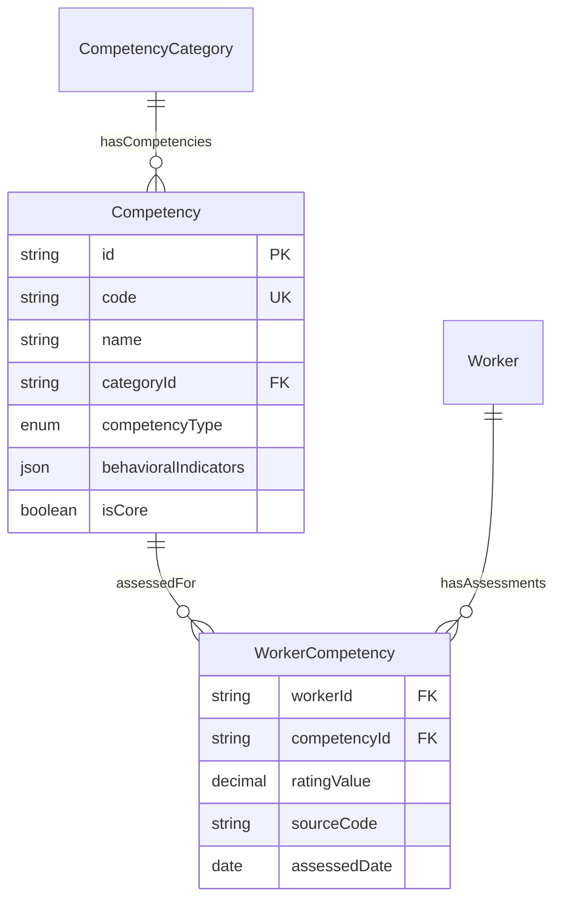

# Entity: Competency

## 1. Overview

**Competency** is master data representing behavioral traits and soft skills. Unlike Skills (what you can do), Competencies describe HOW you do things - your behavior, values, and interpersonal abilities.

**Key Distinction**:
```
Skill = "What you know how to do" (Technical, measurable)
Competency = "How you behave doing it" (Behavioral, subjective)
```



### Assessment Sources

| Source | Method | Objectivity |
|--------|--------|-------------|
| **Self** | Self-assessment | Low |
| **Manager** | Manager rating | Medium |
| **360** | Multi-rater feedback | High |
| **Survey** | Pulse surveys | Medium |

---

## 2. Attributes

### 2.1 Identity

| Attribute | Type | Required | Description |
|-----------|------|----------|-------------|
| id | string | ✓ | Unique identifier (UUID) |
| code | string | ✓ | Competency code |
| name | string | ✓ | Display name |
| nameVn | string | | Vietnamese name |

### 2.2 Classification

| Attribute | Type | Required | Description |
|-----------|------|----------|-------------|
| categoryId | string | | FK → [[CompetencyCategory]] |
| competencyType | enum | | CORE, LEADERSHIP, FUNCTIONAL, TECHNICAL_BEHAVIORAL |

### 2.3 Rating Scale

| Attribute | Type | Required | Description |
|-----------|------|----------|-------------|
| scaleCode | string | | Rating scale reference |
| maxRatingLevel | integer | | Max rating (default: 5) |

**Standard Competency Ratings**:
| Level | Name | Description |
|-------|------|-------------|
| 1 | Needs Development | Rarely demonstrates competency |
| 2 | Developing | Sometimes demonstrates |
| 3 | Proficient | Consistently demonstrates |
| 4 | Advanced | Frequently exceeds expectations |
| 5 | Role Model | Exemplary, coaches others |

### 2.4 Behavioral Indicators

| Attribute | Type | Required | Description |
|-----------|------|----------|-------------|
| description | string | | What this competency means |
| behavioralIndicators | json | | Observable behaviors per level |

**Example Behavioral Indicators**:
```json
{
  "1": ["Rarely takes initiative", "Needs reminders to complete tasks"],
  "2": ["Sometimes shows initiative", "Occasionally needs guidance"],
  "3": ["Consistently proactive", "Independently drives work"],
  "4": ["Anticipates needs", "Helps others be proactive"],
  "5": ["Role model for initiative", "Creates culture of ownership"]
}
```

---

## 3. Competency Types

| Type | Description | Example | Who |
|------|-------------|---------|-----|
| **CORE** | Company values | Integrity, Innovation | All employees |
| **LEADERSHIP** | People management | Coaching, Decision Making | Managers |
| **FUNCTIONAL** | Role-specific behaviors | Client Focus, Technical Depth | By role |
| **TECHNICAL_BEHAVIORAL** | Mixed technical + soft | Solution Thinking | Technical roles |

---

## 4. Relationships



---

## 5. Use Cases

### 1. Core Value Competency

```yaml
Competency:
  code: "INTEGRITY"
  name: "Integrity"
  nameVn: "Chính trực"
  categoryId: "cat-core-values"
  competencyType: "CORE"
  scaleCode: "BEHAVIORAL_1_5"
  maxRatingLevel: 5
  isCore: true
  description: "Acts with honesty and transparency in all situations"
  behavioralIndicators:
    "1": ["Occasionally misrepresents facts", "Avoids accountability"]
    "3": ["Consistently honest", "Takes responsibility for mistakes"]
    "5": ["Role model for integrity", "Creates culture of transparency"]
  isActive: true
```

### 2. Leadership Competency

```yaml
Competency:
  code: "COACHING"
  name: "Coaching & Development"
  nameVn: "Huấn luyện & Phát triển"
  categoryId: "cat-people-mgmt"
  competencyType: "LEADERSHIP"
  scaleCode: "LEADERSHIP_SCALE"
  maxRatingLevel: 5
  isCore: false
  description: "Develops others through feedback, coaching, and opportunities"
  behavioralIndicators:
    "1": ["Provides little feedback", "Does not invest in team development"]
    "3": ["Regularly gives feedback", "Creates development plans"]
    "5": ["Known as great coach", "Team members promoted/developed"]
  isActive: true
```

---

## 6. Assessment Example

```
Worker: Nguyễn Văn A
Competency: COACHING
Assessment: 360 Feedback

Self:     4/5
Manager:  3/5
Peers:    4/5
Direct:   3/5
---
Average:  3.5/5

Gap Analysis:
- Expected (Manager level): 4/5
- Actual: 3.5/5
- Gap: -0.5
- Recommendation: Leadership coaching program
```

---

*Document Status: APPROVED*  
*References: [[CompetencyCategory]], [[Worker]], [[WorkerCompetency]]*
