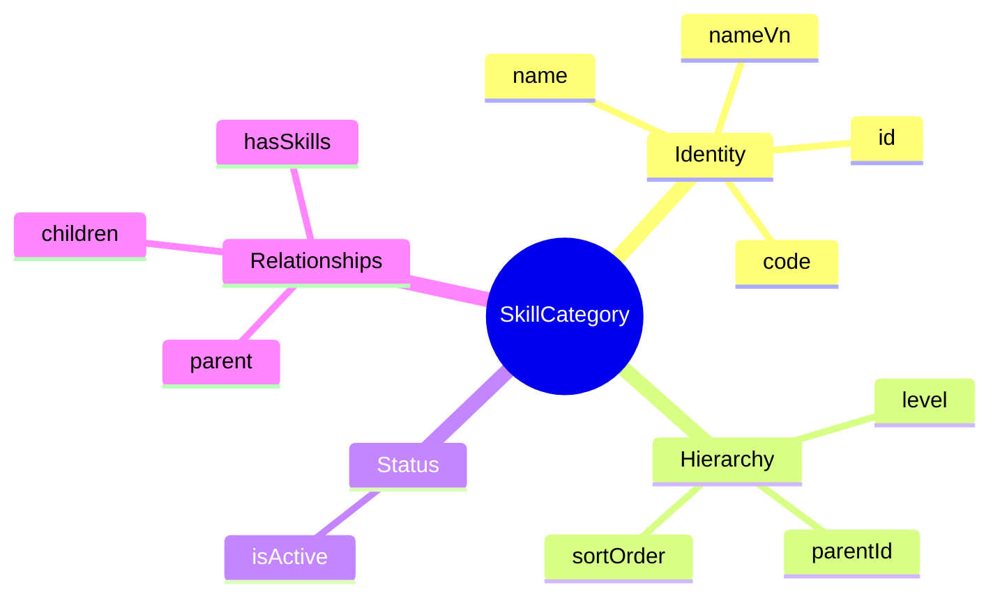
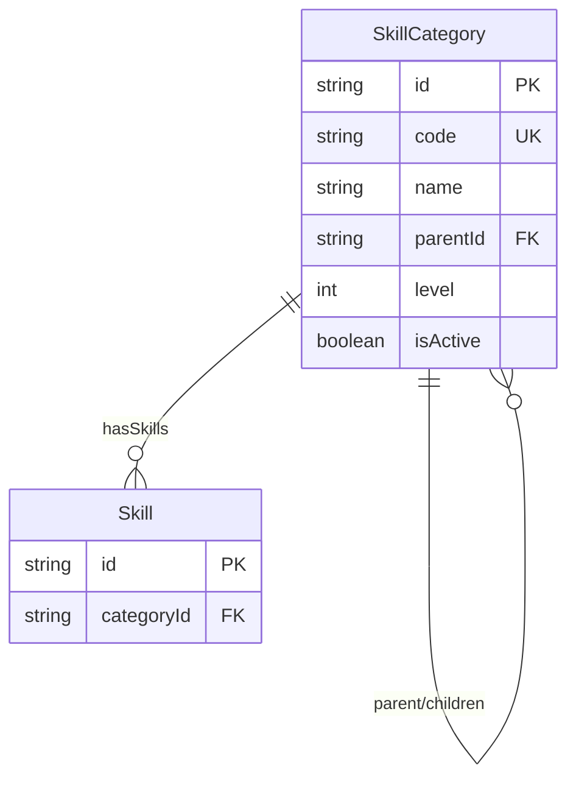

# Entity: SkillCategory

## 1. Overview

**SkillCategory** provides a hierarchical taxonomy for organizing Skills. It enables multi-level classification such as Technical → Programming → Backend → Java.



### Example Hierarchy

```
Technical
├── Programming Languages
│   ├── Backend
│   │   ├── Java
│   │   ├── Python
│   │   └── Go
│   └── Frontend
│       ├── JavaScript
│       ├── TypeScript
│       └── React
├── Cloud & DevOps
│   ├── Cloud Platforms
│   │   ├── AWS
│   │   ├── Azure
│   │   └── GCP
│   └── Containerization
│       ├── Docker
│       └── Kubernetes
└── Database
    ├── SQL
    │   ├── PostgreSQL
    │   └── MySQL
    └── NoSQL
        ├── MongoDB
        └── Redis

Soft Skills
├── Communication
│   ├── Written Communication
│   └── Presentation
├── Leadership
│   ├── Team Building
│   └── Coaching
└── Problem Solving
    ├── Critical Thinking
    └── Decision Making
```

---

## 2. Attributes

### Identity

| Attribute | Type | Required | Description |
|-----------|------|----------|-------------|
| id | string | ✓ | Unique identifier (UUID) |
| code | string | ✓ | Category code (UPPER_SNAKE) |
| name | string | ✓ | Display name |
| nameVn | string | | Vietnamese name |

### Hierarchy

| Attribute | Type | Required | Description |
|-----------|------|----------|-------------|
| parentId | string | | FK → self (parent category) |
| level | integer | | Depth (1 = root) |
| sortOrder | integer | | Sort within parent |

---

## 3. Relationships



---

## 4. Use Cases

### 1. Root Category

```yaml
SkillCategory:
  code: "TECHNICAL"
  name: "Technical Skills"
  nameVn: "Kỹ năng Kỹ thuật"
  parentId: null
  level: 1
  isActive: true
```

### 2. Child Category

```yaml
SkillCategory:
  code: "PROG_LANG"
  name: "Programming Languages"
  nameVn: "Ngôn ngữ Lập trình"
  parentId: "category-technical"
  level: 2
  sortOrder: 1
  isActive: true
```

---

*Document Status: APPROVED*  
*References: [[Skill]], [[JobProfile]], [[Worker]]*
