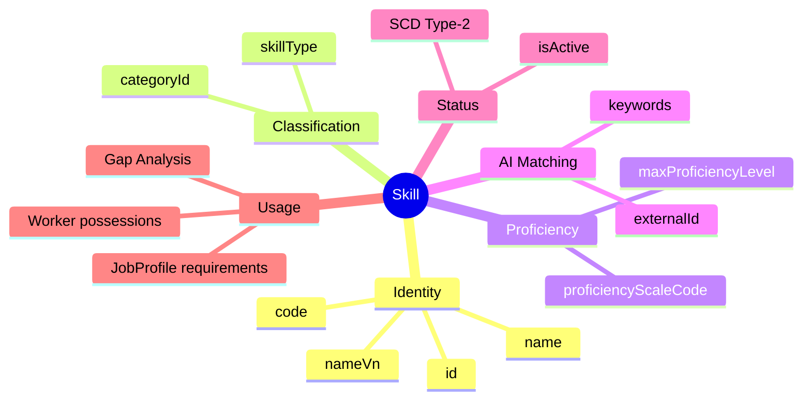
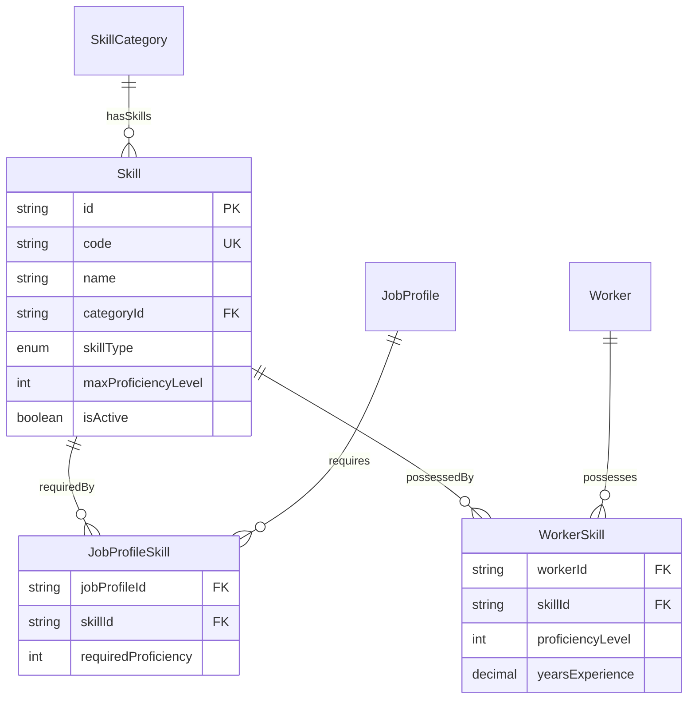

# Entity: Skill

## 1. Overview

**Skill** is a master data entity representing technical or functional abilities that can be required by jobs and possessed by workers. It enables skill-based matching for recruiting, talent management, and career development.

**Key Concept**:
```
Skill = "What you know how to do"
Competency = "How you behave doing it"
```



### Multi-Module Usage

```
Skill is referenced by:
├── JobProfile → Required skills for job
├── Worker → Actual skills possessed
├── Talent → Skill gap analysis
├── Training → Learning recommendations
├── Recruiting → Candidate matching
└── Succession → Readiness assessment
```

---

## 2. Attributes

### 2.1 Identity

| Attribute | Type | Required | Description |
|-----------|------|----------|-------------|
| id | string | ✓ | Unique identifier (UUID) |
| code | string | ✓ | Skill code (JAVA, AWS, etc.) |
| name | string | ✓ | Display name |
| nameVn | string | | Vietnamese name |

### 2.2 Classification

| Attribute | Type | Required | Description |
|-----------|------|----------|-------------|
| categoryId | string | | FK → [[SkillCategory]] |
| skillType | enum | | TECHNICAL, FUNCTIONAL, SOFT, LANGUAGE, CERTIFICATION, TOOL |

### 2.3 Proficiency Scale

| Attribute | Type | Required | Description |
|-----------|------|----------|-------------|
| proficiencyScaleCode | string | | Reference to proficiency scale |
| maxProficiencyLevel | integer | | Max level (default: 5) |

**Standard Proficiency Levels**:
| Level | Name | Description |
|-------|------|-------------|
| 1 | Beginner | Basic understanding |
| 2 | Elementary | Can perform simple tasks |
| 3 | Intermediate | Independent work |
| 4 | Advanced | Can mentor others |
| 5 | Expert | Industry authority |

### 2.4 AI Matching

| Attribute | Type | Required | Description |
|-----------|------|----------|-------------|
| keywords | json | | Synonyms for AI matching |
| externalId | string | | External ID (LinkedIn, O*NET) |
| externalSource | string | | Source system |

---

## 3. Relationships



### Relationship Details

| Entity | Relationship | Cardinality | Description |
|--------|--------------|-------------|-------------|
| [[SkillCategory]] | belongsToCategory | N:1 | Primary category |
| [[JobProfile]] | requiredByJobProfiles | N:N | Jobs requiring this skill |
| [[Worker]] | possessedByWorkers | N:N | Workers with this skill |

---

## 4. Skill Types

| Type | Description | Example |
|------|-------------|---------|
| **TECHNICAL** | Programming, frameworks, systems | Java, Python, React |
| **FUNCTIONAL** | Domain knowledge | Financial Analysis, HR Law |
| **SOFT** | Interpersonal skills | Leadership, Communication |
| **LANGUAGE** | Natural languages | English, Japanese, Vietnamese |
| **CERTIFICATION** | Certified abilities | AWS Certified, PMP, CPA |
| **TOOL** | Software tools | Excel, Figma, JIRA |

---

## 5. Use Cases

### 1. Technical Skill

```yaml
Skill:
  code: "JAVA"
  name: "Java Programming"
  nameVn: "Lập trình Java"
  categoryId: "cat-prog-backend"
  skillType: "TECHNICAL"
  proficiencyScaleCode: "SKILL_1_5"
  maxProficiencyLevel: 5
  keywords: ["java", "jvm", "spring", "spring boot", "j2ee", "maven"]
  externalId: "skill-java-linkedin"
  externalSource: "LINKEDIN"
  isActive: true
```

### 2. Soft Skill

```yaml
Skill:
  code: "LEADERSHIP"
  name: "Leadership"
  nameVn: "Kỹ năng Lãnh đạo"
  categoryId: "cat-soft-leadership"
  skillType: "SOFT"
  proficiencyScaleCode: "SKILL_BEHAVIORAL"
  maxProficiencyLevel: 5
  keywords: ["leader", "team lead", "manager", "people management"]
  isActive: true
```

### 3. Certification

```yaml
Skill:
  code: "AWS_SOLUTIONS_ARCHITECT"
  name: "AWS Solutions Architect"
  nameVn: "AWS Solutions Architect"
  categoryId: "cat-cert-cloud"
  skillType: "CERTIFICATION"
  externalId: "aws-saa-c03"
  externalSource: "AWS"
  isActive: true
```

---

## 6. AI Matching Example

```
JobProfile Required Skills:
├── JAVA (proficiency >= 4)
├── SPRING_BOOT (proficiency >= 3)
├── AWS (proficiency >= 2)
└── LEADERSHIP (proficiency >= 3)

Worker Actual Skills:
├── JAVA (proficiency = 5) ✓
├── SPRING_BOOT (proficiency = 4) ✓
├── AWS (proficiency = 1) ✗ Gap!
└── LEADERSHIP (proficiency = 3) ✓

Skill Gap Analysis:
├── AWS: Required 2, Actual 1, Gap = -1
└── Recommendation: AWS Training Course
```

---

*Document Status: APPROVED*  
*References: [[SkillCategory]], [[JobProfile]], [[Worker]], [[WorkerSkill]], [[JobProfileSkill]]*
