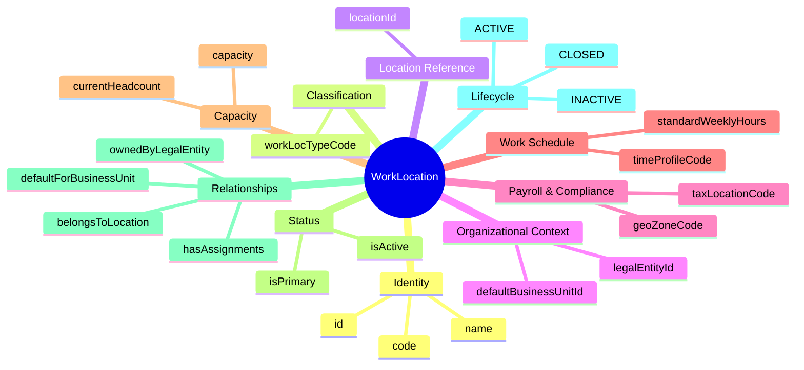
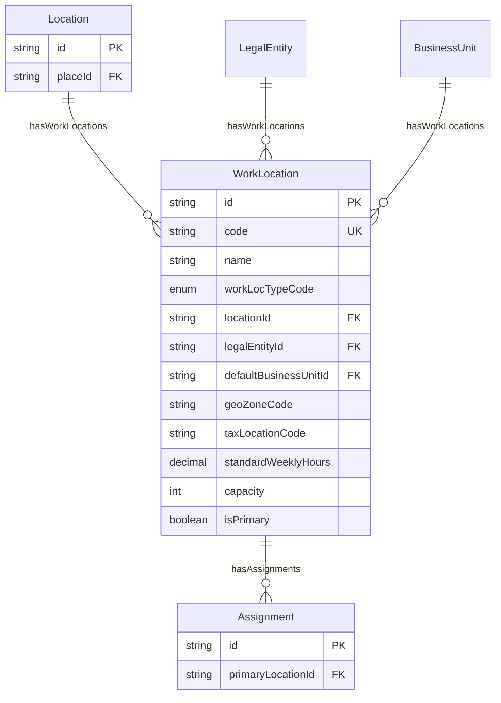
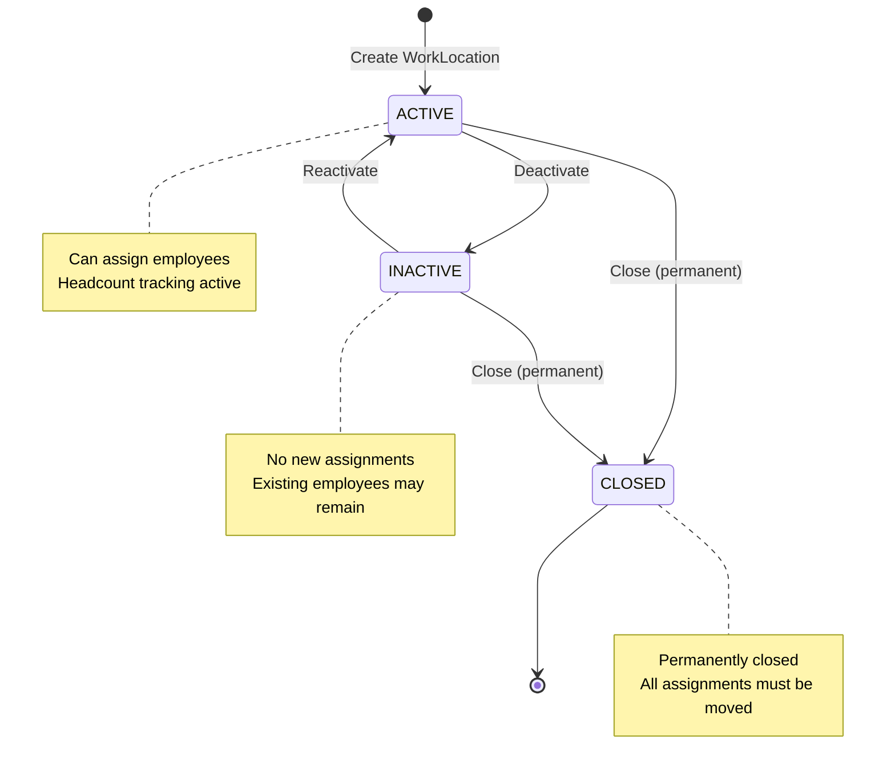

# Entity: WorkLocation

## 1. Overview

**WorkLocation** represents the **HR assignment point** - where employees are officially assigned for work. This is Tier 3 in the 3-tier location hierarchy, connecting physical infrastructure with organizational structure.

```
Place (Big Map - Geographic presence)
└── Location (Internal Map - Physical subdivision)
    └── WorkLocation (HR Assignment) ← YOU ARE HERE
        ├── Links Location + LegalEntity + BusinessUnit
        └── Assignment references this for employee placement
```

**Key Concept**:
```
WorkLocation = HR assignment point (combines Physical + Organizational)
Purpose: Employee placement, payroll zone, tax jurisdiction, headcount tracking
```



### Industry Alignment

| Vendor | Equivalent Concept |
|--------|-------------------|
| Workday | Location (with Business Site usage) + Assignment Location |
| Oracle HCM | Location + Legal Entity linking |
| SAP | Location with Legal Entity + Geo Zone |
| xTalent | WorkLocation (unique 3-tier value-add) |

---

## 2. Attributes

### 2.1 Identity

| Attribute | Type | Required | Description |
|-----------|------|----------|-------------|
| id | string | ✓ | Unique identifier (UUID) |
| code | string | ✓ | Business code (e.g., WL_ETOWN_F5_HR) |
| name | string | ✓ | Display name |

### 2.2 Classification

| Attribute | Type | Required | Description |
|-----------|------|----------|-------------|
| workLocTypeCode | enum | ✓ | OFFICE, REMOTE, HYBRID, HOME, CLIENT_SITE, FIELD, FACTORY_FLOOR, WAREHOUSE, RETAIL_STORE, MOBILE |

### 2.3 Location Reference

| Attribute | Type | Required | Description |
|-----------|------|----------|-------------|
| locationId | string | | FK → [[Location]]. Physical location (null for REMOTE/HOME) |

### 2.4 Organizational Context

| Attribute | Type | Required | Description |
|-----------|------|----------|-------------|
| legalEntityId | string | | FK → [[LegalEntity]]. Owner/operator |
| defaultBusinessUnitId | string | | FK → [[BusinessUnit]]. Default BU |

### 2.5 Payroll & Compliance

| Attribute | Type | Required | Description |
|-----------|------|----------|-------------|
| geoZoneCode | string | | Geographic zone for geo-pay differentials |
| taxLocationCode | string | | Tax jurisdiction code (Cục Thuế for VN) |

### 2.6 Work Schedule

| Attribute | Type | Required | Description |
|-----------|------|----------|-------------|
| timeProfileCode | string | | Default work schedule code |
| standardWeeklyHours | decimal | | Standard hours (40.0, 44.0, etc.) |

### 2.7 Capacity

| Attribute | Type | Required | Description |
|-----------|------|----------|-------------|
| capacity | integer | | Maximum headcount |
| currentHeadcount | integer | | Current assigned employees (derived) |

### 2.8 Status

| Attribute | Type | Required | Description |
|-----------|------|----------|-------------|
| isActive | boolean | ✓ | Is active? |
| isPrimary | boolean | ✓ | Primary for the BU? |

---

## 3. Relationships



### Related Entities

| Entity | Relationship | Cardinality | Description |
|--------|--------------|-------------|-------------|
| [[Location]] | belongsToLocation | N:1 | Physical location (optional) |
| [[LegalEntity]] | ownedByLegalEntity | N:1 | Legal entity ownership |
| [[BusinessUnit]] | defaultForBusinessUnit | N:1 | Default business unit |
| [[Assignment]] | hasAssignments | 1:N | Employee assignments |

---

## 4. Lifecycle



---

## 5. Business Rules Reference

### Validation Rules
- **UniqueCodeGlobally**: Code unique across all work locations
- **LocationRequiredForPhysical**: Physical types need locationId (WARNING)
- **OnePrimaryPerBU**: One primary per BU (WARNING)

### Business Constraints
- **LegalEntityRecommended**: Should have legal entity (WARNING)
- **CapacityTracking**: Office types should have capacity (INFO)
- **GeoZoneForPayroll**: Recommend geo zone for pay differentials (INFO)

### WorkLocation Types

| Type | Physical | Description | Use Case |
|------|----------|-------------|----------|
| OFFICE | ✓ | Office building | Standard office workers |
| REMOTE | ✗ | Work from anywhere | Full remote employees |
| HYBRID | Partial | Mix of office + remote | Hybrid schedule |
| HOME | ✗ | Work from home | Home-based workers |
| CLIENT_SITE | ✓ | Customer premises | Consultants, contractors |
| FIELD | ✗ | Various locations | Sales reps, field technicians |
| FACTORY_FLOOR | ✓ | Manufacturing area | Production workers |
| WAREHOUSE | ✓ | Storage facility | Logistics staff |
| RETAIL_STORE | ✓ | Retail location | Store employees |
| MOBILE | ✗ | No fixed location | Drivers, delivery |

### Use Cases

#### 1. Office Work Location

```yaml
WorkLocation:
  code: "WL_ETOWN_F5_HR"
  name: "E-Town Floor 5 - HR Department"
  workLocTypeCode: "OFFICE"
  locationId: "loc-etown-floor5"      # Physical location
  legalEntityId: "le-vng-corp"        # VNG Corporation
  defaultBusinessUnitId: "bu-hr"      # HR Department
  geoZoneCode: "VN-HCM"               # Ho Chi Minh zone
  taxLocationCode: "CUC_THUE_Q1"      # District 1 tax office
  standardWeeklyHours: 40.0
  capacity: 50
```

#### 2. Remote Work Location

```yaml
WorkLocation:
  code: "WL_REMOTE_VN"
  name: "Remote - Vietnam"
  workLocTypeCode: "REMOTE"
  locationId: null                    # No physical location
  legalEntityId: "le-vng-corp"
  geoZoneCode: "VN-ALL"               # Vietnam-wide
  standardWeeklyHours: 40.0
```

---

*Document Status: APPROVED*  
*Based on: Workday Location+Assignment, Oracle Location+LegalEntity, xTalent 3-tier design*
