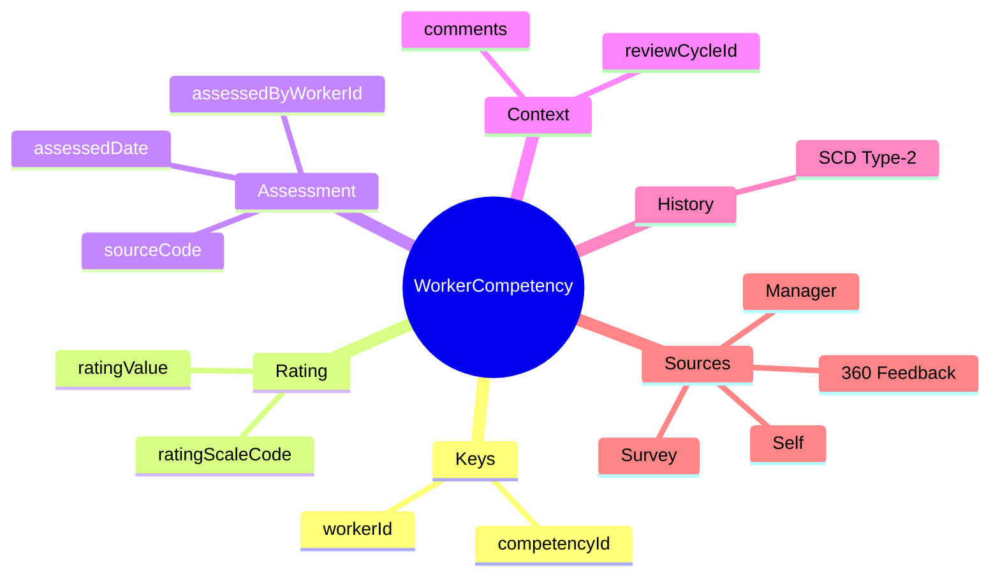
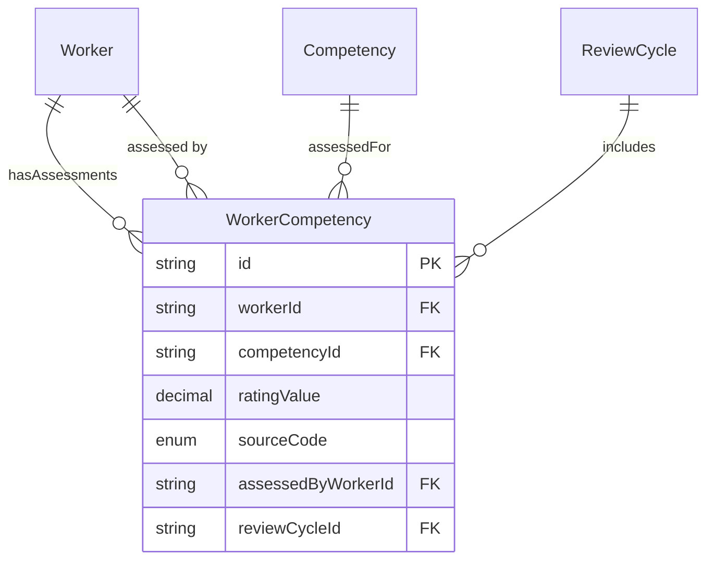

# Entity: WorkerCompetency

## 1. Overview

**WorkerCompetency** is a junction/link entity connecting [[Worker]] to [[Competency]], representing assessments of behavioral competencies. Unlike WorkerSkill (what you can do), WorkerCompetency tracks HOW you do things.



### Assessment Sources

| Source | Description | Weight (typical) |
|--------|-------------|------------------|
| **SELF** | Self-assessment | 10% |
| **MANAGER** | Direct manager | 40% |
| **PEER** | Colleagues | 20% |
| **DIRECT_REPORT** | Subordinates | 20% |
| **EXTERNAL** | External assessor | 10% |
| **AGGREGATE_360** | Combined 360 | - |

---

## 2. Attributes

### Primary Key

| Attribute | Type | Required | Description |
|-----------|------|----------|-------------|
| id | string | ✓ | Unique identifier |
| workerId | string | ✓ | FK → [[Worker]] |
| competencyId | string | ✓ | FK → [[Competency]] |

### Rating

| Attribute | Type | Required | Description |
|-----------|------|----------|-------------|
| ratingValue | decimal | | Rating score (e.g., 3.5) |
| ratingScaleCode | string | | Scale used |

### Assessment Context

| Attribute | Type | Required | Description |
|-----------|------|----------|-------------|
| assessedDate | date | | When assessed |
| assessedByWorkerId | string | | FK → Worker (assessor) |
| sourceCode | enum | | SELF, MANAGER, PEER, etc. |
| reviewCycleId | string | | FK → ReviewCycle |

---

## 3. Relationships



---

## 4. Use Cases

### Self-Assessment

```yaml
WorkerCompetency:
  workerId: "worker-001"
  competencyId: "comp-leadership"
  ratingValue: 4.0
  ratingScaleCode: "BEHAVIORAL_1_5"
  assessedDate: "2025-06-15"
  sourceCode: "SELF"
  reviewCycleId: "review-2025-h1"
  comments: "I have led multiple successful projects this year"
  effectiveStartDate: "2025-06-15"
  isCurrent: true
```

### Manager Assessment

```yaml
WorkerCompetency:
  workerId: "worker-001"
  competencyId: "comp-leadership"
  ratingValue: 3.5
  ratingScaleCode: "BEHAVIORAL_1_5"
  assessedDate: "2025-06-20"
  assessedByWorkerId: "worker-manager-001"
  sourceCode: "MANAGER"
  reviewCycleId: "review-2025-h1"
  comments: "Good leadership potential, needs more strategic thinking"
  effectiveStartDate: "2025-06-20"
  isCurrent: true
```

### 360 Aggregate

```yaml
WorkerCompetency:
  workerId: "worker-001"
  competencyId: "comp-leadership"
  ratingValue: 3.7  # Weighted average
  ratingScaleCode: "BEHAVIORAL_1_5"
  assessedDate: "2025-06-25"
  sourceCode: "AGGREGATE_360"
  reviewCycleId: "review-2025-h1"
  metadata:
    breakdown:
      self: 4.0
      manager: 3.5
      peers_avg: 3.8
      directs_avg: 3.5
    weights:
      self: 0.1
      manager: 0.4
      peers: 0.25
      directs: 0.25
  effectiveStartDate: "2025-06-25"
  isCurrent: true
```

---

*Document Status: APPROVED*  
*References: [[Worker]], [[Competency]], [[ReviewCycle]]*
