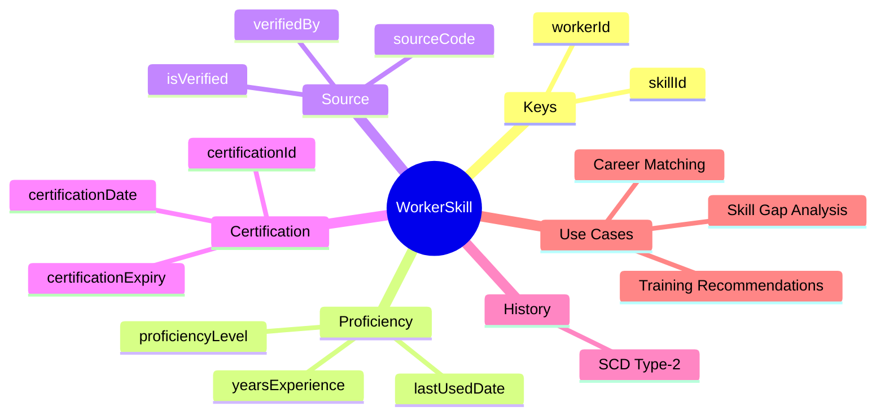
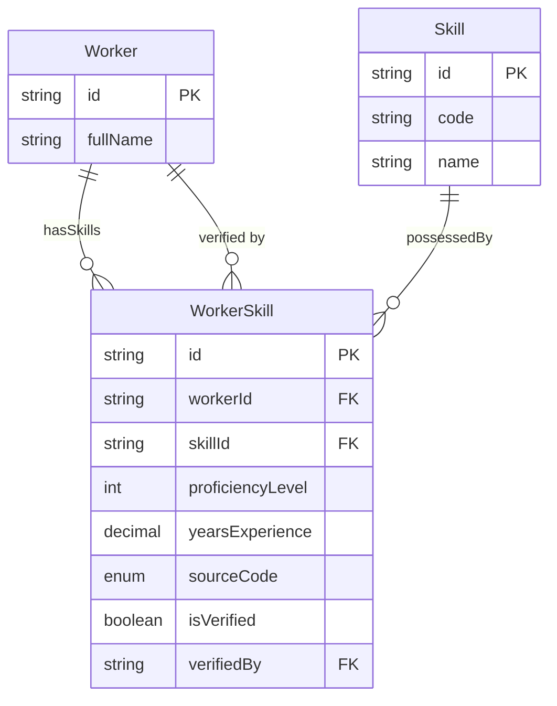

# Entity: WorkerSkill

## 1. Overview

**WorkerSkill** is a junction/link entity that connects [[Worker]] to [[Skill]], representing the actual skills a worker possesses. It includes proficiency level, years of experience, verification status, and certification links.



### Skill Sources

| Source | Description | Reliability |
|--------|-------------|-------------|
| **SELF** | Self-declared | Low |
| **MANAGER** | Manager added | Medium |
| **CERTIFICATION** | From cert record | High |
| **ASSESSMENT** | Skill test | High |
| **IMPORT** | Resume/LinkedIn | Low |
| **AI_INFERRED** | AI from history | Medium |

---

## 2. Attributes

### Primary Key

| Attribute | Type | Required | Description |
|-----------|------|----------|-------------|
| id | string | ✓ | Unique identifier |
| workerId | string | ✓ | FK → [[Worker]] |
| skillId | string | ✓ | FK → [[Skill]] |

### Proficiency

| Attribute | Type | Required | Description |
|-----------|------|----------|-------------|
| proficiencyLevel | integer | | 1-5 or per scale |
| yearsExperience | decimal | | Years using skill |
| lastUsedDate | date | | Last active use |

### Verification

| Attribute | Type | Required | Description |
|-----------|------|----------|-------------|
| sourceCode | enum | | How captured |
| isVerified | boolean | ✓ | Verified? |
| verifiedBy | string | | FK → Worker (verifier) |

---

## 3. Relationships



---

## 4. Use Cases

### Self-declared Skill

```yaml
WorkerSkill:
  workerId: "worker-001"
  skillId: "skill-java"
  proficiencyLevel: 4
  yearsExperience: 5.5
  lastUsedDate: "2025-01-15"
  sourceCode: "SELF"
  isVerified: false
  effectiveStartDate: "2020-06-01"
  isCurrent: true
```

### Certified Skill

```yaml
WorkerSkill:
  workerId: "worker-001"
  skillId: "skill-aws-sa"
  proficiencyLevel: 5
  sourceCode: "CERTIFICATION"
  isVerified: true
  verifiedBy: "system"
  verifiedDate: "2024-08-15"
  certificationId: "cert-aws-001"
  certificationDate: "2024-08-15"
  certificationExpiry: "2027-08-15"
  effectiveStartDate: "2024-08-15"
  isCurrent: true
```

---

*Document Status: APPROVED*  
*References: [[Worker]], [[Skill]], [[JobProfile]]*
