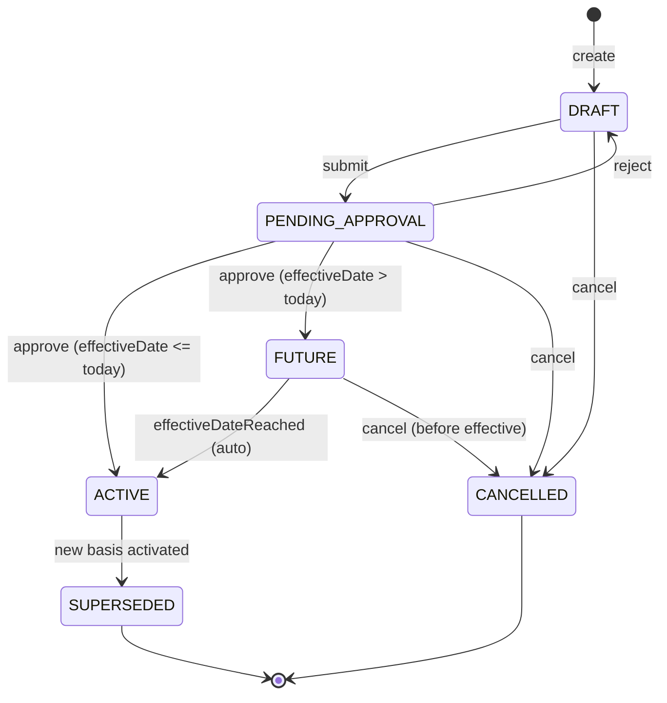

# Compensation Basis API Catalog

> **Module**: Core HR - Compensation Foundation  
> **Version**: 1.0.0  
> **Status**: Draft  
> **Last Updated**: 2026-01-29  
> **Reference**: Oracle HCM Cloud, Workday Compensation, SAP SuccessFactors

---

## Overview

This document catalogs all necessary APIs for the **CompensationBasis** entity - the operational salary record used for payroll, BHXH contributions, and analytics.

### Compensation Architecture

```
┌─────────────────────────────────────────────────────────────────────┐
│  CONTRACT (Legal Layer)                                            │
│  └── baseSalary = LEGAL, static, signed amount                     │
│              │                                                      │
│              └── [CREATE] → CompensationBasis (LEGAL_BASE)          │
└─────────────────────────────────────────────────────────────────────┘
                           │
                           ▼
┌─────────────────────────────────────────────────────────────────────┐
│  WORK RELATIONSHIP (Employment Context)                            │
│  └── CompensationBasis (OPERATIONAL, date-effective)               │
│      ├── basisAmount (current effective salary)                    │
│      ├── frequencyCode (MONTHLY/HOURLY/...)                        │
│      ├── reasonCode (HIRE/PROBATION_END/ANNUAL_REVIEW)             │
│      └── sourceCode (CONTRACT/MANUAL/FORMULA/PROMOTION)            │
│                │                                                    │
│                ├── Payroll Input                                    │
│                ├── BHXH Calculation                                 │
│                └── Analytics (Compa-ratio, trends)                  │
└─────────────────────────────────────────────────────────────────────┘
                           ▲
                           │
┌─────────────────────────────────────────────────────────────────────┐
│  TOTAL REWARDS (Formula Layer)                                     │
│  └── CompensationPlan + Eligibility + Formula Engine               │
└─────────────────────────────────────────────────────────────────────┘
```

### Golden Rule

```
Contract         = Legal Minimum / Agreement (static, for audit)
CompensationBasis = Operational Effective Value (dynamic, for payroll)
TotalRewards      = Formula & Logic (configuration)

Ba lớp KHÔNG ĐƯỢC trùng vai.
```

### Entity Summary

| Entity | Description | File |
|--------|-------------|------|
| **CompensationBasis** | Operational salary (basisAmount) with effective dating | compensation-basis.onto.md |

---

## 1. CompensationBasis APIs

> **Entity**: `CompensationBasis` (Mức Lương Hiệu Lực)  
> **Domain**: Core HR - Compensation  
> **Base Path**: `/api/v1/compensation-bases`

### 1.1 CRUD Operations

| Method | Path | Description | Auth |
|--------|------|-------------|------|
| `POST` | `/compensation-bases` | Create compensation basis | HR Admin |
| `GET` | `/compensation-bases/{id}` | Get by ID | Read |
| `GET` | `/compensation-bases` | List (paginated) | Read |
| `PATCH` | `/compensation-bases/{id}` | Update (draft only) | HR Admin |
| `DELETE` | `/compensation-bases/{id}` | Soft delete (draft only) | HR Admin |

### 1.2 Business Actions - Lifecycle (Approval Workflow)

| Method | Path | Description | Trigger |
|--------|------|-------------|---------|
| `POST` | `/compensation-bases/{id}/actions/submit` | Submit for approval | DRAFT → PENDING |
| `POST` | `/compensation-bases/{id}/actions/approve` | Approve salary change | PENDING → ACTIVE/FUTURE |
| `POST` | `/compensation-bases/{id}/actions/reject` | Reject with reason | PENDING → DRAFT |
| `POST` | `/compensation-bases/{id}/actions/cancel` | Cancel before activation | → CANCELLED |
| `POST` | `/compensation-bases/{id}/actions/supersede` | Supersede by new basis | ACTIVE → SUPERSEDED |
| `POST` | `/compensation-bases/{id}/actions/activate` | Manually activate FUTURE | FUTURE → ACTIVE |

### 1.3 Business Actions - Salary Creation

| Method | Path | Description | Trigger |
|--------|------|-------------|---------|
| `POST` | `/compensation-bases/actions/createFromContract` | Create LEGAL_BASE from Contract | New hire |
| `POST` | `/compensation-bases/actions/createFromPromotion` | Create from promotion action | Job change |
| `POST` | `/compensation-bases/actions/createFromCompCycle` | Create from comp review cycle | Annual review |
| `POST` | `/compensation-bases/actions/createFromProbationEnd` | Create after probation | Probation complete |

### 1.4 Business Actions - Salary Operations

| Method | Path | Description | Trigger |
|--------|------|-------------|---------|
| `POST` | `/compensation-bases/{id}/actions/adjustSalary` | Create adjustment (new record) | Manual adjust |
| `POST` | `/compensation-bases/{id}/actions/recalculateAnnual` | Recalculate annualEquivalent | Frequency change |
| `POST` | `/compensation-bases/{id}/actions/updateSocialInsuranceBasis` | Update BHXH basis | VN compliance |
| `POST` | `/compensation-bases/{id}/actions/setNextReviewDate` | Set next review date | Planning |
| `POST` | `/compensation-bases/{id}/actions/clone` | Clone for new effective date | Re-use |

### 1.5 Bulk Operations

| Method | Path | Description | Trigger |
|--------|------|-------------|---------|
| `POST` | `/compensation-bases/actions/massUpdate` | Mass salary update | Comp cycle |
| `POST` | `/compensation-bases/actions/massApprove` | Bulk approve pending | Manager |
| `POST` | `/compensation-bases/actions/import` | Bulk import | Migration |
| `POST` | `/compensation-bases/actions/export` | Export salary data | Reporting |

### 1.6 Query Operations

| Method | Path | Description | Params |
|--------|------|-------------|--------|
| `GET` | `/compensation-bases/query/by-work-relationship/{wrId}` | Get salary history for WR | `includeSuperseded` |
| `GET` | `/compensation-bases/query/current/{wrId}` | Get current (isCurrent=true) | - |
| `GET` | `/compensation-bases/query/by-status/{status}` | Get by status | `workRelationshipId` |
| `GET` | `/compensation-bases/query/pending-approval` | Get pending approvals | `approverId`, `legalEntityId` |
| `GET` | `/compensation-bases/query/future` | Get future-dated records | `effectiveBefore` |
| `GET` | `/compensation-bases/query/expiring-soon` | Get expiring within N days | `days` |
| `GET` | `/compensation-bases/query/by-reason/{reason}` | Get by reason code | `dateRange` |
| `GET` | `/compensation-bases/query/by-source/{source}` | Get by source code | `dateRange` |
| `GET` | `/compensation-bases/{id}/history` | Get SCD chain (previousBasis) | - |
| `GET` | `/compensation-bases/query/by-date` | Get effective at specific date | `asOfDate`, `wrId` |
| `GET` | `/compensation-bases/query/by-employee/{employeeId}` | Get all for employee | `includeHistory` |

### 1.7 Reporting APIs

| Method | Path | Description | Params |
|--------|------|-------------|--------|
| `GET` | `/compensation-bases/reports/salary-changes` | Salary change report | `dateRange`, `leId` |
| `GET` | `/compensation-bases/reports/pending-approvals` | Pending approvals dashboard | `leId`, `buId` |
| `GET` | `/compensation-bases/reports/compa-ratio` | Compa-ratio analysis | `asOfDate`, `jobId` |
| `GET` | `/compensation-bases/reports/bhxh-contributions` | SI basis report (VN) | `period`, `leId` |
| `GET` | `/compensation-bases/reports/annual-increases` | Annual increase trends | `year`, `leId` |
| `GET` | `/compensation-bases/reports/adjustment-summary` | Adjustment summary by reason | `dateRange` |

---

## 2. Lifecycle State Machine



### State Descriptions

| State | Description | isCurrent |
|-------|-------------|-----------|
| DRAFT | Created, not yet submitted | false |
| PENDING_APPROVAL | Awaiting manager approval | false |
| FUTURE | Approved, effective date in future | false |
| ACTIVE | Currently in effect | true |
| SUPERSEDED | Replaced by newer record | false |
| CANCELLED | Voided before activation | false |

---

## 3. Key Attributes

### Basis Classification

| Code | VN Name | Description |
|------|---------|-------------|
| `LEGAL_BASE` | Mức lương pháp lý | From Contract, for audit |
| `OPERATIONAL_BASE` | Mức lương vận hành | Current for payroll |
| `MARKET_ADJUSTED` | Điều chỉnh thị trường | After market analysis |

### Source Codes

| Code | Description |
|------|-------------|
| `CONTRACT` | From labor contract |
| `MANUAL_ADJUST` | Manual salary change |
| `FORMULA_RESULT` | From formula engine |
| `PROMOTION` | From promotion action |
| `COMP_CYCLE` | From compensation cycle |
| `MASS_UPLOAD` | From bulk import |

### Reason Codes

| Code | VN Name | Description |
|------|---------|-------------|
| `HIRE` | Tuyển dụng | New hire salary |
| `PROBATION_END` | Hết thử việc | After probation |
| `ANNUAL_REVIEW` | Xét lương hàng năm | Annual merit increase |
| `PROMOTION` | Thăng chức | Promotion increase |
| `MARKET_ADJUSTMENT` | Điều chỉnh thị trường | Market rate adjustment |
| `EQUITY_CORRECTION` | Điều chỉnh công bằng | Equity correction |
| `COST_OF_LIVING` | Điều chỉnh sinh hoạt phí | COLA adjustment |
| `DEMOTION` | Giáng chức | Demotion decrease |
| `CONTRACT_RENEWAL` | Tái ký hợp đồng | Contract renewal |

---

## 4. VN Compliance

### BHXH (Social Insurance) Integration

| Field | Description |
|-------|-------------|
| `socialInsuranceBasis` | SI contribution basis (if different from basisAmount) |
| `regionalMinWageZone` | Minimum wage zone (ZONE_I to ZONE_IV) |

### Regional Minimum Wage Zones (2024)

| Zone | Monthly Min Wage | Description |
|------|------------------|-------------|
| ZONE_I | 4,960,000 VND | HCMC, Hanoi urban |
| ZONE_II | 4,410,000 VND | Major provincial cities |
| ZONE_III | 3,860,000 VND | District-level towns |
| ZONE_IV | 3,450,000 VND | Rural areas |

### BHXH APIs

| Method | Path | Description |
|--------|------|-------------|
| `GET` | `/compensation-bases/vn/min-wage-zones` | Get current min wage by zone |
| `POST` | `/compensation-bases/{id}/actions/validateBhxh` | Validate against min wage |
| `GET` | `/compensation-bases/reports/bhxh-contributions` | SI contribution report |

---

## Summary

### API Count

| Category | Count |
|----------|-------|
| CRUD | 5 |
| Lifecycle Actions | 6 |
| Salary Creation | 4 |
| Salary Operations | 5 |
| Bulk Operations | 4 |
| Query APIs | 11 |
| Reports | 6 |
| VN-Specific | 3 |
| **Total** | **44** |

### Priority Matrix

| Priority | APIs | Description |
|----------|------|-------------|
| **P0** | 5 | CRUD - MVP |
| **P1** | 10 | Core Lifecycle & Creation |
| **P2** | 9 | Salary Operations |
| **P3** | 8 | Bulk & VN Compliance |
| **P4** | 12 | Query & Reports |

### Key Use Cases

| Use Case | APIs Involved |
|----------|---------------|
| **New Hire** | createFromContract → submit → approve |
| **Probation End** | createFromProbationEnd → submit → approve |
| **Annual Review** | createFromCompCycle OR massUpdate → massApprove |
| **Promotion** | createFromPromotion → submit → approve |
| **View History** | GET /query/by-work-relationship/{wrId} |
| **BHXH Report** | GET /reports/bhxh-contributions |

---

## Appendix: Request/Response Examples

### Create Compensation Basis

```json
POST /api/v1/compensation-bases
{
  "workRelationshipId": "wr-001",
  "basisTypeCode": "OPERATIONAL_BASE",
  "sourceCode": "MANUAL_ADJUST",
  "reasonCode": "ANNUAL_REVIEW",
  "basisAmount": 22000000,
  "currencyCode": "VND",
  "frequencyCode": "MONTHLY",
  "effectiveStartDate": "2025-01-01",
  "previousBasisId": "cb-002",
  "notes": "Annual merit increase - 10%"
}
```

### Approve Salary Change

```json
POST /api/v1/compensation-bases/{id}/actions/approve
{
  "approvedBy": "manager-001",
  "comments": "Approved based on performance"
}
```

### Get Current Salary

```json
GET /api/v1/compensation-bases/query/current/{workRelationshipId}

Response:
{
  "id": "cb-003",
  "workRelationshipId": "wr-001",
  "basisAmount": 22000000,
  "currencyCode": "VND",
  "frequencyCode": "MONTHLY",
  "annualEquivalent": 264000000,
  "effectiveStartDate": "2025-01-01",
  "isCurrent": true,
  "statusCode": "ACTIVE",
  "reasonCode": "ANNUAL_REVIEW"
}
```

---

*Document Status: DRAFT*  
*References: [[CompensationBasis]], [[WorkRelationship]], [[Contract]]*
