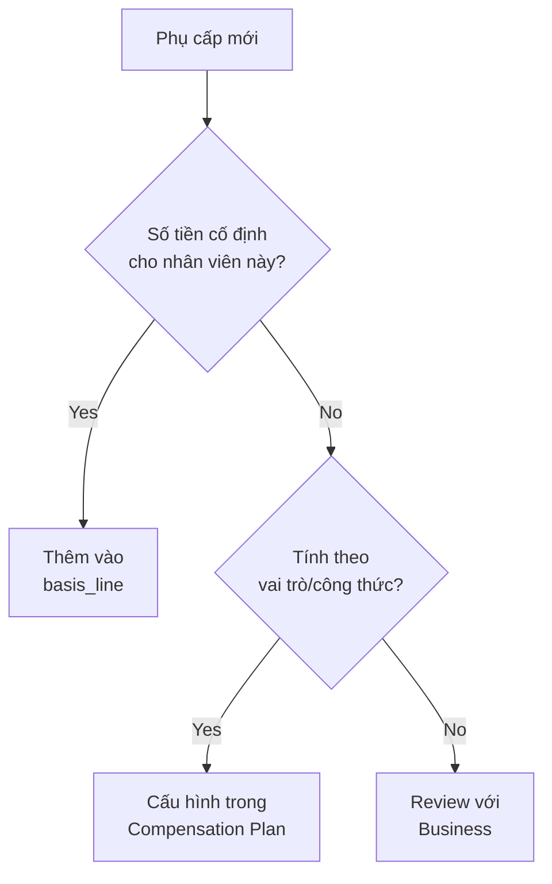
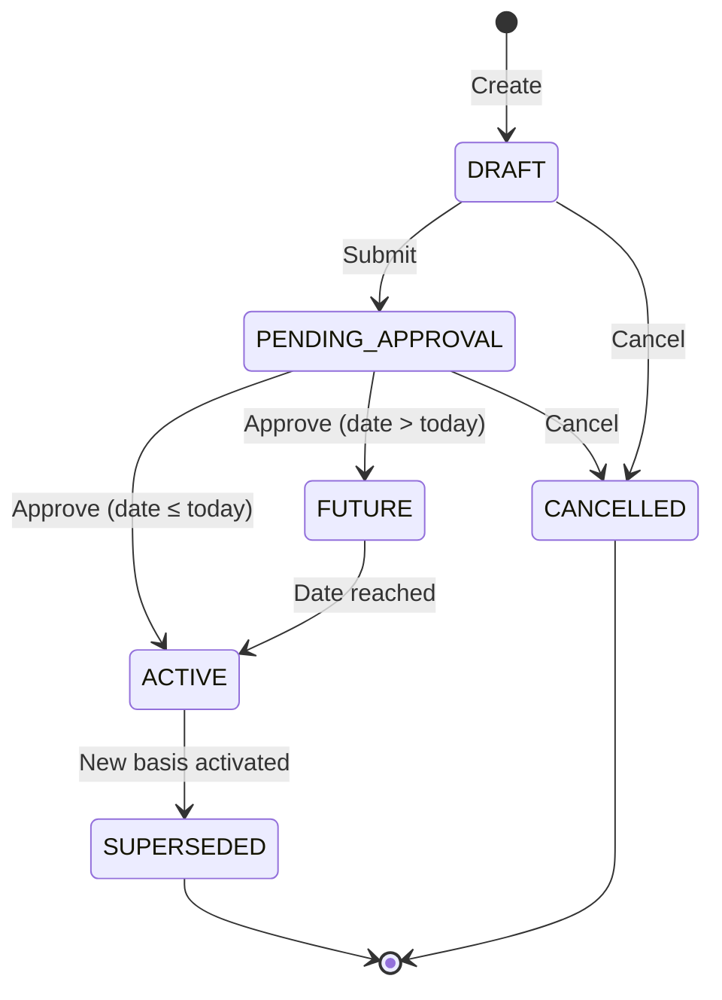

# Compensation Basis - Technical Guide

> **Audience**: BA, Developers, QC, Business Stakeholders  
> **Version**: 1.0.0  
> **Last Updated**: 06 Feb 2026

---

## 📋 Table of Contents

1. [Overview](#overview)
2. [Core Concepts](#core-concepts)
3. [Data Model](#data-model)
4. [Component Lines - Flexible Allowances](#component-lines---flexible-allowances)
5. [Usage Scenarios](#usage-scenarios)
6. [Business Rules](#business-rules)
7. [API Integration](#api-integration)
8. [Testing Guide](#testing-guide)

---

## Overview

### What is Compensation Basis?

**CompensationBasis** (Mức Lương Hiệu Lực) là **operational salary** của nhân viên - số tiền lương thực tế được sử dụng cho:

- ✅ **Payroll calculation** - Tính lương hàng tháng
- ✅ **BHXH/BHYT/BHTN** - Đóng bảo hiểm xã hội
- ✅ **Analytics** - Phân tích xu hướng lương, compa-ratio

### Golden Rule - 3 Layers

```
┌─────────────────────────────────────────────────────────┐
│  Contract (Legal Layer)                                 │
│  └── baseSalary = Số tiền pháp lý trong HĐLĐ           │
│      (Static, for audit, signed document)              │
└─────────────────────────────────────────────────────────┘
                         │
                         ▼
┌─────────────────────────────────────────────────────────┐
│  CompensationBasis (Operational Layer)                  │
│  └── basisAmount = Lương vận hành thực tế              │
│      (Dynamic, date-effective, for payroll)            │
│      + Component Lines = Phụ cấp cố định chốt số       │
└─────────────────────────────────────────────────────────┘
                         │
                         ▼
┌─────────────────────────────────────────────────────────┐
│  Compensation Plan (Formula Layer)                      │
│  └── Formulas + Rules = Phụ cấp tính theo công thức    │
│      (Calculated at runtime, not stored)               │
└─────────────────────────────────────────────────────────┘
```

**⚠️ CRITICAL**: Ba lớp KHÔNG ĐƯỢC trùng vai. Mỗi lớp có trách nhiệm riêng biệt.

---

## Core Concepts

### 1. Header-Line Pattern

CompensationBasis sử dụng **Header-Line pattern** (giống Oracle HCM, SAP):

```
compensation.basis (Header)
  ├── id: cb-001
  ├── basisAmount: 20,000,000 VND (lương cơ bản)
  ├── totalAllowanceAmount: 5,000,000 VND (tổng phụ cấp)
  └── totalGrossAmount: 25,000,000 VND (tổng gross)
      │
      └── compensation.basis_line (Lines - Flexible)
          ├── Line 1: MEAL = 730,000 VND
          ├── Line 2: HOUSING = 3,000,000 VND
          └── Line 3: RESPONSIBILITY = 1,270,000 VND
```

### 2. SCD Type-2 (Slowly Changing Dimension)

Mỗi thay đổi lương tạo **record mới**, giữ nguyên record cũ:

```sql
-- Record 1: Lương tuyển dụng
id: cb-001, effectiveStartDate: 2024-02-01, basisAmount: 15M, isCurrent: false

-- Record 2: Hết thử việc (supersedes cb-001)
id: cb-002, effectiveStartDate: 2024-04-01, basisAmount: 20M, isCurrent: false
previousBasisId: cb-001

-- Record 3: Xét lương hàng năm (supersedes cb-002)
id: cb-003, effectiveStartDate: 2025-01-01, basisAmount: 22M, isCurrent: true
previousBasisId: cb-002
```

**Lợi ích**:
- ✅ Full audit trail - Lịch sử lương đầy đủ
- ✅ Time-travel queries - Query lương tại bất kỳ thời điểm nào
- ✅ Compliance - Đáp ứng yêu cầu kiểm toán

### 3. Flexible vs. Formula-Based Allowances

| Loại phụ cấp | Lưu ở đâu | Ví dụ |
|---------------|-----------|-------|
| **FIXED** - Chốt số riêng cho nhân sự | `compensation.basis_line` | Phụ cấp cơm 730K riêng cho 1 nhân viên |
| **Formula** - Tính theo vai trò/công thức | Compensation Plan (runtime) | Phụ cấp cơm 30K/ngày × số ngày làm việc |

**Decision Tree**:



---

## Data Model

### Entity: CompensationBasis

**Ontology**: `CompensationBasis.onto.md`  
**Table**: `compensation.basis`

#### Key Attributes

| Attribute | Type | Description | Example |
|-----------|------|-------------|---------|
| `id` | uuid | Primary key | `cb-12345` |
| `workRelationshipId` | uuid | Link to WorkRelationship | `wr-001` |
| `effectiveStartDate` | date | Ngày bắt đầu hiệu lực | `2024-04-01` |
| `effectiveEndDate` | date | Ngày kết thúc (null = current) | `null` |
| `isCurrent` | boolean | Bản ghi hiện tại? | `true` |
| `basisAmount` | decimal | Lương cơ bản | `20,000,000` |
| `frequencyCode` | enum | MONTHLY/HOURLY/DAILY | `MONTHLY` |
| `basisTypeCode` | enum | LEGAL_BASE/OPERATIONAL_BASE | `OPERATIONAL_BASE` |
| `sourceCode` | enum | CONTRACT/PROMOTION/COMP_CYCLE | `PROMOTION` |
| `reasonCode` | enum | HIRE/PROBATION_END/ANNUAL_REVIEW | `PROBATION_END` |
| `hasComponentLines` | boolean | Có detail lines? | `true` |
| `totalAllowanceAmount` | decimal | Tổng phụ cấp (aggregated) | `5,000,000` |
| `totalGrossAmount` | decimal | basis + allowances | `25,000,000` |
| `statusCode` | enum | DRAFT/ACTIVE/SUPERSEDED | `ACTIVE` |

#### Lifecycle States



### Table: compensation.basis_line

**Purpose**: Lưu phụ cấp cố định chốt số riêng cho nhân viên

#### Key Columns

| Column | Type | Description | Example |
|--------|------|-------------|---------|
| `id` | uuid | Primary key | `line-001` |
| `basis_id` | uuid | FK to compensation.basis | `cb-12345` |
| `component_type_code` | varchar(50) | MEAL/HOUSING/RESPONSIBILITY | `MEAL` |
| `amount` | decimal | Số tiền phụ cấp | `730,000` |
| `source_code` | varchar(30) | FIXED/OVERRIDE | `FIXED` |
| `effective_start_date` | date | Ngày bắt đầu | `2024-04-01` |
| `is_current_flag` | boolean | Hiệu lực hiện tại? | `true` |

#### Component Type Codes

| Code | VN Name | Use Case |
|------|---------|----------|
| `MEAL` | Phụ cấp ăn trưa | Cố định 730K/tháng cho nhân viên X |
| `HOUSING` | Phụ cấp nhà ở | 3M/tháng cho expat |
| `TRANSPORTATION` | Phụ cấp xăng xe | 2M/tháng cho sales |
| `RESPONSIBILITY` | Phụ cấp trách nhiệm | 5M/tháng cho team lead |
| `SENIORITY` | Phụ cấp thâm niên | 500K/năm thâm niên |
| `TOXICITY` | Phụ cấp độc hại | 1M/tháng cho công việc nguy hiểm |
| `PHONE` | Phụ cấp điện thoại | 500K/tháng |
| `OTHER` | Khác | Phụ cấp đặc biệt |

---

## Component Lines - Flexible Allowances

### When to Use basis_line?

✅ **SỬ DỤNG** `compensation.basis_line` khi:

1. **Số tiền cố định riêng** cho nhân viên cụ thể
   - *Ví dụ*: Anh A được phụ cấp cơm 730K (khác mức chung 500K)
   
2. **Override** giá trị từ compensation plan
   - *Ví dụ*: Plan tính 2M nhưng anh B được 3M (special case)
   
3. **Phụ cấp đặc biệt** không theo công thức
   - *Ví dụ*: Phụ cấp relocation 10M cho expat

❌ **KHÔNG SỬ DỤNG** khi:

1. Phụ cấp tính theo **công thức chung**
   - *Ví dụ*: 30K/ngày × số ngày làm việc → Dùng Compensation Plan
   
2. Phụ cấp theo **vai trò/chức danh**
   - *Ví dụ*: Tất cả Manager được 5M → Dùng Compensation Plan
   
3. Phụ cấp **động** theo performance
   - *Ví dụ*: Bonus KPI → Dùng Compensation Plan

### CRUD Operations

#### Create Component Line

```sql
INSERT INTO compensation.basis_line (
  id, basis_id, component_type_code, amount, 
  source_code, effective_start_date, is_current_flag
) VALUES (
  gen_random_uuid(), 
  'cb-12345',           -- basis_id
  'MEAL',               -- component_type_code
  730000,               -- amount
  'FIXED',              -- source_code
  '2024-04-01',         -- effective_start_date
  true                  -- is_current_flag
);

-- Update header aggregates
UPDATE compensation.basis
SET 
  has_component_lines = true,
  total_allowance_amount = (
    SELECT SUM(amount) 
    FROM compensation.basis_line 
    WHERE basis_id = 'cb-12345' AND is_current_flag = true
  ),
  total_gross_amount = basis_amount + total_allowance_amount,
  component_line_count = (
    SELECT COUNT(*) 
    FROM compensation.basis_line 
    WHERE basis_id = 'cb-12345' AND is_current_flag = true
  )
WHERE id = 'cb-12345';
```

#### Update Component Line (SCD Type-2)

```sql
-- End current line
UPDATE compensation.basis_line
SET 
  effective_end_date = '2024-12-31',
  is_current_flag = false
WHERE id = 'line-001';

-- Create new line with updated amount
INSERT INTO compensation.basis_line (
  id, basis_id, component_type_code, amount,
  source_code, effective_start_date, is_current_flag
) VALUES (
  gen_random_uuid(),
  'cb-12345',
  'MEAL',
  850000,              -- increased from 730K
  'FIXED',
  '2025-01-01',
  true
);

-- Refresh aggregates (same as above)
```

---

## Usage Scenarios

### Scenario 1: Tuyển dụng mới (New Hire)

**Context**: Tuyển dụng Senior Engineer, lương 20M + phụ cấp cơm 730K

```yaml
# Step 1: Create Contract
Contract:
  id: contract-001
  baseSalary: 20,000,000  # Legal amount in HĐLĐ
  
# Step 2: Create CompensationBasis (LEGAL_BASE)
CompensationBasis:
  id: cb-001
  workRelationshipId: wr-001
  contractId: contract-001
  basisTypeCode: LEGAL_BASE
  sourceCode: CONTRACT
  reasonCode: HIRE
  basisAmount: 20,000,000
  effectiveStartDate: 2024-02-01
  hasComponentLines: true
  statusCode: ACTIVE
  
# Step 3: Add Component Line
BasisLine:
  id: line-001
  basisId: cb-001
  componentTypeCode: MEAL
  amount: 730,000
  sourceCode: FIXED
  effectiveStartDate: 2024-02-01
  
# Result:
# - totalAllowanceAmount: 730,000
# - totalGrossAmount: 20,730,000
```

### Scenario 2: Hết thử việc (Probation End)

**Context**: Sau 2 tháng thử việc, tăng lương lên 25M + thêm phụ cấp trách nhiệm 2M

```yaml
# Step 1: Create new CompensationBasis (supersedes cb-001)
CompensationBasis:
  id: cb-002
  workRelationshipId: wr-001
  previousBasisId: cb-001        # Link to previous
  basisTypeCode: OPERATIONAL_BASE
  sourceCode: MANUAL_ADJUST
  reasonCode: PROBATION_END
  basisAmount: 25,000,000        # Increased
  adjustmentAmount: 5,000,000
  adjustmentPercentage: 25.00
  effectiveStartDate: 2024-04-01
  statusCode: ACTIVE
  
# Step 2: Copy existing lines + add new line
BasisLine (MEAL - copied):
  basisId: cb-002
  componentTypeCode: MEAL
  amount: 730,000
  sourceCode: FIXED
  
BasisLine (RESPONSIBILITY - new):
  basisId: cb-002
  componentTypeCode: RESPONSIBILITY
  amount: 2,000,000
  sourceCode: FIXED
  
# Step 3: Auto-supersede cb-001
UPDATE compensation.basis
SET statusCode = 'SUPERSEDED', isCurrent = false
WHERE id = 'cb-001';

# Result:
# - totalAllowanceAmount: 2,730,000
# - totalGrossAmount: 27,730,000
```

### Scenario 3: Override Compensation Plan

**Context**: Plan tính phụ cấp nhà ở 2M cho tất cả expat, nhưng anh C được 3M (special case)

```yaml
# Compensation Plan calculates: 2,000,000
# But we want to override for this specific employee

BasisLine:
  basisId: cb-003
  componentTypeCode: HOUSING
  amount: 3,000,000
  sourceCode: OVERRIDE        # ← Key: OVERRIDE not FIXED
  reasonCode: SPECIAL
  notes: "Approved by CEO - relocation package"
  
# At payroll runtime:
# 1. Plan calculates: 2M
# 2. System checks basis_line: Found OVERRIDE = 3M
# 3. Use 3M instead of 2M
```

---

## Business Rules

### Validation Rules

| Rule | Description | Severity |
|------|-------------|----------|
| **BasisAmountRequired** | `basisAmount` > 0 | ERROR |
| **EffectiveDateRequired** | `effectiveStartDate` not null | ERROR |
| **WorkRelationshipRequired** | Must link to WorkRelationship | ERROR |
| **NoOverlappingPeriods** | No 2 ACTIVE records with overlapping dates | ERROR |
| **LegalBaseMustHaveContract** | If `basisTypeCode = LEGAL_BASE` then `contractId` required | ERROR |

### Business Rules

| Rule | Description | Severity |
|------|-------------|----------|
| **BaseSalaryMinWage** | `basisAmount` ≥ Regional Min Wage (VN BHXH) | WARNING |
| **ApprovalRequired** | Large increases (>10%) need approval | WARNING |
| **ICurrentFlagSync** | Only 1 `isCurrent = true` per WorkRelationship | INFO |
| **AggregateSync** | `totalGrossAmount = basisAmount + totalAllowanceAmount` | INFO |

### Calculation Rules

```javascript
// Auto-calculate annual equivalent
annualEquivalent = basisAmount × annualizationFactor

// Annualization factors
const FACTORS = {
  ANNUALLY: 1,
  MONTHLY: 12,
  BI_WEEKLY: 26,
  WEEKLY: 52,
  DAILY: 260,
  HOURLY: 2080
};

// Aggregate component lines
totalAllowanceAmount = SUM(basis_line.amount WHERE is_current_flag = true)
totalGrossAmount = basisAmount + totalAllowanceAmount
componentLineCount = COUNT(basis_line WHERE is_current_flag = true)
```

---

## API Integration

### REST API Examples

#### Get Current Basis for Employee

```http
GET /api/v1/compensation/basis?workRelationshipId=wr-001&current=true

Response:
{
  "id": "cb-003",
  "workRelationshipId": "wr-001",
  "basisAmount": 25000000,
  "currencyCode": "VND",
  "frequencyCode": "MONTHLY",
  "totalAllowanceAmount": 2730000,
  "totalGrossAmount": 27730000,
  "componentLines": [
    {
      "componentTypeCode": "MEAL",
      "amount": 730000,
      "sourceCode": "FIXED"
    },
    {
      "componentTypeCode": "RESPONSIBILITY",
      "amount": 2000000,
      "sourceCode": "FIXED"
    }
  ],
  "effectiveStartDate": "2024-04-01",
  "isCurrent": true,
  "statusCode": "ACTIVE"
}
```

#### Create New Basis with Lines

```http
POST /api/v1/compensation/basis

Request:
{
  "workRelationshipId": "wr-001",
  "basisAmount": 30000000,
  "frequencyCode": "MONTHLY",
  "basisTypeCode": "OPERATIONAL_BASE",
  "sourceCode": "PROMOTION",
  "reasonCode": "PROMOTION",
  "effectiveStartDate": "2025-07-01",
  "componentLines": [
    {
      "componentTypeCode": "MEAL",
      "amount": 730000,
      "sourceCode": "FIXED"
    },
    {
      "componentTypeCode": "RESPONSIBILITY",
      "amount": 5000000,
      "sourceCode": "FIXED"
    }
  ]
}

Response: 201 Created
{
  "id": "cb-004",
  "totalGrossAmount": 35730000,
  "statusCode": "DRAFT"
}
```

#### Get Salary History

```http
GET /api/v1/compensation/basis/history?workRelationshipId=wr-001

Response:
{
  "history": [
    {
      "id": "cb-001",
      "effectiveStartDate": "2024-02-01",
      "effectiveEndDate": "2024-03-31",
      "basisAmount": 20000000,
      "reasonCode": "HIRE",
      "statusCode": "SUPERSEDED"
    },
    {
      "id": "cb-002",
      "effectiveStartDate": "2024-04-01",
      "effectiveEndDate": "2024-12-31",
      "basisAmount": 25000000,
      "reasonCode": "PROBATION_END",
      "statusCode": "SUPERSEDED"
    },
    {
      "id": "cb-003",
      "effectiveStartDate": "2025-01-01",
      "effectiveEndDate": null,
      "basisAmount": 30000000,
      "reasonCode": "ANNUAL_REVIEW",
      "statusCode": "ACTIVE"
    }
  ]
}
```

---

## Testing Guide

### Test Cases for QC

#### TC-001: Create Basis without Lines

```gherkin
Given a WorkRelationship "wr-001" exists
When I create CompensationBasis with:
  | basisAmount | 20000000 |
  | frequencyCode | MONTHLY |
  | hasComponentLines | false |
Then basis is created successfully
And totalAllowanceAmount = 0
And totalGrossAmount = 20000000
And componentLineCount = 0
```

#### TC-002: Create Basis with Lines

```gherkin
Given a WorkRelationship "wr-001" exists
When I create CompensationBasis with:
  | basisAmount | 20000000 |
  | componentLines | MEAL:730000, HOUSING:3000000 |
Then basis is created successfully
And totalAllowanceAmount = 3730000
And totalGrossAmount = 23730000
And componentLineCount = 2
```

#### TC-003: SCD Type-2 Supersede

```gherkin
Given an ACTIVE CompensationBasis "cb-001" exists
When I create new CompensationBasis "cb-002" with:
  | previousBasisId | cb-001 |
  | effectiveStartDate | 2025-01-01 |
And I approve cb-002
Then cb-002.statusCode = "ACTIVE"
And cb-002.isCurrent = true
And cb-001.statusCode = "SUPERSEDED"
And cb-001.isCurrent = false
```

#### TC-004: Validation - No Overlapping Periods

```gherkin
Given an ACTIVE CompensationBasis exists:
  | effectiveStartDate | 2024-01-01 |
  | effectiveEndDate | null |
When I try to create another ACTIVE basis:
  | effectiveStartDate | 2024-06-01 |
Then I should get error "Overlapping active periods"
```

#### TC-005: Component Line OVERRIDE

```gherkin
Given CompensationBasis "cb-001" exists
And Compensation Plan calculates HOUSING = 2000000
When I add basis_line:
  | componentTypeCode | HOUSING |
  | amount | 3000000 |
  | sourceCode | OVERRIDE |
Then at payroll runtime
And system uses 3000000 (not 2000000)
```

### SQL Test Queries

```sql
-- Test 1: Verify aggregates
SELECT 
  b.id,
  b.basis_amount,
  b.total_allowance_amount,
  b.total_gross_amount,
  b.component_line_count,
  SUM(l.amount) as calculated_allowance,
  COUNT(l.id) as calculated_count
FROM compensation.basis b
LEFT JOIN compensation.basis_line l ON l.basis_id = b.id AND l.is_current_flag = true
WHERE b.id = 'cb-001'
GROUP BY b.id;

-- Expected: total_allowance_amount = calculated_allowance

-- Test 2: Verify SCD chain
SELECT 
  id,
  previous_basis_id,
  effective_start_date,
  basis_amount,
  status_code,
  is_current_flag
FROM compensation.basis
WHERE work_relationship_id = 'wr-001'
ORDER BY effective_start_date;

-- Expected: Only 1 record with is_current_flag = true

-- Test 3: Time-travel query (salary at specific date)
SELECT 
  b.id,
  b.basis_amount,
  b.total_gross_amount,
  b.effective_start_date,
  b.effective_end_date
FROM compensation.basis b
WHERE b.work_relationship_id = 'wr-001'
  AND b.effective_start_date <= '2024-06-15'
  AND (b.effective_end_date IS NULL OR b.effective_end_date >= '2024-06-15')
  AND b.status_code = 'ACTIVE';

-- Expected: Returns the active basis on 2024-06-15
```

---

## FAQ

### Q1: Khi nào tạo record mới vs. update record cũ?

**A**: **LUÔN LUÔN** tạo record mới (SCD Type-2). Không bao giờ update `basisAmount` của record đã ACTIVE.

**Lý do**:
- ✅ Audit trail đầy đủ
- ✅ Payroll history chính xác
- ✅ Compliance requirements

### Q2: Phụ cấp OT có lưu trong basis_line không?

**A**: **KHÔNG**. OT là phụ cấp **động** tính theo giờ làm thực tế → Dùng Compensation Plan.

`basis_line` chỉ cho phụ cấp **cố định chốt số**.

### Q3: Làm sao phân biệt FIXED vs. OVERRIDE?

| source_code | Ý nghĩa | Use Case |
|-------------|---------|----------|
| `FIXED` | Số tiền cố định riêng, không liên quan plan | Phụ cấp đặc biệt cho 1 nhân viên |
| `OVERRIDE` | Override giá trị từ plan | Plan tính 2M nhưng nhân viên này được 3M |

### Q4: totalGrossAmount có bao gồm allowances từ Compensation Plan không?

**A**: **KHÔNG**. 

```
totalGrossAmount = basisAmount + totalAllowanceAmount (from basis_line only)
```

Allowances từ Compensation Plan được tính **runtime** khi chạy payroll.

### Q5: Khi nào cần approval?

**A**: Theo business rule:

- Tăng lương > 10% → Cần approval
- Tăng lương ≤ 10% → Có thể auto-approve (tùy config)
- Promotion → Luôn cần approval

---

## References

- **Ontology**: [`CompensationBasis.onto.md`](../02.ontology/compensation-basis.onto.md)
- **DBML Schema**: [`1.Core.V4.dbml`](../03-design/1.Core.V4.dbml) - Tables: `compensation.basis`, `compensation.basis_line`
- **Business Rules**: `compensation-management.brs.md` (TBD)
- **API Spec**: `compensation-api.api.md` (TBD)

---

**Document Version**: 1.0.0  
**Last Updated**: 06 Feb 2026  
**Maintained By**: HR Domain Team
