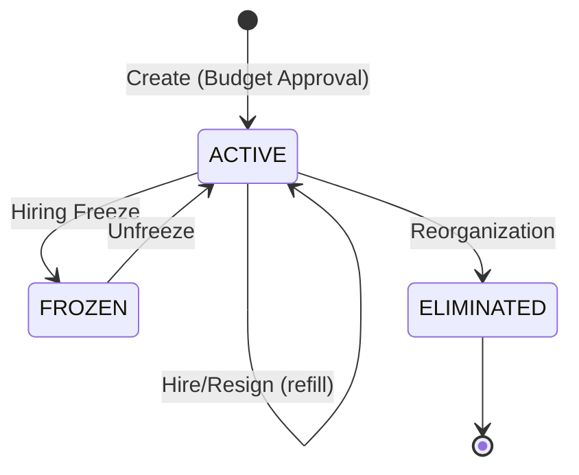

# Job, Position & Staffing Models - Complete Guide

> **Audience**: BA, Developers, QC, HR Administrators, Business Stakeholders  
> **Version**: 3.0.0  
> **Last Updated**: 06 Feb 2026  
> **Reading Time**: 60-75 minutes

---

## 📋 Table of Contents

1. [Overview](#overview)
2. [Core Concepts: Job vs Position](#core-concepts-job-vs-position)
3. [Job Management](#job-management)
4. [Position Management](#position-management)
5. [Staffing Models](#staffing-models)
6. [Position-Job Override Rules](#position-job-override-rules)
7. [Assignment Patterns](#assignment-patterns)
8. [Testing Guide](#testing-guide)

---

## Overview

### What This Guide Covers

This guide explains the **Job-Position-Assignment** model in xTalent Core Module, covering:

- ✅ **Job** - Template/classification (WHAT work + compensation level)
- ✅ **Position** - Instance/slot (WHERE in org + reporting structure)
- ✅ **Assignment** - Employee-to-Position/Job mapping (WHO does the work)
- ✅ **Staffing Models** - Position-based vs Job-based (HOW to manage headcount)

### Golden Rule - 3 Layers

```
┌─────────────────────────────────────────────────────────┐
│  Job (Template/Class)                                   │
│  └── Defines: WHAT work + Grade + Level                │
│      (Reusable, compensation-driven)                    │
└─────────────────────────────────────────────────────────┘
                         │
                         ▼
┌─────────────────────────────────────────────────────────┐
│  Position (Instance/Slot)                               │
│  └── Defines: WHERE in org + Reporting + FTE           │
│      (Specific, org-structure-driven)                   │
└─────────────────────────────────────────────────────────┘
                         │
                         ▼
┌─────────────────────────────────────────────────────────┐
│  Assignment (Employee Link)                             │
│  └── Defines: WHO + WHEN + Primary/Secondary           │
│      (Time-effective, person-driven)                    │
└─────────────────────────────────────────────────────────┘
```

---

## Core Concepts: Job vs Position

### The Fundamental Distinction

| Aspect | Job | Position |
|--------|-----|----------|
| **Nature** | Template/Classification | Instance/Slot |
| **Purpose** | Define WHAT work + compensation | Define WHERE in org structure |
| **Multiplicity** | One Job → Many Positions | One Position → One (or few) Employees |
| **Compensation** | **Owns** grade_code, level_code | **Inherits** from Job |
| **Org Structure** | No org placement | **Owns** business_unit_id, reports_to_id |
| **Reusability** | Reused across org | Specific to one BU |
| **Example** | "Senior Backend Engineer" | "POS-ENG-BACKEND-001" |

### Analogy: Class vs Object

**For Technical People**:
```java
// Job is like a CLASS
class SeniorBackendEngineer {
    String gradeCode = "G7";        // ✅ Compensation
    String levelCode = "L3";        // ✅ Seniority
    String jobType = "TECH";        // ✅ Classification
}

// Position is like an OBJECT (instance)
Position pos1 = new SeniorBackendEngineer();
pos1.businessUnitId = "BU-ENGINEERING";   // ✅ Org placement
pos1.reportsToId = "POS-MGR-001";         // ✅ Reporting line
pos1.title = "Senior BE - AI Platform";   // ✅ Context
pos1.gradeCode = → "G7" (inherited);      // ❌ Cannot override
```

**For Non-Technical People**:
- **Job** = Recipe (how to make a cake)
- **Position** = Actual cake (specific instance in your kitchen)

---

## Job Management

### What is a Job?

**Definition**: A generic role definition that describes WHAT work needs to be done and its compensation level.

**Ontology**: [`Job.onto.md`](../02.ontology/jobs/job.onto.md)  
**Table**: `jobpos.job`

### Key Attributes

| Attribute | Type | Description | Example |
|-----------|------|-------------|---------|
| `jobCode` | string | Unique job code | `JOB-BACKEND-SENIOR` |
| `jobTitle` | string | Job title | `Senior Backend Engineer` |
| `gradeCode` | enum | **Compensation grade** | `G7` |
| `levelCode` | enum | **Seniority level** | `L3` (Senior) |
| `jobTypeCode` | enum | Job classification | `TECH` |
| `taxonomyId` | uuid | Link to JobTaxonomy | `tax-backend-dev` |
| `parentJobId` | uuid | Parent job (inheritance) | `JOB-BACKEND` |

### Job Taxonomy (4-Level Hierarchy)

```
Level 1: TRACK
  └─ Level 2: FAMILY
      └─ Level 3: GROUP
          └─ Level 4: SUBGROUP
```

**Example**:

```
Technology (Track)
  ├─ Software Engineering (Family)
  │   ├─ Backend Development (Group)
  │   │   ├─ Microservices Backend (Subgroup)
  │   │   ├─ API Development (Subgroup)
  │   │   └─ Database Administration (Subgroup)
  │   │
  │   ├─ Frontend Development (Group)
  │   └─ Mobile Development (Group)
  │
  ├─ Data & Analytics (Family)
  └─ DevOps & Infrastructure (Family)
```

### Job Hierarchy (Inheritance)

Jobs can inherit from parent jobs:

```yaml
# Parent Job
Job: Backend Engineer
  gradeCode: null  # Not specified
  levelCode: null
  baseResponsibilities:
    - "Design and implement APIs"
    - "Optimize database queries"

# Child Job (inherits from parent)
Job: Senior Backend Engineer
  parentJobId: JOB-BACKEND
  gradeCode: "G7"        # ✅ Adds grade
  levelCode: "L3"        # ✅ Adds level
  # Inherits baseResponsibilities from parent
  additionalResponsibilities:
    - "Mentor junior engineers"
    - "Lead technical design"
```

### Job Levels & Grades

#### Levels (Seniority)

| Code | Name | Experience | Management |
|------|------|------------|------------|
| `L1` | Junior | 0-2 years | No |
| `L2` | Mid-level | 2-5 years | No |
| `L3` | Senior | 5-8 years | No |
| `L4` | Principal | 8-12 years | No |
| `M1` | Manager | 5-8 years | Yes |
| `M2` | Senior Manager | 8-12 years | Yes |
| `E1` | Executive | 15+ years | Yes |

#### Grades (Compensation)

| Code | Name | Min Salary | Mid Salary | Max Salary |
|------|------|------------|------------|------------|
| `G5` | Grade 5 | 50M VND | 65M VND | 80M VND |
| `G6` | Grade 6 | 70M VND | 90M VND | 110M VND |
| `G7` | Grade 7 | 100M VND | 130M VND | 160M VND |
| `G8` | Grade 8 | 140M VND | 180M VND | 220M VND |

**Key Insight**: Grade determines compensation. Level determines seniority.

---

## Position Management

### What is a Position?

**Definition**: A specific, budgeted headcount slot for a job in a particular department.

**Ontology**: [`Position.onto.md`](../02.ontology/jobs/position.onto.md)  
**Table**: `jobpos.position`

### Key Attributes

| Attribute | Type | Description | Example |
|-----------|------|-------------|---------|
| `code` | string | Position code | `POS-ENG-BACKEND-001` |
| `title` | string | Position title (can override) | `Senior BE - AI Platform` |
| `jobId` | uuid | **Link to Job** | `JOB-BACKEND-SENIOR` |
| `businessUnitId` | uuid | **Org placement** | `BU-ENGINEERING` |
| `reportsToPositionId` | uuid | **Reporting line** | `POS-MGR-001` |
| `fullTimeEquiv` | decimal | FTE (0.5, 1.0, etc.) | `1.0` |
| `maxIncumbents` | integer | Max employees | `1` |
| `currentIncumbents` | integer | Current employees | `1` |
| `statusCode` | enum | ACTIVE/FROZEN/ELIMINATED | `ACTIVE` |

### Position Lifecycle



### Position Status

| Status | Description | Can Hire? |
|--------|-------------|-----------|
| **ACTIVE** | Active position, can be filled | ✅ Yes |
| **FROZEN** | Hiring freeze, cannot fill | ❌ No |
| **ELIMINATED** | Position eliminated, historical only | ❌ No |

---

## Staffing Models

### The Critical Decision

**Question**: Do you manage headcount through pre-defined positions or flexible job assignments?

### Position-Based Staffing

**Definition**: Employees are assigned to specific, pre-approved budgeted positions.

**Core Concept**: **Position = Headcount Slot**

```yaml
# Step 1: Create Position (Budget Approval)
Position: POS-ENG-001
  jobId: JOB-BACKEND-SENIOR
  businessUnitId: BU-ENGINEERING
  statusCode: ACTIVE
  isBudgeted: true
  currentIncumbents: 0  # Vacant

# Step 2: Hire to Position
Assignment:
  employeeId: EMP-001
  positionId: POS-ENG-001  # ✅ Required
  jobId: JOB-BACKEND-SENIOR  # Auto-derived from position

# Position now filled
Position: POS-ENG-001
  currentIncumbents: 1
```

**Characteristics**:

| Aspect | Details |
|--------|---------|
| **Headcount Control** | Strict - positions are pre-approved |
| **Budget Approval** | Required for each position |
| **Hiring Process** | Fill existing vacant position |
| **Vacancy Tracking** | Easy - positions can be vacant |
| **Organizational Chart** | Shows positions (boxes), not people |
| **Flexibility** | Lower - need approval to create position |

**When to Use**:
- ✅ Government agencies (strict headcount)
- ✅ Large corporations with formal position management
- ✅ Organizations requiring budget approval per position
- ✅ Highly regulated industries

---

### Job-Based Staffing

**Definition**: Employees are assigned directly to jobs without pre-defined positions.

**Core Concept**: **Job = Role, No Position Needed**

```yaml
# No position creation needed!

# Hire directly to Job
Assignment:
  employeeId: EMP-001
  positionId: null  # ❌ No position
  jobId: JOB-BACKEND-SENIOR  # ✅ Required
  businessUnitId: BU-ENGINEERING
  supervisorAssignmentId: ASG-MGR-001
```

**Characteristics**:

| Aspect | Details |
|--------|---------|
| **Headcount Control** | Flexible - no pre-defined slots |
| **Budget Approval** | Approve headcount budget, not positions |
| **Hiring Process** | Hire to job directly |
| **Vacancy Tracking** | Harder - no concept of "vacant position" |
| **Organizational Chart** | Shows people and their jobs |
| **Flexibility** | Higher - easy to scale up/down |

**When to Use**:
- ✅ Startups (rapid growth)
- ✅ Consulting firms (project-based staffing)
- ✅ Agile organizations (frequent reorganizations)
- ✅ Contractor-heavy workforce
- ✅ Small companies (<50 people)

---

### Hybrid Approach (Recommended)

**Strategy**: Use position-based for some roles, job-based for others.

```yaml
# Tier 1: Executive (Position-Based)
Positions:
  - POS-CEO
  - POS-CFO
  - POS-CTO

Characteristics:
  - Strict control
  - Board approval required
  - Succession planning

# Tier 2: Management (Position-Based)
Positions:
  - POS-DIR-ENG
  - POS-MGR-BACKEND

Characteristics:
  - Budget approval required
  - Reporting hierarchy

# Tier 3: Individual Contributors (Job-Based)
Jobs:
  - JOB-BACKEND-SENIOR
  - JOB-BACKEND-MID

Characteristics:
  - Flexible headcount
  - Manager approval
  - Easy to scale

# Tier 4: Contractors (Job-Based)
Jobs:
  - JOB-CONTRACTOR-BACKEND

Characteristics:
  - No positions
  - Temporary
  - Flexible
```

---

### Staffing Model Configuration

**Legal Entity Level**: Each Legal Entity can configure its staffing model.

**Ontology**: [`LegalEntity.onto.md`](../02.ontology/org/LegalEntity.onto.md)  
**Table**: `org_legal.entity`

```yaml
LegalEntity:
  code: "VNG-HCM"
  staffingModelCode: "POSITION_BASED"  # or JOB_BASED, HYBRID
```

#### Staffing Model Values

| Value | Description | Assignment Constraint |
|-------|-------------|----------------------|
| **POSITION_BASED** | Position-centric (default) | `positionId` REQUIRED for all assignments |
| **JOB_BASED** | Job-centric (flexible) | `jobId` REQUIRED, `positionId` optional |
| **HYBRID** | Either position or job | Either `positionId` OR `jobId` must be provided |

#### Validation Rules

```yaml
# Position-based Organization
LegalEntity: VNG-HCM
  staffingModelCode: POSITION_BASED

# ✅ Valid - has positionId
Assignment:
  legalEntityCode: "VNG-HCM"
  positionId: "pos-dev-001"
  jobId: null  # Auto-derived from Position.jobId

# ❌ Invalid - missing positionId
Assignment:
  legalEntityCode: "VNG-HCM"
  positionId: null  # ERROR: Position required
  jobId: "job-dev"
```

```yaml
# Job-based Organization
LegalEntity: VNG-STARTUP
  staffingModelCode: JOB_BASED

# ✅ Valid - has jobId only
Assignment:
  legalEntityCode: "VNG-STARTUP"
  positionId: null  # OK for job-based
  jobId: "job-dev"

# ✅ Valid - has both (position optional)
Assignment:
  legalEntityCode: "VNG-STARTUP"
  positionId: "pos-dev-001"  # Optional tracking
  jobId: "job-dev"
```

---

## Position-Job Override Rules

### The Golden Rule

> **Position = Instance of Job** in specific organizational context
> 
> - **Compensation attributes (grade, level) CANNOT be overridden**
> - **Organizational attributes (title, reporting) CAN be overridden**

### Override Rules Matrix

| Attribute | Source | Can Override? | Rationale |
|-----------|--------|---------------|-----------|
| **gradeCode** | Job | ❌ **NO** | Compensation must be consistent |
| **levelCode** | Job | ❌ **NO** | Seniority is job-defined |
| **jobTypeCode** | Job | ❌ **NO** | Job classification is inherent |
| **title** | Position | ✅ **YES** | Can add context (team, location) |
| **reportsToId** | Position | ✅ **YES** | Org structure is position-specific |
| **businessUnitId** | Position | ✅ **YES** | Position is placed in specific BU |
| **fullTimeEquiv** | Position | ✅ **YES** | FTE can vary (0.5, 1.0, etc.) |

### Example: What Position Inherits

```yaml
Job: "Senior Software Engineer"
  gradeCode: "G7"        # ✅ Position MUST inherit
  levelCode: "L3"        # ✅ Position MUST inherit
  jobTypeCode: "TECH"    # ✅ Position MUST inherit
  jobTitle: "Senior Software Engineer"

Position: "Senior SW Engineer - AI Platform"
  jobId: JOB-001
  # Inherited (cannot override):
  gradeCode: → "G7" (from job)
  levelCode: → "L3" (from job)
  jobTypeCode: → "TECH" (from job)
  
  # Can override:
  title: "Senior Software Engineer - AI Platform Team"  # ✅ More specific
  reportsToId: MGR-AI-PLATFORM  # ✅ Org-specific
  businessUnitId: BU-AI         # ✅ Org-specific
  fullTimeEquiv: 1.0            # ✅ Position-specific
```

### Common Mistakes to Avoid

#### ❌ Mistake 1: Trying to Override Grade

```sql
-- WRONG: Trying to give position different grade
-- This is NOT possible because grade is on Job, not Position
UPDATE jobpos.position 
SET grade_code = 'G8'  -- ❌ Column doesn't exist!
WHERE id = 'position-uuid';

-- CORRECT: Change job's grade (affects ALL positions)
UPDATE jobpos.job
SET grade_code = 'G8'
WHERE id = 'job-uuid';
```

#### ❌ Mistake 2: Duplicating Job Title

```yaml
# WRONG: Just copying job title
Position:
  title: "Software Engineer"  # ❌ Same as job.jobTitle, no value added
  
# BETTER: Add context
Position:
  title: "Software Engineer - AI Platform"  # ✅ More specific
```

---

## Assignment Patterns

### What is an Assignment?

**Definition**: Links an Employee to a Position or Job, with time-effective dates.

**Ontology**: [`Assignment.onto.md`](../02.ontology/core/Assignment.onto.md)  
**Table**: `employment.assignment`

### Key Attributes

| Attribute | Type | Description |
|-----------|------|-------------|
| `employeeId` | uuid | Employee being assigned |
| `positionId` | uuid | Position (if position-based) |
| `jobId` | uuid | Job (if job-based or derived) |
| `businessUnitId` | uuid | Business unit |
| `assignmentTypeCode` | enum | PRIMARY, SECONDARY, TEMPORARY |
| `effectiveStartDate` | date | Start date |
| `effectiveEndDate` | date | End date (null = current) |
| `isCurrent` | boolean | Current assignment? |

### Assignment Types

| Type | Description | Use Case |
|------|-------------|----------|
| **PRIMARY** | Main assignment | Employee's primary role |
| **SECONDARY** | Additional assignment | Matrix management, dual roles |
| **TEMPORARY** | Temporary assignment | Project work, coverage |

### Pattern 1: Position-Based Assignment

```yaml
# Step 1: Create Position
Position: POS-ENG-001
  jobId: JOB-BACKEND-SENIOR
  businessUnitId: BU-ENGINEERING
  statusCode: ACTIVE
  currentIncumbents: 0

# Step 2: Create Assignment
Assignment:
  employeeId: EMP-001
  positionId: POS-ENG-001  # ✅ Required
  jobId: JOB-BACKEND-SENIOR  # Auto-derived
  assignmentTypeCode: PRIMARY
  effectiveStartDate: 2024-01-15
  isCurrent: true

# Step 3: Position updated
Position: POS-ENG-001
  currentIncumbents: 1
```

### Pattern 2: Job-Based Assignment

```yaml
# No position needed!

Assignment:
  employeeId: EMP-001
  positionId: null  # ❌ No position
  jobId: JOB-BACKEND-SENIOR  # ✅ Required
  businessUnitId: BU-ENGINEERING
  supervisorAssignmentId: ASG-MGR-001
  assignmentTypeCode: PRIMARY
  effectiveStartDate: 2024-01-15
  isCurrent: true
```

### Pattern 3: Secondary Assignment (Matrix Management)

```yaml
# Primary Assignment
Assignment 1:
  employeeId: EMP-001
  positionId: POS-ENG-001
  assignmentTypeCode: PRIMARY
  assignmentPercentage: 70

# Secondary Assignment (Project)
Assignment 2:
  employeeId: EMP-001
  positionId: POS-PROJECT-001
  assignmentTypeCode: SECONDARY
  assignmentPercentage: 30
```

---

## Testing Guide

### Test Cases for QC

#### TC-001: Position-Based Assignment

```gherkin
Given a LegalEntity "VNG-HCM" with staffingModelCode = "POSITION_BASED"
And a Position "POS-ENG-001" exists with jobId = "JOB-BACKEND-SENIOR"
When I create Assignment with:
  | employeeId | EMP-001 |
  | positionId | POS-ENG-001 |
Then assignment is created successfully
And assignment.jobId = "JOB-BACKEND-SENIOR" (auto-derived)
And position.currentIncumbents = 1
```

#### TC-002: Job-Based Assignment

```gherkin
Given a LegalEntity "VNG-STARTUP" with staffingModelCode = "JOB_BASED"
When I create Assignment with:
  | employeeId | EMP-001 |
  | positionId | null |
  | jobId | JOB-BACKEND-SENIOR |
Then assignment is created successfully
And no position is created
```

#### TC-003: Staffing Model Validation

```gherkin
Given a LegalEntity "VNG-HCM" with staffingModelCode = "POSITION_BASED"
When I try to create Assignment with:
  | employeeId | EMP-001 |
  | positionId | null |
  | jobId | JOB-BACKEND-SENIOR |
Then I should get error "Position required for position-based staffing"
```

#### TC-004: Position Cannot Override Grade

```gherkin
Given a Job "JOB-001" with gradeCode = "G7"
And a Position "POS-001" with jobId = "JOB-001"
When I query position compensation
Then position.gradeCode = "G7" (inherited from job)
And position table has no grade_code column
```

### SQL Test Queries

```sql
-- Test 1: Verify position inherits from job
SELECT 
  p.code AS position_code,
  p.title AS position_title,
  j.grade_code,      -- ✅ From Job
  j.level_code,      -- ✅ From Job
  j.job_type_code    -- ✅ From Job
FROM jobpos.position p
JOIN jobpos.job j ON j.id = p.job_id
WHERE p.id = 'position-uuid';

-- Test 2: Verify staffing model enforcement
SELECT 
  le.code AS legal_entity,
  le.staffing_model_code,
  a.position_id,
  a.job_id,
  CASE 
    WHEN le.staffing_model_code = 'POSITION_BASED' AND a.position_id IS NULL 
      THEN 'ERROR: Missing position'
    WHEN le.staffing_model_code = 'JOB_BASED' AND a.job_id IS NULL 
      THEN 'ERROR: Missing job'
    ELSE 'OK'
  END AS validation_status
FROM employment.assignment a
JOIN org_legal.entity le ON le.code = a.legal_entity_code
WHERE a.is_current_flag = true;

-- Test 3: Headcount by position (position-based)
SELECT 
  p.code AS position_code,
  p.max_incumbents,
  p.current_incumbents,
  COUNT(a.id) AS actual_assignments
FROM jobpos.position p
LEFT JOIN employment.assignment a ON a.position_id = p.id AND a.is_current_flag = true
WHERE p.is_current_flag = true
GROUP BY p.id
HAVING p.current_incumbents != COUNT(a.id);  -- Should be 0 rows

-- Test 4: Headcount by job (job-based)
SELECT 
  j.job_code,
  j.job_title,
  COUNT(a.id) AS headcount
FROM jobpos.job j
LEFT JOIN employment.assignment a ON a.job_id = j.id AND a.is_current_flag = true
WHERE j.is_current_flag = true
GROUP BY j.id;
```

---

## FAQ

### Q1: Khi nào dùng Position-based vs Job-based?

**A**: 

| Use Position-Based When | Use Job-Based When |
|-------------------------|---------------------|
| Strict headcount control needed | Flexibility and speed needed |
| Formal budget approval process | Project-based staffing |
| Vacancy tracking important | Agile organization |
| Government/regulated industry | Startup/consulting firm |

### Q2: Position có thể có grade khác Job không?

**A**: **KHÔNG**. Grade là thuộc tính của Job, Position PHẢI kế thừa.

```yaml
Job: gradeCode = "G7"
Position: gradeCode → "G7" (inherited, cannot override)
```

### Q3: Làm sao để track vacancy trong Job-based model?

**A**: Không có concept "vacant position". Thay vào đó:

```sql
-- Track headcount vs budget
SELECT 
  job_code,
  COUNT(assignments) AS actual_headcount,
  budget_headcount,
  (budget_headcount - COUNT(assignments)) AS available_slots
FROM jobs
LEFT JOIN assignments ON ...
GROUP BY job_code;
```

### Q4: Có thể mix Position-based và Job-based trong cùng org không?

**A**: **CÓ**. Dùng `staffingModelCode = HYBRID` hoặc cấu hình khác nhau cho từng Legal Entity.

### Q5: Khi nào cần Secondary Assignment?

**A**: 

- Matrix management (báo cáo 2 managers)
- Project work (70% main role, 30% project)
- Dual roles (temporary coverage)

---

## References

- **Ontologies**:
  - [`Job.onto.md`](../02.ontology/jobs/job.onto.md)
  - [`Position.onto.md`](../02.ontology/jobs/position.onto.md)
  - [`Assignment.onto.md`](../02.ontology/core/Assignment.onto.md)
  - [`LegalEntity.onto.md`](../02.ontology/org/LegalEntity.onto.md)
- **DBML Schema**: [`1.Core.V4.dbml`](../03-design/1.Core.V4.dbml)
- **Related Guides**:
  - [Compensation Basis Guide](./compensation-basis-guide.md)

---

**Document Version**: 3.0.0  
**Last Updated**: 06 Feb 2026  
**Maintained By**: HR Domain Team
