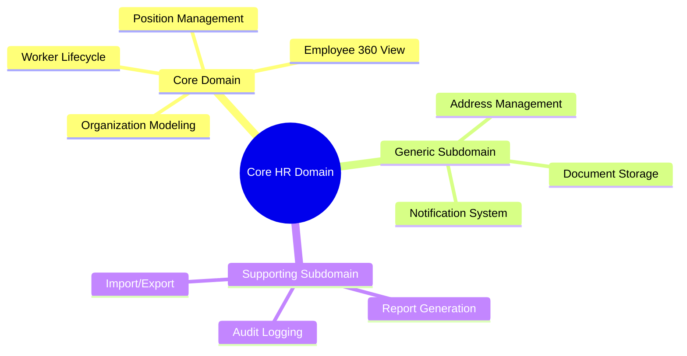
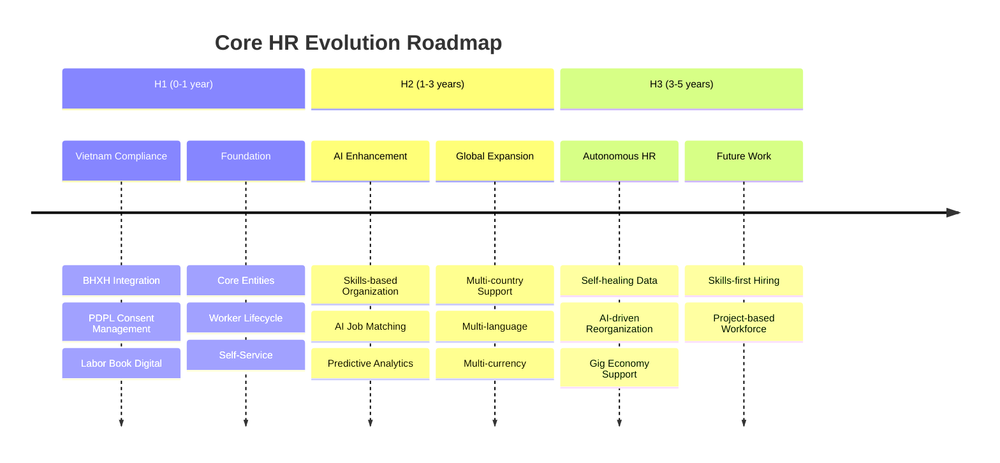
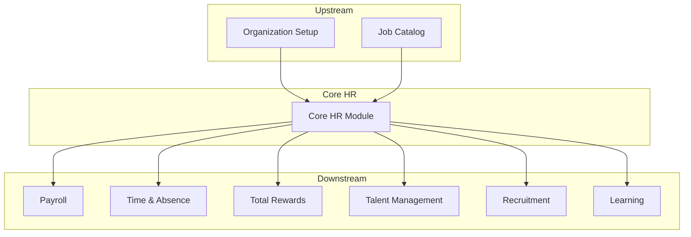

# 🔬 Research Report: Core HR Module

> **Module:** Core HR (CO)  
> **Date:** 2026-01-30  
> **Version:** 1.0  
> **Confidence Score:** HIGH  
> **Status:** Completed

---

## 1. Executive Summary

**Core HR** là module nền tảng của hệ thống Human Capital Management (HCM), quản lý toàn bộ thông tin nhân viên, cấu trúc tổ chức, vị trí công việc và vòng đời lao động từ khi tuyển dụng đến khi nghỉ việc (hire-to-retire).

Nghiên cứu này benchmark 4 vendor hàng đầu thế giới: **Oracle HCM Cloud**, **SAP SuccessFactors Employee Central**, **Workday HCM**, và **Microsoft Dynamics 365 Human Resources**.

### Key Findings

| Dimension | Summary |
|-----------|---------|
| **Total Features** | 47 core features across 7 categories |
| **Entities** | 16+ core entities |
| **Vietnam Compliance** | BHXH, Labor Law, PDPL 2026 |
| **Recommended Approach** | Position-based organization with Vietnam-first compliance |

---

## 2. Confidence Assessment

| Dimension | Score | Rationale |
|-----------|-------|-----------|
| **Regulatory Clarity** | HIGH | Vietnam Labor Law 45/2019/QH14 well-defined, PDPL 91/2025 coming 2026 |
| **Market Consensus** | HIGH | Strong alignment across all 4 vendors on core features |
| **Business Stability** | HIGH | Core HR is foundational, patterns stable for 10+ years |

**Overall Score:** `HIGH`  
**Investment Recommendation:** PROCEED with full implementation

### Conflict Warnings

| Topic | Conflict | Resolution |
|-------|----------|------------|
| Position vs Job-based | Oracle/SAP prefer Position-based; Workday flexible | Adopt Position-based (better for Vietnam enterprise) |
| Skills Taxonomy | Workday Skills Cloud proprietary; Others generic | Build extensible framework, defer to H2 |

---

## 3. Domain Strategic Classification

| Type | Examples | Strategy | Investment |
|------|----------|----------|------------|
| **Core Domain** | Employee 360, Org Modeling, Position Mgmt, Worker Lifecycle | Build perfectly | HIGH |
| **Generic Subdomain** | Address Mgmt, Document Storage, Notifications | Buy/Standardize | LOW |
| **Supporting Subdomain** | Reports, Audit, Import/Export | Outsource/Simplify | MINIMAL |

---

## 4. Competitive Analysis

### 4.1 Oracle HCM Cloud

| Category | Features |
|----------|----------|
| **Core HR** | Employee Data Management, Central Repository, Employment History |
| **Organization** | Hierarchy Configuration, Business Units, Departments, Divisions |
| **Position** | Comprehensive Position Management, Headcount Control, Job Catalog |
| **Self-Service** | ESS/MSS Portals, Mobile Access, Approval Workflows |
| **Innovation** | AI-powered tools, Journeys, Redwood UI, Work Pattern Templates |
| **Org Visualization** | Visual Org Charts, Drag-drop Reorganization Modeling |

**Unique Strengths:**
- Journeys (guided task completion for life events)
- Redwood UX (modern interface)
- Strong global compliance framework

### 4.2 SAP SuccessFactors Employee Central

| Category | Features |
|----------|----------|
| **Core HR** | People Profile, Centralized Services, Pending Workflows |
| **Organization** | Company Structure Overview, Deep Links, Foundation Objects |
| **Position** | Position Management, Job Family, Job Classification |
| **Self-Service** | Quick Actions, My Calendar UI, Automatic Hiring |
| **Innovation** | SAP Business AI, Assisted Goals, AI Writing |
| **Workforce** | Contingent Workforce, Higher Duty, Temporary Assignments |

**Unique Strengths:**
- Quick Actions (templates for common changes)
- Strong S/4HANA integration
- Multi-currency Benefits Enrollment

### 4.3 Workday HCM

| Category | Features |
|----------|----------|
| **Core HR** | Core HR as Foundation, Effective Dating, Service Date Changes |
| **Organization** | Flexible Structures (Hierarchical, Matrix, Cost Center, Geographic) |
| **Position** | Reorganization Modeling, Mass Actions, Drag-drop Interface |
| **Self-Service** | My Tasks Inbox, Workday Assistant (AI) |
| **Innovation** | Illuminate AI, Skills Suggestions, Natural Language Queries |
| **Workforce** | Workforce Planning, Percent-based Commission, Stock Grants |

**Unique Strengths:**
- Flexible organizational structures (matrix, geographic)
- Workday Illuminate AI platform
- Skills-based organization capabilities

### 4.4 Microsoft Dynamics 365 Human Resources

| Category | Features |
|----------|----------|
| **Core HR** | Digital Personnel File, Employee Management, Workforce Data |
| **Organization** | Organizational Hierarchies, Departments, Teams |
| **Position** | Position Management, Job Descriptions, Headcount |
| **Self-Service** | Employee/Manager Self-Service, Viva Connections |
| **Innovation** | Copilot AI, Power Platform Extensions, Power BI |
| **Workforce** | Leave & Absence, Recruitment Model-Driven App |

**Unique Strengths:**
- Power Platform extensibility
- Microsoft 365 / Teams integration
- Copilot AI assistance

---

## 5. Feature Comparison Matrix

| Feature | Oracle | SAP | Workday | MS Dynamics | xTalent Target |
|---------|--------|-----|---------|-------------|----------------|
| **Personal Information Mgmt** | ✅ | ✅ | ✅ | ✅ | ✅ P0 |
| **Employment History** | ✅ | ✅ | ✅ | ✅ | ✅ P0 |
| **Organization Hierarchy** | ✅ | ✅ | ✅ | ✅ | ✅ P0 |
| **Position Management** | ✅ | ✅ | ✅ | ✅ | ✅ P0 |
| **Hire/Transfer/Terminate** | ✅ | ✅ | ✅ | ✅ | ✅ P0 |
| **Contract Management** | ✅ | ✅ | ✅ | ⚪ | ✅ P0 |
| **Self-Service (ESS/MSS)** | ✅ | ✅ | ✅ | ✅ | ✅ P0 |
| **Approval Workflows** | ✅ | ✅ | ✅ | ✅ | ✅ P0 |
| **Visual Org Charts** | ✅ | ⚪ | ✅ | ⚪ | ✅ P1 |
| **Reorganization Modeling** | ✅ | ⚪ | ✅ | ⚪ | ✅ P2 |
| **AI-Powered Features** | ✅ | ✅ | ✅ | ✅ | 🔮 H2 |
| **Matrix Organization** | ⚪ | ⚪ | ✅ | ⚪ | 🔮 H2 |
| **Skills Taxonomy** | ⚪ | ⚪ | ✅ | ⚪ | 🔮 H2 |
| **Vietnam BHXH Integration** | ⚪ | ⚪ | ⚪ | ⚪ | ✅ P0 |
| **Vietnam PDPL Compliance** | ⚪ | ⚪ | ⚪ | ⚪ | ✅ P0 |

Legend: ✅ Available | ⚪ Limited/None | 🔮 Future

---

## 6. Vietnam Regulatory Requirements

### 6.1 Labor Law (45/2019/QH14)

| Requirement | Details | Impact on Core HR |
|-------------|---------|-------------------|
| **Labor Contract** | Written for >1 month, 3 types (indefinite, definite 36m, seasonal) | Contract entity, validation rules |
| **Working Hours** | 8h/day, 48h/week max | Employee work schedule attributes |
| **Overtime** | 12h/day, 40h/month, 200-300h/year | Integration with Time module |
| **Probation** | Max 60 days for professional roles | Probation status, auto-confirmation |
| **Termination** | Strict conditions, notice periods | Termination workflow, severance calc |
| **Internal Regulations** | Mandatory for 10+ employees | Document management |

### 6.2 Social Insurance Law (BHXH)

| Contribution | Rate | Party |
|--------------|------|-------|
| Retirement & Survivorship | 14% | Employer |
| | 8% | Employee |
| Sickness & Maternity | 3% | Employer |
| Occupational Accident | 0.5% | Employer |
| **Total Social Insurance** | **17.5% + 8%** | |
| Health Insurance | 3% | Employer |
| Unemployment Insurance | 1% | Employer |
| **Grand Total** | **25%** | |

**Integration Requirements:**
- Monthly contribution calculation
- Employee registration within 30 days
- Contribution history tracking
- BHXH portal integration

### 6.3 Personal Data Protection Law (PDPL 91/2025)

| Requirement | Details | Core HR Impact |
|-------------|---------|----------------|
| **Consent** | Explicit, verifiable consent required | Consent tracking entity |
| **Data Subject Rights** | Access, correction, deletion, portability | Self-service features |
| **Breach Notification** | 72 hours to authorities | Incident workflow |
| **Data Categories** | Basic vs Sensitive data | PII flagging in entities |
| **Cross-border Transfer** | Impact assessment required | Data residency rules |
| **Penalties** | Up to 5% revenue | Audit logging |

---

## 7. Domain Evolution Planning

| Horizon | Focus | Strategy |
|---------|-------|----------|
| **H1** | Vietnam compliance, core data model | Hard requirements, must implement |
| **H2** | AI, skills taxonomy, global expansion | Build extensibility hooks |
| **H3** | Autonomous HR, gig economy | Keep core decoupled |

---

## 8. Explicit Non-Goals

> **These capabilities are OUT OF SCOPE for Core HR module:**

| Non-Goal | Reason | Owner Module |
|----------|--------|--------------|
| Payroll Calculation | Complex tax/benefit math, separate domain | Payroll (PR) |
| Benefits Administration | Enrollment, eligibility rules | Total Rewards (TR) |
| Talent Acquisition | Recruiting workflow, applicant tracking | Talent Acquisition (TA) |
| Performance Management | Goals, reviews, ratings | Talent Management (TM) |
| Learning & Development | Training catalog, certifications | Learning (LN) |
| Time & Attendance | Clock-in/out, schedules, absences | Time & Absence (TA) |
| Compensation Planning | Salary reviews, bonus allocation | Total Rewards (TR) |

---

## 9. Architectural Decision Records (ADR)

### ADR-001: Position-based Organization Model

**Status:** APPROVED  
**Context:** Choose between position-based (Oracle/SAP style) vs job-based organization  
**Decision:** Adopt position-based model  
**Rationale:**
- Better fit for Vietnam enterprise culture (hierarchical)
- Clearer budget/headcount control
- Aligns with Oracle/SAP best practices
- Supports future reorganization modeling

### ADR-002: Skills Taxonomy Deferral

**Status:** APPROVED  
**Context:** Implement Workday-style skills taxonomy now or later  
**Decision:** Defer to H2 horizon  
**Rationale:**
- Core compliance features priority (H1)
- Skills taxonomy requires significant AI investment
- Market demand in Vietnam not yet mature
- Build extensible hooks for future integration

### ADR-003: Vietnam-First BHXH Integration

**Status:** APPROVED  
**Context:** Generic social insurance vs Vietnam-specific  
**Decision:** Build Vietnam-specific BHXH integration first  
**Rationale:**
- Primary target market is Vietnam
- BHXH API requirements well-defined
- Can abstract for future countries
- Competitive advantage in local market

---

## 10. Cross-Domain Dependencies

| Module | Dependency Type | Data Exchange |
|--------|-----------------|---------------|
| **Payroll** | Downstream | Employee, Position, Salary, Bank Account |
| **Time & Absence** | Downstream | Employee, Work Schedule, Department |
| **Total Rewards** | Downstream | Employee, Position, Dependents |
| **Talent Management** | Downstream | Employee, Position, Organization |
| **Recruitment** | Downstream | Position (vacancy), Job, Department |
| **Learning** | Downstream | Employee, Job, Skills |

---

## 11. Search Log (Audit Trail)

| Query | Source Tier | Key Finding |
|-------|-------------|-------------|
| Oracle HCM Cloud Core HR features 2024 | Tier 1 | Journeys, Redwood UI, AI-powered tools |
| SAP SuccessFactors Employee Central 2024 | Tier 1 | Quick Actions, People Profile, S/4HANA integration |
| Workday HCM organization design 2024 | Tier 1 | Illuminate AI, Flexible org structures |
| Microsoft Dynamics 365 HR 2024 | Tier 1 | Copilot, Power Platform, Digital Personnel File |
| Core HR module features enterprise | Tier 2 | Position Management, Employee Lifecycle stages |
| Vietnam Labor Law BHXH requirements | Tier 1 | 25% contribution, 30-day registration |
| Vietnam PDPL personal data 2026 | Tier 1 | Consent, 72h breach, 5% revenue penalty |
| HCM best practices organization structure | Tier 2 | Position hierarchies, Org chart visualization |

---

## 12. References (Tiered)

### Tier 1 (Official Documentation)

- [Oracle HCM Cloud](https://www.oracle.com/human-capital-management/)
- [SAP SuccessFactors](https://www.sap.com/products/hcm.html)
- [Workday HCM](https://www.workday.com/en-us/products/human-capital-management.html)
- [Microsoft Dynamics 365 HR](https://dynamics.microsoft.com/en-us/human-resources/overview/)
- [Vietnam Labor Law 45/2019/QH14](https://thuvienphapluat.vn/van-ban/lao-dong-tien-luong/Bo-Luat-lao-dong-2019-333670.aspx)
- [Vietnam Social Insurance Law](https://thuvienphapluat.vn/van-ban/Bao-hiem/Luat-Bao-hiem-xa-hoi-2024-583055.aspx)
- [Vietnam PDPL 91/2025](https://thuvienphapluat.vn/van-ban/Cong-nghe-thong-tin/Luat-Bao-ve-du-lieu-ca-nhan-2025-626741.aspx)

### Tier 2 (Industry Analysis)

- vietnam-briefing.com - Labor Law compliance guides
- aseanbriefing.com - Social Insurance updates
- techtarget.com - HRIS/HCM feature analysis
- miHCM - Employee Lifecycle Management
- peoplestrong - Core HR features

---

## 13. Next Steps

1. **Create Entity Catalog** (`entity-catalog.md`) - Detailed entity definitions
2. **Create Feature Catalog** (`feature-catalog.md`) - Detailed feature specifications
3. **Create Solution Blueprint** (`solution-blueprint.md`) - Implementation roadmap
4. **Initiate Phase 1 Development** - Foundation entities and APIs
