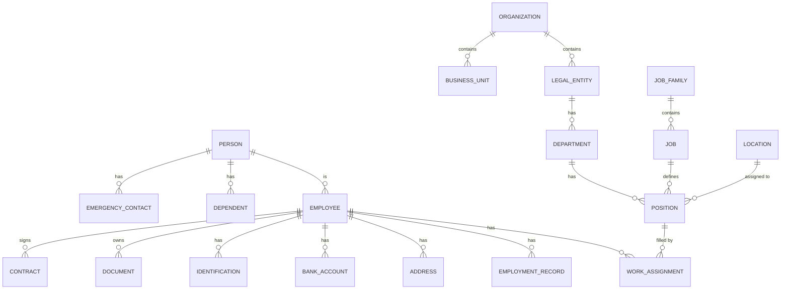

# 📋 Entity Catalog: Core HR Module

> **Module:** Core HR (CO)  
> **Date:** 2026-01-30  
> **Version:** 1.0  
> **Total Entities:** 25

---

## Overview



---

## Entity Classification Summary

| Category | Entities |
|----------|----------|
| **Person Domain** | Person, Employee, Dependent, EmergencyContact |
| **Organization Domain** | Organization, LegalEntity, BusinessUnit, Department, CostCenter |
| **Position Domain** | Position, Job, JobFamily, JobLevel, Grade |
| **Work Assignment Domain** | WorkAssignment, EmploymentRecord, Contract, Probation |
| **Personal Data Domain** | Address, BankAccount, Identification, Education, Skill |
| **Document Domain** | Document, DocumentType |

---

## 1. Person Domain

### 1.1 Person

> **Description:** Cá nhân - đơn vị cơ bản nhất đại diện cho một người, có thể trở thành Employee, Dependent, hoặc Candidate.

```yaml
entity: Person
stability: HIGH
change_frequency: RARE
is_pii: true
is_core: true

attributes:
  - name: person_id
    type: UUID
    description: Unique identifier
    required: true
    
  - name: person_number
    type: String
    description: Human-readable ID (e.g., P00001)
    required: true
    unique: true
    
  - name: first_name
    type: String
    description: Họ (Vietnamese family name)
    required: true
    pii: true
    
  - name: middle_name
    type: String
    description: Tên đệm
    required: false
    pii: true
    
  - name: last_name
    type: String
    description: Tên (Vietnamese given name)
    required: true
    pii: true
    
  - name: full_name
    type: String
    description: Họ và tên đầy đủ
    required: true
    pii: true
    computed: true
    
  - name: display_name
    type: String
    description: Tên hiển thị (preferred name)
    required: false
    pii: true
    
  - name: date_of_birth
    type: Date
    description: Ngày sinh
    required: true
    pii: true
    
  - name: gender
    type: Enum
    values: [MALE, FEMALE, OTHER, UNDISCLOSED]
    required: true
    
  - name: nationality
    type: String
    description: Quốc tịch
    required: true
    
  - name: marital_status
    type: Enum
    values: [SINGLE, MARRIED, DIVORCED, WIDOWED, SEPARATED]
    required: false
    
  - name: ethnicity
    type: String
    description: Dân tộc (Vietnam-specific)
    required: false
    
  - name: religion
    type: String
    description: Tôn giáo
    required: false
    pii: true
    sensitive: true
    
  - name: blood_type
    type: Enum
    values: [A, B, AB, O, UNKNOWN]
    required: false

dependencies:
  upstream: []
  downstream:
    - Employee
    - Dependent
    - EmergencyContact

vietnam_requirements:
  - Dân tộc (54 ethnic groups)
  - Hộ khẩu reference
```

### 1.2 Employee

> **Description:** Nhân viên - Person có quan hệ lao động với tổ chức. Là entity trung tâm của Core HR.

```yaml
entity: Employee
stability: HIGH
change_frequency: RARE
is_pii: true
is_core: true

attributes:
  - name: employee_id
    type: UUID
    description: Unique identifier
    required: true
    
  - name: employee_number
    type: String
    description: Mã nhân viên (e.g., NV00001)
    required: true
    unique: true
    
  - name: person_id
    type: UUID
    description: Reference to Person
    required: true
    foreign_key: Person.person_id
    
  - name: hire_date
    type: Date
    description: Ngày vào làm
    required: true
    
  - name: original_hire_date
    type: Date
    description: Ngày vào làm đầu tiên (for rehires)
    required: true
    
  - name: seniority_date
    type: Date
    description: Ngày tính thâm niên
    required: true
    
  - name: employee_status
    type: Enum
    values: [ACTIVE, INACTIVE, SUSPENDED, TERMINATED, PENDING]
    required: true
    default: PENDING
    
  - name: employee_type
    type: Enum
    values: [FULL_TIME, PART_TIME, CONTRACTOR, INTERN, SEASONAL]
    required: true
    
  - name: worker_category
    type: Enum
    values: [EMPLOYEE, CONTINGENT_WORKER, PENSIONER]
    required: true
    default: EMPLOYEE
    
  - name: primary_work_email
    type: Email
    description: Email công việc chính
    required: true
    pii: true
    
  - name: primary_work_phone
    type: Phone
    description: Số điện thoại công việc
    required: false
    pii: true
    
  - name: manager_id
    type: UUID
    description: Direct manager
    required: false
    foreign_key: Employee.employee_id
    
  - name: hr_representative_id
    type: UUID
    description: HR phụ trách
    required: false
    foreign_key: Employee.employee_id
    
  - name: bhxh_number
    type: String
    description: Số sổ BHXH
    required: false
    vietnam_specific: true
    
  - name: tax_code
    type: String
    description: Mã số thuế cá nhân
    required: false
    vietnam_specific: true
    pii: true
    
  - name: termination_date
    type: Date
    description: Ngày nghỉ việc
    required: false
    
  - name: termination_reason
    type: Enum
    values: [RESIGNATION, TERMINATION, RETIREMENT, DEATH, CONTRACT_END, LAYOFF, OTHER]
    required: false
    
  - name: last_working_date
    type: Date
    description: Ngày làm việc cuối
    required: false
    
  - name: notice_date
    type: Date
    description: Ngày thông báo nghỉ việc
    required: false

dependencies:
  upstream:
    - Person
  downstream:
    - WorkAssignment
    - EmploymentRecord
    - Contract
    - Address
    - BankAccount
    - Identification
    - Document
    - Dependent
    - EmergencyContact

vietnam_requirements:
  - Số sổ BHXH (mandatory for SI registration)
  - Mã số thuế cá nhân
  - Báo cáo lao động 6 tháng/lần
```

### 1.3 Dependent

> **Description:** Người phụ thuộc của nhân viên - dùng cho tính giảm trừ thuế TNCN và đăng ký BHYT.

```yaml
entity: Dependent
stability: MEDIUM
change_frequency: YEARLY
is_pii: true
is_core: false

attributes:
  - name: dependent_id
    type: UUID
    required: true
    
  - name: employee_id
    type: UUID
    required: true
    foreign_key: Employee.employee_id
    
  - name: person_id
    type: UUID
    description: Reference to Person if exists
    required: false
    foreign_key: Person.person_id
    
  - name: relationship
    type: Enum
    values: [SPOUSE, CHILD, PARENT, SIBLING, OTHER]
    required: true
    
  - name: first_name
    type: String
    required: true
    pii: true
    
  - name: last_name
    type: String
    required: true
    pii: true
    
  - name: date_of_birth
    type: Date
    required: true
    pii: true
    
  - name: gender
    type: Enum
    values: [MALE, FEMALE, OTHER]
    required: true
    
  - name: is_tax_dependent
    type: Boolean
    description: Có được giảm trừ thuế TNCN không
    vietnam_specific: true
    
  - name: tax_dependent_start_date
    type: Date
    required: false
    
  - name: tax_dependent_end_date
    type: Date
    required: false
    
  - name: is_insurance_dependent
    type: Boolean
    description: Có được bảo hiểm không
    
  - name: identification_number
    type: String
    description: CCCD/CMND số
    pii: true
    vietnam_specific: true
    
  - name: bhxh_dependent_number
    type: String
    description: Số thẻ BHYT người phụ thuộc
    vietnam_specific: true

dependencies:
  upstream:
    - Employee
    - Person (optional)
  downstream:
    - BenefitsEnrollment
    - TaxDeduction
```

### 1.4 EmergencyContact

> **Description:** Liên hệ khẩn cấp của nhân viên.

```yaml
entity: EmergencyContact
stability: HIGH
change_frequency: YEARLY
is_pii: true
is_core: false

attributes:
  - name: contact_id
    type: UUID
    required: true
    
  - name: employee_id
    type: UUID
    required: true
    foreign_key: Employee.employee_id
    
  - name: contact_name
    type: String
    required: true
    pii: true
    
  - name: relationship
    type: Enum
    values: [SPOUSE, PARENT, SIBLING, CHILD, FRIEND, OTHER]
    required: true
    
  - name: phone_primary
    type: Phone
    required: true
    pii: true
    
  - name: phone_secondary
    type: Phone
    required: false
    pii: true
    
  - name: email
    type: Email
    required: false
    pii: true
    
  - name: address
    type: String
    required: false
    pii: true
    
  - name: is_primary
    type: Boolean
    description: Liên hệ chính
    default: false
    
  - name: priority_order
    type: Integer
    description: Thứ tự ưu tiên liên hệ
    required: true
```

---

## 2. Organization Domain

### 2.1 Organization

> **Description:** Tổ chức cấp cao nhất - đại diện cho toàn bộ doanh nghiệp.

```yaml
entity: Organization
stability: HIGH
change_frequency: RARE
is_pii: false
is_core: true

attributes:
  - name: organization_id
    type: UUID
    required: true
    
  - name: organization_code
    type: String
    description: Mã tổ chức
    required: true
    unique: true
    
  - name: organization_name
    type: String
    required: true
    
  - name: organization_name_en
    type: String
    description: Tên tiếng Anh
    required: false
    
  - name: organization_type
    type: Enum
    values: [CORPORATION, COMPANY, BRANCH, REPRESENTATIVE_OFFICE]
    required: true
    
  - name: tax_code
    type: String
    description: Mã số thuế doanh nghiệp
    vietnam_specific: true
    
  - name: business_registration_number
    type: String
    description: Số đăng ký kinh doanh
    vietnam_specific: true
    
  - name: establishment_date
    type: Date
    required: false
    
  - name: website
    type: URL
    required: false
    
  - name: logo_url
    type: URL
    required: false
    
  - name: parent_organization_id
    type: UUID
    required: false
    foreign_key: Organization.organization_id

dependencies:
  upstream: []
  downstream:
    - LegalEntity
    - BusinessUnit
    - Location
```

### 2.2 LegalEntity

> **Description:** Pháp nhân - đơn vị có tư cách pháp lý riêng, chịu trách nhiệm về thuế và BHXH.

```yaml
entity: LegalEntity
stability: HIGH
change_frequency: RARE
is_pii: false
is_core: true

attributes:
  - name: legal_entity_id
    type: UUID
    required: true
    
  - name: legal_entity_code
    type: String
    required: true
    unique: true
    
  - name: legal_entity_name
    type: String
    required: true
    
  - name: organization_id
    type: UUID
    required: true
    foreign_key: Organization.organization_id
    
  - name: tax_code
    type: String
    description: Mã số thuế
    required: true
    vietnam_specific: true
    
  - name: bhxh_unit_code
    type: String
    description: Mã đơn vị BHXH
    vietnam_specific: true
    
  - name: legal_representative
    type: String
    description: Người đại diện pháp luật
    required: true
    
  - name: country_code
    type: String
    description: ISO 3166-1 alpha-2
    required: true
    default: VN
    
  - name: default_currency
    type: String
    description: ISO 4217
    required: true
    default: VND
    
  - name: fiscal_year_start
    type: Integer
    description: Tháng bắt đầu năm tài chính (1-12)
    default: 1
    
  - name: registration_address
    type: String
    description: Địa chỉ đăng ký kinh doanh
    required: true

dependencies:
  upstream:
    - Organization
  downstream:
    - Department
    - Employee (employer)
    - Payroll
```

### 2.3 BusinessUnit

> **Description:** Đơn vị kinh doanh - phân chia theo ngành nghề hoặc thị trường.

```yaml
entity: BusinessUnit
stability: MEDIUM
change_frequency: YEARLY
is_pii: false
is_core: true

attributes:
  - name: business_unit_id
    type: UUID
    required: true
    
  - name: business_unit_code
    type: String
    required: true
    unique: true
    
  - name: business_unit_name
    type: String
    required: true
    
  - name: organization_id
    type: UUID
    required: true
    foreign_key: Organization.organization_id
    
  - name: parent_business_unit_id
    type: UUID
    required: false
    foreign_key: BusinessUnit.business_unit_id
    
  - name: head_employee_id
    type: UUID
    description: Trưởng đơn vị
    required: false
    foreign_key: Employee.employee_id
    
  - name: effective_start_date
    type: Date
    required: true
    
  - name: effective_end_date
    type: Date
    required: false
```

### 2.4 Department

> **Description:** Phòng/Ban - đơn vị tổ chức cơ bản chứa các Position.

```yaml
entity: Department
stability: HIGH
change_frequency: YEARLY
is_pii: false
is_core: true

attributes:
  - name: department_id
    type: UUID
    required: true
    
  - name: department_code
    type: String
    required: true
    unique: true
    
  - name: department_name
    type: String
    required: true
    
  - name: department_name_en
    type: String
    required: false
    
  - name: legal_entity_id
    type: UUID
    required: true
    foreign_key: LegalEntity.legal_entity_id
    
  - name: business_unit_id
    type: UUID
    required: false
    foreign_key: BusinessUnit.business_unit_id
    
  - name: parent_department_id
    type: UUID
    required: false
    foreign_key: Department.department_id
    
  - name: manager_position_id
    type: UUID
    description: Vị trí quản lý phòng
    required: false
    foreign_key: Position.position_id
    
  - name: cost_center_id
    type: UUID
    required: false
    foreign_key: CostCenter.cost_center_id
    
  - name: location_id
    type: UUID
    description: Địa điểm làm việc chính
    required: false
    foreign_key: Location.location_id
    
  - name: status
    type: Enum
    values: [ACTIVE, INACTIVE, PENDING]
    required: true
    default: ACTIVE
    
  - name: effective_start_date
    type: Date
    required: true
    
  - name: effective_end_date
    type: Date
    required: false
    
  - name: hierarchy_level
    type: Integer
    description: Cấp trong cấu trúc tổ chức
    computed: true

dependencies:
  upstream:
    - LegalEntity
    - BusinessUnit
    - CostCenter
    - Location
  downstream:
    - Position
    - Employee (via WorkAssignment)
```

### 2.5 CostCenter

> **Description:** Trung tâm chi phí - đơn vị kế toán để phân bổ chi phí nhân sự.

```yaml
entity: CostCenter
stability: MEDIUM
change_frequency: YEARLY
is_pii: false
is_core: false

attributes:
  - name: cost_center_id
    type: UUID
    required: true
    
  - name: cost_center_code
    type: String
    required: true
    unique: true
    
  - name: cost_center_name
    type: String
    required: true
    
  - name: legal_entity_id
    type: UUID
    required: true
    foreign_key: LegalEntity.legal_entity_id
    
  - name: parent_cost_center_id
    type: UUID
    required: false
    foreign_key: CostCenter.cost_center_id
    
  - name: manager_employee_id
    type: UUID
    required: false
    foreign_key: Employee.employee_id
    
  - name: budget_amount
    type: Decimal
    description: Ngân sách được phân bổ
    required: false
    
  - name: currency_code
    type: String
    default: VND
    
  - name: effective_start_date
    type: Date
    required: true
    
  - name: effective_end_date
    type: Date
    required: false
```

---

## 3. Position Domain

### 3.1 Position

> **Description:** Vị trí công việc - slot trong cấu trúc tổ chức mà Employee có thể fill vào.

```yaml
entity: Position
stability: MEDIUM
change_frequency: QUARTERLY
is_pii: false
is_core: true

attributes:
  - name: position_id
    type: UUID
    required: true
    
  - name: position_code
    type: String
    required: true
    unique: true
    
  - name: position_title
    type: String
    required: true
    
  - name: position_title_en
    type: String
    required: false
    
  - name: job_id
    type: UUID
    required: true
    foreign_key: Job.job_id
    
  - name: department_id
    type: UUID
    required: true
    foreign_key: Department.department_id
    
  - name: location_id
    type: UUID
    required: false
    foreign_key: Location.location_id
    
  - name: reports_to_position_id
    type: UUID
    description: Vị trí báo cáo
    required: false
    foreign_key: Position.position_id
    
  - name: grade_id
    type: UUID
    description: Bậc lương/cấp bậc
    required: false
    foreign_key: Grade.grade_id
    
  - name: position_type
    type: Enum
    values: [REGULAR, TEMPORARY, CONTRACTOR, INTERN]
    required: true
    default: REGULAR
    
  - name: full_time_equivalent
    type: Decimal
    description: Tỷ lệ FTE (1.0 = full-time)
    required: true
    default: 1.0
    
  - name: headcount_type
    type: Enum
    values: [BUDGETED, UNBUDGETED, FROZEN]
    required: true
    default: BUDGETED
    
  - name: status
    type: Enum
    values: [OPEN, FILLED, CLOSED, FROZEN]
    required: true
    default: OPEN
    
  - name: incumbent_employee_id
    type: UUID
    description: Nhân viên đang giữ vị trí (nếu FILLED)
    required: false
    foreign_key: Employee.employee_id
    
  - name: vacancy_reason
    type: Enum
    values: [NEW_POSITION, REPLACEMENT, EXPANSION]
    required: false
    
  - name: target_hire_date
    type: Date
    description: Ngày dự kiến tuyển
    required: false
    
  - name: effective_start_date
    type: Date
    required: true
    
  - name: effective_end_date
    type: Date
    required: false

dependencies:
  upstream:
    - Job
    - Department
    - Location
    - Grade
  downstream:
    - WorkAssignment
    - Recruitment Requisition
```

### 3.2 Job

> **Description:** Công việc - mô tả chức danh và yêu cầu công việc, không gắn với vị trí cụ thể.

```yaml
entity: Job
stability: HIGH
change_frequency: YEARLY
is_pii: false
is_core: true

attributes:
  - name: job_id
    type: UUID
    required: true
    
  - name: job_code
    type: String
    required: true
    unique: true
    
  - name: job_title
    type: String
    required: true
    
  - name: job_title_en
    type: String
    required: false
    
  - name: job_family_id
    type: UUID
    required: true
    foreign_key: JobFamily.job_family_id
    
  - name: job_level_id
    type: UUID
    required: false
    foreign_key: JobLevel.job_level_id
    
  - name: job_description
    type: Text
    description: Mô tả công việc chi tiết
    required: false
    
  - name: responsibilities
    type: Text[]
    description: Danh sách trách nhiệm
    required: false
    
  - name: requirements
    type: Text[]
    description: Danh sách yêu cầu
    required: false
    
  - name: minimum_qualifications
    type: JSON
    description: Trình độ tối thiểu
    required: false
    
  - name: preferred_qualifications
    type: JSON
    description: Trình độ ưu tiên
    required: false
    
  - name: salary_range_min
    type: Decimal
    required: false
    
  - name: salary_range_max
    type: Decimal
    required: false
    
  - name: currency_code
    type: String
    default: VND
    
  - name: flsa_status
    type: Enum
    values: [EXEMPT, NON_EXEMPT]
    description: Overtime eligibility (US concept, adapt for Vietnam)
    required: false
    
  - name: status
    type: Enum
    values: [ACTIVE, INACTIVE, DRAFT]
    required: true
    default: ACTIVE

dependencies:
  upstream:
    - JobFamily
    - JobLevel
  downstream:
    - Position
    - Skill (via JobSkill)
```

### 3.3 JobFamily

> **Description:** Nhóm công việc - phân loại công việc theo chức năng (IT, Finance, HR, etc.)

```yaml
entity: JobFamily
stability: HIGH
change_frequency: RARE
is_pii: false
is_core: false

attributes:
  - name: job_family_id
    type: UUID
    required: true
    
  - name: job_family_code
    type: String
    required: true
    unique: true
    
  - name: job_family_name
    type: String
    required: true
    
  - name: job_family_name_en
    type: String
    required: false
    
  - name: parent_job_family_id
    type: UUID
    required: false
    foreign_key: JobFamily.job_family_id
    
  - name: description
    type: Text
    required: false
```

### 3.4 JobLevel

> **Description:** Cấp bậc công việc - mức độ trách nhiệm và thâm niên (Entry, Senior, Manager, etc.)

```yaml
entity: JobLevel
stability: HIGH
change_frequency: RARE
is_pii: false
is_core: false

attributes:
  - name: job_level_id
    type: UUID
    required: true
    
  - name: job_level_code
    type: String
    required: true
    unique: true
    
  - name: job_level_name
    type: String
    required: true
    example: "Senior Engineer"
    
  - name: level_number
    type: Integer
    description: Thứ tự cấp bậc (1 = Entry, 10 = Executive)
    required: true
    
  - name: is_management
    type: Boolean
    description: Có phải cấp quản lý không
    default: false
    
  - name: is_executive
    type: Boolean
    description: Có phải cấp điều hành không
    default: false
```

### 3.5 Grade

> **Description:** Bậc lương - gắn với salary range và benefits.

```yaml
entity: Grade
stability: HIGH
change_frequency: YEARLY
is_pii: false
is_core: false

attributes:
  - name: grade_id
    type: UUID
    required: true
    
  - name: grade_code
    type: String
    required: true
    unique: true
    
  - name: grade_name
    type: String
    required: true
    
  - name: grade_sequence
    type: Integer
    description: Thứ tự để sort
    required: true
    
  - name: salary_range_min
    type: Decimal
    required: false
    
  - name: salary_range_mid
    type: Decimal
    required: false
    
  - name: salary_range_max
    type: Decimal
    required: false
    
  - name: currency_code
    type: String
    default: VND
    
  - name: effective_start_date
    type: Date
    required: true
    
  - name: effective_end_date
    type: Date
    required: false

dependencies:
  downstream:
    - Position
    - CompensationBasis
```

---

## 4. Work Assignment Domain

### 4.1 WorkAssignment

> **Description:** Phân công công việc - gắn Employee vào Position tại một thời điểm.

```yaml
entity: WorkAssignment
stability: MEDIUM
change_frequency: REALTIME
is_pii: false
is_core: true

attributes:
  - name: assignment_id
    type: UUID
    required: true
    
  - name: employee_id
    type: UUID
    required: true
    foreign_key: Employee.employee_id
    
  - name: position_id
    type: UUID
    required: true
    foreign_key: Position.position_id
    
  - name: assignment_type
    type: Enum
    values: [PRIMARY, SECONDARY, TEMPORARY, HIGHER_DUTY]
    required: true
    default: PRIMARY
    
  - name: assignment_status
    type: Enum
    values: [ACTIVE, INACTIVE, PENDING, ENDED]
    required: true
    default: PENDING
    
  - name: employment_type
    type: Enum
    values: [FULL_TIME, PART_TIME, CONTRACT, INTERN]
    required: true
    
  - name: work_percentage
    type: Decimal
    description: Tỷ lệ % làm việc tại vị trí này
    required: true
    default: 100
    
  - name: effective_start_date
    type: Date
    description: Ngày bắt đầu phân công
    required: true
    
  - name: effective_end_date
    type: Date
    description: Ngày kết thúc phân công
    required: false
    
  - name: manager_id
    type: UUID
    description: Direct manager (có thể khác position.reports_to)
    required: false
    foreign_key: Employee.employee_id
    
  - name: work_schedule_id
    type: UUID
    description: Lịch làm việc
    required: false
    
  - name: probation_end_date
    type: Date
    description: Ngày kết thúc thử việc
    vietnam_specific: true
    
  - name: assignment_reason
    type: Enum
    values: [NEW_HIRE, PROMOTION, TRANSFER, DEMOTION, REORGANIZATION, TEMPORARY]
    required: false

dependencies:
  upstream:
    - Employee
    - Position
  downstream:
    - Payroll
    - TimeEntry
    - PerformanceReview
```

### 4.2 EmploymentRecord

> **Description:** Lịch sử công tác - ghi lại các sự kiện trong vòng đời nhân viên.

```yaml
entity: EmploymentRecord
stability: HIGH
change_frequency: RARE
is_pii: true
is_core: true

attributes:
  - name: record_id
    type: UUID
    required: true
    
  - name: employee_id
    type: UUID
    required: true
    foreign_key: Employee.employee_id
    
  - name: record_type
    type: Enum
    values: [HIRE, REHIRE, PROMOTION, DEMOTION, TRANSFER, SALARY_CHANGE, TERMINATION, LEAVE_OF_ABSENCE, RETURN_FROM_LEAVE, CONTRACT_RENEWAL, PROBATION_PASS, PROBATION_FAIL]
    required: true
    
  - name: effective_date
    type: Date
    required: true
    
  - name: previous_value
    type: JSON
    description: Giá trị trước thay đổi
    required: false
    
  - name: new_value
    type: JSON
    description: Giá trị sau thay đổi
    required: false
    
  - name: reason
    type: Text
    description: Lý do thay đổi
    required: false
    
  - name: comments
    type: Text
    required: false
    
  - name: approved_by
    type: UUID
    required: false
    foreign_key: Employee.employee_id
    
  - name: approval_date
    type: DateTime
    required: false
    
  - name: created_by
    type: UUID
    required: true
    
  - name: created_at
    type: DateTime
    required: true
```

### 4.3 Contract

> **Description:** Hợp đồng lao động - theo quy định Luật Lao động Việt Nam.

```yaml
entity: Contract
stability: MEDIUM
change_frequency: YEARLY
is_pii: true
is_core: true
vietnam_critical: true

attributes:
  - name: contract_id
    type: UUID
    required: true
    
  - name: contract_number
    type: String
    description: Số hợp đồng
    required: true
    unique: true
    
  - name: employee_id
    type: UUID
    required: true
    foreign_key: Employee.employee_id
    
  - name: legal_entity_id
    type: UUID
    required: true
    foreign_key: LegalEntity.legal_entity_id
    
  - name: contract_type
    type: Enum
    values: [INDEFINITE, DEFINITE_TERM, SEASONAL, PROBATION]
    required: true
    vietnam_specific: true
    notes: |
      - INDEFINITE: Hợp đồng không xác định thời hạn
      - DEFINITE_TERM: Hợp đồng xác định thời hạn (1-36 tháng)
      - SEASONAL: Hợp đồng theo mùa vụ (không còn phổ biến)
      - PROBATION: Hợp đồng thử việc
    
  - name: contract_status
    type: Enum
    values: [DRAFT, ACTIVE, EXPIRED, TERMINATED, RENEWED]
    required: true
    default: DRAFT
    
  - name: start_date
    type: Date
    required: true
    
  - name: end_date
    type: Date
    description: NULL for indefinite contracts
    required: false
    
  - name: probation_period_days
    type: Integer
    description: Số ngày thử việc (max 60 for professional)
    vietnam_specific: true
    validation: max 180
    
  - name: probation_salary_percentage
    type: Decimal
    description: % lương thử việc (min 85%)
    vietnam_specific: true
    validation: min 85
    
  - name: base_salary
    type: Decimal
    required: true
    
  - name: salary_currency
    type: String
    default: VND
    
  - name: work_location
    type: String
    required: true
    
  - name: job_description
    type: Text
    required: true
    
  - name: signing_date
    type: Date
    required: true
    
  - name: signed_by_employee
    type: Boolean
    default: false
    
  - name: signed_by_employer
    type: String
    description: Tên người ký (đại diện công ty)
    required: true
    
  - name: renewal_count
    type: Integer
    description: Số lần gia hạn (max 1 for DEFINITE_TERM)
    default: 0
    vietnam_specific: true
    
  - name: previous_contract_id
    type: UUID
    required: false
    foreign_key: Contract.contract_id
    
  - name: termination_date
    type: Date
    required: false
    
  - name: termination_reason
    type: Enum
    values: [MUTUAL_AGREEMENT, EMPLOYEE_RESIGNATION, EMPLOYER_TERMINATION, CONTRACT_EXPIRY, DISCIPLINARY, REDUNDANCY, BUSINESS_CLOSURE]
    required: false
    
  - name: notice_period_days
    type: Integer
    description: Số ngày báo trước khi nghỉ
    vietnam_specific: true

dependencies:
  upstream:
    - Employee
    - LegalEntity
  downstream:
    - EmploymentRecord
    - Document (contract file)

vietnam_requirements:
  - HĐ xác định thời hạn: 1-36 tháng
  - Chỉ được gia hạn 1 lần
  - Sau 2 HĐ xác định → phải ký vô thời hạn
  - Thử việc: max 60 ngày (chuyên môn), 30 ngày (trung cấp)
  - Lương thử việc: min 85%
```

### 4.4 Probation

> **Description:** Thông tin thử việc - tracking riêng cho quy trình thử việc.

```yaml
entity: Probation
stability: MEDIUM
change_frequency: QUARTERLY
is_pii: false
is_core: true
vietnam_critical: true

attributes:
  - name: probation_id
    type: UUID
    required: true
    
  - name: employee_id
    type: UUID
    required: true
    foreign_key: Employee.employee_id
    
  - name: contract_id
    type: UUID
    required: true
    foreign_key: Contract.contract_id
    
  - name: start_date
    type: Date
    required: true
    
  - name: end_date
    type: Date
    required: true
    
  - name: probation_status
    type: Enum
    values: [IN_PROGRESS, PASSED, FAILED, EXTENDED, TERMINATED_EARLY]
    required: true
    default: IN_PROGRESS
    
  - name: salary_percentage
    type: Decimal
    description: % của lương chính thức
    required: true
    validation: min 85
    
  - name: evaluation_date
    type: Date
    description: Ngày đánh giá cuối kỳ thử việc
    required: false
    
  - name: evaluation_result
    type: Enum
    values: [EXCELLENT, GOOD, SATISFACTORY, UNSATISFACTORY]
    required: false
    
  - name: evaluated_by
    type: UUID
    required: false
    foreign_key: Employee.employee_id
    
  - name: evaluation_comments
    type: Text
    required: false
    
  - name: confirmation_date
    type: Date
    description: Ngày xác nhận chính thức
    required: false
```

---

## 5. Personal Data Domain

### 5.1 Address

> **Description:** Địa chỉ - có thể có nhiều địa chỉ (thường trú, tạm trú, liên lạc).

```yaml
entity: Address
stability: MEDIUM
change_frequency: YEARLY
is_pii: true
is_core: false

attributes:
  - name: address_id
    type: UUID
    required: true
    
  - name: employee_id
    type: UUID
    required: true
    foreign_key: Employee.employee_id
    
  - name: address_type
    type: Enum
    values: [PERMANENT, TEMPORARY, MAILING, WORK]
    required: true
    notes: |
      - PERMANENT: Hộ khẩu thường trú
      - TEMPORARY: Tạm trú
      - MAILING: Địa chỉ nhận thư
      - WORK: Địa chỉ làm việc
    
  - name: is_primary
    type: Boolean
    default: false
    
  - name: address_line_1
    type: String
    description: Số nhà, đường
    required: true
    pii: true
    
  - name: address_line_2
    type: String
    description: Phường/Xã
    required: false
    pii: true
    
  - name: district
    type: String
    description: Quận/Huyện
    required: true
    vietnam_specific: true
    
  - name: city_province
    type: String
    description: Tỉnh/Thành phố
    required: true
    vietnam_specific: true
    
  - name: country_code
    type: String
    default: VN
    
  - name: postal_code
    type: String
    required: false
    
  - name: effective_start_date
    type: Date
    required: true
    
  - name: effective_end_date
    type: Date
    required: false
```

### 5.2 BankAccount

> **Description:** Tài khoản ngân hàng - dùng để trả lương.

```yaml
entity: BankAccount
stability: MEDIUM
change_frequency: YEARLY
is_pii: true
is_core: false

attributes:
  - name: bank_account_id
    type: UUID
    required: true
    
  - name: employee_id
    type: UUID
    required: true
    foreign_key: Employee.employee_id
    
  - name: bank_name
    type: String
    required: true
    
  - name: bank_code
    type: String
    description: Mã ngân hàng (e.g., VCB, TCB)
    required: true
    vietnam_specific: true
    
  - name: branch_name
    type: String
    required: false
    
  - name: account_number
    type: String
    required: true
    pii: true
    encrypted: true
    
  - name: account_holder_name
    type: String
    required: true
    pii: true
    
  - name: account_type
    type: Enum
    values: [CHECKING, SAVINGS]
    default: CHECKING
    
  - name: is_primary
    type: Boolean
    description: Tài khoản nhận lương chính
    default: false
    
  - name: payment_percentage
    type: Decimal
    description: % lương chuyển vào tài khoản này
    default: 100
    
  - name: currency_code
    type: String
    default: VND
    
  - name: status
    type: Enum
    values: [ACTIVE, INACTIVE, PENDING_VERIFICATION]
    default: PENDING_VERIFICATION
```

### 5.3 Identification

> **Description:** Giấy tờ tùy thân - CCCD, Passport, Work Permit.

```yaml
entity: Identification
stability: MEDIUM
change_frequency: YEARLY
is_pii: true
is_core: true
vietnam_critical: true

attributes:
  - name: identification_id
    type: UUID
    required: true
    
  - name: employee_id
    type: UUID
    required: true
    foreign_key: Employee.employee_id
    
  - name: document_type
    type: Enum
    values: [CCCD, CMND, PASSPORT, WORK_PERMIT, DRIVER_LICENSE, SOCIAL_INSURANCE_BOOK, OTHER]
    required: true
    notes: |
      - CCCD: Căn cước công dân (12 số)
      - CMND: Chứng minh nhân dân (9 số, legacy)
      - PASSPORT: Hộ chiếu
      - WORK_PERMIT: Giấy phép lao động (for foreigners)
      - SOCIAL_INSURANCE_BOOK: Sổ BHXH
    
  - name: document_number
    type: String
    required: true
    pii: true
    unique_per_type: true
    
  - name: issue_date
    type: Date
    required: true
    
  - name: expiry_date
    type: Date
    required: false
    notes: CCCD có hạn 25 năm hoặc không thời hạn
    
  - name: issue_place
    type: String
    description: Nơi cấp
    required: true
    
  - name: issue_authority
    type: String
    description: Cơ quan cấp (e.g., Cục Cảnh sát QLHC về TTXH)
    required: false
    
  - name: is_primary
    type: Boolean
    default: false
    
  - name: verification_status
    type: Enum
    values: [PENDING, VERIFIED, EXPIRED, INVALID]
    default: PENDING
    
  - name: verification_date
    type: Date
    required: false
    
  - name: document_file_id
    type: UUID
    description: Reference to uploaded document scan
    required: false
    foreign_key: Document.document_id

vietnam_requirements:
  - CCCD bắt buộc cho công dân VN
  - Work Permit bắt buộc cho người nước ngoài
  - Phải có ảnh scan/photo
```

### 5.4 Education

> **Description:** Học vấn - bằng cấp và chứng chỉ.

```yaml
entity: Education
stability: MEDIUM
change_frequency: YEARLY
is_pii: false
is_core: false

attributes:
  - name: education_id
    type: UUID
    required: true
    
  - name: employee_id
    type: UUID
    required: true
    foreign_key: Employee.employee_id
    
  - name: education_level
    type: Enum
    values: [HIGH_SCHOOL, VOCATIONAL, ASSOCIATE, BACHELOR, MASTER, DOCTORATE, OTHER]
    required: true
    
  - name: institution_name
    type: String
    required: true
    
  - name: major
    type: String
    description: Chuyên ngành
    required: false
    
  - name: degree_name
    type: String
    required: false
    
  - name: graduation_date
    type: Date
    required: false
    
  - name: gpa
    type: Decimal
    required: false
    
  - name: gpa_scale
    type: Decimal
    description: Thang điểm (4.0, 10.0)
    required: false
    
  - name: is_highest_education
    type: Boolean
    default: false
    
  - name: country_code
    type: String
    default: VN
    
  - name: certificate_file_id
    type: UUID
    required: false
    foreign_key: Document.document_id
```

### 5.5 Skill

> **Description:** Kỹ năng - framework cho skills-based organization (H2).

```yaml
entity: Skill
stability: HIGH
change_frequency: QUARTERLY
is_pii: false
is_core: false
future_horizon: H2

attributes:
  - name: skill_id
    type: UUID
    required: true
    
  - name: skill_code
    type: String
    required: true
    unique: true
    
  - name: skill_name
    type: String
    required: true
    
  - name: skill_category
    type: Enum
    values: [TECHNICAL, SOFT_SKILL, LANGUAGE, CERTIFICATION, TOOL]
    required: true
    
  - name: parent_skill_id
    type: UUID
    required: false
    foreign_key: Skill.skill_id
    
  - name: description
    type: Text
    required: false
    
  - name: proficiency_levels
    type: JSON
    description: Định nghĩa các mức độ thành thạo
    example: |
      {
        "BEGINNER": "Knows basics",
        "INTERMEDIATE": "Can work independently",
        "ADVANCED": "Can mentor others",
        "EXPERT": "Industry recognized"
      }
```

### 5.6 EmployeeSkill

> **Description:** Kỹ năng nhân viên - mapping skills to employees.

```yaml
entity: EmployeeSkill
stability: MEDIUM
change_frequency: QUARTERLY
is_pii: false
is_core: false
future_horizon: H2

attributes:
  - name: employee_skill_id
    type: UUID
    required: true
    
  - name: employee_id
    type: UUID
    required: true
    foreign_key: Employee.employee_id
    
  - name: skill_id
    type: UUID
    required: true
    foreign_key: Skill.skill_id
    
  - name: proficiency_level
    type: Enum
    values: [BEGINNER, INTERMEDIATE, ADVANCED, EXPERT]
    required: true
    
  - name: years_of_experience
    type: Decimal
    required: false
    
  - name: last_used_date
    type: Date
    required: false
    
  - name: verified_by
    type: UUID
    required: false
    foreign_key: Employee.employee_id
    
  - name: verification_date
    type: Date
    required: false
    
  - name: certification_file_id
    type: UUID
    required: false
    foreign_key: Document.document_id
```

---

## 6. Document Domain

### 6.1 Document

> **Description:** Tài liệu - lưu trữ các file liên quan đến nhân viên.

```yaml
entity: Document
stability: LOW
change_frequency: REALTIME
is_pii: true
is_core: false

attributes:
  - name: document_id
    type: UUID
    required: true
    
  - name: employee_id
    type: UUID
    required: false
    foreign_key: Employee.employee_id
    notes: NULL if organization-level document
    
  - name: document_type_id
    type: UUID
    required: true
    foreign_key: DocumentType.document_type_id
    
  - name: document_name
    type: String
    required: true
    
  - name: file_name
    type: String
    required: true
    
  - name: file_path
    type: String
    required: true
    
  - name: file_size
    type: Integer
    description: Size in bytes
    required: true
    
  - name: mime_type
    type: String
    required: true
    
  - name: checksum
    type: String
    description: SHA-256 hash for integrity
    required: true
    
  - name: is_confidential
    type: Boolean
    default: false
    
  - name: access_level
    type: Enum
    values: [PUBLIC, INTERNAL, CONFIDENTIAL, RESTRICTED]
    default: INTERNAL
    
  - name: expiry_date
    type: Date
    required: false
    
  - name: uploaded_by
    type: UUID
    required: true
    foreign_key: Employee.employee_id
    
  - name: uploaded_at
    type: DateTime
    required: true
    
  - name: status
    type: Enum
    values: [ACTIVE, ARCHIVED, DELETED]
    default: ACTIVE
```

### 6.2 DocumentType

> **Description:** Loại tài liệu - phân loại document.

```yaml
entity: DocumentType
stability: HIGH
change_frequency: RARE
is_pii: false
is_core: false

attributes:
  - name: document_type_id
    type: UUID
    required: true
    
  - name: type_code
    type: String
    required: true
    unique: true
    
  - name: type_name
    type: String
    required: true
    
  - name: category
    type: Enum
    values: [CONTRACT, IDENTIFICATION, EDUCATION, CERTIFICATION, PERFORMANCE, DISCIPLINARY, MEDICAL, OTHER]
    required: true
    
  - name: is_required
    type: Boolean
    description: Bắt buộc phải có
    default: false
    
  - name: requires_expiry
    type: Boolean
    description: Cần theo dõi hạn
    default: false
    
  - name: max_file_size
    type: Integer
    description: Max size in MB
    default: 10
    
  - name: allowed_extensions
    type: String[]
    default: ["pdf", "jpg", "png", "doc", "docx"]
```

---

## 7. Location Domain

### 7.1 Location

> **Description:** Địa điểm làm việc - văn phòng, chi nhánh, site.

```yaml
entity: Location
stability: HIGH
change_frequency: YEARLY
is_pii: false
is_core: true

attributes:
  - name: location_id
    type: UUID
    required: true
    
  - name: location_code
    type: String
    required: true
    unique: true
    
  - name: location_name
    type: String
    required: true
    
  - name: location_type
    type: Enum
    values: [HEADQUARTERS, BRANCH, OFFICE, FACTORY, WAREHOUSE, REMOTE]
    required: true
    
  - name: legal_entity_id
    type: UUID
    required: true
    foreign_key: LegalEntity.legal_entity_id
    
  - name: parent_location_id
    type: UUID
    required: false
    foreign_key: Location.location_id
    
  - name: address
    type: String
    required: true
    
  - name: city
    type: String
    required: true
    
  - name: country_code
    type: String
    default: VN
    
  - name: timezone
    type: String
    description: IANA timezone (e.g., Asia/Ho_Chi_Minh)
    required: true
    default: Asia/Ho_Chi_Minh
    
  - name: phone
    type: String
    required: false
    
  - name: capacity
    type: Integer
    description: Số người tối đa
    required: false
    
  - name: is_active
    type: Boolean
    default: true

dependencies:
  upstream:
    - LegalEntity
  downstream:
    - Position
    - Department
    - Employee (work location)
```

---

## Entity Summary Table

| Entity | Stability | Frequency | PII | Core | Vietnam |
|--------|-----------|-----------|-----|------|---------|
| Person | HIGH | RARE | ✅ | ✅ | - |
| Employee | HIGH | RARE | ✅ | ✅ | ✅ |
| Dependent | MEDIUM | YEARLY | ✅ | - | ✅ |
| EmergencyContact | HIGH | YEARLY | ✅ | - | - |
| Organization | HIGH | RARE | - | ✅ | - |
| LegalEntity | HIGH | RARE | - | ✅ | ✅ |
| BusinessUnit | MEDIUM | YEARLY | - | ✅ | - |
| Department | HIGH | YEARLY | - | ✅ | - |
| CostCenter | MEDIUM | YEARLY | - | - | - |
| Position | MEDIUM | QUARTERLY | - | ✅ | - |
| Job | HIGH | YEARLY | - | ✅ | - |
| JobFamily | HIGH | RARE | - | - | - |
| JobLevel | HIGH | RARE | - | - | - |
| Grade | HIGH | YEARLY | - | - | - |
| WorkAssignment | MEDIUM | REALTIME | - | ✅ | - |
| EmploymentRecord | HIGH | RARE | ✅ | ✅ | - |
| Contract | MEDIUM | YEARLY | ✅ | ✅ | ✅ |
| Probation | MEDIUM | QUARTERLY | - | ✅ | ✅ |
| Address | MEDIUM | YEARLY | ✅ | - | ✅ |
| BankAccount | MEDIUM | YEARLY | ✅ | - | ✅ |
| Identification | MEDIUM | YEARLY | ✅ | ✅ | ✅ |
| Education | MEDIUM | YEARLY | - | - | - |
| Skill | HIGH | QUARTERLY | - | - | - |
| EmployeeSkill | MEDIUM | QUARTERLY | - | - | - |
| Document | LOW | REALTIME | ✅ | - | - |
| DocumentType | HIGH | RARE | - | - | - |
| Location | HIGH | YEARLY | - | ✅ | - |

---

## Next Steps

1. **Create ontology files** (`*.onto.md`) for each core entity
2. **Design API contracts** for CRUD and lifecycle operations
3. **Implement Vietnam-specific validations** (BHXH, Contract rules)
4. **Build relationship links** (`*.link.md`) for complex associations
