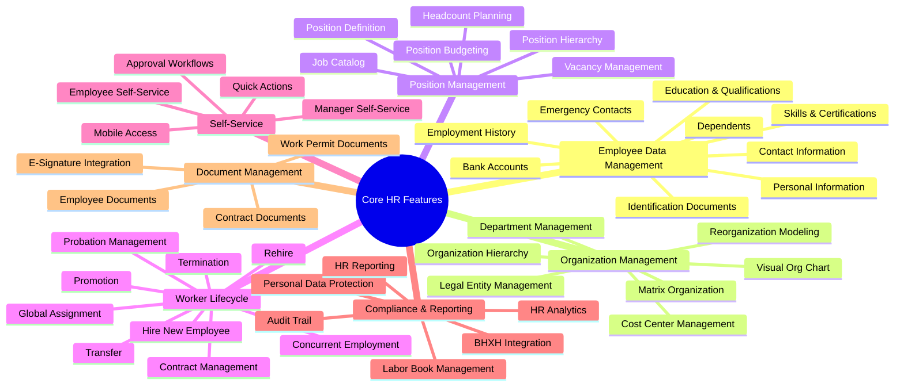

# 📋 Feature Catalog: Core HR Module

> **Module:** Core HR (CO)  
> **Date:** 2026-01-30  
> **Version:** 1.0  
> **Total Features:** 47 features across 7 categories

---

## Overview



---

## Feature Classification Summary

| Category | Count | P0 | P1 | P2 |
|----------|-------|----|----|-----|
| Employee Data Management | 9 | 4 | 3 | 2 |
| Organization Management | 7 | 3 | 2 | 2 |
| Position Management | 6 | 2 | 3 | 1 |
| Worker Lifecycle | 9 | 5 | 2 | 2 |
| Self-Service | 5 | 3 | 1 | 1 |
| Compliance & Reporting | 7 | 4 | 2 | 1 |
| Document Management | 4 | 1 | 2 | 1 |
| **Total** | **47** | **22** | **15** | **10** |

---

## 1. Employee Data Management

### 1.1 Personal Information Management

```yaml
feature_id: CO-EDM-001
feature_name: Personal Information Management
category: Employee Data Management
type: Parity
priority: P0
complexity: MEDIUM

description: |
  Quản lý thông tin cá nhân cơ bản của nhân viên bao gồm họ tên, ngày sinh, 
  giới tính, quốc tịch, tình trạng hôn nhân, dân tộc, tôn giáo.

business_value: |
  - Là nền tảng dữ liệu cho tất cả các module HR khác
  - Hỗ trợ báo cáo nhân sự theo yêu cầu pháp luật
  - Cung cấp thông tin cho các quyết định nhân sự

user_stories:
  - role: HR Admin
    action: nhập và cập nhật thông tin cá nhân nhân viên
    benefit: đảm bảo hồ sơ nhân sự chính xác và đầy đủ
    
  - role: Employee
    action: xem và yêu cầu cập nhật thông tin cá nhân
    benefit: kiểm soát dữ liệu cá nhân của mình
    
  - role: Manager
    action: xem thông tin cá nhân nhân viên trong team
    benefit: hiểu rõ hơn về nhân viên để quản lý hiệu quả

acceptance_criteria:
  - Hỗ trợ đầy đủ các trường thông tin cá nhân theo chuẩn Vietnam
  - Validation dữ liệu (ngày sinh hợp lệ, format CCCD/CMND)
  - Lưu trữ lịch sử thay đổi (audit trail)
  - Hỗ trợ đa ngôn ngữ (Vietnamese, English)
  - PII encryption cho các trường nhạy cảm

entities_involved:
  - Person
  - Employee

vietnam_requirements:
  - Dân tộc (54 dân tộc Việt Nam)
  - Tôn giáo (theo danh mục Nhà nước)
  - Hộ khẩu thường trú (reference)

vendor_reference:
  oracle: Core HR > Person Management
  sap: Employee Central > Personal Information
  workday: Core HR > Personal Data
  ms_dynamics: Employee Management > Personal Details
```

### 1.2 Contact Information

```yaml
feature_id: CO-EDM-002
feature_name: Contact Information
category: Employee Data Management
type: Parity
priority: P0
complexity: LOW

description: |
  Quản lý thông tin liên lạc của nhân viên bao gồm email, số điện thoại,
  địa chỉ (thường trú, tạm trú, liên lạc).

business_value: |
  - Đảm bảo liên lạc hiệu quả với nhân viên
  - Hỗ trợ gửi thông báo, tài liệu pháp lý
  - Phục vụ thanh toán lương, đăng ký BHXH

user_stories:
  - role: Employee
    action: cập nhật thông tin liên lạc cá nhân
    benefit: nhận được thông tin từ công ty đúng lúc
    
  - role: HR Admin
    action: xác minh và cập nhật địa chỉ nhân viên
    benefit: đảm bảo thông tin chính xác cho các thủ tục hành chính
    
  - role: System
    action: tự động gửi thông báo đến email/phone của nhân viên
    benefit: tự động hóa giao tiếp nội bộ

acceptance_criteria:
  - Hỗ trợ nhiều địa chỉ (thường trú, tạm trú, liên lạc, làm việc)
  - Validation email format, phone number format (Vietnam)
  - Đánh dấu địa chỉ/email/phone chính (primary)
  - Effective dating cho địa chỉ (ngày bắt đầu/kết thúc)
  - Tích hợp với danh mục Tỉnh/Thành phố Việt Nam

entities_involved:
  - Employee
  - Address

vietnam_requirements:
  - Địa chỉ theo cấu trúc VN (Phường/Xã, Quận/Huyện, Tỉnh/TP)
  - Format số điện thoại Vietnam (+84, 0xxx)
```

### 1.3 Employment History

```yaml
feature_id: CO-EDM-003
feature_name: Employment History
category: Employee Data Management
type: Parity
priority: P0
complexity: MEDIUM

description: |
  Theo dõi lịch sử công tác của nhân viên tại công ty, bao gồm các sự kiện:
  tuyển dụng, thăng chức, chuyển đổi, điều chỉnh lương, nghỉ việc.

business_value: |
  - Cung cấp bức tranh toàn diện về sự nghiệp nhân viên
  - Hỗ trợ đánh giá hiệu suất, xét duyệt thăng chức
  - Đáp ứng yêu cầu kiểm toán và pháp lý

user_stories:
  - role: HR Admin
    action: xem toàn bộ lịch sử công tác của nhân viên
    benefit: đánh giá và ra quyết định nhân sự chính xác
    
  - role: Manager
    action: xem lịch sử thăng tiến của nhân viên
    benefit: hiểu rõ năng lực và tiềm năng phát triển
    
  - role: Employee
    action: xem lịch sử công tác của bản thân
    benefit: theo dõi sự phát triển nghề nghiệp

acceptance_criteria:
  - Tự động ghi nhận mọi thay đổi trạng thái nhân viên
  - Timeline view cho lịch sử công tác
  - Export lịch sử ra PDF/Excel
  - Lưu trữ lý do thay đổi và người phê duyệt
  - Filter theo loại sự kiện, khoảng thời gian

entities_involved:
  - Employee
  - EmploymentRecord
  - WorkAssignment

vendor_reference:
  oracle: Core HR > Employment History
  sap: Employee Central > Employment Details
  workday: Core HR > Job History
```

### 1.4 Identification Documents

```yaml
feature_id: CO-EDM-004
feature_name: Identification Documents
category: Employee Data Management
type: Compliance
priority: P0
complexity: MEDIUM

description: |
  Quản lý giấy tờ tùy thân của nhân viên: CCCD/CMND, Passport, 
  Giấy phép lao động (cho người nước ngoài), Sổ BHXH.

business_value: |
  - Tuân thủ quy định về lưu trữ thông tin nhân viên
  - Hỗ trợ đăng ký BHXH, thuế TNCN
  - Kiểm tra tư cách pháp lý làm việc

user_stories:
  - role: HR Admin
    action: nhập và xác minh giấy tờ tùy thân nhân viên
    benefit: đảm bảo tính hợp lệ của hồ sơ nhân sự
    
  - role: System
    action: cảnh báo khi giấy tờ sắp hết hạn
    benefit: chủ động gia hạn/cập nhật trước khi hết hạn
    
  - role: Compliance Officer
    action: báo cáo tình trạng giấy tờ của nhân viên
    benefit: đảm bảo tuân thủ quy định pháp luật

acceptance_criteria:
  - Hỗ trợ các loại giấy tờ: CCCD, CMND, Passport, Work Permit, BHXH Book
  - Validation số CCCD (12 chữ số), CMND (9 chữ số)
  - Upload và lưu trữ scan/photo
  - Cảnh báo giấy tờ sắp hết hạn (30/60/90 ngày trước)
  - Trạng thái xác minh (Pending, Verified, Expired, Invalid)

entities_involved:
  - Employee
  - Identification
  - Document

vietnam_requirements:
  - CCCD bắt buộc cho công dân Việt Nam
  - Work Permit bắt buộc cho người nước ngoài
  - Sổ BHXH để tham gia bảo hiểm bắt buộc
  - Validation theo quy định CCCD mới (chip-based)
```

### 1.5 Bank Account Management

```yaml
feature_id: CO-EDM-005
feature_name: Bank Account Management
category: Employee Data Management
type: Parity
priority: P1
complexity: LOW

description: |
  Quản lý thông tin tài khoản ngân hàng của nhân viên để nhận lương.
  Hỗ trợ nhiều tài khoản với tỷ lệ phân bổ lương.

business_value: |
  - Đảm bảo trả lương chính xác và đúng tài khoản
  - Hỗ trợ phân bổ lương vào nhiều tài khoản
  - Giảm lỗi chuyển khoản

user_stories:
  - role: Employee
    action: đăng ký và cập nhật tài khoản nhận lương
    benefit: nhận lương đúng tài khoản mong muốn
    
  - role: HR Admin
    action: xác minh thông tin tài khoản ngân hàng
    benefit: đảm bảo không có lỗi chuyển khoản
    
  - role: Payroll Admin
    action: lấy thông tin tài khoản để chạy payroll
    benefit: tự động hóa quy trình trả lương

acceptance_criteria:
  - Hỗ trợ nhiều tài khoản với % phân bổ
  - Danh sách ngân hàng Việt Nam (Vietcombank, BIDV, Techcombank, etc.)
  - Mã hóa số tài khoản (encrypted storage)
  - Xác minh tên chủ tài khoản khớp với tên nhân viên
  - Status: Active, Inactive, Pending Verification

entities_involved:
  - Employee
  - BankAccount

vietnam_requirements:
  - Danh sách ngân hàng theo NHNN
  - Mã ngân hàng (bank code) theo chuẩn
```

### 1.6 Emergency Contacts

```yaml
feature_id: CO-EDM-006
feature_name: Emergency Contacts
category: Employee Data Management
type: Parity
priority: P1
complexity: LOW

description: |
  Quản lý thông tin liên hệ khẩn cấp của nhân viên. 
  Sử dụng trong các trường hợp tai nạn lao động, khẩn cấp y tế.

business_value: |
  - Liên lạc nhanh với người thân trong trường hợp khẩn cấp
  - Tuân thủ quy định an toàn lao động
  - Thể hiện sự quan tâm của công ty đến nhân viên

user_stories:
  - role: Employee
    action: đăng ký người liên hệ khẩn cấp
    benefit: đảm bảo người thân được thông báo kịp thời
    
  - role: HR Admin
    action: truy cập nhanh thông tin liên hệ khẩn cấp
    benefit: xử lý tình huống khẩn cấp hiệu quả
    
  - role: Safety Officer
    action: báo cáo danh sách nhân viên có/không có liên hệ khẩn cấp
    benefit: đảm bảo tất cả nhân viên có thông tin này

acceptance_criteria:
  - Hỗ trợ nhiều người liên hệ với thứ tự ưu tiên
  - Các mối quan hệ: Vợ/Chồng, Cha/Mẹ, Anh/Chị/Em, Bạn bè
  - Nhiều số điện thoại cho mỗi người liên hệ
  - Đánh dấu người liên hệ chính (primary)
  - Quick access từ employee profile

entities_involved:
  - Employee
  - EmergencyContact
```

### 1.7 Dependent Management

```yaml
feature_id: CO-EDM-007
feature_name: Dependent Management
category: Employee Data Management
type: Parity
priority: P1
complexity: MEDIUM

description: |
  Quản lý thông tin người phụ thuộc của nhân viên để tính giảm trừ thuế TNCN
  và đăng ký bảo hiểm y tế người phụ thuộc.

business_value: |
  - Tính chính xác giảm trừ thuế TNCN
  - Đăng ký BHYT cho người phụ thuộc
  - Hỗ trợ benefit enrollment (nếu có)

user_stories:
  - role: Employee
    action: đăng ký người phụ thuộc để giảm trừ thuế
    benefit: được hưởng đúng quyền lợi thuế
    
  - role: HR Admin
    action: xác minh thông tin người phụ thuộc
    benefit: đảm bảo tuân thủ quy định thuế
    
  - role: Payroll Admin
    action: lấy số người phụ thuộc để tính thuế TNCN
    benefit: tính thuế chính xác tự động

acceptance_criteria:
  - Các mối quan hệ: Vợ/Chồng, Con, Cha/Mẹ, Anh/Chị/Em
  - Đánh dấu có được giảm trừ thuế TNCN không
  - Thời gian áp dụng giảm trừ (từ ngày - đến ngày)
  - Upload giấy tờ chứng minh quan hệ
  - Đăng ký BHYT người phụ thuộc

entities_involved:
  - Employee
  - Dependent

vietnam_requirements:
  - Giảm trừ gia cảnh: 4.4 triệu/người/tháng (2024)
  - Điều kiện: Con dưới 18, hoặc đang học, không có thu nhập
  - Vợ/chồng không có thu nhập hoặc thu nhập dưới 1 triệu/tháng
  - Cần giấy tờ: Giấy khai sinh, Đăng ký kết hôn, Xác nhận không thu nhập
```

### 1.8 Education & Qualifications

```yaml
feature_id: CO-EDM-008
feature_name: Education & Qualifications
category: Employee Data Management
type: Parity
priority: P2
complexity: MEDIUM

description: |
  Quản lý thông tin học vấn, bằng cấp, chứng chỉ của nhân viên.
  Hỗ trợ theo dõi và xác minh trình độ chuyên môn.

business_value: |
  - Đánh giá trình độ nhân viên cho vị trí công việc
  - Hỗ trợ phát triển nghề nghiệp và đào tạo
  - Tuân thủ yêu cầu trình độ cho một số vị trí

user_stories:
  - role: Employee
    action: cập nhật bằng cấp và chứng chỉ
    benefit: được xem xét cho các cơ hội thăng tiến
    
  - role: HR Admin
    action: xác minh bằng cấp của nhân viên
    benefit: đảm bảo tính xác thực của hồ sơ
    
  - role: Manager
    action: xem trình độ học vấn của team
    benefit: phân công công việc phù hợp năng lực

acceptance_criteria:
  - Các cấp độ: THPT, Trung cấp, Cao đẳng, Đại học, Thạc sĩ, Tiến sĩ
  - Thông tin: Trường, Chuyên ngành, Năm tốt nghiệp, GPA
  - Upload bằng cấp scan
  - Đánh dấu bằng cấp cao nhất
  - Filter theo chuyên ngành, trường học

entities_involved:
  - Employee
  - Education
  - Document
```

### 1.9 Skills & Certifications

```yaml
feature_id: CO-EDM-009
feature_name: Skills & Certifications
category: Employee Data Management
type: Innovation
priority: P2
complexity: HIGH
horizon: H2

description: |
  Framework quản lý kỹ năng và chứng chỉ của nhân viên.
  Nền tảng cho Skills-based Organization trong tương lai.

business_value: |
  - Xây dựng skills inventory cho tổ chức
  - Matching nhân viên với dự án/vị trí phù hợp
  - Xác định gap kỹ năng và nhu cầu đào tạo

user_stories:
  - role: Employee
    action: đăng ký kỹ năng và chứng chỉ
    benefit: được nhìn nhận năng lực đầy đủ
    
  - role: Manager
    action: xem skills matrix của team
    benefit: biết ai có thể làm gì
    
  - role: HR Admin
    action: tìm kiếm nhân viên theo kỹ năng
    benefit: staffing dự án hiệu quả

acceptance_criteria:
  - Taxonomy kỹ năng theo category (Technical, Soft Skill, Language, Tool)
  - Proficiency levels (Beginner, Intermediate, Advanced, Expert)
  - Upload chứng chỉ liên quan
  - Self-assessment + Manager verification
  - Skills search và matching

entities_involved:
  - Skill
  - EmployeeSkill
  - Document

vendor_reference:
  workday: Skills Cloud
  oracle: Dynamic Skills
  linkedin: LinkedIn Skills
```

---

## 2. Organization Management

### 2.1 Organization Hierarchy

```yaml
feature_id: CO-ORG-001
feature_name: Organization Hierarchy
category: Organization Management
type: Parity
priority: P0
complexity: HIGH

description: |
  Thiết lập và quản lý cấu trúc tổ chức theo phân cấp:
  Organization > Legal Entity > Business Unit > Department.

business_value: |
  - Định nghĩa rõ ràng cấu trúc công ty
  - Hỗ trợ phân quyền và workflow approval
  - Cơ sở cho reporting và analytics

user_stories:
  - role: HR Admin
    action: thiết lập và cập nhật cấu trúc tổ chức
    benefit: phản ánh đúng thực tế tổ chức
    
  - role: Executive
    action: xem tổng quan cấu trúc tổ chức
    benefit: hiểu rõ quy mô và phân bổ nhân sự
    
  - role: Manager
    action: xem cấu trúc phòng ban của mình
    benefit: quản lý team hiệu quả

acceptance_criteria:
  - Multi-level hierarchy (Organization > Legal Entity > BU > Dept)
  - Effective dating cho mỗi node
  - Status: Active, Inactive, Pending
  - Manager assignment cho mỗi unit
  - History tracking khi thay đổi cấu trúc

entities_involved:
  - Organization
  - LegalEntity
  - BusinessUnit
  - Department

vendor_reference:
  oracle: Workforce Structures
  sap: Foundation Objects
  workday: Organizations
```

### 2.2 Department Management

```yaml
feature_id: CO-ORG-002
feature_name: Department Management
category: Organization Management
type: Parity
priority: P0
complexity: MEDIUM

description: |
  Quản lý phòng ban - đơn vị tổ chức cơ bản chứa các Position và Employee.
  Hỗ trợ hierarchy và reporting chain.

business_value: |
  - Phân nhóm nhân viên theo chức năng
  - Cơ sở cho phân quyền truy cập
  - Hỗ trợ cost allocation và budgeting

user_stories:
  - role: HR Admin
    action: tạo và quản lý phòng ban
    benefit: cấu trúc tổ chức rõ ràng
    
  - role: Department Head
    action: xem danh sách vị trí và nhân viên trong phòng
    benefit: quản lý resources hiệu quả
    
  - role: Finance
    action: xem chi phí nhân sự theo phòng ban
    benefit: budget control tốt hơn

acceptance_criteria:
  - CRUD operations cho Department
  - Parent-child relationship (sub-departments)
  - Manager position assignment
  - Location assignment
  - Cost Center linkage
  - Employee headcount tracking

entities_involved:
  - Department
  - Position
  - CostCenter
  - Location
```

### 2.3 Legal Entity Management

```yaml
feature_id: CO-ORG-003
feature_name: Legal Entity Management
category: Organization Management
type: Compliance
priority: P0
complexity: MEDIUM

description: |
  Quản lý pháp nhân - đơn vị có tư cách pháp lý riêng, chịu trách nhiệm 
  về thuế, BHXH, và các nghĩa vụ pháp lý.

business_value: |
  - Tuân thủ quy định về pháp nhân
  - Tách biệt trách nhiệm pháp lý giữa các công ty
  - Hỗ trợ multi-company scenarios

user_stories:
  - role: HR Admin
    action: thiết lập thông tin pháp nhân
    benefit: đảm bảo tuân thủ pháp luật
    
  - role: Finance
    action: xem danh sách pháp nhân để báo cáo thuế
    benefit: báo cáo tài chính chính xác
    
  - role: Payroll Admin
    action: chạy payroll theo từng pháp nhân
    benefit: tách biệt nghĩa vụ thuế và BHXH

acceptance_criteria:
  - Mã số thuế (MST) unique per legal entity
  - Mã đơn vị BHXH
  - Người đại diện pháp luật
  - Địa chỉ đăng ký kinh doanh
  - Fiscal year configuration
  - Currency configuration

entities_involved:
  - Organization
  - LegalEntity

vietnam_requirements:
  - Mã số thuế doanh nghiệp (10 hoặc 13 số)
  - Mã đơn vị BHXH để đóng bảo hiểm
  - Giấy đăng ký kinh doanh
```

### 2.4 Cost Center Management

```yaml
feature_id: CO-ORG-004
feature_name: Cost Center Management
category: Organization Management
type: Parity
priority: P1
complexity: MEDIUM

description: |
  Quản lý trung tâm chi phí để phân bổ chi phí nhân sự.
  Tích hợp với Finance module để budget tracking.

business_value: |
  - Theo dõi chi phí nhân sự theo cost center
  - Hỗ trợ budget planning và control
  - Cung cấp data cho financial reporting

user_stories:
  - role: Finance
    action: thiết lập cost center structure
    benefit: phân bổ chi phí chính xác
    
  - role: HR Admin
    action: gán employee/position vào cost center
    benefit: tracking chi phí nhân sự
    
  - role: Manager
    action: xem budget vs actual của cost center
    benefit: control chi phí team

acceptance_criteria:
  - Hierarchy cost centers
  - Budget assignment per cost center
  - Link với Department/Position
  - Effective dating
  - Integration với Payroll cho cost allocation

entities_involved:
  - CostCenter
  - Department
  - Position
```

### 2.5 Visual Organization Chart

```yaml
feature_id: CO-ORG-005
feature_name: Visual Organization Chart
category: Organization Management
type: Parity
priority: P1
complexity: MEDIUM

description: |
  Hiển thị sơ đồ tổ chức dạng trực quan (org chart).
  Hỗ trợ drill-down từ Organization đến từng Employee.

business_value: |
  - Trực quan hóa cấu trúc tổ chức
  - Dễ dàng identify reporting lines
  - Onboarding support cho new hires

user_stories:
  - role: Employee
    action: xem org chart để biết ai là ai
    benefit: hiểu rõ cấu trúc công ty
    
  - role: Manager
    action: xem org chart của team và các team liên quan
    benefit: collaboration hiệu quả hơn
    
  - role: Executive
    action: xem org chart toàn công ty
    benefit: oversight tổ chức

acceptance_criteria:
  - Interactive org chart (zoom, pan, expand/collapse)
  - Display: Photo, Name, Title, Department
  - View by Organization/Department/Reporting Line
  - Export to PDF/Image
  - Show vacant positions (dotted line)
  - Search employee trong chart

entities_involved:
  - Department
  - Position
  - Employee

vendor_reference:
  oracle: Visual Organization Chart
  workday: Org Chart
  sap: People Profile Integration
```

### 2.6 Reorganization Modeling

```yaml
feature_id: CO-ORG-006
feature_name: Reorganization Modeling
category: Organization Management
type: Innovation
priority: P2
complexity: HIGH

description: |
  Công cụ mô phỏng tái cấu trúc tổ chức trước khi thực hiện.
  Drag-drop interface để move departments, positions, employees.

business_value: |
  - Lập kế hoạch tái cấu trúc an toàn
  - Đánh giá impact trước khi thực hiện
  - Giảm rủi ro trong reorganization

user_stories:
  - role: HR Executive
    action: mô phỏng các scenario tái cấu trúc
    benefit: đánh giá trước khi quyết định
    
  - role: HR Admin
    action: thực hiện reorganization theo plan đã duyệt
    benefit: execution chính xác và hiệu quả
    
  - role: Finance
    action: xem impact chi phí của reorganization
    benefit: budget planning cho thay đổi

acceptance_criteria:
  - Drag-drop interface để di chuyển org nodes
  - Compare current vs proposed structure
  - Impact analysis (affected employees, cost)
  - Approval workflow cho reorganization
  - Scheduled effective date
  - Rollback capability

entities_involved:
  - Organization
  - Department
  - Position
  - Employee

vendor_reference:
  oracle: Reorganization Modeling
  workday: Reorganization
```

### 2.7 Matrix Organization

```yaml
feature_id: CO-ORG-007
feature_name: Matrix Organization
category: Organization Management
type: Innovation
priority: P2
complexity: HIGH
horizon: H2

description: |
  Hỗ trợ cấu trúc ma trận nơi employee có thể report cho 
  nhiều managers (functional vs project).

business_value: |
  - Phù hợp với project-based organizations
  - Tối ưu hóa resource utilization
  - Flexibility trong reporting lines

user_stories:
  - role: HR Admin
    action: setup dotted-line reporting relationships
    benefit: reflect thực tế matrix organization
    
  - role: Employee
    action: biết tất cả managers của mình
    benefit: report đúng người đúng việc
    
  - role: Project Manager
    action: xem team members từ nhiều departments
    benefit: manage cross-functional teams

acceptance_criteria:
  - Primary manager (solid line)
  - Secondary managers (dotted line)
  - Role-based relationships (Functional, Project, Mentor)
  - Effective dating cho mỗi relationship
  - Reflect trong org chart

entities_involved:
  - Employee
  - WorkAssignment
  - Position

vendor_reference:
  workday: Matrix Organizations
```

---

## 3. Position Management

### 3.1 Position Definition

```yaml
feature_id: CO-POS-001
feature_name: Position Definition
category: Position Management
type: Parity
priority: P0
complexity: MEDIUM

description: |
  Định nghĩa vị trí công việc trong cấu trúc tổ chức.
  Position là slot mà Employee sẽ được assign vào.

business_value: |
  - Kiểm soát headcount và budget
  - Cơ sở cho recruitment và workforce planning
  - Định nghĩa rõ ràng reporting lines

user_stories:
  - role: HR Admin
    action: tạo và quản lý positions
    benefit: kiểm soát cấu trúc nhân sự
    
  - role: Manager
    action: request mở position mới
    benefit: grow team theo nhu cầu
    
  - role: Recruiter
    action: xem vacant positions để recruit
    benefit: tuyển dụng đúng vị trí

acceptance_criteria:
  - Link với Job (job definition)
  - Link với Department
  - Link với Location
  - Reporting position (supervisor)
  - Grade assignment
  - Status: Open, Filled, Closed, Frozen
  - FTE (Full-time equivalent)
  - Effective dating

entities_involved:
  - Position
  - Job
  - Department
  - Location
  - Grade

vendor_reference:
  oracle: Position Management
  sap: Position Management
  workday: Position Management
```

### 3.2 Job Catalog Management

```yaml
feature_id: CO-POS-002
feature_name: Job Catalog Management
category: Position Management
type: Parity
priority: P0
complexity: MEDIUM

description: |
  Quản lý catalog các Job trong tổ chức. Job định nghĩa chức danh, 
  mô tả công việc, yêu cầu năng lực, không gắn với vị trí cụ thể.

business_value: |
  - Chuẩn hóa job titles across tổ chức
  - Cơ sở cho compensation benchmarking
  - Hỗ trợ career pathing

user_stories:
  - role: HR Admin
    action: tạo và maintain job catalog
    benefit: consistency trong job definitions
    
  - role: Compensation Analyst
    action: link jobs với salary ranges
    benefit: market-competitive pay structures
    
  - role: Employee
    action: xem job descriptions và career paths
    benefit: hiểu rõ expectations và opportunities

acceptance_criteria:
  - Job Family hierarchy
  - Job Level assignment
  - Job Description (responsibilities, requirements)
  - Salary range per job
  - Required skills/qualifications
  - Status: Active, Inactive, Draft
  - Search và filter jobs

entities_involved:
  - Job
  - JobFamily
  - JobLevel
  - Grade

vendor_reference:
  oracle: Job Catalog
  sap: Job Classification
  workday: Job Profiles
```

### 3.3 Position Hierarchy

```yaml
feature_id: CO-POS-003
feature_name: Position Hierarchy
category: Position Management
type: Parity
priority: P1
complexity: MEDIUM

description: |
  Thiết lập reporting relationships giữa các positions.
  Cơ sở cho approval workflows và organization chart.

business_value: |
  - Định nghĩa rõ ràng chain of command
  - Tự động hóa approval routing
  - Accurate org chart generation

user_stories:
  - role: HR Admin
    action: setup position reporting lines
    benefit: clear organizational structure
    
  - role: System
    action: route approvals theo position hierarchy
    benefit: tự động hóa workflows
    
  - role: Manager
    action: xem direct reports positions
    benefit: span of control visibility

acceptance_criteria:
  - Reports-to position relationship
  - Multi-level hierarchy support
  - Effective dating cho relationship changes
  - Visual hierarchy tree view
  - Validate no circular references
  - Integration với approval workflows

entities_involved:
  - Position
```

### 3.4 Headcount Planning

```yaml
feature_id: CO-POS-004
feature_name: Headcount Planning
category: Position Management
type: Parity
priority: P1
complexity: HIGH

description: |
  Lập kế hoạch headcount theo department, cost center.
  So sánh actual vs planned để control hiring.

business_value: |
  - Budget control cho nhân sự
  - Workforce planning data
  - Hiring prioritization

user_stories:
  - role: HR Executive
    action: set headcount targets per department
    benefit: align hiring với strategy
    
  - role: Manager
    action: request headcount increase
    benefit: grow team khi cần
    
  - role: Finance
    action: track headcount vs budget
    benefit: cost control

acceptance_criteria:
  - Planned vs Actual headcount by department
  - Budgeted vs Unbudgeted positions
  - FTE calculations
  - Headcount dashboard
  - Variance reporting
  - Approval workflow cho headcount requests

entities_involved:
  - Position
  - Department
  - CostCenter
```

### 3.5 Position Budgeting

```yaml
feature_id: CO-POS-005
feature_name: Position Budgeting
category: Position Management
type: Parity
priority: P2
complexity: HIGH

description: |
  Gắn budget với mỗi position. Track spending vs budget.
  Integration với Finance/Payroll.

business_value: |
  - Financial control cho labor costs
  - Prevent over-hiring
  - Accurate cost forecasting

user_stories:
  - role: Finance
    action: set budget per position
    benefit: labor cost control
    
  - role: HR Admin
    action: validate hiring against budget
    benefit: prevent unauthorized spending
    
  - role: Manager
    action: xem remaining budget cho positions
    benefit: hiring decisions

acceptance_criteria:
  - Budget amount per position
  - Actual cost tracking (from Payroll)
  - Budget vs Actual comparison
  - Alerts when approaching budget limit
  - Budget transfer between positions
  - Fiscal year budget cycles

entities_involved:
  - Position
  - CostCenter
  - Payroll (integration)
```

### 3.6 Vacancy Management

```yaml
feature_id: CO-POS-006
feature_name: Vacancy Management
category: Position Management
type: Parity
priority: P1
complexity: MEDIUM

description: |
  Quản lý các vị trí đang trống (vacant positions).
  Integration với Recruitment để fill vacancies.

business_value: |
  - Visibility vào open positions
  - Faster time-to-fill
  - Workforce gap analysis

user_stories:
  - role: Manager
    action: report vacancy khi employee nghỉ
    benefit: nhanh chóng request replacement
    
  - role: Recruiter
    action: xem danh sách vacancies để recruit
    benefit: prioritize recruiting efforts
    
  - role: HR Executive
    action: monitor vacancy rates
    benefit: identify retention issues

acceptance_criteria:
  - Vacancy reason (New position, Replacement, Expansion)
  - Target hire date
  - Time-to-fill tracking
  - Integration với Recruitment module
  - Vacancy dashboard
  - Aging report for long-open positions

entities_involved:
  - Position
  - Recruitment (integration)
```

---

## 4. Worker Lifecycle

### 4.1 Hire New Employee

```yaml
feature_id: CO-WLC-001
feature_name: Hire New Employee
category: Worker Lifecycle
type: Parity
priority: P0
complexity: HIGH

description: |
  Quy trình tuyển dụng và nhập mới nhân viên vào hệ thống.
  Bao gồm tạo hồ sơ, gán vị trí, ký hợp đồng.

business_value: |
  - Streamline quy trình onboarding
  - Đảm bảo đầy đủ thông tin pháp lý
  - Giảm thời gian từ offer đến ngày đầu làm việc

user_stories:
  - role: HR Admin
    action: khởi tạo hồ sơ nhân viên mới
    benefit: onboarding nhanh và chính xác
    
  - role: Manager
    action: chọn position và approve hiring
    benefit: control hiring decisions
    
  - role: New Employee
    action: điền thông tin cá nhân và upload giấy tờ
    benefit: self-service orientation

acceptance_criteria:
  - Wizard-based hiring flow
  - Validate required documents (CCCD, ảnh thẻ)
  - Create employee record, work assignment
  - Generate employee number tự động
  - Integration với Recruitment (if from requisition)
  - Probation contract generation
  - Trigger BHXH registration

entities_involved:
  - Person
  - Employee
  - WorkAssignment
  - Contract
  - Probation

vietnam_requirements:
  - Hợp đồng thử việc (nếu có)
  - Khai báo BHXH trong 30 ngày
  - Đăng ký sổ lao động
```

### 4.2 Rehire

```yaml
feature_id: CO-WLC-002
feature_name: Rehire
category: Worker Lifecycle
type: Parity
priority: P1
complexity: MEDIUM

description: |
  Tuyển lại nhân viên đã từng làm việc tại công ty.
  Giữ lại lịch sử công tác trước đó.

business_value: |
  - Rút ngắn thời gian onboarding
  - Bảo tồn institutional knowledge
  - Giảm chi phí đào tạo

user_stories:
  - role: HR Admin
    action: rehire nhân viên cũ
    benefit: restore profile nhanh chóng
    
  - role: Manager
    action: xem lịch sử làm việc trước của nhân viên rehire
    benefit: đánh giá phù hợp
    
  - role: System
    action: tự động link với hồ sơ cũ
    benefit: continuity of records

acceptance_criteria:
  - Search và select từ terminated employees
  - Link với Person record cũ
  - New Employee record với original_hire_date giữ nguyên
  - Seniority calculation options
  - New contract required
  - BHXH re-registration

entities_involved:
  - Employee
  - Person
  - EmploymentRecord
  - Contract
```

### 4.3 Transfer

```yaml
feature_id: CO-WLC-003
feature_name: Transfer
category: Worker Lifecycle
type: Parity
priority: P0
complexity: MEDIUM

description: |
  Chuyển nhân viên sang phòng ban/vị trí/địa điểm khác.
  Có thể là lateral move hoặc với thay đổi Job.

business_value: |
  - Flexibility trong bố trí nhân sự
  - Career development opportunities
  - Resource optimization

user_stories:
  - role: HR Admin
    action: thực hiện transfer cho nhân viên
    benefit: cập nhật chính xác thông tin tổ chức
    
  - role: Manager
    action: request transfer cho nhân viên
    benefit: điều chỉnh team structure
    
  - role: Employee
    action: xem chi tiết transfer và acknowledge
    benefit: clarity về thay đổi

acceptance_criteria:
  - Select new position/department/location
  - Effective date scheduling
  - Approval workflow (current & new manager)
  - Update WorkAssignment
  - Record EmploymentRecord
  - Notify affected parties
  - Optional: salary adjustment

entities_involved:
  - Employee
  - WorkAssignment
  - Position
  - Department
  - EmploymentRecord
```

### 4.4 Promotion

```yaml
feature_id: CO-WLC-004
feature_name: Promotion
category: Worker Lifecycle
type: Parity
priority: P0
complexity: MEDIUM

description: |
  Thăng chức nhân viên lên vị trí cao hơn.
  Thường đi kèm với tăng lương và thay đổi responsibilities.

business_value: |
  - Motivate và retain top performers
  - Career progression visibility
  - Succession pipeline management

user_stories:
  - role: Manager
    action: đề xuất thăng chức cho nhân viên
    benefit: reward và develop talents
    
  - role: HR Admin
    action: process promotion request
    benefit: formal promotion records
    
  - role: Employee
    action: nhận thông báo thăng chức
    benefit: recognition chính thức

acceptance_criteria:
  - Select new job/position (higher level)
  - Salary adjustment workflow
  - Effective date
  - Multi-level approval
  - Update WorkAssignment
  - Create EmploymentRecord
  - Letter generation

entities_involved:
  - Employee
  - WorkAssignment
  - Position
  - Job
  - EmploymentRecord
```

### 4.5 Termination

```yaml
feature_id: CO-WLC-005
feature_name: Termination
category: Worker Lifecycle
type: Compliance
priority: P0
complexity: HIGH

description: |
  Quy trình nghỉ việc cho nhân viên - bao gồm từ chức, sa thải, 
  hết hợp đồng, nghỉ hưu.

business_value: |
  - Tuân thủ quy trình pháp lý
  - Proper offboarding
  - Risk mitigation

user_stories:
  - role: HR Admin
    action: process termination
    benefit: đảm bảo tuân thủ luật lao động
    
  - role: Manager
    action: initiate termination request
    benefit: formal process
    
  - role: Employee
    action: submit resignation
    benefit: self-service resignation

acceptance_criteria:
  - Termination reason classification
  - Notice period calculation
  - Last working date
  - Severance calculation trigger
  - Asset return checklist
  - Exit interview (optional)
  - BHXH termination notification
  - Final pay calculation trigger

entities_involved:
  - Employee
  - WorkAssignment
  - Contract
  - EmploymentRecord

vietnam_requirements:
  - Thời gian báo trước: 30-45 ngày tùy loại hợp đồng
  - Trợ cấp thôi việc (nếu đủ điều kiện)
  - Chốt sổ BHXH
  - Giấy xác nhận thôi việc
```

### 4.6 Contract Management

```yaml
feature_id: CO-WLC-006
feature_name: Contract Management
category: Worker Lifecycle
type: Compliance
priority: P0
complexity: HIGH

description: |
  Quản lý hợp đồng lao động theo Luật Lao động Việt Nam.
  Bao gồm tạo, gia hạn, chuyển đổi loại hợp đồng.

business_value: |
  - Tuân thủ Luật Lao động
  - Giảm rủi ro pháp lý
  - Quản lý contract lifecycle hiệu quả

user_stories:
  - role: HR Admin
    action: tạo và quản lý hợp đồng lao động
    benefit: đảm bảo tuân thủ pháp luật
    
  - role: System
    action: cảnh báo hợp đồng sắp hết hạn
    benefit: chủ động gia hạn/chuyển đổi
    
  - role: Employee
    action: xem và ký hợp đồng điện tử
    benefit: transparency và convenience

acceptance_criteria:
  - Contract types: Thử việc, Xác định thời hạn, Không thời hạn
  - Contract duration validation (1-36 months for definite)
  - Renewal tracking (max 1 lần cho HĐ xác định)
  - Auto-conversion rules
  - Contract expiry alerts (30/60/90 days)
  - E-signature integration
  - Contract document storage

entities_involved:
  - Contract
  - Employee
  - LegalEntity
  - Document

vietnam_requirements:
  - HĐ xác định thời hạn: 1-36 tháng
  - Chỉ được gia hạn 1 lần
  - Sau 2 HĐ xác định → phải ký vô thời hạn
  - Nội dung bắt buộc theo Điều 21 BLLĐ
```

### 4.7 Probation Management

```yaml
feature_id: CO-WLC-007
feature_name: Probation Management
category: Worker Lifecycle
type: Compliance
priority: P0
complexity: MEDIUM

description: |
  Quản lý thời gian thử việc theo quy định pháp luật.
  Theo dõi, đánh giá và xác nhận chính thức.

business_value: |
  - Tuân thủ quy định thử việc
  - Đánh giá nhân viên mới hiệu quả
  - Quyết định tuyển dụng chính thức

user_stories:
  - role: HR Admin
    action: thiết lập và track thử việc
    benefit: tuân thủ timeline thử việc
    
  - role: Manager
    action: đánh giá nhân viên thử việc
    benefit: quyết định tuyển dụng chính thức
    
  - role: Employee
    action: xem tiến trình thử việc
    benefit: biết rõ expectations

acceptance_criteria:
  - Probation period configuration (30/60/90/180 days)
  - Probation salary (min 85% of grade)
  - Evaluation workflow trước khi kết thúc
  - Pass/Fail/Extend options
  - Auto-create formal contract on pass
  - Early termination với 3-day notice

entities_involved:
  - Probation
  - Contract
  - Employee
  - EmploymentRecord

vietnam_requirements:
  - Max 60 ngày cho công việc chuyên môn cao
  - Max 30 ngày cho trung cấp
  - Max 6 ngày cho lao động phổ thông
  - Lương thử việc tối thiểu 85%
```

### 4.8 Concurrent Employment

```yaml
feature_id: CO-WLC-008
feature_name: Concurrent Employment
category: Worker Lifecycle
type: Parity
priority: P2
complexity: HIGH

description: |
  Hỗ trợ nhân viên có nhiều work assignments đồng thời.
  Ví dụ: kiêm nhiệm, dự án, part-time positions.

business_value: |
  - Tối ưu hóa resource utilization
  - Flexible work arrangements
  - Cost tracking cho multiple assignments

user_stories:
  - role: HR Admin
    action: assign multiple positions cho một employee
    benefit: track all assignments
    
  - role: Manager
    action: request employee cho dự án part-time
    benefit: flexible staffing
    
  - role: Employee
    action: xem tất cả assignments của mình
    benefit: clarity về responsibilities

acceptance_criteria:
  - Multiple WorkAssignments per employee
  - Primary vs Secondary designation
  - Work percentage allocation (total ≤ 100%)
  - Effective dating per assignment
  - Salary split if needed
  - Time allocation tracking

entities_involved:
  - Employee
  - WorkAssignment
  - Position

vendor_reference:
  sap: Concurrent Employment
  oracle: Multiple Assignments
```

### 4.9 Global Assignment

```yaml
feature_id: CO-WLC-009
feature_name: Global Assignment
category: Worker Lifecycle
type: Parity
priority: P2
complexity: HIGH
horizon: H2

description: |
  Quản lý biệt phái/điều động nhân viên sang công ty/quốc gia khác.
  Bao gồm expatriate management.

business_value: |
  - Support multinational operations
  - Talent mobility
  - Compliance with local regulations

user_stories:
  - role: HR Admin
    action: setup global assignment cho employee
    benefit: track international placements
    
  - role: Employee
    action: xem assignment details và benefits
    benefit: clarity về package

acceptance_criteria:
  - Home vs Host country tracking
  - Assignment type (Short-term, Long-term, Permanent)
  - Expatriate package management
  - Work permit tracking
  - Tax equalization (optional)
  - Repatriation planning

entities_involved:
  - Employee
  - WorkAssignment
  - LegalEntity
  - Identification

vendor_reference:
  sap: Global Assignments
  oracle: Global HR
```

---

## 5. Self-Service

### 5.1 Employee Self-Service (ESS)

```yaml
feature_id: CO-SSV-001
feature_name: Employee Self-Service (ESS)
category: Self-Service
type: Parity
priority: P0
complexity: MEDIUM

description: |
  Portal cho nhân viên tự quản lý thông tin cá nhân, 
  xem payslips, submit requests.

business_value: |
  - Giảm workload cho HR
  - Empower employees
  - Faster processing

user_stories:
  - role: Employee
    action: cập nhật thông tin cá nhân
    benefit: control over own data
    
  - role: Employee
    action: xem payslips và tax documents
    benefit: transparency về compensation
    
  - role: Employee
    action: submit các yêu cầu HR
    benefit: convenience

acceptance_criteria:
  - View/Edit personal information
  - View compensation details
  - Download payslips
  - Submit leave requests (integration)
  - Update emergency contacts
  - View org chart
  - View company announcements

entities_involved:
  - Employee
  - All personal entities

vendor_reference:
  oracle: HCM Self-Service
  sap: Employee Self-Service
  workday: Employee Self-Service
```

### 5.2 Manager Self-Service (MSS)

```yaml
feature_id: CO-SSV-002
feature_name: Manager Self-Service (MSS)
category: Self-Service
type: Parity
priority: P0
complexity: MEDIUM

description: |
  Portal cho manager quản lý team: xem team members, 
  approve requests, initiate HR transactions.

business_value: |
  - Decentralize HR operations
  - Faster approvals
  - Better team visibility

user_stories:
  - role: Manager
    action: xem danh sách và thông tin team members
    benefit: team oversight
    
  - role: Manager
    action: approve/reject requests từ team
    benefit: timely decisions
    
  - role: Manager
    action: initiate HR transactions (transfer, promotion)
    benefit: control over team changes

acceptance_criteria:
  - View direct reports list
  - View team org chart
  - Approve workflows (leave, OT, etc.)
  - Initiate transfers, promotions
  - View team headcount và budget
  - Team analytics

entities_involved:
  - Employee
  - WorkAssignment
  - Position
  - Department

vendor_reference:
  oracle: Manager Self-Service
  sap: Manager Self-Service
  workday: Manager Hub
```

### 5.3 Approval Workflows

```yaml
feature_id: CO-SSV-003
feature_name: Approval Workflows
category: Self-Service
type: Parity
priority: P0
complexity: MEDIUM

description: |
  Engine xử lý approval cho các transactions HR.
  Configurable routing dựa trên position hierarchy.

business_value: |
  - Formalize approval process
  - Audit trail
  - Prevent unauthorized changes

user_stories:
  - role: HR Admin
    action: configure approval workflows
    benefit: control over process
    
  - role: Approver
    action: review và approve/reject requests
    benefit: informed decision making
    
  - role: Requester
    action: track status của requests
    benefit: visibility

acceptance_criteria:
  - Configurable approval chains
  - Position-based routing
  - Multi-level approval
  - Parallel/Sequential approval
  - Delegate approval
  - SLA tracking
  - Email notifications
  - Mobile approval

entities_involved:
  - WorkflowInstance
  - WorkflowStep
  - Employee
  - Position

vendor_reference:
  oracle: Approvals
  sap: Workflows
  workday: Business Processes
```

### 5.4 Mobile Access

```yaml
feature_id: CO-SSV-004
feature_name: Mobile Access
category: Self-Service
type: Parity
priority: P1
complexity: MEDIUM

description: |
  Mobile app hoặc responsive web cho phép truy cập HR 
  functions trên điện thoại/tablet.

business_value: |
  - Accessibility mọi lúc mọi nơi
  - Faster response time
  - Modern employee experience

user_stories:
  - role: Employee
    action: truy cập HR functions trên mobile
    benefit: convenience
    
  - role: Manager
    action: approve requests on-the-go
    benefit: không delay approvals
    
  - role: Field Worker
    action: access HR without desktop
    benefit: inclusion

acceptance_criteria:
  - Responsive web design
  - Native mobile app (iOS, Android) - optional
  - Core ESS/MSS functions
  - Push notifications
  - Offline capability for basic info
  - Touch-friendly UI

entities_involved:
  - All self-service entities
```

### 5.5 Quick Actions

```yaml
feature_id: CO-SSV-005
feature_name: Quick Actions
category: Self-Service
type: Innovation
priority: P2
complexity: LOW

description: |
  Templates cho các actions thường dùng.
  One-click để thực hiện các thay đổi common.

business_value: |
  - Simplify frequent tasks
  - Reduce errors
  - Faster processing

user_stories:
  - role: Employee
    action: sử dụng quick action để đổi số điện thoại
    benefit: không cần navigate phức tạp
    
  - role: HR Admin
    action: configure quick action templates
    benefit: standardize common changes
    
  - role: Manager
    action: quick action để view team calendar
    benefit: fast access

acceptance_criteria:
  - Pre-configured action templates
  - Admin-configurable
  - Context-sensitive (show relevant actions)
  - Confirmation before submit
  - Track usage analytics

entities_involved:
  - QuickAction
  - Various entities

vendor_reference:
  sap: Quick Actions
```

---

## 6. Compliance & Reporting

### 6.1 Labor Book Management

```yaml
feature_id: CO-CPL-001
feature_name: Labor Book Management
category: Compliance & Reporting
type: Compliance
priority: P0
complexity: MEDIUM

description: |
  Quản lý sổ lao động điện tử theo quy định Việt Nam.
  Ghi nhận lịch sử công tác, lương, khen thưởng, kỷ luật.

business_value: |
  - Tuân thủ quy định về sổ lao động
  - Cung cấp chứng từ cho nhân viên khi nghỉ việc
  - Audit trail đầy đủ

user_stories:
  - role: HR Admin
    action: cập nhật sổ lao động cho nhân viên
    benefit: tuân thủ quy định pháp luật
    
  - role: Employee
    action: xem lịch sử sổ lao động
    benefit: khi cần cấp trích lục
    
  - role: Government
    action: yêu cầu trích xuất sổ lao động
    benefit: thanh tra lao động

acceptance_criteria:
  - Digital labor book per employee
  - Auto-record các sự kiện (tuyển dụng, thăng chức, lương, nghỉ việc)
  - Export theo format quy định
  - Print-ready format
  - Historical data retention

entities_involved:
  - Employee
  - EmploymentRecord
  - Contract

vietnam_requirements:
  - Theo Nghị định 145/2020/NĐ-CP
  - Nội dung bắt buộc: Thông tin NLĐ, HĐ lao động, quá trình làm việc
  - Lưu trữ trong suốt thời gian làm việc và sau 5 năm khi nghỉ
```

### 6.2 BHXH Integration

```yaml
feature_id: CO-CPL-002
feature_name: BHXH Integration
category: Compliance & Reporting
type: Compliance
priority: P0
complexity: HIGH

description: |
  Tích hợp với hệ thống Bảo hiểm Xã hội Việt Nam.
  Đăng ký, báo cáo, đóng phí BHXH/BHYT/BHTN.

business_value: |
  - Tự động hóa quy trình BHXH
  - Giảm lỗi khai báo
  - Tuân thủ pháp luật

user_stories:
  - role: HR Admin
    action: đăng ký BHXH cho nhân viên mới
    benefit: tuân thủ thời hạn 30 ngày
    
  - role: Payroll Admin
    action: tính và nộp BHXH hàng tháng
    benefit: đúng hạn, đúng số
    
  - role: Employee
    action: xem thông tin đóng BHXH
    benefit: tracking quyền lợi

acceptance_criteria:
  - Register new employee với BHXH
  - Calculate contributions (17.5% NLĐ, 8% NLD)
  - Generate monthly reports (D02-TS)
  - Terminate registration on termination
  - Track BHXH book status
  - Integration với BHXH portal API

entities_involved:
  - Employee
  - BHXHRecord
  - LegalEntity

vietnam_requirements:
  - Đăng ký trong 30 ngày từ ngày tuyển
  - Báo cáo D02-TS hàng tháng
  - Chốt sổ khi nghỉ việc
  - Integration với VssID
```

### 6.3 Personal Data Protection (PDPL)

```yaml
feature_id: CO-CPL-003
feature_name: Personal Data Protection (PDPL)
category: Compliance & Reporting
type: Compliance
priority: P0
complexity: HIGH

description: |
  Tuân thủ Luật Bảo vệ Dữ liệu Cá nhân 91/2025.
  Consent management, data subject rights, breach notification.

business_value: |
  - Tuân thủ PDPL (effective 2026)
  - Avoid penalties (up to 5% revenue)
  - Build employee trust

user_stories:
  - role: Employee
    action: xem và quản lý consent cho dữ liệu cá nhân
    benefit: quyền kiểm soát dữ liệu
    
  - role: HR Admin
    action: track consent status của nhân viên
    benefit: compliance monitoring
    
  - role: DPO
    action: handle data subject requests
    benefit: đáp ứng quyền của chủ thể dữ liệu

acceptance_criteria:
  - Consent collection và tracking
  - Data subject rights (access, correction, deletion)
  - Purpose limitation enforcement
  - Data retention policies
  - Breach notification workflow (72h)
  - Cross-border transfer impact assessment
  - Audit logging tất cả access to PII

entities_involved:
  - ConsentRecord
  - DataSubjectRequest
  - Employee
  - All PII entities

vietnam_requirements:
  - Luật 91/2025/QH15 effective 01/01/2026
  - Consent phải explicit, verifiable
  - Data subject rights trong 72 giờ
  - Breach notification trong 72 giờ
```

### 6.4 HR Reporting

```yaml
feature_id: CO-CPL-004
feature_name: HR Reporting
category: Compliance & Reporting
type: Parity
priority: P1
complexity: MEDIUM

description: |
  Hệ thống báo cáo HR tiêu chuẩn.
  Headcount, turnover, demographics, compliance reports.

business_value: |
  - Data-driven HR decisions
  - Regulatory compliance
  - Executive dashboards

user_stories:
  - role: HR Admin
    action: generate standard HR reports
    benefit: routine reporting
    
  - role: HR Executive
    action: xem dashboards KPIs
    benefit: strategic oversight
    
  - role: Government
    action: nhận báo cáo định kỳ
    benefit: compliance

acceptance_criteria:
  - Pre-built report templates
  - Headcount by dept/location/time
  - Turnover analysis
  - Demographic breakdowns
  - Contract expiry reports
  - Regulatory reports (báo cáo lao động)
  - Export to Excel/PDF
  - Schedule auto-run

entities_involved:
  - All Core HR entities

vendor_reference:
  oracle: BI Publisher
  sap: Report Center
  workday: Reports
```

### 6.5 HR Analytics

```yaml
feature_id: CO-CPL-005
feature_name: HR Analytics
category: Compliance & Reporting
type: Innovation
priority: P2
complexity: HIGH
horizon: H2

description: |
  Advanced analytics và predictive insights.
  Workforce trends, attrition prediction, skills gaps.

business_value: |
  - Predictive HR decisions
  - Proactive interventions
  - Strategic workforce planning

user_stories:
  - role: HR Executive
    action: xem predictive attrition model
    benefit: proactive retention
    
  - role: HR Analyst
    action: analyze workforce trends
    benefit: informed planning
    
  - role: CHRO
    action: strategic workforce insights
    benefit: board-level reporting

acceptance_criteria:
  - Interactive dashboards
  - Trend analysis over time
  - Drill-down capability
  - Predictive models (attrition, skills)
  - Benchmarking capabilities
  - Custom analytics builder
  - AI-powered insights

entities_involved:
  - All Core HR entities
  - Analytics engine

vendor_reference:
  oracle: AI Insights
  workday: People Analytics
  sap: People Analytics
```

### 6.6 Audit Trail

```yaml
feature_id: CO-CPL-006
feature_name: Audit Trail
category: Compliance & Reporting
type: Compliance
priority: P0
complexity: MEDIUM

description: |
  Ghi nhận mọi thay đổi dữ liệu HR cho mục đích audit.
  Who, what, when, why cho mọi transaction.

business_value: |
  - Compliance evidence
  - Security monitoring
  - Dispute resolution

user_stories:
  - role: Auditor
    action: review change history
    benefit: verify compliance
    
  - role: HR Admin
    action: investigate data changes
    benefit: troubleshoot issues
    
  - role: Security
    action: monitor suspicious activities
    benefit: security oversight

acceptance_criteria:
  - Log all create/update/delete operations
  - Capture: user, timestamp, old value, new value
  - Capture: reason for change (if applicable)
  - Read access to PII logged
  - Retention policy configurable
  - Search và filter logs
  - Tamper-proof storage

entities_involved:
  - AuditLog
  - All entities
```

### 6.7 Government Reporting

```yaml
feature_id: CO-CPL-007
feature_name: Government Reporting
category: Compliance & Reporting
type: Compliance
priority: P1
complexity: MEDIUM

description: |
  Báo cáo định kỳ cho cơ quan nhà nước.
  Báo cáo lao động, báo cáo tai nạn, báo cáo an toàn.

business_value: |
  - Tuân thủ quy định báo cáo
  - Avoid penalties
  - Streamline reporting

user_stories:
  - role: HR Admin
    action: generate báo cáo lao động định kỳ
    benefit: nộp đúng hạn
    
  - role: Safety Officer
    action: báo cáo tai nạn lao động
    benefit: tuân thủ quy định
    
  - role: Government
    action: nhận báo cáo theo format chuẩn
    benefit: dữ liệu thống nhất

acceptance_criteria:
  - Báo cáo lao động 6 tháng/lần
  - Báo cáo tai nạn lao động trong 24h
  - Format theo quy định (Mẫu số...)
  - Export ready for submission
  - Historical report archive
  - Reminder notifications

entities_involved:
  - Employee
  - LegalEntity
  - WorkplaceIncident

vietnam_requirements:
  - Báo cáo sử dụng lao động: 6 tháng/lần
  - Báo cáo tai nạn: 24h sau xảy ra
  - Mẫu biểu theo Thông tư
```

---

## 7. Document Management

### 7.1 Employee Documents

```yaml
feature_id: CO-DOC-001
feature_name: Employee Documents
category: Document Management
type: Parity
priority: P1
complexity: MEDIUM

description: |
  Lưu trữ và quản lý tài liệu nhân viên.
  Bằng cấp, chứng chỉ, đánh giá, disciplinary records.

business_value: |
  - Centralized document storage
  - Easy retrieval
  - Compliance với retention policies

user_stories:
  - role: Employee
    action: upload documents cá nhân
    benefit: complete own profile
    
  - role: HR Admin
    action: manage employee documents
    benefit: organized records
    
  - role: Manager
    action: access relevant employee documents
    benefit: informed decisions

acceptance_criteria:
  - Document types configuration
  - Upload với metadata
  - Version control
  - Access control by type
  - Expiry tracking
  - Full-text search (optional)
  - Document preview

entities_involved:
  - Document
  - DocumentType
  - Employee
```

### 7.2 Contract Documents

```yaml
feature_id: CO-DOC-002
feature_name: Contract Documents
category: Document Management
type: Compliance
priority: P0
complexity: MEDIUM

description: |
  Lưu trữ hợp đồng lao động và phụ lục.
  Linked với Contract entity.

business_value: |
  - Legal compliance
  - Quick access to contracts
  - Audit evidence

user_stories:
  - role: HR Admin
    action: upload và link contract documents
    benefit: organized contract records
    
  - role: Employee
    action: view own contracts
    benefit: reference khi cần
    
  - role: Legal
    action: review contract documents
    benefit: legal verification

acceptance_criteria:
  - Link document to Contract entity
  - Mandatory for all active contracts
  - Signed version tracking
  - Amendment/Addendum support
  - Access restricted to authorized roles
  - Retention per legal requirements

entities_involved:
  - Document
  - Contract
  - Employee

vietnam_requirements:
  - Lưu trữ trong thời gian HĐ + 10 năm
  - Bản scan hoặc bản gốc điện tử
```

### 7.3 Work Permit Documents

```yaml
feature_id: CO-DOC-003
feature_name: Work Permit Documents
category: Document Management
type: Compliance
priority: P1
complexity: MEDIUM

description: |
  Quản lý giấy phép lao động cho nhân viên nước ngoài.
  Tracking expiry và renewal.

business_value: |
  - Legal compliance cho foreign workers
  - Proactive renewal
  - Avoid work permit violations

user_stories:
  - role: HR Admin
    action: track work permits và expiry dates
    benefit: avoid expired permits
    
  - role: System
    action: alert trước khi work permit hết hạn
    benefit: proactive renewal
    
  - role: Foreign Employee
    action: view work permit status
    benefit: awareness

acceptance_criteria:
  - Work permit upload và metadata
  - Expiry date tracking
  - Alert 90/60/30 days before expiry
  - Renewal workflow
  - Link to Identification entity
  - Dashboard for HR to monitor

entities_involved:
  - Document
  - Identification
  - Employee

vietnam_requirements:
  - Giấy phép lao động theo NĐ 70/2023/NĐ-CP
  - Thời hạn tối đa 2 năm
  - Phải gia hạn trước 5-45 ngày
```

### 7.4 E-Signature Integration

```yaml
feature_id: CO-DOC-004
feature_name: E-Signature Integration
category: Document Management
type: Innovation
priority: P2
complexity: MEDIUM

description: |
  Tích hợp chữ ký điện tử cho các tài liệu HR.
  Contracts, offers, policy acknowledgments.

business_value: |
  - Faster document turnaround
  - Remote signing capability
  - Legal validity

user_stories:
  - role: HR Admin
    action: gửi contract để ký điện tử
    benefit: no paper, faster signing
    
  - role: Employee
    action: ký tài liệu điện tử
    benefit: convenience
    
  - role: Legal
    action: verify e-signature validity
    benefit: legal compliance

acceptance_criteria:
  - Integration với e-signature providers
  - Signature workflow (one/multiple signers)
  - Signature tracking và status
  - Signed document storage
  - Audit trail của signing process
  - Legal validity per Vietnam law

entities_involved:
  - Document
  - Contract
  - SignatureRequest

vietnam_requirements:
  - Theo Luật Giao dịch điện tử và NĐ 130/2018
  - Chữ ký số công cộng hoặc chuyên dùng
  - Providers: VNPT-CA, Viettel-CA, FPT-CA
```

---

## Summary

### Feature Count by Category

| Category | P0 | P1 | P2 | Total |
|----------|----|----|-----|-------|
| Employee Data Management | 4 | 3 | 2 | 9 |
| Organization Management | 3 | 2 | 2 | 7 |
| Position Management | 2 | 3 | 1 | 6 |
| Worker Lifecycle | 5 | 2 | 2 | 9 |
| Self-Service | 3 | 1 | 1 | 5 |
| Compliance & Reporting | 4 | 2 | 1 | 7 |
| Document Management | 1 | 2 | 1 | 4 |
| **Total** | **22** | **15** | **10** | **47** |

### Feature Type Distribution

| Type | Count | Percentage |
|------|-------|------------|
| Parity | 29 | 62% |
| Compliance | 12 | 25% |
| Innovation | 6 | 13% |

### Vietnam-Specific Features

| Feature | Requirement |
|---------|-------------|
| Identification Documents | CCCD, Work Permit |
| Dependent Management | Giảm trừ thuế TNCN |
| Legal Entity Management | MST, Mã BHXH |
| Contract Management | Luật Lao động 45/2019 |
| Probation Management | Quy định thử việc |
| Termination | Trợ cấp thôi việc |
| Labor Book Management | NĐ 145/2020 |
| BHXH Integration | Luật BHXH |
| Personal Data Protection | Luật 91/2025 |
| Government Reporting | Báo cáo định kỳ |
| Work Permit Documents | NĐ 70/2023 |
| E-Signature | Luật GDĐT |

---

## Next Steps

1. **Create Solution Blueprint** - Fit-gap analysis và implementation roadmap
2. **Build Ontology Files** - Detailed entity definitions (*.onto.md)
3. **Build Business Rules** - Rule specifications (*.brs.md)
4. **Build Feature Specs** - Detailed feature documentation (*.feat.md)
