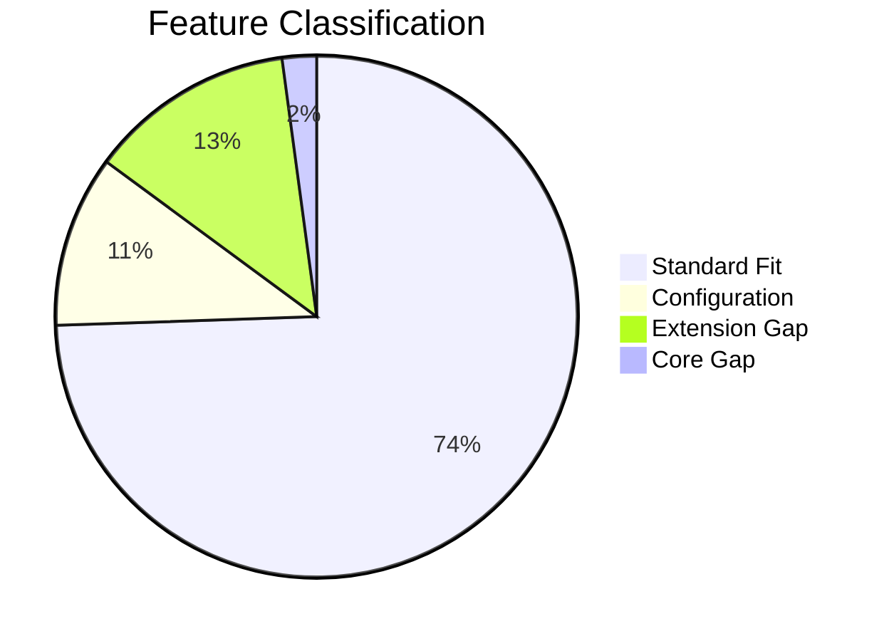
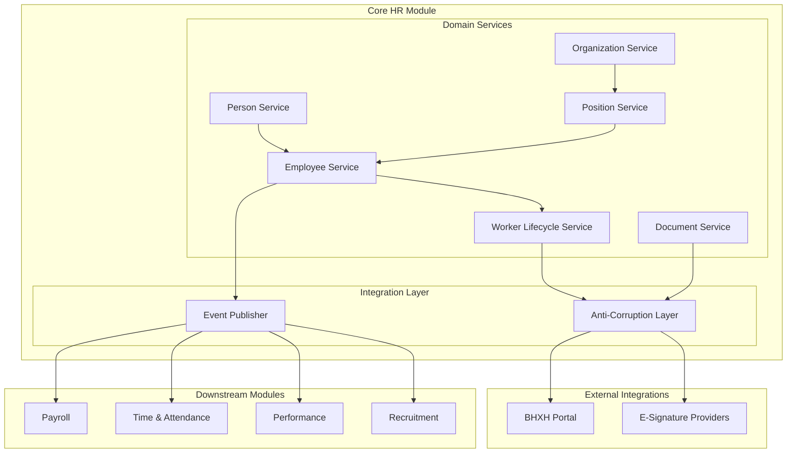
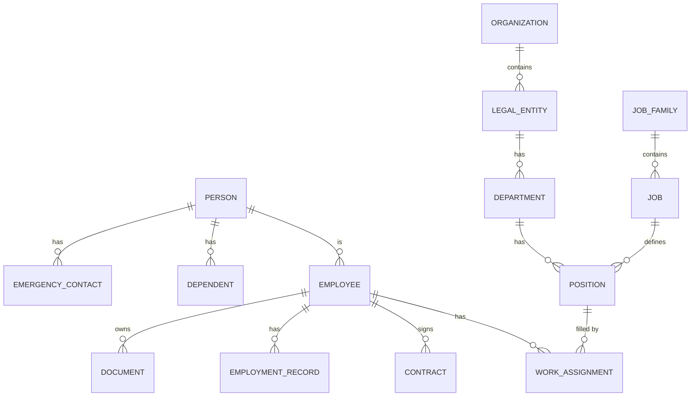
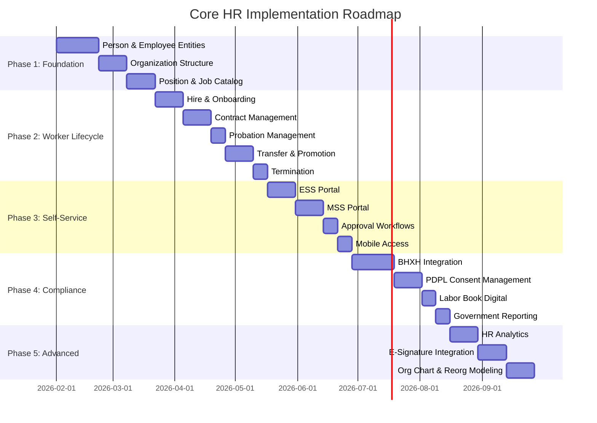
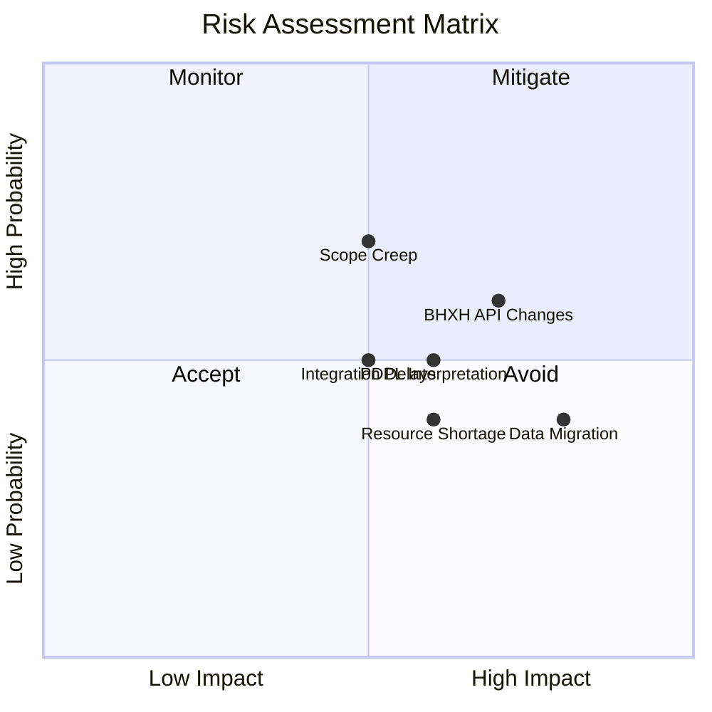
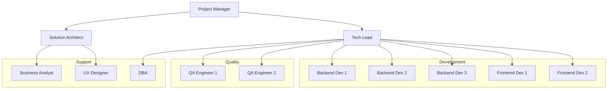

# 🏗️ Solution Blueprint: Core HR Module

> **Module:** Core HR (CO)  
> **Date:** 2026-01-30  
> **Version:** 1.0  
> **Status:** Draft  
> **Prepared by:** Solution Architect Team

---

## 1. Executive Summary

### 1.1 Module Overview

**Core HR** là module nền tảng của xTalent HCM, quản lý toàn bộ thông tin nhân viên, cấu trúc tổ chức, vị trí công việc và vòng đời lao động. Module này là **Single Source of Truth** cho tất cả dữ liệu nhân sự và là dependency của mọi module khác trong hệ thống.

### 1.2 Key Metrics

| Metric | Value |
|--------|-------|
| **Total Features** | 47 |
| **Core Entities** | 27 |
| **P0 (Must Have)** | 22 features |
| **P1 (Should Have)** | 15 features |
| **P2 (Nice to Have)** | 10 features |
| **Vietnam-Specific** | 12 features |
| **Estimated Duration** | 6-8 months |

### 1.3 Strategic Objectives

1. **Vietnam-First Compliance** - Tuân thủ đầy đủ Luật Lao động, BHXH, PDPL
2. **Position-Based Organization** - Cấu trúc tổ chức dựa trên Position (không phải Job-based)
3. **AI-Ready Architecture** - Thiết kế extensible cho AI features trong H2
4. **Enterprise-Grade** - Đáp ứng nhu cầu doanh nghiệp lớn (1000+ employees)

---

## 2. Fit-Gap Analysis

### 2.1 Analysis Summary



| Classification | Count | Percentage | Authority |
|----------------|-------|------------|-----------|
| **Standard Fit** | 35 | 74% | Project Team |
| **Configuration** | 5 | 11% | Solution Architect |
| **Extension Gap** | 6 | 13% | Solution Architect |
| **Core Gap** | 1 | 2% | ARB Approval |

### 2.2 Standard Fit Features (35)

Các features này có thể implement theo pattern chuẩn của xTalent platform:

| Category | Features |
|----------|----------|
| **Employee Data** | Personal Info, Contact, Employment History, Bank Account, Emergency Contacts, Dependents, Education |
| **Organization** | Org Hierarchy, Department, Business Unit, Cost Center, Visual Org Chart |
| **Position** | Position Definition, Job Catalog, Position Hierarchy, Vacancy Management |
| **Worker Lifecycle** | Hire, Rehire, Transfer, Promotion, Termination |
| **Self-Service** | ESS, MSS, Approval Workflows, Mobile Access, Quick Actions |
| **Document** | Employee Documents, Contract Documents |
| **Reporting** | HR Reporting, Audit Trail |

### 2.3 Configuration Required (5)

Các features cần configuration đặc thù cho Vietnam:

| Feature | Configuration Needed | Effort |
|---------|---------------------|--------|
| **Identification Documents** | CCCD/CMND validation rules, Work Permit types | 2 days |
| **Dependent Management** | Tax deduction rules (4.4M/person), eligibility criteria | 1 day |
| **Legal Entity** | Vietnam MST format (10/13 digits), BHXH unit code | 1 day |
| **Government Reporting** | Report templates theo Thông tư | 3 days |
| **Work Permit Documents** | Expiry rules, renewal workflow | 2 days |

### 2.4 Extension Gaps (6)

Các features cần phát triển extension ngoài platform core:

| Gap ID | Feature | Type | Complexity | Effort | Authority |
|--------|---------|------|------------|--------|-----------|
| EXT-001 | **BHXH Integration** | Integration | HIGH | 3 weeks | Solution Architect |
| EXT-002 | **PDPL Consent Management** | Compliance | HIGH | 2 weeks | Solution Architect |
| EXT-003 | **Labor Book Digital** | Compliance | MEDIUM | 1 week | Solution Architect |
| EXT-004 | **Contract Auto-Renewal** | Business Logic | MEDIUM | 1 week | Solution Architect |
| EXT-005 | **Probation Rules** | Business Logic | MEDIUM | 1 week | Solution Architect |
| EXT-006 | **E-Signature Integration** | Integration | MEDIUM | 2 weeks | Solution Architect |

#### EXT-001: BHXH Integration

```yaml
gap_id: EXT-001
feature: BHXH Integration
type: Integration
complexity: HIGH
effort: 3 weeks

description: |
  Tích hợp với hệ thống BHXH Việt Nam qua VssID API để:
  - Đăng ký nhân viên mới
  - Báo cáo D02-TS hàng tháng
  - Chốt sổ khi nghỉ việc
  - Tra cứu thông tin đóng BHXH

integration_pattern: Anti-Corruption Layer (ACL)

technical_approach:
  - Create BHXH Adapter service
  - Map internal entities to BHXH format
  - Queue-based async processing
  - Retry logic for API failures
  - Fallback to manual export

dependencies:
  - VssID API credentials
  - BHXH portal registration
  - SSL Certificate

risks:
  - BHXH API changes without notice
  - API downtime during peak periods
  
mitigation:
  - Fallback to manual export
  - Offline queue for retry
```

#### EXT-002: PDPL Consent Management

```yaml
gap_id: EXT-002
feature: PDPL Consent Management
type: Compliance
complexity: HIGH
effort: 2 weeks

description: |
  Tuân thủ Luật Bảo vệ Dữ liệu Cá nhân 91/2025 effective 01/01/2026:
  - Consent collection và tracking
  - Data subject rights (access, correction, deletion, portability)
  - Breach notification workflow (72h)
  - Purpose limitation enforcement

technical_approach:
  - ConsentRecord entity with versioning
  - DataSubjectRequest workflow
  - PII flagging on all entities
  - Audit logging cho PII access
  - Retention policy engine

entities_new:
  - ConsentRecord
  - ConsentPurpose
  - DataSubjectRequest
  - PIIAuditLog

risks:
  - PDPL interpretation uncertainty
  - Scope creep from legal team
  
mitigation:
  - Regular sync với Legal
  - Incremental delivery
```

#### EXT-003: Labor Book Digital

```yaml
gap_id: EXT-003
feature: Labor Book Digital
type: Compliance
complexity: MEDIUM
effort: 1 week

description: |
  Sổ lao động điện tử theo NĐ 145/2020/NĐ-CP:
  - Ghi nhận tự động từ EmploymentRecord
  - Export theo format quy định
  - Print-ready format

technical_approach:
  - View/Report on EmploymentRecord
  - Template-based export (PDF, DOCX)
  - Versioned copies for terminated employees
```

#### EXT-004: Contract Auto-Renewal

```yaml
gap_id: EXT-004
feature: Contract Auto-Renewal Rules
type: Business Logic
complexity: MEDIUM
effort: 1 week

description: |
  Quy tắc tự động cho hợp đồng theo Luật Lao động:
  - Alert khi HĐ xác định sắp hết hạn
  - Validate số lần gia hạn (max 1)
  - Auto-suggest chuyển đổi sang vô thời hạn
  - Block gia hạn không hợp lệ

technical_approach:
  - Business Rules Engine
  - Scheduled job để check expiry
  - Workflow trigger cho renewal
```

#### EXT-005: Probation Rules Engine

```yaml
gap_id: EXT-005
feature: Probation Rules Engine
type: Business Logic
complexity: MEDIUM
effort: 1 week

description: |
  Quy tắc thử việc theo quy định:
  - Max duration theo loại công việc (6/30/60/180 ngày)
  - Min salary (85%)
  - Auto-confirm workflow
  - Early termination với 3-day notice

technical_approach:
  - Configurable rules per job type
  - Scheduled job cho auto-confirm
  - Workflow integration
```

#### EXT-006: E-Signature Integration

```yaml
gap_id: EXT-006
feature: E-Signature Integration
type: Integration
complexity: MEDIUM
effort: 2 weeks

description: |
  Tích hợp chữ ký số cho hợp đồng và tài liệu HR:
  - Integration với VNPT-CA, Viettel-CA, hoặc FPT-CA
  - Signature workflow
  - Signed document storage

technical_approach:
  - Plugin architecture cho multiple providers
  - SignatureRequest entity
  - Async signing process
  - Webhook for completion notification
```

### 2.5 Core Gap (1)

Cần ARB approval do impact đến core architecture:

| Gap ID | Feature | Impact | ARB Decision Required |
|--------|---------|--------|----------------------|
| CORE-001 | **Skills-Based Organization** | New entity model, cross-module impact | YES |

#### CORE-001: Skills-Based Organization (H2 Deferral)

```yaml
gap_id: CORE-001
feature: Skills-Based Organization
type: Core Architecture
complexity: VERY HIGH
horizon: H2 (defer)

description: |
  Framework cho skills-based organization giống Workday Skills Cloud.
  Impact đến: Core HR, Recruitment, Performance, Learning, Compensation.

impact_analysis:
  - New Skill, EmployeeSkill entities
  - Skills taxonomy management
  - Skills inference từ job history
  - Skills-based job matching
  - Cross-module integration

arb_recommendation: DEFER to H2
  
rationale: |
  - Không phải regulatory requirement
  - High complexity, high risk
  - Market chưa demand (Vietnam)
  - Focus H1 on compliance features

h1_placeholder:
  - Create Skill, EmployeeSkill entities (basic)
  - Manual skill assignment (no inference)
  - No cross-module integration yet
```

---

## 3. Solution Architecture

### 3.1 Architecture Overview



### 3.2 Domain Services

| Service | Responsibility | Entities |
|---------|---------------|----------|
| **Person Service** | Manage person identity, demographics | Person, Address, Identification |
| **Employee Service** | Manage employment relationship | Employee, Dependent, EmergencyContact, BankAccount |
| **Organization Service** | Manage org structure | Organization, LegalEntity, BusinessUnit, Department, CostCenter, Location |
| **Position Service** | Manage positions and jobs | Position, Job, JobFamily, JobLevel, Grade |
| **Worker Lifecycle Service** | Manage employee events | WorkAssignment, EmploymentRecord, Contract, Probation |
| **Document Service** | Manage documents | Document, DocumentType |

### 3.3 Integration Patterns

| Integration | Pattern | Rationale |
|-------------|---------|-----------|
| **BHXH Portal** | ACL + Async Queue | Unreliable external API, need retry logic |
| **E-Signature** | Plugin + Webhook | Multiple providers, async process |
| **Payroll** | Event Sourcing | Eventual consistency, audit trail |
| **Time & Attendance** | Event Sourcing | Real-time sync not required |
| **Recruitment** | Domain Events | Hire event triggers from approved candidate |
| **Performance** | Domain Events | Employee data for review cycles |

### 3.4 Data Architecture



### 3.5 API Strategy

| API Category | Style | Auth | Rate Limit |
|--------------|-------|------|------------|
| **Internal APIs** | REST + gRPC | JWT (internal) | No limit |
| **Partner APIs** | REST | OAuth 2.0 | 1000/min |
| **Public APIs** | REST | API Key | 100/min |
| **BHXH Integration** | SOAP/REST | Certificate | Per BHXH spec |

### 3.6 Security Architecture

| Layer | Controls |
|-------|----------|
| **Data at Rest** | AES-256 encryption cho PII fields |
| **Data in Transit** | TLS 1.3 |
| **Access Control** | RBAC + Position-based |
| **PII Protection** | Field-level encryption, masking |
| **Audit** | All CRUD + Read on PII logged |
| **Consent** | PDPL consent tracking |

---

## 4. Implementation Roadmap

### 4.1 Phase Overview



### 4.2 Phase 1: Foundation (7 weeks)

**Objective:** Xây dựng core entities và data model

| Sprint | Features | Entities | Effort |
|--------|----------|----------|--------|
| 1.1 | Person, Personal Info, Contact, Identification | Person, Address, Identification | 3 weeks |
| 1.2 | Organization, Legal Entity, Department | Organization, LegalEntity, BusinessUnit, Department, CostCenter, Location | 2 weeks |
| 1.3 | Position, Job Catalog, Job Family | Position, Job, JobFamily, JobLevel, Grade | 2 weeks |

**Deliverables:**
- [ ] Core entity CRUD APIs
- [ ] Data validation rules
- [ ] Basic UI screens
- [ ] Unit tests (>80% coverage)
- [ ] API documentation

**Exit Criteria:**
- [ ] All P0 entities created với CRUD
- [ ] Vietnam-specific validations working (CCCD, MST)
- [ ] Data migration tool ready
- [ ] Performance benchmark passed (<200ms response)

### 4.3 Phase 2: Worker Lifecycle (8 weeks)

**Objective:** Implement toàn bộ employee lifecycle events

| Sprint | Features | Key Entities/Flows | Effort |
|--------|----------|-------------------|--------|
| 2.1 | Hire, Rehire | Employee, WorkAssignment, hiring workflow | 2 weeks |
| 2.2 | Contract Management | Contract, contract types, renewal rules | 2 weeks |
| 2.3 | Probation | Probation, evaluation workflow | 1 week |
| 2.4 | Transfer, Promotion | EmploymentRecord, approval workflows | 2 weeks |
| 2.5 | Termination | Offboarding checklist, severance trigger | 1 week |

**Deliverables:**
- [ ] Complete worker lifecycle APIs
- [ ] Approval workflow engine
- [ ] Employment history tracking
- [ ] Contract document generation
- [ ] Integration với downstream modules

**Exit Criteria:**
- [ ] Full hire-to-retire flow working
- [ ] Contract rules compliant với Luật Lao động
- [ ] Probation rules per job type
- [ ] Termination triggers payroll final pay
- [ ] UAT sign-off từ HR stakeholders

### 4.4 Phase 3: Self-Service (6 weeks)

**Objective:** Build employee và manager portals

| Sprint | Features | Effort |
|--------|----------|--------|
| 3.1 | ESS Portal (view/edit personal info, view payslips) | 2 weeks |
| 3.2 | MSS Portal (team view, initiate transactions) | 2 weeks |
| 3.3 | Approval Workflows (configurable, multi-level) | 1 week |
| 3.4 | Mobile Access (responsive, push notifications) | 1 week |

**Deliverables:**
- [ ] ESS web portal
- [ ] MSS web portal
- [ ] Workflow engine configuration UI
- [ ] Mobile-responsive design
- [ ] Push notification integration

**Exit Criteria:**
- [ ] Employees can view/edit own data
- [ ] Managers can view team và approve requests
- [ ] Workflows configurable by admin
- [ ] Mobile access functional
- [ ] User acceptance testing passed

### 4.5 Phase 4: Compliance (7 weeks)

**Objective:** Vietnam regulatory compliance

| Sprint | Features | Effort |
|--------|----------|--------|
| 4.1 | BHXH Integration (registration, D02-TS, termination) | 3 weeks |
| 4.2 | PDPL Consent Management (consent, rights, breach) | 2 weeks |
| 4.3 | Labor Book Digital (auto-record, export) | 1 week |
| 4.4 | Government Reporting (templates, scheduling) | 1 week |

**Deliverables:**
- [ ] BHXH Adapter service
- [ ] Consent management module
- [ ] Digital labor book feature
- [ ] Report templates theo Thông tư
- [ ] Compliance dashboard

**Exit Criteria:**
- [ ] BHXH integration tested với sandbox
- [ ] PDPL consent flow working
- [ ] Labor book export matches format
- [ ] Government reports validated
- [ ] Compliance audit checklist passed

### 4.6 Phase 5: Advanced Features (6 weeks)

**Objective:** Advanced features và nice-to-haves

| Sprint | Features | Effort |
|--------|----------|--------|
| 5.1 | HR Analytics (dashboards, trends) | 2 weeks |
| 5.2 | E-Signature Integration (contracts, offers) | 2 weeks |
| 5.3 | Visual Org Chart, Reorganization Modeling | 2 weeks |

**Deliverables:**
- [ ] Analytics dashboards
- [ ] E-signature với 1 provider
- [ ] Interactive org chart
- [ ] Reorg modeling (preview)

**Exit Criteria:**
- [ ] Analytics dashboards live
- [ ] E-signature contracts working
- [ ] Org chart interactive
- [ ] All P2 features delivered (or deferred with rationale)

---

## 5. Exit Criteria Matrix

### 5.1 Overall Success Criteria

| Criterion | Target | Measurement |
|-----------|--------|-------------|
| **Feature Completion** | 100% P0, 90%+ P1 | Feature tracker |
| **Test Coverage** | >80% unit, >60% integration | SonarQube |
| **Performance** | <200ms avg response | APM |
| **Availability** | 99.5% uptime | Monitoring |
| **Security** | Zero critical vulnerabilities | Security scan |
| **Compliance** | 100% regulatory features | Compliance checklist |
| **User Satisfaction** | >4.0/5.0 rating | User survey |

### 5.2 Phase Exit Criteria

| Phase | Exit Criteria | Sign-off By |
|-------|--------------|-------------|
| **P1: Foundation** | Core entities CRUD, Vietnam validations, data migration ready | Tech Lead |
| **P2: Lifecycle** | Full hire-to-retire, contract compliance, probation rules | Product Owner |
| **P3: Self-Service** | ESS/MSS portals live, workflows configurable | Product Owner |
| **P4: Compliance** | BHXH integration, PDPL consent, regulatory reports | Compliance Officer |
| **P5: Advanced** | Analytics, e-signature, org chart | Product Owner |

### 5.3 Go-Live Criteria

| Category | Criterion | Status |
|----------|-----------|--------|
| **Functional** | All P0 features passed UAT | ⬜ |
| **Data** | Production data migrated và validated | ⬜ |
| **Performance** | Load test passed (target TPS) | ⬜ |
| **Security** | Penetration test passed | ⬜ |
| **Compliance** | Legal sign-off on PDPL, BHXH | ⬜ |
| **Training** | End-user training completed | ⬜ |
| **Support** | Runbook và escalation path defined | ⬜ |
| **Rollback** | Rollback plan tested | ⬜ |

---

## 6. Risk Register

### 6.1 Risk Matrix



### 6.2 Risk Details

| ID | Risk | Probability | Impact | Strategy | Mitigation |
|----|------|-------------|--------|----------|------------|
| R1 | **BHXH API Changes** | HIGH | HIGH | Mitigate | ACL pattern, fallback to manual, maintain API contract tests |
| R2 | **PDPL Interpretation** | MEDIUM | HIGH | Mitigate | Regular sync với Legal, incremental delivery, flexible consent model |
| R3 | **Data Migration Quality** | LOW | HIGH | Avoid | Data profiling upfront, validation scripts, dry-run migration |
| R4 | **Scope Creep** | HIGH | MEDIUM | Mitigate | Strict change control, defer to H2 for nice-to-haves |
| R5 | **Resource Shortage** | MEDIUM | MEDIUM | Monitor | Cross-training, contractor backup plan |
| R6 | **Integration Delays** | MEDIUM | MEDIUM | Monitor | Early integration testing, mock services |
| R7 | **User Adoption** | MEDIUM | MEDIUM | Mitigate | Training program, change management, super-user network |

### 6.3 Risk Response Plan

#### R1: BHXH API Changes

```yaml
risk_id: R1
risk: BHXH API changes without notice
probability: HIGH
impact: HIGH

triggers:
  - BHXH releases new API version
  - API response format changes
  - New required fields added

response:
  - ACL pattern isolates changes
  - API contract tests detect breaking changes
  - Fallback to manual export/import
  - Maintain 2-version support

owner: Integration Lead
review_frequency: Monthly
```

#### R2: PDPL Interpretation

```yaml
risk_id: R2
risk: Uncertainty in PDPL interpretation
probability: MEDIUM
impact: HIGH

triggers:
  - Legal team provides new interpretation
  - Government issues clarifying guidance
  - Industry peers implement differently

response:
  - Flexible consent model (configurable purposes)
  - Regular Legal sync (bi-weekly)
  - Incremental feature delivery
  - Monitor industry implementations

owner: Compliance Officer
review_frequency: Bi-weekly
```

---

## 7. Resource Requirements

### 7.1 Team Structure



### 7.2 Resource Allocation

| Role | FTE | Phase 1 | Phase 2 | Phase 3 | Phase 4 | Phase 5 |
|------|-----|---------|---------|---------|---------|---------|
| Project Manager | 1 | ✅ | ✅ | ✅ | ✅ | ✅ |
| Solution Architect | 0.5 | ✅ | ✅ | ⚪ | ✅ | ⚪ |
| Tech Lead | 1 | ✅ | ✅ | ✅ | ✅ | ✅ |
| Backend Developer | 3 | ✅ | ✅ | ✅ | ✅ | ✅ |
| Frontend Developer | 2 | ⚪ | ✅ | ✅ | ✅ | ✅ |
| QA Engineer | 2 | ✅ | ✅ | ✅ | ✅ | ✅ |
| Business Analyst | 1 | ✅ | ✅ | ✅ | ✅ | ⚪ |
| UX Designer | 0.5 | ⚪ | ⚪ | ✅ | ⚪ | ✅ |
| DBA | 0.5 | ✅ | ⚪ | ⚪ | ⚪ | ⚪ |

### 7.3 External Dependencies

| Dependency | Type | Lead Time | Status |
|------------|------|-----------|--------|
| BHXH API Credentials | Government | 2-4 weeks | ⬜ Not Started |
| E-Signature Provider Contract | Vendor | 2 weeks | ⬜ Not Started |
| SSL Certificates | Infrastructure | 1 week | ⬜ Not Started |
| Production Environment | Infrastructure | 2 weeks | ⬜ Not Started |

---

## 8. Governance

### 8.1 Decision Rights

| Decision Type | Authority | Escalation |
|---------------|-----------|------------|
| Feature scope within phase | Product Owner | PM |
| Technical design | Tech Lead | Solution Architect |
| Extension gaps | Solution Architect | PM |
| Core gaps | ARB | Steering Committee |
| Timeline changes | PM | Steering Committee |
| Resource allocation | PM | Steering Committee |
| Go-live decision | Product Owner + Tech Lead + Compliance | Steering Committee |

### 8.2 Change Control

| Change Type | Process | Approver |
|-------------|---------|----------|
| Bug fix | Direct commit | Tech Lead |
| Feature tweak | Sprint backlog | Product Owner |
| New requirement | Change Request | PM + Product Owner |
| Scope addition | Change Request + Impact Analysis | Steering Committee |
| Core gap | ARB Review | ARB |

### 8.3 Reporting Cadence

| Report | Frequency | Audience | Owner |
|--------|-----------|----------|-------|
| Daily Standup | Daily | Delivery Team | Tech Lead |
| Sprint Review | Bi-weekly | Stakeholders | Product Owner |
| Phase Gate | Per phase | Steering Committee | PM |
| Risk Review | Monthly | PM, SA | Risk Owner |
| Compliance Check | Monthly | Compliance Officer | Compliance Officer |

---

## 9. Appendices

### A. Acronym Glossary

| Acronym | Meaning |
|---------|---------|
| BHXH | Bảo Hiểm Xã Hội (Social Insurance) |
| BHYT | Bảo Hiểm Y Tế (Health Insurance) |
| BHTN | Bảo Hiểm Thất Nghiệp (Unemployment Insurance) |
| PDPL | Personal Data Protection Law (Luật 91/2025) |
| CCCD | Căn Cước Công Dân (Citizen ID Card) |
| MST | Mã Số Thuế (Tax Code) |
| TNCN | Thu Nhập Cá Nhân (Personal Income) |
| ESS | Employee Self-Service |
| MSS | Manager Self-Service |
| ACL | Anti-Corruption Layer |
| ARB | Architecture Review Board |
| FTE | Full-Time Equivalent |
| UAT | User Acceptance Testing |

### B. Reference Documents

| Document | Location |
|----------|----------|
| Research Report | `_research/_research-report.md` |
| Entity Catalog | `_research/entity-catalog.md` |
| Feature Catalog | `_research/feature-catalog.md` |
| Vietnam Labor Law 45/2019 | External |
| PDPL 91/2025 | External |
| BHXH Law | External |

### C. Approval Sign-off

| Role | Name | Signature | Date |
|------|------|-----------|------|
| Product Owner | | | |
| Solution Architect | | | |
| Tech Lead | | | |
| Compliance Officer | | | |
| Project Manager | | | |

---

*Document generated: 2026-01-30*
*Next review: Before Phase 1 kickoff*
