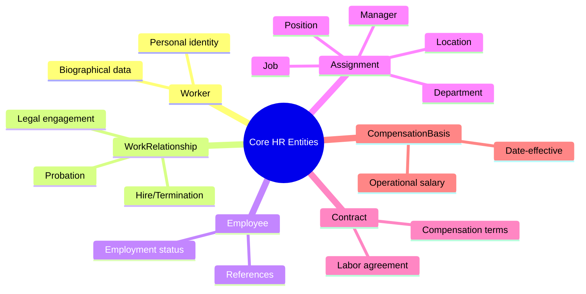

# HR Event to Ontology Mapping

> **Version**: 1.0.0  
> **Status**: Draft  
> **Author**: Ontology Architecture Team  
> **Last Updated**: 2026-02-02

## 1. Overview

Tài liệu này mô tả mapping giữa các **HR Events** (sự kiện nhân sự) và các **Ontology Entities/Attributes** tương ứng trong hệ thống xTalent HCM.

### 1.1 Entity Hierarchy



### 1.2 Key Principles

1. **Date-Effective Tracking**: Hầu hết các events tạo ra records mới với `effectiveStartDate` thay vì update-in-place
2. **Separation of Concerns**: 
   - `Worker` = Person identity (tĩnh)
   - `WorkRelationship` = Legal context (pháp lý)
   - `Employee` = Employment status (derived)
   - `Assignment` = Organizational context (động, date-effective)
   - `Contract` = Legal agreement (pháp lý hợp đồng)
   - `CompensationBasis` = Operational salary (vận hành lương)
3. **VN Labor Law Compliance**: Tuân thủ Bộ luật Lao động 2019

---

## 2. Event Mapping Table

### 2.1 Employment Lifecycle Events

| Event | VN Name | Primary Entity | Key Attributes | Related Entities |
|-------|---------|----------------|----------------|------------------|
| **Join Company** | Vào công ty | `WorkRelationship` | `startDate`, `relationshipTypeCode`, `legalEmployerId`, `workerId` | `Employee` (auto-created), `Contract`, `Assignment` |
| **Termination** | Chấm dứt HĐLĐ | `WorkRelationship` | `terminationDate`, `terminationReasonCode`, `terminationInitiatedBy`, `noticeDate` | `Employee.statusCode=TERMINATED`, `Contract.statusCode`, `Assignment.effectiveEndDate` |
| **Retirement** | Nghỉ hưu | `Employee` | `statusCode=RETIRED` | `WorkRelationship.terminationDate`, `WorkRelationship.terminationReasonCode=RETIREMENT` |
| **Re-hire** | Tái tuyển dụng | `WorkRelationship` (new) | `startDate`, `originalHireDate`, `previousWorkRelationshipId` | `Employee` (new), `Contract` (new) |

### 2.2 Contract Events

| Event | VN Name | Primary Entity | Key Attributes | Related Entities |
|-------|---------|----------------|----------------|------------------|
| **New Contract** | Ký HĐLĐ mới | `Contract` | `contractNumber`, `startDate`, `endDate`, `contractTypeCode`, `baseSalary` | `WorkRelationship.laborContractId` |
| **Contract Renewal** | Gia hạn/Tái ký HĐLĐ | `Contract` (new) | `previousContractId`, `renewalCount`, `startDate`, `endDate`, `contractTypeCode` | `WorkRelationship.laborContractId` (update) |
| **Contract Termination** | Chấm dứt HĐLĐ | `Contract` | `terminationDate`, `terminationReasonCode`, `terminationInitiatedBy`, `statusCode=TERMINATED` | `WorkRelationship.terminationDate` |
| **Contract Amendment** | Bổ sung/Sửa đổi HĐLĐ | `Contract` (new version) | `previousVersionId`, `amendmentType`, `statusCode` | - |

### 2.3 Probation Events

| Event | VN Name | Primary Entity | Key Attributes | Related Entities |
|-------|---------|----------------|----------------|------------------|
| **Start Probation** | Bắt đầu thử việc | `WorkRelationship` | `probationStartDate`, `probationEndDate`, `probationDurationDays` | `Employee.probationEndDate`, `Contract.probationDuration` |
| **End Probation - Pass** | Kết thúc thử việc - Đạt | `WorkRelationship` | `probationResult=PASSED`, `probationEndDate` | `Employee.probationResult=PASSED`, `CompensationBasis` (new - salary increase) |
| **End Probation - Fail** | Kết thúc thử việc - Không đạt | `WorkRelationship` | `probationResult=FAILED`, `terminationDate` | `Employee.statusCode=TERMINATED`, `Contract.statusCode=TERMINATED` |
| **Extend Probation** | Gia hạn thử việc | `WorkRelationship` | `probationEndDate` (updated), `probationResult=EXTENDED` | `Employee.probationEndDate` |

### 2.4 Assignment/Organizational Events

| Event | VN Name | Primary Entity | Key Attributes | Related Entities |
|-------|---------|----------------|----------------|------------------|
| **Change Department** | Chuyển phòng ban | `Assignment` (new) | `departmentId`, `effectiveStartDate`, `assignmentReasonCode=TRANSFER` | Previous `Assignment.effectiveEndDate` |
| **Internal Department Movement** | Di chuyển nội bộ phòng ban | `Assignment` (new) | `departmentId`, `effectiveStartDate`, `assignmentReasonCode=INTERNAL_TRANSFER` | Previous `Assignment.effectiveEndDate` |
| **Change Reporting Line** | Thay đổi cấp quản lý | `Assignment` (new) | `reportsToAssignmentId`, `effectiveStartDate`, `assignmentReasonCode=MANAGER_CHANGE` | - |
| **Change Working Office** | Thay đổi văn phòng làm việc | `Assignment` (new) | `locationId`, `effectiveStartDate`, `assignmentReasonCode=RELOCATION` | `WorkLocation` reference |
| **Promotion** | Thăng chức | `Assignment` (new) | `positionId`, `jobId`, `effectiveStartDate`, `assignmentReasonCode=PROMOTION` | `CompensationBasis` (new - salary increase), `Position` |
| **Demotion** | Giáng chức | `Assignment` (new) | `positionId`, `jobId`, `effectiveStartDate`, `assignmentReasonCode=DEMOTION` | `CompensationBasis` (new - salary decrease), `Position` |
| **Lateral Move** | Luân chuyển ngang | `Assignment` (new) | `positionId`, `jobId`, `departmentId`, `effectiveStartDate`, `assignmentReasonCode=LATERAL_MOVE` | `Position` |

### 2.5 Job/Position Events

| Event | VN Name | Primary Entity | Key Attributes | Related Entities |
|-------|---------|----------------|----------------|------------------|
| **Change JF/JG/SG** | Thay đổi Job Family/Group/Subgroup | `Job` (update) | `primaryTaxonomyNodeId` | `JobTaxonomyMap` |
| **JF/JG/SG/Title/Level Adjustment** | Điều chỉnh JF/JG/SG/Title/Level | `Assignment` (new) | `jobId`, `effectiveStartDate`, `assignmentReasonCode=RECLASSIFICATION` | `Job`, `Position` |
| **Change Org Chart** | Thay đổi sơ đồ tổ chức | Multiple | `Position.supervisorPositionId`, `BusinessUnit.parentBusinessUnitId` | Cascading updates |
| **Change Department Head** | Thay đổi trưởng phòng | `BusinessUnit` | `managerEmployeeId` | `Employee` reference |

### 2.6 Compensation Events

| Event | VN Name | Primary Entity | Key Attributes | Related Entities |
|-------|---------|----------------|----------------|------------------|
| **Increase Salary** | Tăng lương | `CompensationBasis` (new) | `basisAmount`, `effectiveStartDate`, `reasonCode=ANNUAL_REVIEW/ADJUSTMENT`, `adjustmentAmount`, `adjustmentPercentage`, `previousBasisId` | `Contract.baseSalary` (if legal change) |
| **Decrease Salary** | Giảm lương | `CompensationBasis` (new) | `basisAmount`, `effectiveStartDate`, `reasonCode=DEMOTION/ADJUSTMENT`, `adjustmentAmount` (negative), `previousBasisId` | - |
| **Salary Adjustment** | Điều chỉnh lương | `CompensationBasis` (new) | `basisAmount`, `effectiveStartDate`, `reasonCode`, `sourceCode`, `basisTypeCode`, `previousBasisId` | - |
| **Change Payroll** | Thay đổi lương | `CompensationBasis` (new) | `basisAmount`, `frequencyCode`, `payMethodCode`, `effectiveStartDate` | - |

### 2.7 Leave & Time Events

| Event | VN Name | Primary Entity | Key Attributes | Related Entities |
|-------|---------|----------------|----------------|------------------|
| **Start Long-term Leave** | Bắt đầu nghỉ dài hạn | `Employee` | `statusCode=ON_LEAVE` | `WorkRelationship` (status sync) |
| **Return from Leave** | Trở lại làm việc | `Employee` | `statusCode=ACTIVE` | `WorkRelationship` (status sync) |
| **Suspension** | Đình chỉ công việc | `WorkRelationship` | `suspensionStartDate`, `suspensionEndDate`, `suspensionReason`, `statusCode=SUSPENDED` | `Employee.statusCode=SUSPENDED` |
| **Reinstate** | Phục hồi | `WorkRelationship` | `suspensionEndDate`, `statusCode=ACTIVE` | `Employee.statusCode=ACTIVE` |
| **Change Timesheet** | Thay đổi bảng chấm công | `Assignment` | `timeProfileCode`, `standardHoursPerWeek` | `WorkLocation.timeProfileCode` |

### 2.8 Working Group Events

| Event | VN Name | Primary Entity | Key Attributes | Related Entities |
|-------|---------|----------------|----------------|------------------|
| **Change Working Group** | Thay đổi nhóm làm việc | `Assignment` | `metadata.workingGroupId`, `effectiveStartDate` | Custom entity if applicable |

---

## 3. Detailed Event Specifications

### 3.1 Join Company (Vào Công Ty)

**Description**: Sự kiện khi một Worker được tuyển dụng và trở thành Employee của Legal Entity.

**Primary Flow**:
```
1. Worker exists (or created)
   ↓
2. CREATE WorkRelationship
   - workerId = <worker_id>
   - legalEmployerId = <legal_entity_id>
   - relationshipTypeCode = 'EMPLOYEE'
   - startDate = <hire_date>
   - statusCode = 'ACTIVE'
   ↓
3. AUTO-CREATE Employee (derived)
   - workRelationshipId = <work_relationship_id>
   - employeeCode = <generated>
   - hireDate = WorkRelationship.startDate
   - statusCode = 'ACTIVE'
   ↓
4. CREATE Contract (optional, VN required)
   - employeeId = <employee_id>
   - contractTypeCode = 'DEFINITE' | 'INDEFINITE' | 'TRIAL'
   - startDate = <contract_start_date>
   - baseSalary = <base_salary>
   ↓
5. CREATE Assignment
   - employeeId = <employee_id>
   - positionId = <position_id>
   - jobId = <job_id>
   - departmentId = <department_id>
   - effectiveStartDate = <hire_date>
   - assignmentReasonCode = 'HIRE'
   - isPrimary = true
   ↓
6. CREATE CompensationBasis
   - workRelationshipId = <work_relationship_id>
   - basisAmount = Contract.baseSalary
   - effectiveStartDate = <hire_date>
   - reasonCode = 'HIRE'
   - basisTypeCode = 'LEGAL_BASE'
   - sourceCode = 'CONTRACT'
```

**Affected Entities**:
| Entity | Action | Key Fields |
|--------|--------|------------|
| Worker | Read/Create | id, firstName, lastName, dateOfBirth |
| WorkRelationship | Create | startDate, relationshipTypeCode, legalEmployerId |
| Employee | Auto-Create | employeeCode, hireDate, statusCode |
| Contract | Create | contractNumber, startDate, contractTypeCode, baseSalary |
| Assignment | Create | positionId, jobId, departmentId, effectiveStartDate, assignmentReasonCode=HIRE |
| CompensationBasis | Create | basisAmount, reasonCode=HIRE, sourceCode=CONTRACT |

---

### 3.2 Termination (Chấm Dứt HĐLĐ)

**Description**: Sự kiện kết thúc quan hệ lao động giữa Employee và Legal Entity.

**Primary Flow**:
```
1. UPDATE WorkRelationship
   - terminationDate = <termination_date>
   - terminationReasonCode = <reason>
   - terminationInitiatedBy = 'VOLUNTARY' | 'INVOLUNTARY' | 'MUTUAL'
   - noticeDate = <notice_date>
   - statusCode = 'TERMINATED'
   ↓
2. UPDATE Employee (derived sync)
   - terminationDate = WorkRelationship.terminationDate
   - lastWorkingDate = <last_working_date>
   - statusCode = 'TERMINATED'
   ↓
3. UPDATE Contract
   - terminationDate = <termination_date>
   - terminationReasonCode = <reason>
   - statusCode = 'TERMINATED'
   ↓
4. UPDATE Assignment (all active)
   - effectiveEndDate = <termination_date>
   - statusCode = 'ENDED'
   ↓
5. UPDATE CompensationBasis (current)
   - effectiveEndDate = <termination_date>
   - statusCode = 'SUPERSEDED'
```

**Termination Reason Codes** (VN Labor Law aligned):
| Code | VN Name | Description | Initiated By |
|------|---------|-------------|--------------|
| `RESIGNATION` | Từ chức | Employee resigns | VOLUNTARY |
| `LAYOFF` | Sa thải | Company layoff | INVOLUNTARY |
| `FIRED` | Kỷ luật sa thải | Disciplinary termination | INVOLUNTARY |
| `CONTRACT_END` | Hết hạn HĐLĐ | Contract expiration | MUTUAL |
| `RETIREMENT` | Nghỉ hưu | Retirement | VOLUNTARY |
| `DEATH` | Tử vong | Death of employee | N/A |
| `MUTUAL_AGREEMENT` | Thỏa thuận chấm dứt | Mutual termination | MUTUAL |

---

### 3.3 Promotion (Thăng Chức)

**Description**: Sự kiện thăng chức - thay đổi Position/Job và typically kèm tăng lương.

**Primary Flow**:
```
1. UPDATE Previous Assignment
   - effectiveEndDate = <promotion_date - 1>
   ↓
2. CREATE New Assignment
   - employeeId = <employee_id>
   - positionId = <new_position_id>
   - jobId = <new_job_id>
   - departmentId = <same_or_new>
   - effectiveStartDate = <promotion_date>
   - assignmentReasonCode = 'PROMOTION'
   - isPrimary = true
   ↓
3. CREATE CompensationBasis (if salary change)
   - workRelationshipId = <work_relationship_id>
   - basisAmount = <new_salary>
   - effectiveStartDate = <promotion_date>
   - reasonCode = 'PROMOTION'
   - sourceCode = 'PROMOTION'
   - adjustmentAmount = new_salary - previous_salary
   - adjustmentPercentage = (new - old) / old * 100
   - previousBasisId = <previous_basis_id>
```

**Affected Entities**:
| Entity | Action | Key Fields |
|--------|--------|------------|
| Assignment (old) | Update | effectiveEndDate |
| Assignment (new) | Create | positionId, jobId, assignmentReasonCode=PROMOTION |
| CompensationBasis | Create | basisAmount, reasonCode=PROMOTION, adjustmentAmount |
| Position | Read | New position reference |
| Job | Read | New job reference |

---

### 3.4 Change Department (Chuyển Phòng Ban)

**Description**: Sự kiện chuyển nhân viên sang phòng ban khác.

**Primary Flow**:
```
1. UPDATE Previous Assignment
   - effectiveEndDate = <transfer_date - 1>
   ↓
2. CREATE New Assignment
   - employeeId = <employee_id>
   - positionId = <new_or_same_position_id>
   - jobId = <same_job_id>
   - departmentId = <new_department_id>
   - locationId = <new_location_id> (optional)
   - reportsToAssignmentId = <new_manager_assignment_id> (if changed)
   - effectiveStartDate = <transfer_date>
   - assignmentReasonCode = 'TRANSFER'
   - isPrimary = true
```

**Affected Entities**:
| Entity | Action | Key Fields |
|--------|--------|------------|
| Assignment (old) | Update | effectiveEndDate |
| Assignment (new) | Create | departmentId, assignmentReasonCode=TRANSFER |
| BusinessUnit | Read | New department reference |
| Position | Read/Update | If position changes |

---

### 3.5 Salary Adjustment (Điều Chỉnh Lương)

**Description**: Sự kiện thay đổi mức lương operational.

**Primary Flow**:
```
1. GET Current CompensationBasis
   - isCurrent = true
   - workRelationshipId = <work_relationship_id>
   ↓
2. UPDATE Current CompensationBasis
   - effectiveEndDate = <adjustment_date - 1>
   - isCurrent = false
   - statusCode = 'SUPERSEDED'
   ↓
3. CREATE New CompensationBasis
   - workRelationshipId = <work_relationship_id>
   - basisAmount = <new_salary>
   - currencyCode = 'VND'
   - frequencyCode = 'MONTHLY'
   - effectiveStartDate = <adjustment_date>
   - basisTypeCode = 'OPERATIONAL_BASE'
   - sourceCode = 'MANUAL_ADJUST' | 'COMP_CYCLE' | 'FORMULA_RESULT'
   - reasonCode = 'ANNUAL_REVIEW' | 'MARKET_ADJUSTMENT' | 'EQUITY_CORRECTION' | etc.
   - adjustmentAmount = new_salary - previous_salary
   - adjustmentPercentage = (new - old) / old * 100
   - previousBasisId = <previous_basis_id>
   - isCurrent = true
   - statusCode = 'ACTIVE'
   - approvalStatus = 'APPROVED' (if required)
   - approvedBy = <approver_worker_id>
```

**Reason Codes for Salary Changes**:
| Code | VN Name | Description |
|------|---------|-------------|
| `HIRE` | Tuyển dụng | Initial hire salary |
| `PROBATION_END` | Hết thử việc | Post-probation adjustment |
| `ANNUAL_REVIEW` | Xét lương hàng năm | Annual merit increase |
| `PROMOTION` | Thăng chức | Promotion increase |
| `LATERAL_MOVE` | Luân chuyển ngang | Lateral move (same level) |
| `MARKET_ADJUSTMENT` | Điều chỉnh thị trường | Market rate correction |
| `EQUITY_CORRECTION` | Cân bằng nội bộ | Internal equity adjustment |
| `COST_OF_LIVING` | Điều chỉnh vật giá | COLA adjustment |
| `DEMOTION` | Giáng chức | Demotion decrease |
| `CONTRACT_RENEWAL` | Gia hạn HĐLĐ | Contract renewal |

---

## 4. Assignment Reason Codes (Master List)

| Code | VN Name | Description | Triggers |
|------|---------|-------------|----------|
| `HIRE` | Tuyển dụng | New hire assignment | Join Company |
| `PROMOTION` | Thăng chức | Promotion to higher level | Promotion |
| `DEMOTION` | Giáng chức | Demotion to lower level | Demotion |
| `TRANSFER` | Chuyển phòng ban | Department transfer | Change Department |
| `INTERNAL_TRANSFER` | Chuyển nội bộ | Internal movement | Internal Department Movement |
| `LATERAL_MOVE` | Luân chuyển ngang | Lateral move (same level) | Lateral Move |
| `RELOCATION` | Thay đổi địa điểm | Location/office change | Change Working Office |
| `MANAGER_CHANGE` | Thay đổi quản lý | Reporting line change | Change Reporting Line |
| `RECLASSIFICATION` | Phân loại lại | Job reclassification | JF/JG/SG/Title/Level Adjustment |
| `REORGANIZATION` | Tái cơ cấu | Org restructuring | Change Org Chart |
| `DATA_CHANGE` | Thay đổi dữ liệu | Data correction | Administrative update |
| `PROJECT_ASSIGNMENT` | Phân công dự án | Project assignment | Matrix assignment |
| `SECONDMENT` | Biệt phái | Secondment to another entity | Cross-entity assignment |

---

## 5. Cross-Reference: Event to Entity Matrix

| Event | Worker | WorkRelationship | Employee | Contract | Assignment | CompBasis | Position | Job | BusinessUnit | WorkLocation |
|-------|--------|------------------|----------|----------|------------|-----------|----------|-----|--------------|--------------|
| Join Company | R | C | C | C | C | C | R | R | R | R |
| Termination | - | U | U | U | U | U | - | - | - | - |
| Contract Renewal | - | U | - | C | - | C | - | - | - | - |
| Probation End | - | U | U | U | - | C | - | - | - | - |
| Change Department | - | - | - | - | C | - | R | - | R | - |
| Change Reporting Line | - | - | - | - | C | - | - | - | - | - |
| Change Working Office | - | - | - | - | C | - | - | - | - | R |
| Promotion | - | - | - | - | C | C | R | R | - | - |
| Demotion | - | - | - | - | C | C | R | R | - | - |
| Salary Adjustment | - | - | - | - | - | C | - | - | - | - |
| Start Leave | - | U | U | - | - | - | - | - | - | - |
| Suspension | - | U | U | - | - | - | - | - | - | - |
| Change JF/JG/SG | - | - | - | - | C | - | - | U | - | - |
| Change Org Chart | - | - | - | - | - | - | U | - | U | - |
| Change Department Head | - | - | - | - | - | - | - | - | U | - |

**Legend**: R = Read, C = Create, U = Update, - = Not affected

---

## 6. VN Labor Law Compliance Notes

### 6.1 Required Fields by Event

| Event | VN Required Fields |
|-------|-------------------|
| Join Company | Contract.contractNumber, Contract.contractTypeCode, Contract.baseSalary, WorkRelationship.startDate |
| Termination | WorkRelationship.terminationReasonCode, WorkRelationship.noticeDate (30/45 days advance) |
| Probation | WorkRelationship.probationDurationDays (max 6/30/60/180 days based on role) |
| Contract Renewal | Contract.renewalCount (max 2 renewals, then → INDEFINITE) |

### 6.2 Probation Duration Rules (VN Labor Code 2019)

| Job Category | Max Probation Days | Probation Salary |
|--------------|-------------------|--------------------|
| Management/Specialist (university degree) | 180 days | ≥ 85% of contract salary |
| Technical/Professional | 60 days | ≥ 85% of contract salary |
| Skilled labor | 30 days | ≥ 85% of contract salary |
| Other work | 6 days | ≥ 85% of contract salary |

### 6.3 Contract Renewal Rules (VN Labor Code 2019)

- **DEFINITE contracts**: Max 2 renewals, then must convert to INDEFINITE
- **SEASONAL contracts**: Max 12 months duration
- **Contract.renewalCount** tracks this automatically

---

## 7. Related Documents

- [[Worker.onto.md]] - Worker entity definition
- [[WorkRelationship.onto.md]] - Work relationship entity definition
- [[Employee.onto.md]] - Employee entity definition
- [[Contract.onto.md]] - Contract entity definition
- [[Assignment.onto.md]] - Assignment entity definition
- [[CompensationBasis.onto.md]] - Compensation basis entity definition
- [[Position.onto.md]] - Position entity definition
- [[Job.onto.md]] - Job entity definition
- [[BusinessUnit.onto.md]] - Business unit entity definition
- [[WorkLocation.onto.md]] - Work location entity definition

---

*Document Status: Draft - Pending Review*  
*VN Labor Law Compliance: Bộ luật Lao động 2019, Nghị định 145/2020/NĐ-CP*
