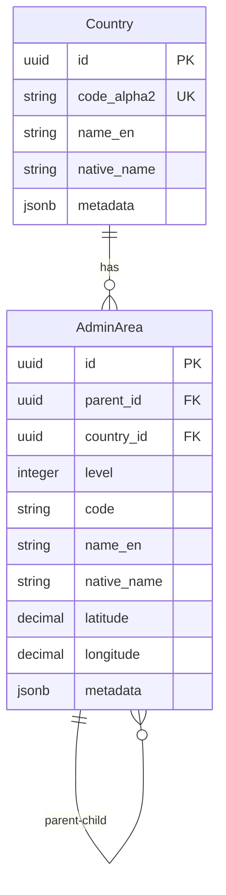

# Geographic Glossary

## Overview

This glossary defines the geographic master data entities used throughout the xTalent HCM system. Geographic entities provide the foundation for location-based operations, compliance, and reporting.

---

## Entities

### Country

**Definition:** ISO-3166 country master data providing standardized country codes and names for global operations.

**Purpose:** 
- Standardize country references across the system
- Support multi-country operations
- Enable country-specific compliance and regulations
- Provide localization support

**Key Attributes:**

| Attribute | Type | Required | Description |
|-----------|------|----------|-------------|
| `id` | UUID | Yes | Unique identifier |
| `code_alpha2` | string(2) | Yes | ISO-3166 alpha-2 code (e.g., VN, US, FR) |
| `name_en` | string(255) | No | English country name |
| `native_name` | string(255) | No | Country name in native language |
| `metadata` | jsonb | No | Additional data (alpha-3, numeric code, region, phone prefix) |
| `effective_start_date` | date | Yes | Effective start date |
| `effective_end_date` | date | No | Effective end date |
| `is_current_flag` | boolean | Yes | Current record indicator (default: true) |

**Metadata Fields:**
```json
{
  "code_alpha3": "VNM",
  "code_numeric": "704",
  "region": "Southeast Asia",
  "subregion": "South-Eastern Asia",
  "phone_prefix": "+84",
  "currency_code": "VND",
  "languages": ["vi", "en"],
  "capital": "Hanoi",
  "continent": "Asia"
}
```

**Relationships:**
- **Has many** `AdminArea` (administrative areas within the country)

**Business Rules:**
- Country code (alpha-2) must be unique
- Must follow ISO-3166 standard
- SCD Type 2 for historical tracking
- Metadata should include alpha-3 and numeric codes for cross-system compatibility

**Examples:**

```yaml
# Vietnam
id: country_vn_001
code_alpha2: VN
name_en: Vietnam
native_name: Việt Nam
metadata:
  code_alpha3: VNM
  code_numeric: "704"
  region: Southeast Asia
  phone_prefix: "+84"
  currency_code: VND

# United States
id: country_us_001
code_alpha2: US
name_en: United States
native_name: United States
metadata:
  code_alpha3: USA
  code_numeric: "840"
  region: Northern America
  phone_prefix: "+1"
  currency_code: USD
```

**Use Cases:**
- Employee address validation
- Legal entity registration
- Payroll country determination
- Tax jurisdiction identification
- Work permit and visa management
- Global assignment tracking

---

### AdminArea

**Definition:** Administrative areas (province/state, district, ward/commune) within countries. Supports hierarchical geographic structure up to 3 levels.

**Purpose:**
- Provide detailed geographic location data
- Support address validation and standardization
- Enable location-based reporting and analytics
- Facilitate compliance with local regulations

**Key Attributes:**

| Attribute | Type | Required | Description |
|-----------|------|----------|-------------|
| `id` | UUID | Yes | Unique identifier |
| `parent_id` | UUID | No | Parent admin area (null for top level) |
| `country_id` | UUID | Yes | Country reference |
| `level` | integer | No | Hierarchy level (1=Province/State, 2=District, 3=Ward/Commune) |
| `code` | string(20) | No | Administrative area code |
| `name_en` | string(255) | No | English name |
| `native_name` | string(255) | No | Name in local language |
| `latitude` | decimal(9,6) | No | Geographic latitude |
| `longitude` | decimal(9,6) | No | Geographic longitude |
| `metadata` | jsonb | No | Additional data (type, population, postal codes) |
| `effective_start_date` | date | Yes | Effective start date |
| `effective_end_date` | date | No | Effective end date |
| `is_current_flag` | boolean | Yes | Current record indicator (default: true) |

**Hierarchy Levels:**

| Level | Description | Examples |
|-------|-------------|----------|
| 1 | Province / State / Region | Hanoi, California, Île-de-France |
| 2 | District / County / Department | Ba Đình District, Los Angeles County |
| 3 | Ward / Commune / City | Phúc Xá Ward, Santa Monica |

**Metadata Fields:**
```json
{
  "type": "PROVINCE",
  "population": 8246600,
  "area_km2": 3358.6,
  "postal_codes": ["100000", "100100"],
  "timezone": "Asia/Ho_Chi_Minh",
  "iso_code": "VN-HN",
  "official_website": "https://hanoi.gov.vn"
}
```

**Relationships:**
- **Belongs to** `Country` (parent country)
- **Belongs to** `AdminArea` (parent admin area for levels 2-3)
- **Has many** `AdminArea` (child admin areas)

**Business Rules:**
- Combination of `country_id`, `level`, and `code` must be unique
- Level 1 areas have `parent_id = null`
- Level 2 areas must have a Level 1 parent
- Level 3 areas must have a Level 2 parent
- Maximum 3 levels of hierarchy
- SCD Type 2 for historical tracking
- Latitude/longitude optional but recommended for mapping

**Constraints:**
```sql
UNIQUE (country_id, level, code)
CHECK (level >= 1 AND level <= 3)
CHECK (level = 1 IMPLIES parent_id IS NULL)
CHECK (level > 1 IMPLIES parent_id IS NOT NULL)
```

**Examples:**

```yaml
# Level 1: Hanoi City (Province-level)
id: admin_vn_hanoi
parent_id: null
country_id: country_vn_001
level: 1
code: HN
name_en: Hanoi
native_name: Hà Nội
latitude: 21.028511
longitude: 105.804817
metadata:
  type: PROVINCE
  population: 8246600
  iso_code: VN-HN

# Level 2: Ba Dinh District
id: admin_vn_badinh
parent_id: admin_vn_hanoi
country_id: country_vn_001
level: 2
code: BD
name_en: Ba Dinh District
native_name: Quận Ba Đình
latitude: 21.034444
longitude: 105.819722
metadata:
  type: DISTRICT
  population: 221893

# Level 3: Phuc Xa Ward
id: admin_vn_phucxa
parent_id: admin_vn_badinh
country_id: country_vn_001
level: 3
code: PX
name_en: Phuc Xa Ward
native_name: Phường Phúc Xá
metadata:
  type: WARD
  population: 12500
```

**Use Cases:**
- Employee address management
- Work location definition
- Facility location tracking
- Tax jurisdiction determination
- Regional reporting and analytics
- Geofencing for time attendance
- Salary survey location matching
- Compliance with local labor laws

---

## Relationships



---

## Data Governance

### Data Quality Rules

1. **Country:**
   - Must use official ISO-3166 codes
   - English names should match ISO standard
   - Native names should use official local spelling
   - Metadata should be complete for operational countries

2. **AdminArea:**
   - Codes should follow country-specific standards
   - Names should be verified against official sources
   - Hierarchy must be logically consistent
   - Coordinates should be accurate for mapping

### Data Ownership

- **Master Data Team:** Maintains country and admin area data
- **HR Operations:** Validates location data for employees
- **Compliance Team:** Ensures regulatory requirements are met

### Update Frequency

- **Country:** Rarely updated (only for new countries or ISO changes)
- **AdminArea:** Updated as administrative boundaries change

---

## Integration Points

### Internal Modules

| Module | Usage |
|--------|-------|
| **Core** | Entity addresses, worker addresses, facility locations |
| **Employment** | Employee work locations, assignment locations |
| **Payroll** | Tax jurisdiction, payroll country |
| **Total Rewards** | Salary survey locations, cost of living adjustments |
| **Time & Attendance** | Work location tracking, geofencing |

### External Systems

| System | Purpose |
|--------|---------|
| **Address Validation Services** | Validate and standardize addresses |
| **Mapping Services** | Geocoding, distance calculations |
| **Tax Systems** | Determine tax jurisdictions |
| **Government Databases** | Sync with official administrative divisions |

---

## Best Practices

### Implementation

1. **Preload Standard Data:**
   - Import ISO-3166 country data
   - Load administrative divisions for operational countries
   - Verify data accuracy before go-live

2. **Maintain Data Quality:**
   - Regular audits against official sources
   - Validate coordinates for accuracy
   - Keep metadata up-to-date

3. **Performance Optimization:**
   - Index on `country_id`, `level`, `code`
   - Cache frequently accessed locations
   - Use materialized paths for hierarchy queries

### Usage Guidelines

1. **Address Entry:**
   - Always use standardized country codes
   - Validate admin areas against hierarchy
   - Capture coordinates when available

2. **Reporting:**
   - Use hierarchy for roll-up reporting
   - Leverage metadata for enriched analytics
   - Consider timezone differences for global reports

3. **Compliance:**
   - Track location changes for audit
   - Maintain historical data per SCD Type 2
   - Document location-specific regulations

---

## Version History

| Version | Date | Changes |
|---------|------|---------|
| 2.0 | 2025-12-01 | Enhanced metadata structure, added coordinates |
| 1.0 | 2025-11-01 | Initial geographic ontology |

---

## References

- **ISO 3166:** International standard for country codes
- **Administrative Divisions:** Country-specific official sources
- **Geocoding Standards:** WGS84 coordinate system
