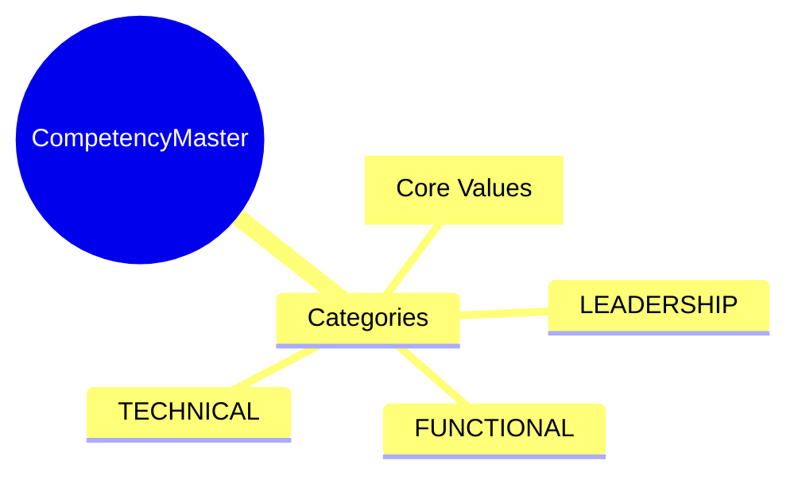
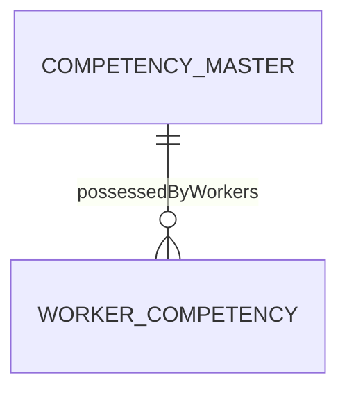

# CompetencyMaster

## Overview

**CompetencyMaster** is the catalog of behavioral competencies - leadership, communication, problem-solving, and other soft skills. Unlike [[SkillMaster]] which tracks technical abilities, competencies focus on behavioral traits assessed through performance reviews.



## Business Context

### Key Stakeholders
- **HR/L&D**: Defines competency framework
- **Manager**: Uses for performance assessment
- **Employee**: Self-assessment

### Business Processes
- **Performance Management**: Competency ratings
- **Leadership Development**: Core competencies
- **Hiring**: Competency-based interviews

### Business Value
A core competency framework enables consistent behavioral assessment across the organization.

## Attributes Guide

### Identification
- **competencyCode**: Identifier. Format: COMP-LEAD, COMP-COMM.
- **competencyName**: e.g., "Leadership", "Communication".

### Classification
- **categoryCode**: Competency type:
  - *CORE*: Company values everyone needs
  - *LEADERSHIP*: For people managers
  - *FUNCTIONAL*: Role-specific behaviors
  - *TECHNICAL*: Technical leadership

### Assessment
- **behavioralIndicators**: Example behaviors by level:
```json
{
  "1": "Rarely demonstrates leadership",
  "3": "Demonstrates leadership in team settings",
  "5": "Inspires others, recognized leader"
}
```

## Relationships Explained



### Workers
- **possessedByWorkers** → [[WorkerCompetency]]: Assessment records.

## Lifecycle & Workflows

| State | Meaning |
|-------|---------|
| **active** | Available for assessment |
| **inactive** | Retired |

## Examples

### Example: Leadership Competency
- **competencyCode**: COMP-LEAD
- **competencyName**: Leadership
- **categoryCode**: LEADERSHIP
- **description**: Ability to inspire and guide others

## Related Entities

| Entity | Relationship |
|--------|--------------|
| [[WorkerCompetency]] | possessedByWorkers |
