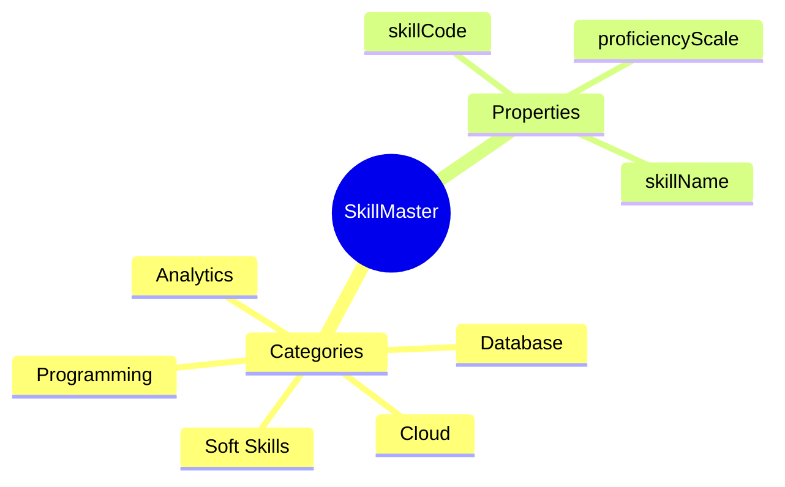
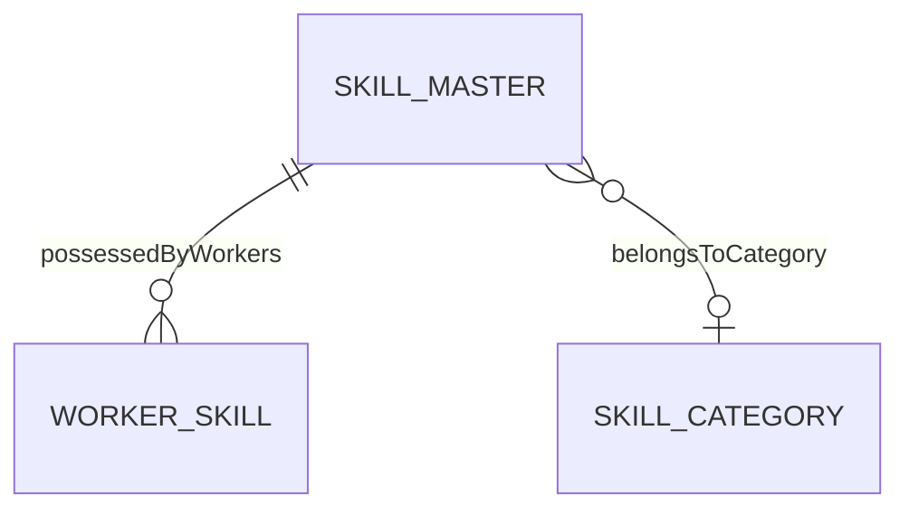
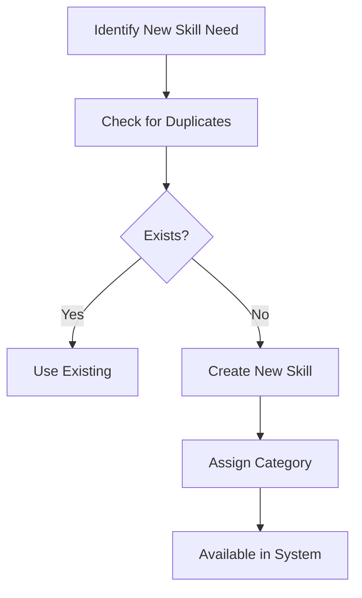

# SkillMaster

## Overview

**SkillMaster** is the catalog of skills available in the organization - technical capabilities like programming languages, tools, and professional certifications. This is the single source of truth for skill definitions, ensuring consistent skill tracking across [[WorkerSkill]] records.

## Business Context

### Key Stakeholders
- **HR/L&D**: Maintains skill catalog
- **Employee**: Selects skills from catalog
- **Manager**: Uses for team skill assessment
- **Talent Analytics**: Reports on skill distribution

### Business Processes
This entity is central to:
- **Skill Tracking**: Foundation for [[WorkerSkill]]
- **Skills Gap Analysis**: Available vs needed skills
- **Training Catalog**: Links skills to courses
- **Job Requirements**: Skills needed for [[Job]]

### Business Value
A well-maintained skill catalog enables consistent skill tracking, meaningful analytics, and effective talent development.

## Attributes Guide

### Identification
- **skillCode**: Machine-readable identifier. Format: SKL-JAVA, SKL-AWS-SA.
- **skillName**: Human-readable name. e.g., "Java", "AWS Solutions Architect".

### Classification
- **categoryId**: Skill category for grouping:
  - *Programming*: Languages, frameworks
  - *Cloud*: AWS, GCP, Azure
  - *Database*: SQL, NoSQL
  - *Soft Skills*: Communication, Leadership

### Assessment
- **proficiencyScaleCode**: Which proficiency scale to use. Default 1-5.

## Relationships Explained

### Worker Skills
- **possessedByWorkers** → [[WorkerSkill]]: All workers who have this skill. Used for skill availability reports.

### Category
- **belongsToCategory** → SkillCategory: For organizing skill catalog.

## Lifecycle & Workflows

### State Definitions

| State | Business Meaning | System Impact |
|-------|------------------|---------------|
| **active** | Available for selection | Can be added to profiles |
| **inactive** | Deprecated/obsolete | Hidden from selection |

### Skill Catalog Management

## Actions & Operations

### create
**Who**: HR/L&D Admin  
**When**: New skill needed in catalog  
**Required**: skillCode, skillName, effectiveStartDate  
**Process**:
1. Verify no duplicate exists
2. Assign category
3. Create in active state

### merge
**Who**: HR/L&D Admin  
**When**: Consolidating duplicate skills  
**Process**:
1. Identify target skill
2. Move all WorkerSkill records to target
3. Deactivate source skill

## Business Rules

### Data Integrity

#### Unique Code (uniqueCode)
**Rule**: Skill code must be unique.  
**Reason**: Master identifier.  
**Violation**: System prevents save.

### Retention

#### Retain If Used (retainIfUsed)
**Rule**: Skills with active WorkerSkill cannot be deleted.  
**Reason**: Preserves worker skill history.  
**Implementation**: Only mark inactive, not delete.

## Examples

### Example 1: Programming Skill
- **skillCode**: SKL-JAVA
- **skillName**: Java
- **categoryId**: CAT-PROGRAMMING
- **proficiencyScaleCode**: SCALE-5

### Example 2: Cloud Certification
- **skillCode**: SKL-AWS-SAA
- **skillName**: AWS Solutions Architect Associate
- **categoryId**: CAT-CLOUD

## Related Entities

| Entity | Relationship | Description |
|--------|--------------|-------------|
| [[WorkerSkill]] | possessedByWorkers | Skill instances |
