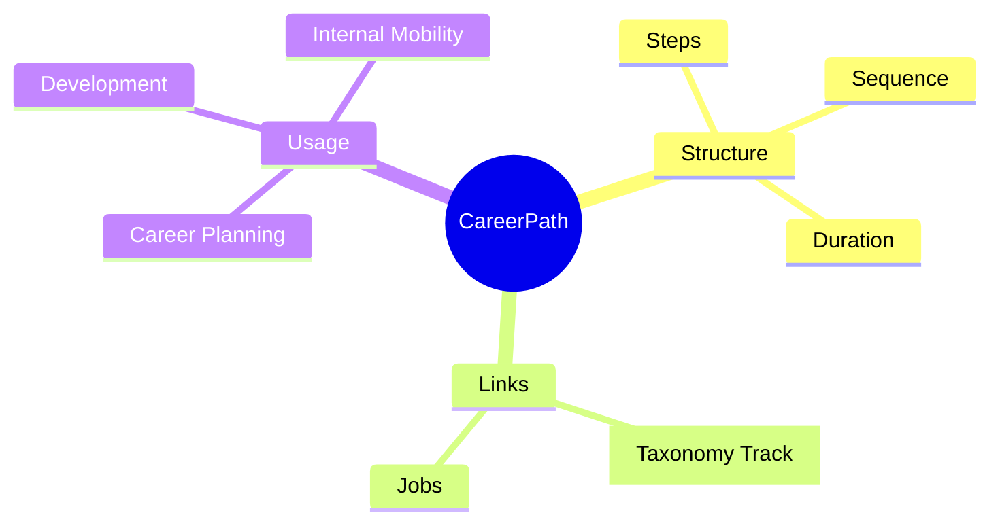
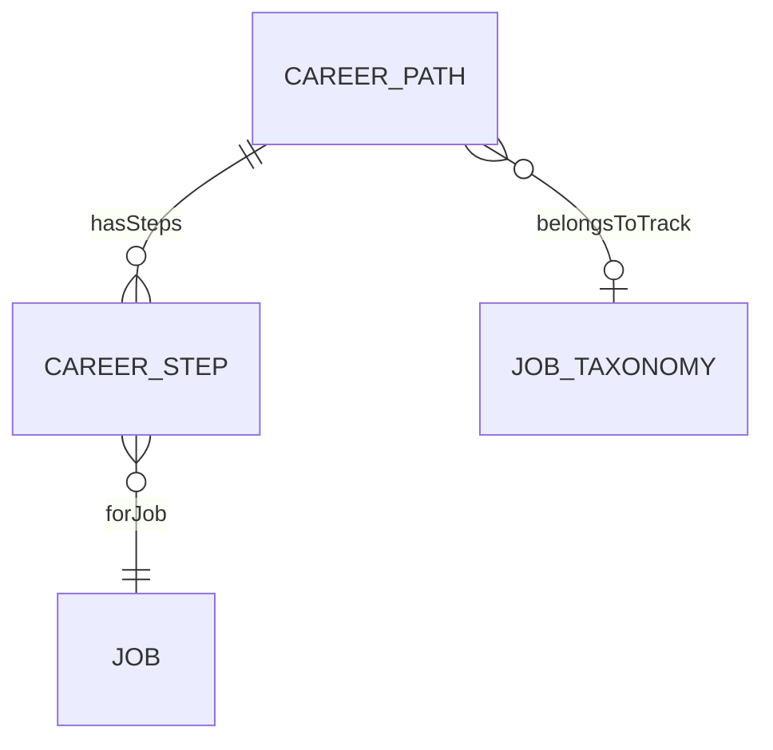
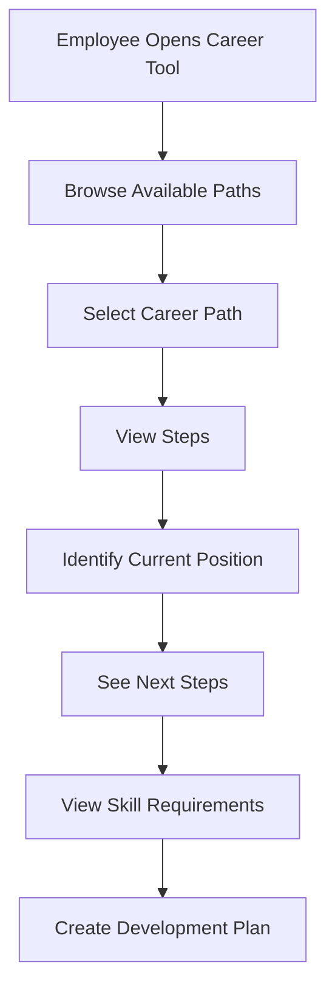

# CareerPath

## Overview

A **CareerPath** defines a recommended job progression route - a sequence of jobs that represent a logical career development journey. Career paths help employees visualize growth opportunities and guide development planning. Each path contains [[CareerStep]]s that reference [[Job]]s.

## Business Context

### Key Stakeholders
- **HR/L&D**: Designs and maintains career paths
- **Employee**: Explores growth options
- **Manager**: Guides career conversations
- **Talent Mgmt**: Internal mobility insights

### Business Processes
This entity is central to:
- **Career Planning**: Employee self-service exploration
- **Development Planning**: Skill gap identification
- **Internal Mobility**: Promotion pipelines
- **Succession Planning**: Talent pipeline visibility

### Business Value
Clear career paths improve employee engagement, reduce unwanted turnover, and enable proactive talent development.

## Attributes Guide

### Identification
- **code**: Unique identifier. Format: PATH-ENG-BE.
- **name**: Display name. e.g., "Backend Engineering Career Path".
- **trackTaxonomyId**: Links to [[JobTaxonomy]] Track for categorization.

### Description
- **description**: Full path overview and purpose.
- **targetAudience**: Who should consider this path.
- **estimatedDurationMonths**: Typical time to complete path.

## Relationships Explained

### Steps
- **hasSteps** → [[CareerStep]]: Ordered sequence of jobs in path. Each step references a [[Job]].

### Track
- **belongsToTrack** → [[JobTaxonomy]]: Categorization for filtering (Engineering Track, Sales Track).

## Lifecycle & Workflows

### State Definitions

| State | Business Meaning | System Impact |
|-------|------------------|---------------|
| **draft** | Being designed | Not visible to employees |
| **active** | Available for use | Shown in career tools |
| **inactive** | Retired | Hidden from selection |

### Career Path Usage Flow

## Actions & Operations

### create
**Who**: HR/L&D  
**When**: New career path needed  
**Required**: code, name, effectiveStartDate  
**Process**:
1. Define path purpose
2. Optionally link to track
3. Create in draft state

### addStep
**Who**: HR/L&D  
**When**: Building path sequence  
**Process**:
1. Select job for step
2. Set seq_no
3. Define min_time_months

### activate
**Who**: HR/L&D with approval  
**When**: Path ready for employees  
**Process**:
1. Verify at least 2 steps
2. Verify step sequence valid
3. Transition to active

## Business Rules

### Data Integrity

#### Unique Code (uniqueCode)
**Rule**: Path code must be unique.  
**Reason**: Master identifier.  
**Violation**: System prevents save.

#### Valid Sequence (validStepSequence)
**Rule**: Steps must have sequential seq_no (1, 2, 3...).  
**Reason**: Ensures clear progression.  
**Violation**: Warning on gaps.

## Examples

### Example 1: Backend Engineering Path
- **code**: PATH-ENG-BE
- **name**: Backend Engineering Career Path
- **estimatedDurationMonths**: 60
- **Steps**:
  1. Junior Backend Developer (min 12 months)
  2. Backend Developer (min 24 months)
  3. Senior Backend Developer (min 24 months)
  4. Lead Backend Developer

## Related Entities

| Entity | Relationship | Description |
|--------|--------------|-------------|
| [[CareerStep]] | hasSteps | Path steps |
| [[JobTaxonomy]] | belongsToTrack | Track category |
| [[Job]] | viaSteps | Jobs in path |
