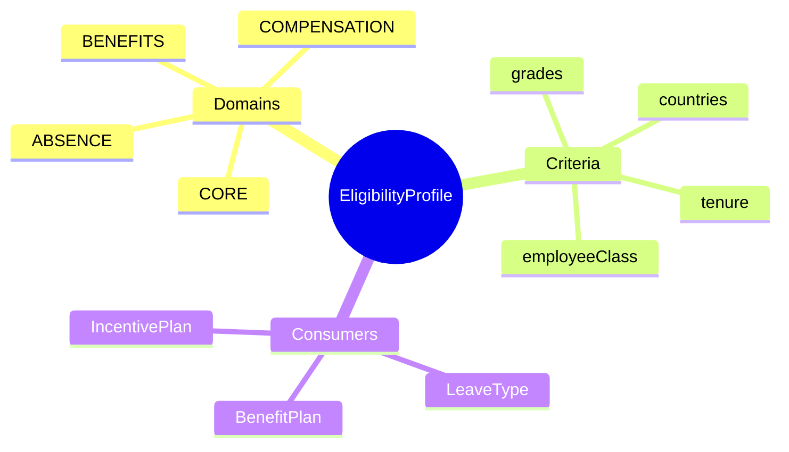
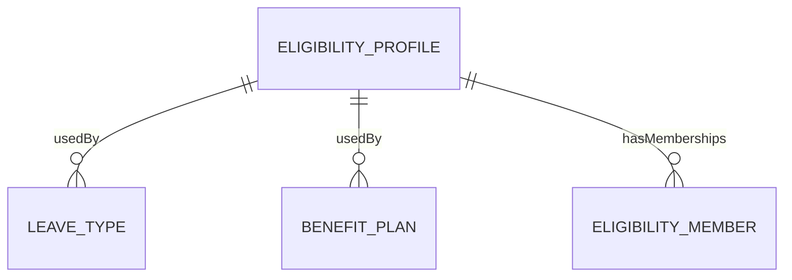
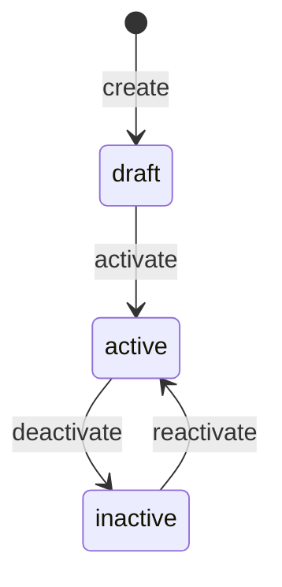
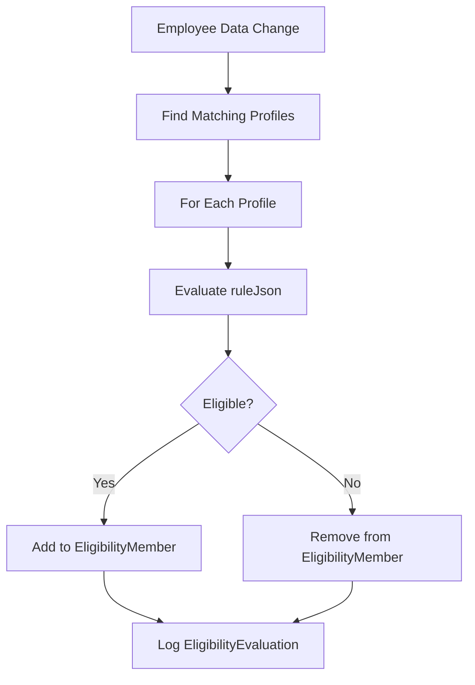

# EligibilityProfile

## Overview

An **EligibilityProfile** defines WHO is eligible for something based on organizational criteria. This is a cross-module entity - the same profile can determine eligibility for leave types (TA), benefit plans (TR), and more. The profile defines rules; consuming entities (LeaveType, BenefitPlan) reference the profile.



## Business Context

### Key Stakeholders
- **HR Policy**: Defines eligibility rules
- **Benefits Admin**: Uses for benefit plan eligibility
- **Leave Admin**: Uses for leave type eligibility
- **Payroll**: Uses for compensation eligibility

### Business Processes
This entity is central to:
- **Leave Management**: Who can use which leave types
- **Benefits Enrollment**: Who can enroll in which plans
- **Compensation**: Who qualifies for bonuses/raises
- **Policy Enforcement**: Consistent rule application

### Business Value
Centralized eligibility definitions ensure consistent policy application across HR modules, reduce duplication, and simplify compliance management.

## Attributes Guide

### Identification
- **code**: Unique identifier. Format: ELIG-SENIOR-VN.
- **name**: Display name. e.g., "Senior Staff Vietnam".
- **domain**: Which module primarily uses this:
  - *ABSENCE*: Leave types, time off
  - *BENEFITS*: Insurance, allowances
  - *COMPENSATION*: Salary, bonuses
  - *CORE*: Cross-cutting eligibility

### Eligibility Rules (ruleJson)
Dynamic criteria in JSON format:
```json
{
  "grades": ["G4", "G5", "G6"],
  "countries": ["VN"],
  "min_tenure_months": 12,
  "employee_class": ["PERMANENT"],
  "exclude_probation": true
}
```

Supported criteria:
- **grades**: Job grades eligible
- **countries**: Country codes
- **min_tenure_months**: Minimum employment tenure
- **employee_class**: PERMANENT, CONTRACT, PROBATION
- **business_units**: Specific BU codes
- **job_families**: Job family codes

### Priority
- **priority**: Lower = higher priority. Used when multiple profiles match.

## Relationships Explained



### Consumer Entities
Various entities reference EligibilityProfile:
- [[LeaveType]] → eligibility (from TA module)
- [[BenefitPlan]] → eligibility (from TR module)
- [[IncentivePlan]] → eligibility (from TR module)

### Cached Memberships
- **hasMemberships** → EligibilityMember: Pre-computed list of eligible employees. Updated when employee data or profile rules change.

## Lifecycle & Workflows

### State Definitions

| State | Business Meaning | System Impact |
|-------|------------------|---------------|
| **draft** | Being defined | Cannot be used |
| **active** | In use | Evaluations run |
| **inactive** | Retired | No new evaluations |

### State Diagram



### Eligibility Evaluation Flow



### Hybrid Model (Default + Override)
1. **Default**: System evaluates rules automatically
2. **Override**: HR can manually add/remove employees

## Actions & Operations

### create
**Who**: HR Policy  
**When**: New eligibility criteria needed  
**Required**: code, name, domain, ruleJson, effectiveStartDate  
**Process**:
1. Define criteria in ruleJson
2. Set domain for categorization
3. Create in draft state

### activate
**Who**: HR Policy with approval  
**When**: Profile ready for use  
**Process**:
1. Validate ruleJson syntax
2. Run initial evaluation
3. Transition to active

### evaluate
**Who**: System (triggered by employee change)  
**When**: Employee data changes (hire, transfer, grade change)  
**Process**:
1. Compare employee against ruleJson
2. Update EligibilityMember (add/remove)
3. Log evaluation result

### bulkEvaluate
**Who**: System (scheduled or manual)  
**When**: Profile rules change  
**Process**:
1. Re-evaluate all employees
2. Update EligibilityMember cache
3. Log all evaluations

## Business Rules

### Data Integrity

#### Unique Code Per Domain (uniqueCodePerDomain)
**Rule**: Code unique within domain.  
**Reason**: Allow same code in different domains if needed.  
**Violation**: System prevents save.

#### Valid Rule JSON (validRuleJson)
**Rule**: ruleJson must be parseable and contain valid criteria.  
**Reason**: Ensures evaluation can run.  
**Violation**: System prevents save with error details.

### Business Logic

#### Cross-Module Reuse (crossModuleReuse)
**Rule**: Multiple objects can reference same profile.  
**Reason**: Reduces duplication, ensures consistency.  
**Example**: Same "Senior Staff VN" profile used for leave and benefits.

## Examples

### Example 1: Senior Staff Vietnam
- **code**: ELIG_SENIOR_VN
- **domain**: CORE
- **ruleJson**:
  ```json
  {
    "grades": ["G4", "G5", "G6"],
    "countries": ["VN"],
    "min_tenure_months": 12
  }
  ```

### Example 2: Full-Time Permanent
- **code**: ELIG_FULLTIME_PERM
- **domain**: BENEFITS
- **ruleJson**:
  ```json
  {
    "employee_class": ["PERMANENT"],
    "exclude_probation": true
  }
  ```

## Related Entities

| Entity | Relationship | Description |
|--------|--------------|-------------|
| [[LeaveType]] | usedBy | TA module |
| [[BenefitPlan]] | usedBy | TR module |
| [[EligibilityMember]] | hasMemberships | Cached results |
