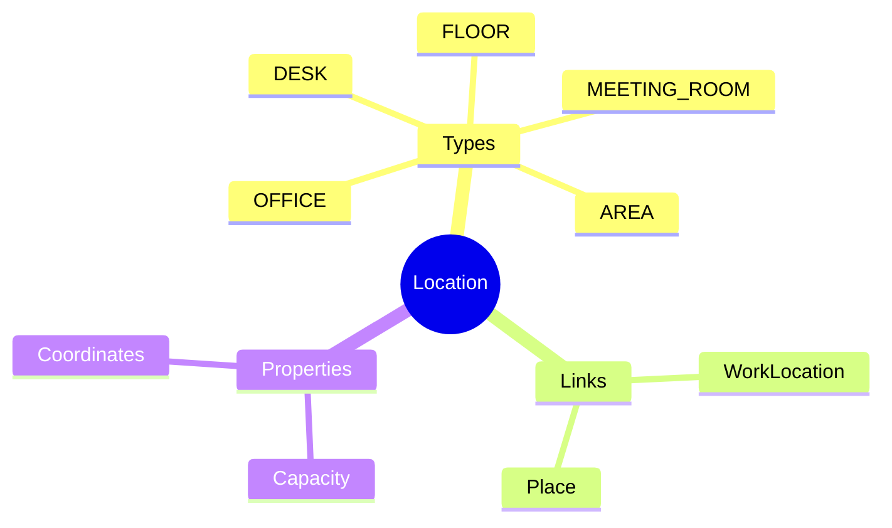
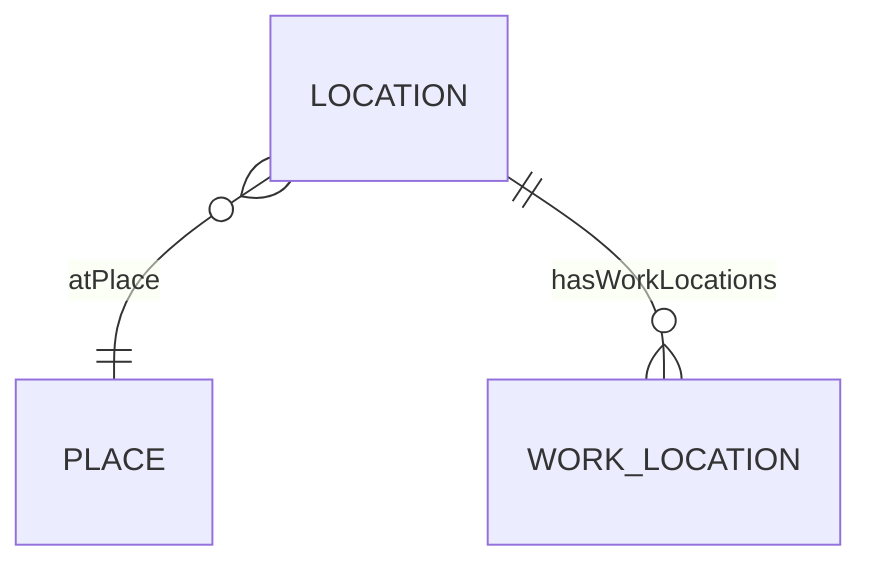

# Location

## Overview

A **Location** represents a specific space within a [[Place]] - floor, office, meeting room, or desk area. Locations provide granular spatial reference for [[WorkLocation]]s and resource management.

## Business Context

### Key Stakeholders
- **Facilities**: Space management
- **IT**: Asset placement
- **HR Admin**: Work location assignment

### Business Processes
- **Space Planning**: Floor/room allocation
- **Hot Desking**: Desk booking
- **Resource Management**: Meeting rooms

### Business Value
Granular location data enables space optimization and hybrid work management.

## Attributes Guide

### Identification
- **code**: Unique identifier. Format: LOC-VT-F10-A.
- **name**: e.g., "Floor 10 - Zone A".
- **locationTypeCode**: FLOOR, OFFICE, MEETING_ROOM, DESK, AREA.

### Spatial
- **capacity**: Max occupancy.
- **latitude/longitude**: For mapping.

## Relationships Explained

### Place
- **atPlace** → [[Place]]: Physical building/site.

### Work Locations
- **hasWorkLocations** → [[WorkLocation]]: HR work locations at this space.

## Lifecycle & Workflows

| State | Meaning |
|-------|---------|
| **active** | Space available |
| **inactive** | Space decommissioned |

## Actions & Operations

### create
**Who**: Facilities  
**Required**: code, name, placeId, locationTypeCode

## Examples

### Example: Office Floor
- **code**: LOC-VT-F10
- **name**: Floor 10
- **locationTypeCode**: FLOOR
- **placeId**: PLC-VN-HCM-VT

## Related Entities

| Entity | Relationship |
|--------|--------------|
| [[Place]] | atPlace |
| [[WorkLocation]] | hasWorkLocations |
