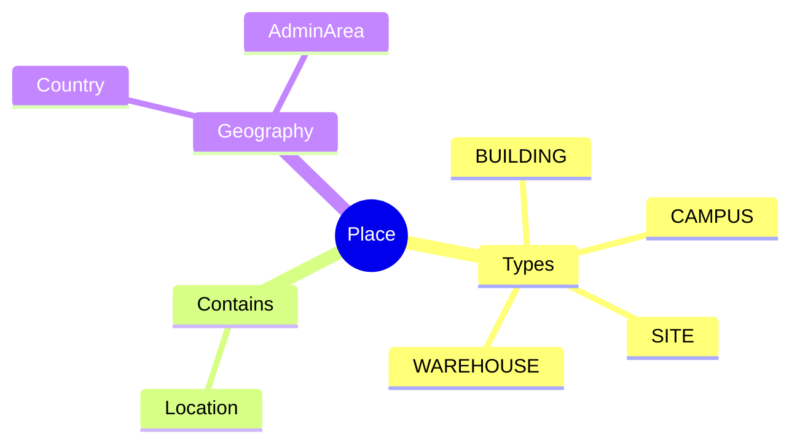
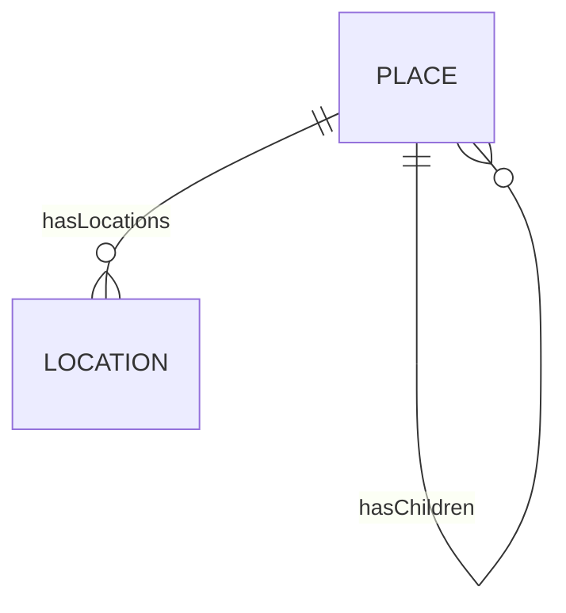

# Place

## Overview

A **Place** represents a physical site - building, campus, or warehouse. Places provide the top-level physical hierarchy, containing [[Location]]s which in turn host [[WorkLocation]]s. This three-tier model enables granular facility management.

## Business Context

### Key Stakeholders
- **Facilities**: Manages physical sites
- **Real Estate**: Lease/property management
- **HR**: Links to work assignments

### Business Processes
- **Facility Management**: Site inventory
- **Space Planning**: Floor/room allocation
- **Address Management**: Physical addresses

### Business Value
Centralized site management enables facility planning and location-based policies.

## Attributes Guide

### Identification
- **code**: Unique identifier. Format: PLC-VN-HCM-VT.
- **name**: e.g., "VNG Tower".
- **placeTypeCode**: BUILDING, CAMPUS, SITE, WAREHOUSE.

### Geography
- **countryCode**: ISO country code.
- **adminAreaId**: Province/city reference.

## Relationships Explained

### Locations
- **hasLocations** → [[Location]]: Specific spaces within place.

### Hierarchy
- **hasChildren** → [[Place]]: Sub-places (building within campus).

## Lifecycle & Workflows

| State | Meaning |
|-------|---------|
| **active** | Site operational |
| **inactive** | Site closed |

## Actions & Operations

### create
**Who**: Facilities  
**Required**: code, name, placeTypeCode, countryCode

## Examples

### Example: Office Building
- **code**: PLC-VN-HCM-VT
- **name**: VNG Tower
- **placeTypeCode**: BUILDING
- **countryCode**: VN

## Related Entities

| Entity | Relationship |
|--------|--------------|
| [[Location]] | hasLocations |
