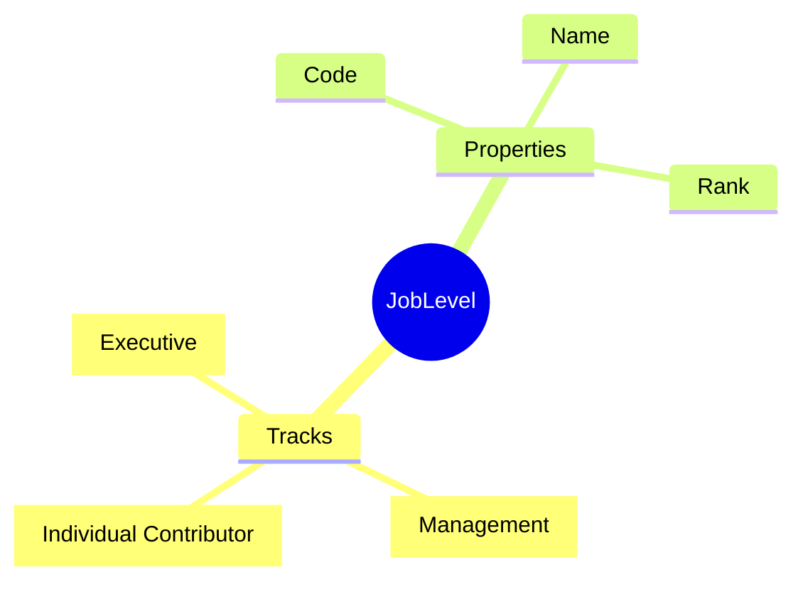

# JobLevel

## Overview

**JobLevel** defines seniority tiers in the job hierarchy - from entry-level to executive. Levels are referenced by [[Job]] to indicate seniority and influence compensation banding. Supports separate Individual Contributor (IC) and Management (MGR) tracks.

## Business Context

### Key Stakeholders
- **HR Compensation**: Defines levels
- **Manager**: Career conversations
- **Employee**: Understands progression

### Business Processes
- **Job Design**: Level assignment
- **Compensation**: Grade mapping
- **Career Pathing**: Level progression

### Business Value
Clear level definitions enable consistent career conversations and transparent progression paths.

## Attributes Guide

### Identification
- **levelCode**: Identifier. Format: IC1, IC2, M1, D1.
- **levelName**: Display name. e.g., "Junior", "Senior", "Lead".

### Classification
- **levelTypeCode**: Track type:
  - *IC*: Individual Contributor
  - *MGR*: Manager/People leader
  - *EXEC*: Executive/C-suite

### Ordering
- **rankOrder**: Numeric order for sorting/comparison.

## Relationships Explained

### Jobs
- **usedByJobs** → [[Job]]: Jobs at this seniority level.

## Lifecycle & Workflows

| State | Meaning |
|-------|---------|
| **active** | In use |
| **inactive** | Deprecated |

## Examples

### Example: IC Developer Track
| levelCode | levelName | rankOrder |
|-----------|-----------|-----------|
| IC1 | Junior | 1 |
| IC2 | Mid-level | 2 |
| IC3 | Senior | 3 |
| IC4 | Staff | 4 |
| IC5 | Principal | 5 |

### Example: Management Track
| levelCode | levelName | rankOrder |
|-----------|-----------|-----------|
| M1 | Team Lead | 10 |
| M2 | Manager | 11 |
| M3 | Senior Manager | 12 |
| D1 | Director | 20 |

## Related Entities

| Entity | Relationship |
|--------|--------------|
| [[Job]] | usedByJobs |
