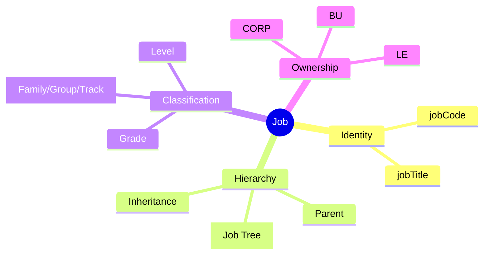
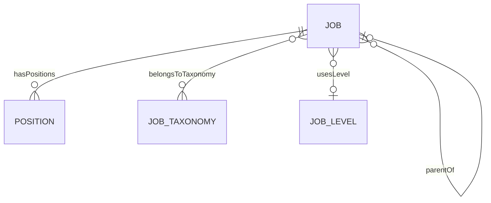
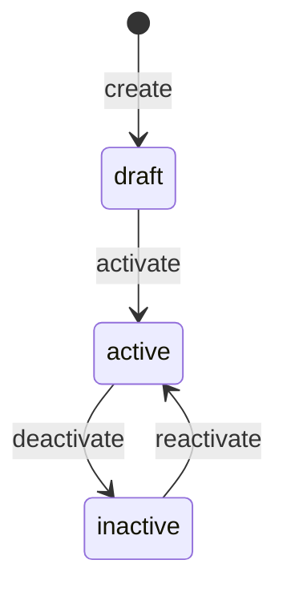
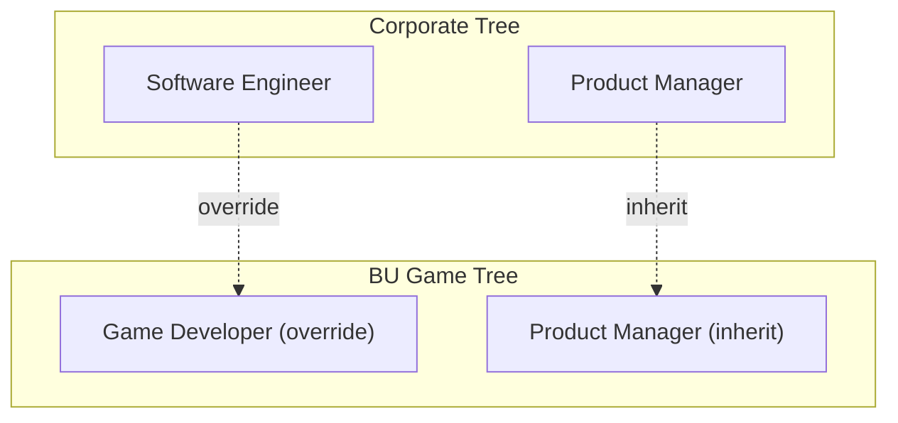

# Job

## Overview

A **Job** defines a standardized role template - responsibilities, requirements, and compensation level. Jobs exist independently of specific positions and employees. Multiple [[Position]]s can reference the same Job. Jobs support multi-tree architecture allowing corporate standards with BU overrides.

## Business Context

### Key Stakeholders
- **HR Compensation**: Defines jobs, sets grades
- **HR Admin**: Creates positions from jobs
- **Manager**: Uses job profiles for hiring, career development
- **Finance**: Uses grade for budget planning

### Business Processes
This entity is central to:
- **Position Creation**: Every Position references a Job
- **Compensation Planning**: Job → Grade → PayRange from [[TR]] module
- **Career Pathing**: Job progressions, taxonomy tracks
- **Reporting**: Headcount by job family, skills gap analysis

### Business Value
Job standardization enables consistent compensation, clear career paths, and accurate workforce planning across the organization.

## Attributes Guide

### Identification
- **jobCode**: Unique identifier within tree. Format: JOB-XXX. Used in reporting, integration.
- **jobTitle**: Human-readable name. Can be overridden at Position level.
- **treeId**: Links to Job Tree (CORP_JOB, BU_GAME_JOB). Enables multi-tree architecture.

### Hierarchy & Inheritance
- **parentId**: Parent job for hierarchical groupings (Job Family → Job).
- **ownerScope**: Who owns this job definition:
  - *CORP*: Corporate standard, applies to all
  - *LE*: Legal Entity specific
  - *BU*: Business Unit specific
- **inheritFlag**: If true, inherits properties from parent tree. If false, fully overrides.

### Classification
- **levelCode**: Seniority level (IC1, IC2, M1, D1). Links to [[JobLevel]].
- **gradeCode**: Compensation grade. Links to [[TR]].GradeVersion for pay ranges.
- **jobTypeCode**: Classification (TECHNICAL, MANAGEMENT, SUPPORT).

### Versioning (SCD-2)
- **effectiveStartDate/End**: Track changes over time.
- **isCurrentFlag**: Only one version is current at any time.

## Relationships Explained

### Position Link
- **hasPositions** → [[Position]]: Positions that use this job template. Job defines the "what", Position defines "where" (which BU, reporting line).

### Taxonomy Classification
- **belongsToTaxonomy** → [[JobTaxonomy]]: Links to Family/Group/Track. One job can belong to multiple taxonomy nodes. Enables flexible reporting (by family, by track).

### Level Reference
- **usesLevel** → [[JobLevel]]: Defines seniority. Used for career progression logic.

## Lifecycle & Workflows

### State Definitions

| State | Business Meaning | System Impact |
|-------|------------------|---------------|
| **draft** | Being defined, not yet usable | Cannot create positions |
| **active** | Available for use | Positions can be created |
| **inactive** | Retired/obsolete | Existing positions remain, no new |

### State Diagram

### Multi-Tree Architecture

## Actions & Operations

### create
**Who**: HR Compensation, HR Admin  
**When**: New job role needed  
**Required**: treeId, jobCode, jobTitle, ownerScope, effectiveStartDate  
**Process**:
1. Verify jobCode unique in tree
2. Create job in draft state
3. Set level/grade if known

### activate
**Who**: HR Compensation (approval required)  
**When**: Job definition complete and approved  
**Process**:
1. Verify grade is set
2. Transition to active
3. Available for position creation

### setGrade
**Who**: HR Compensation  
**When**: Defining or updating compensation tier  
**Process**:
1. Select grade from [[TR]].GradeVersion
2. Update gradeCode
3. Triggers effective date for changes

## Business Rules

### Data Integrity

#### Unique Code (uniqueCodeInTree)
**Rule**: Job code unique within its tree.  
**Reason**: Prevents confusion, enables reliable lookups.  
**Violation**: System prevents save.

#### Version Control (versionControl)
**Rule**: Changes create new SCD-2 version.  
**Reason**: Historical tracking for compensation, compliance.  
**Implementation**: Old version isCurrentFlag=false, new version created.

### Business Logic

#### Grade Requirement (gradeRequired)
**Rule**: Grade should be set before creating positions.  
**Reason**: Positions need grade for compensation planning.  
**Violation**: Warning shown, not blocking.

## Examples

### Example 1: Corporate Standard Job
- **jobCode**: JOB-SWE-SR
- **jobTitle**: Senior Software Engineer
- **treeId**: CORP_JOB
- **ownerScope**: CORP
- **levelCode**: IC3
- **gradeCode**: G5

### Example 2: BU Override Job
- **jobCode**: JOB-GAME-DEV
- **jobTitle**: Game Developer
- **treeId**: BU_GAME_JOB
- **ownerScope**: BU
- **ownerUnitId**: GAME_DIVISION
- **inheritFlag**: false (full override)

## Related Entities

| Entity | Relationship | Description |
|--------|--------------|-------------|
| [[Position]] | hasPositions | Positions using job |
| [[JobTaxonomy]] | belongsToTaxonomy | Classification |
| [[JobLevel]] | usesLevel | Seniority level |
| [[JobProgression]] | from/to | Career paths |
