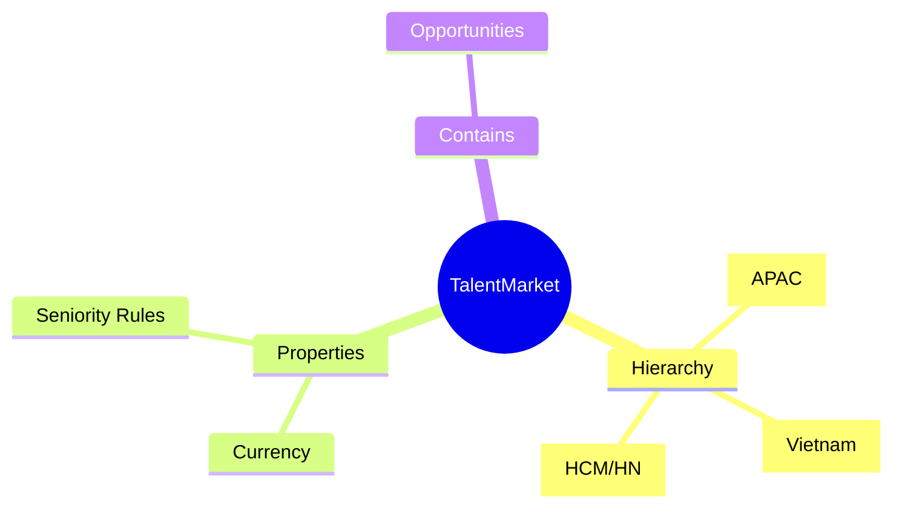
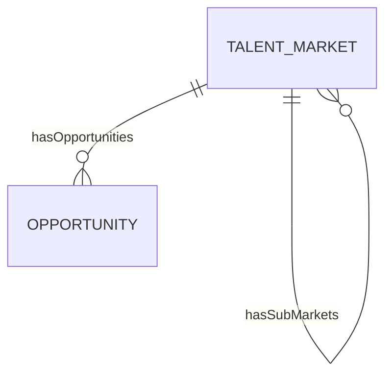

# TalentMarket

## Overview

A **TalentMarket** represents a labor market segment - typically geographic or business-focused - where internal mobility occurs. Markets group [[Opportunity]]s and enable localized talent strategies. They may have hierarchical structure (APAC → Vietnam → HCM).

## Business Context

### Key Stakeholders
- **Talent Management**: Defines market structure
- **HR Policy**: Sets market-specific rules
- **Employee**: Browses opportunities by market
- **Analytics**: Reports by market

### Business Processes
This entity is central to:
- **Internal Mobility**: Filtering opportunities
- **Compensation**: Market-based pay
- **Seniority**: Cross-entity tenure rules

### Business Value
Market segmentation enables targeted talent strategies while maintaining organizational coherence.

## Attributes Guide

### Identification
- **code**: Unique identifier. Format: MKT-VN, MKT-APAC.
- **nameVi/nameEn**: Bilingual names.
- **currencyCode**: Primary currency for this market.

### Hierarchy
- **parentId**: Parent market for grouping.

### Seniority Rules
- **isCumulativeSeniority**: If true, tenure counts across all entities in market.

## Relationships Explained

### Opportunities
- **hasOpportunities** → [[Opportunity]]: Opportunities posted in this market.

### Hierarchy
- **hasSubMarkets** → [[TalentMarket]]: Child markets.

## Lifecycle & Workflows

| State | Meaning |
|-------|---------|
| **active** | Market operating |
| **inactive** | Market closed |

## Actions & Operations

### create
**Who**: Talent Management  
**Required**: code, nameVi, nameEn, currencyCode, effectiveStartDate

## Business Rules

#### Unique Code (uniqueCode)
**Rule**: Market code unique.

## Examples

### Example 1: Vietnam Market
- **code**: MKT-VN
- **nameVi**: Thị trường Việt Nam
- **nameEn**: Vietnam Market
- **currencyCode**: VND

## Related Entities

| Entity | Relationship |
|--------|--------------|
| [[Opportunity]] | hasOpportunities |
