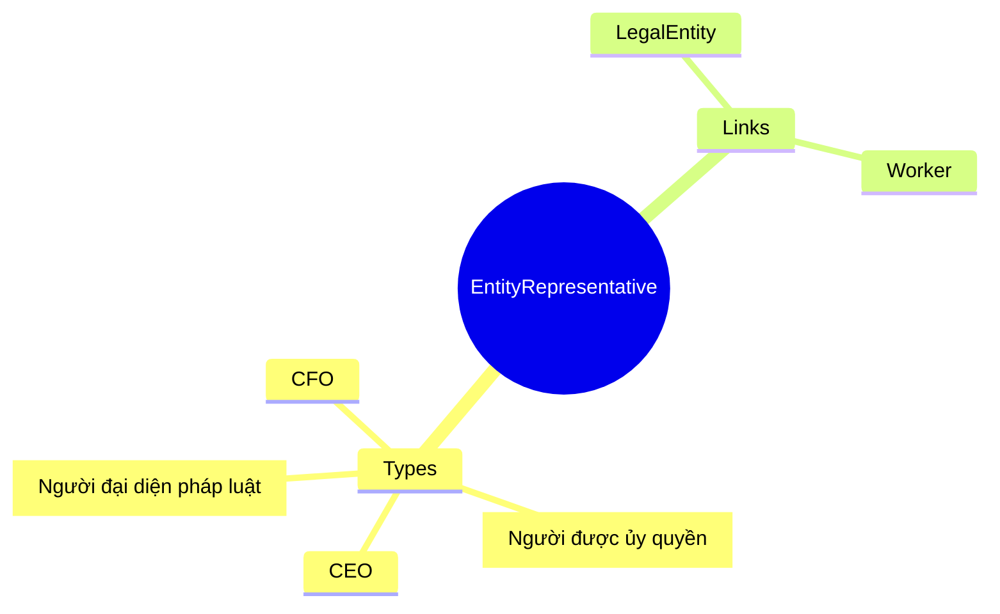
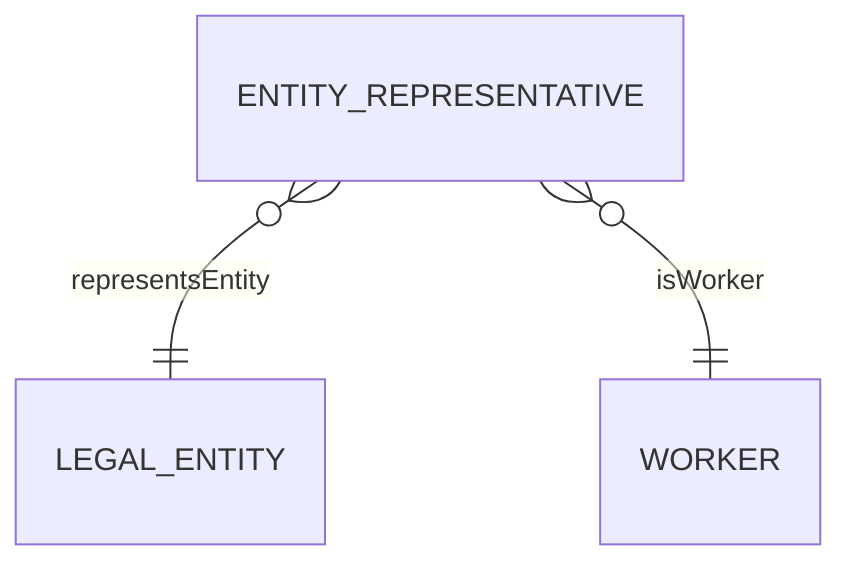

# EntityRepresentative

## Overview

An **EntityRepresentative** represents a person authorized to represent a [[LegalEntity]] - legal representative (Người đại diện theo pháp luật), authorized signatory, or executive role. Critical for contract signing authority and regulatory compliance.

## Business Context

### Key Stakeholders
- **Legal/Compliance**: Manages representatives
- **Executive**: Signing authority
- **Procurement**: Contract approval

### Business Processes
- **Contract Signing**: Authority verification
- **Regulatory Filings**: Representative disclosure
- **Corporate Governance**: Role assignments

### Business Value
Accurate representative tracking ensures valid contracts and regulatory compliance.

## Attributes Guide

### Identification
- **repTypeCode**: Representative role:
  - *LEGAL_REP*: Legal representative per Enterprise Law
  - *AUTH_REP*: Authorized signatory (delegated)
  - *CEO*: Chief Executive
  - *CFO*: Chief Financial

### Documentation
- **documentId**: Authorization/appointment document.
- **effectiveStartDate/EndDate**: Validity period.

## Relationships Explained

### Entity
- **representsEntity** → [[LegalEntity]]: The company represented.

### Person
- **isWorker** → [[Worker]]: The person acting as representative.

## Lifecycle & Workflows

| State | Meaning |
|-------|---------|
| **active** | Currently authorized |
| **inactive** | Authorization ended |

## Actions & Operations

### appoint
**Who**: Legal/Compliance with Board  
**Required**: legalEntityId, repTypeCode, workerId, effectiveStartDate

### revoke
**Who**: Legal/Compliance  
**When**: End of term, resignation, change

## Business Rules

#### One Per Type (uniqueRepPerType)
**Rule**: One active representative per type.

#### Document Required (documentRequired)
**Rule**: LEGAL_REP requires official document.

## Examples

### Example: Legal Representative
- **repTypeCode**: LEGAL_REP
- **legalEntityId**: VNG_CORP
- **workerId**: WRK-CEO
- **effectiveStartDate**: 2020-01-01

## Related Entities

| Entity | Relationship |
|--------|--------------|
| [[LegalEntity]] | representsEntity |
| [[Worker]] | isWorker |
