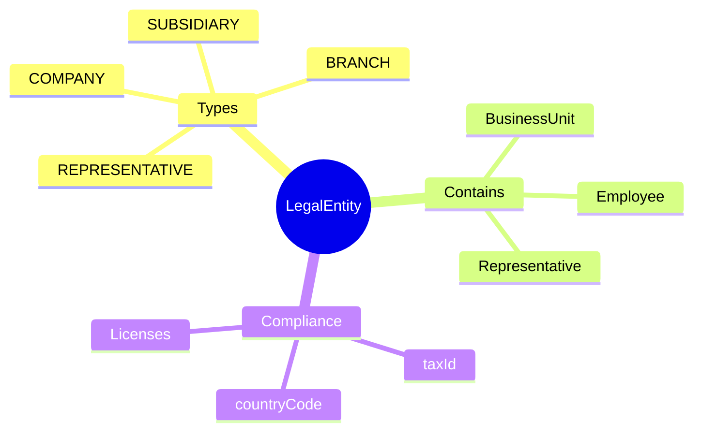
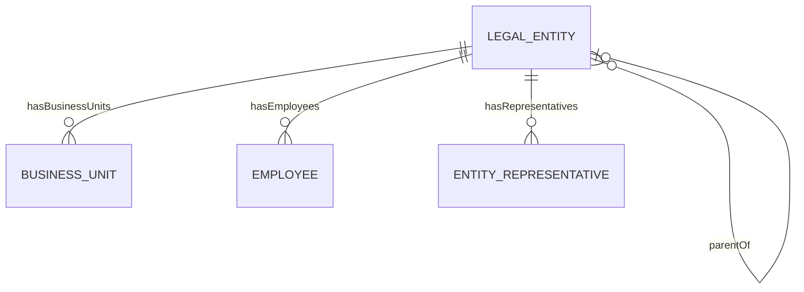
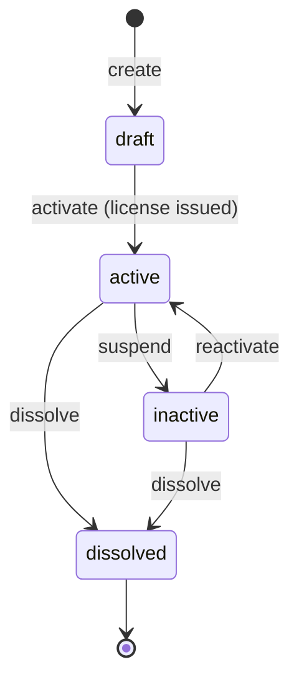
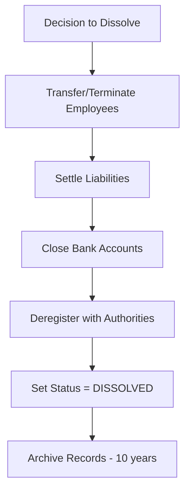

# LegalEntity

## Overview

A **LegalEntity** represents a legally registered organization - company, branch, or subsidiary. This is the fundamental unit for statutory compliance, tax reporting, and employment contracts. All [[Employee]]s are employed by exactly one Legal Entity.

## Business Context

### Key Stakeholders
- **Legal/Compliance**: Manages registrations, licenses
- **Finance**: Uses for statutory reporting, tax filing
- **HR**: Creates employees within entities
- **Executive**: Org structure decisions

### Business Processes
This entity is central to:
- **Employee Contracts**: Every contract tied to Legal Entity
- **Statutory Reporting**: Tax, social insurance by entity
- **Payroll**: Runs per Legal Entity
- **M&A**: Entity creation/dissolution for acquisitions

### Business Value
Legal Entity is the foundational structure for all legal, tax, and compliance requirements. Accurate entity data ensures proper statutory reporting and liability management.

## Attributes Guide

### Identification
- **code**: Internal identifier. Format: VNG_CORP, ZALOPAY. Used in all systems.
- **nameVi / nameEn**: Official registered names. nameVi is per business license.
- **taxId**: Mã số thuế. Critical for tax filings, invoicing.

### Classification
- **typeId**: Legal structure per Vietnam Enterprise Law:
  - *COMPANY*: Công ty mẹ - independent company
  - *BRANCH*: Chi nhánh - branch office
  - *SUBSIDIARY*: Công ty con - separate legal entity
  - *REPRESENTATIVE*: Văn phòng đại diện - no business activity

### Hierarchy
- **parentId**: Parent entity for group structure.
- **path**: Materialized path for efficient hierarchy queries. Format: /VNG/ZALO/ZALOPAY

### Jurisdiction
- **countryCode**: Determines applicable labor law, tax rules, currency.

## Relationships Explained

### Organizational Structure
- **hasBusinessUnits** → [[BusinessUnit]]: Departments, teams within entity. BU = operational structure, Entity = legal structure.

### People
- **hasEmployees** → [[Employee]]: All employment contracts under this entity. Determines tax jurisdiction, labor law applicability.
- **hasRepresentatives** → [[EntityRepresentative]]: Người đại diện theo pháp luật. Required for legal transactions.

## Lifecycle & Workflows

### State Definitions

| State | Business Meaning | System Impact |
|-------|------------------|---------------|
| **draft** | Being established | Cannot employ, no transactions |
| **active** | Fully operational | Normal operations |
| **inactive** | Temporarily suspended | Limited operations |
| **dissolved** | Legally closed | Read-only, archived |

### State Diagram

### Entity Dissolution Flow

## Actions & Operations

### create
**Who**: Legal/Compliance team  
**When**: New company, branch, subsidiary established  
**Required**: code, nameVi, typeId, countryCode, effectiveStartDate  
**Process**:
1. Legal entity registration complete
2. Create record in draft state
3. Add business license, representatives

### activate
**Who**: Legal/Compliance  
**When**: Business license issued, ready for operation  
**Process**:
1. Verify at least one representative
2. Verify business license on file
3. Transition to active

### addRepresentative
**Who**: Legal/Compliance  
**When**: Appointing/changing legal representative  
**Process**:
1. Create [[EntityRepresentative]] record
2. Link to Worker (person)
3. Set effective dates

### dissolve
**Who**: Legal/Compliance with executive approval  
**When**: Entity being closed  
**Process**:
1. Verify all employees terminated/transferred
2. Verify all liabilities settled
3. Transition to dissolved
4. Archive for retention period

## Business Rules

### Data Integrity

#### Unique Code (uniqueCode)
**Rule**: Entity code globally unique.  
**Reason**: Master identifier for integrations.  
**Violation**: System prevents save.

#### Unique Tax ID (uniqueTaxId)
**Rule**: Tax ID unique within country.  
**Reason**: Tax authority requirement.  
**Violation**: System prevents save.

### Compliance

#### Representative Required (representativeRequired)
**Rule**: Active entity must have legal representative.  
**Reason**: Vietnam Enterprise Law requirement.  
**Violation**: Warning shown; cannot sign contracts.

#### Data Retention (dataRetention)
**Rule**: Records retained 10+ years after dissolution.  
**Reason**: Tax audit, legal requirements.  
**Implementation**: Archived, accessible to Legal only.

## Examples

### Example 1: Parent Company
- **code**: VNG_CORP
- **nameVi**: Công ty Cổ phần VNG
- **typeId**: COMPANY
- **countryCode**: VN
- **parentId**: null (top level)

### Example 2: Subsidiary
- **code**: ZALOPAY
- **nameVi**: Công ty TNHH ZaloPay
- **typeId**: SUBSIDIARY
- **parentId**: VNG_CORP

## Related Entities

| Entity | Relationship | Description |
|--------|--------------|-------------|
| [[BusinessUnit]] | hasBusinessUnits | Operational units |
| [[Employee]] | hasEmployees | Employment records |
| [[EntityRepresentative]] | hasRepresentatives | Legal reps |
