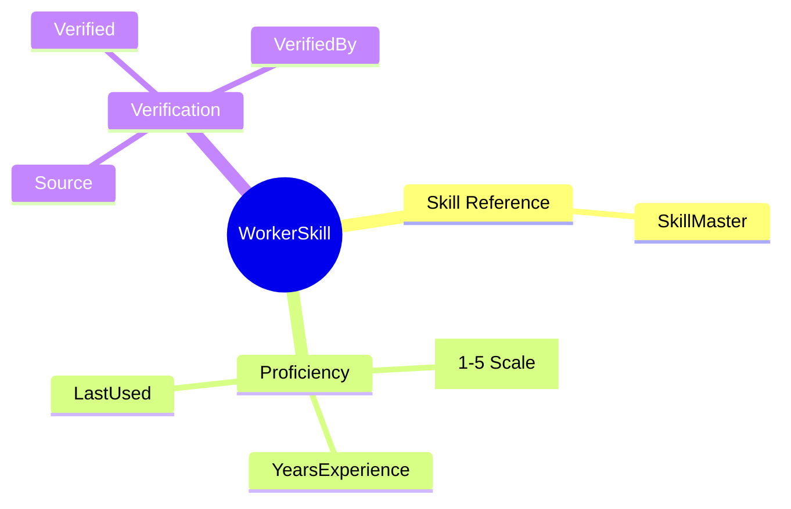
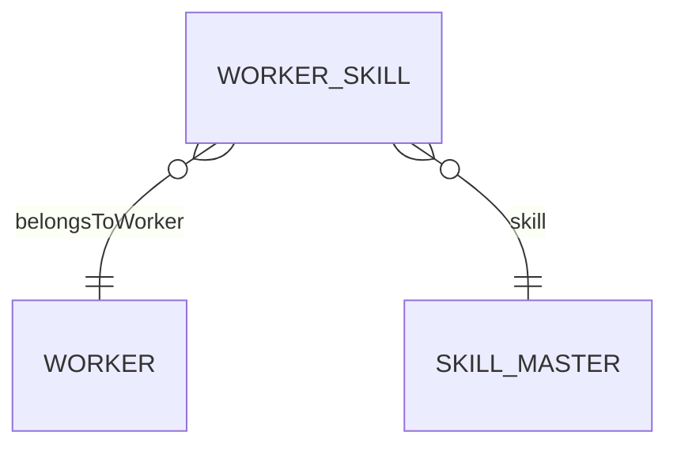
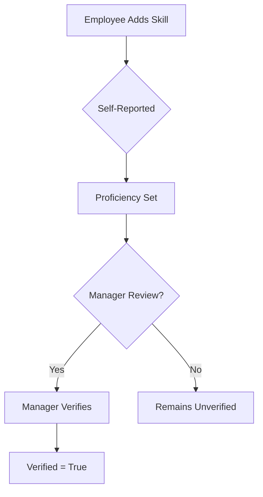

# WorkerSkill

## Overview

A **WorkerSkill** records a worker's proficiency in a specific skill from [[SkillMaster]]. This entity tracks not just possession of a skill, but proficiency level, years of experience, and verification status. Used for project matching, training needs assessment, and career development.

## Business Context

### Key Stakeholders
- **Employee**: Self-reports skills, views skill portfolio
- **Manager**: Reviews/verifies skills, identifies gaps
- **HR/L&D**: Analyzes skills gaps, plans training
- **Project Manager**: Matches skills to project needs

### Business Processes
This entity is central to:
- **Talent Marketplace**: Skill matching for opportunities
- **Training Needs**: Gap analysis
- **Career Planning**: Skill development paths
- **Project Staffing**: Finding right skills for projects

### Business Value
Comprehensive skill tracking enables better resource allocation, targeted learning investments, and career growth visibility.

## Attributes Guide

### Skill Reference
- **skillId**: Links to [[SkillMaster]] catalog entry.
- **workerId**: The [[Worker]] who possesses this skill.

### Proficiency Assessment
- **proficiencyLevel**: 1-5 scale:
  - *1 - Beginner*: Basic knowledge, needs guidance
  - *2 - Intermediate*: Can work with some supervision
  - *3 - Advanced*: Works independently
  - *4 - Expert*: Can teach others, handles complex cases
  - *5 - Master*: Industry recognized, thought leader
- **yearsExperience**: Total years using this skill.
- **lastUsedDate**: When skill was last applied. Skills not used in 2+ years may depreciate.

### Source & Verification
- **sourceCode**: How skill was recorded:
  - *SELF*: Employee self-reported
  - *MANAGER*: Manager assessment
  - *CERT*: Certification (auto-import)
  - *ASSESS*: Formal assessment/test
  - *LMS*: Learning system completion
- **verifiedFlag**: Has proficiency been verified by authorized person?

## Relationships Explained

### Worker Link
- **belongsToWorker** → [[Worker]]: The person with this skill. Worker may have many skills.

### Skill Catalog
- **skill** → [[SkillMaster]]: The skill definition from catalog. Provides skill name, category.

## Lifecycle & Workflows

### State Definitions

| State | Business Meaning | System Impact |
|-------|------------------|---------------|
| **active** | Current skill | Included in skill profile |
| **inactive** | Obsolete/removed | Hidden from profile |

### Skill Verification Flow

## Actions & Operations

### add
**Who**: Employee (self), Manager, LMS (auto)  
**When**: New skill acquired or discovered  
**Required**: workerId, skillId, effectiveStartDate  
**Process**:
1. Check if skill already exists for worker
2. Set initial proficiency (default 1 if self-reported)
3. Source = origin of record

### verify
**Who**: Manager, L&D, Assessment system  
**When**: Confirming proficiency claim  
**Process**:
1. Review evidence (project work, test result)
2. Set verifiedFlag = true
3. Record verifier and date

### updateProficiency
**Who**: Employee, Manager, Assessment  
**When**: Proficiency changes (improvement or depreciation)  
**Process**:
1. Update proficiencyLevel
2. Update lastUsedDate if active use

## Business Rules

### Data Integrity

#### One Skill Per Worker (uniqueSkillPerWorker)
**Rule**: Only one active skill record per worker-skill combination.  
**Reason**: Prevents duplicate claims.  
**Violation**: System prompts to update existing record.

#### Valid Proficiency (proficiencyRange)
**Rule**: Proficiency must be 1-5.  
**Reason**: Standardized scale.  
**Violation**: System prevents save.

## Examples

### Example 1: Self-Reported Java Skill
- **workerId**: WRK-00042
- **skillId**: SKL-JAVA
- **proficiencyLevel**: 3 (Advanced)
- **yearsExperience**: 5
- **sourceCode**: SELF
- **verifiedFlag**: false

### Example 2: Certified AWS Skill
- **workerId**: WRK-00042
- **skillId**: SKL-AWS
- **proficiencyLevel**: 4 (Expert)
- **sourceCode**: CERT
- **verifiedFlag**: true
- **verifiedDate**: 2024-01-15

## Related Entities

| Entity | Relationship | Description |
|--------|--------------|-------------|
| [[Worker]] | belongsToWorker | Skill owner |
| [[SkillMaster]] | skill | Skill definition |
