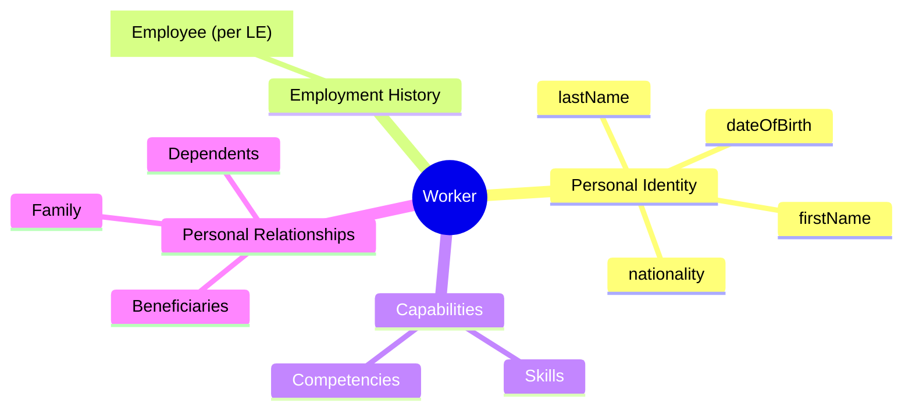
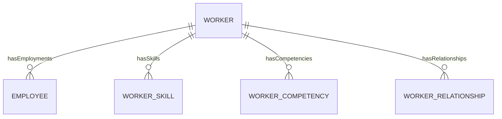

# Worker

## Overview

A **Worker** represents the lifetime identity of a person who has (or had) any work relationship with the organization. This entity stores permanent personal information that doesn't change with employment - name, DOB, nationality. One Worker can have multiple [[Employee]] records across different Legal Entities.

## Business Context

### Key Stakeholders
- **Recruiter**: Creates Worker during candidate conversion
- **HR Admin**: Manages personal information updates
- **Employee (Self)**: Views/updates own information via self-service
- **Payroll**: Uses for tax identification, banking details

### Business Processes
This entity is central to:
- **Pre-hire**: Worker created before Employee (candidate → worker → employee)
- **Cross-entity Employment**: Same Worker, multiple Employees
- **Alumni Tracking**: Worker persists after all employments end
- **Skill Management**: Career development, project matching

### Business Value
Worker is the single source of truth for person identity across the entire HR ecosystem. Enables accurate people analytics, prevents duplicate records, and supports multi-entity organizations.

## Attributes Guide

### Identity
- **id**: System-generated UUID. Immutable for entire worker lifetime. Used as the master key across all HR systems.
- **firstName / lastName**: Legal name as on government documents. Critical for payroll, contracts, legal compliance.
- **preferredName**: How person prefers to be addressed. Used in communications, org charts, badges.

### Demographics
- **dateOfBirth**: Used for age verification, retirement planning, milestone celebrations.
- **genderCode**: Required for legal/statutory reporting. Values:
  - *M*: Male
  - *F*: Female
  - *OTHER*: Non-binary/prefer not to say
- **nationalityCode**: ISO country code. Determines visa requirements, work permit needs.

### Personal Status
- **maritalStatusCode**: Affects tax deductions (Vietnam PIT), dependent benefits eligibility.

## Relationships Explained

### Employment Records
- **hasEmployments** → [[Employee]]: Each time Worker joins a Legal Entity, an Employee record is created. Worker may have:
  - One active Employee (normal case)
  - Multiple active Employees (concurrent employment in group)
  - Zero active Employees (alumni)

### Capabilities
- **hasSkills** → [[WorkerSkill]]: Technical skills (Java, Python). Used for project matching, training needs, career planning.
- **hasCompetencies** → [[WorkerCompetency]]: Behavioral competencies (Leadership). From performance reviews, 360 feedback.

### Personal Network
- **hasRelationships** → [[WorkerRelationship]]: Family members, dependents, emergency contacts, beneficiaries. Links to another Worker if person is in system.

## Lifecycle & Workflows

### State Definitions

| State | Business Meaning | System Impact |
|-------|------------------|---------------|
| **active** | Has current/potential employment value | Full data maintained, searchable |
| **inactive** | No longer relevant to organization | Data archived, limited access |

### Transition Workflows

#### New Worker Creation
1. Recruiter converts candidate OR HR creates directly
2. System generates immutable ID
3. Worker enters `active` state
4. Ready to create Employee record

#### Worker Deactivation
- Happens automatically after X years with no active employment
- Can be triggered manually for data cleanup
- Worker data retained per retention policy

## Actions & Operations

### create
**Who**: HR Administrators, Recruiters  
**When**: New person joining organization or during candidate conversion  
**Required**: firstName, lastName, dateOfBirth, genderCode, nationalityCode  
**Process**:
1. Check for potential duplicates (name + DOB)
2. Generate immutable ID
3. Create Worker in active state

**Downstream effects**:
- Ready for Employee creation
- Available for skill/competency tracking

### updatePersonalInfo
**Who**: HR Admin, Employee (self-service)  
**When**: Name change (marriage), correction  
**Process**:
1. Validate change request (may require documentation)
2. Update affected fields
3. Audit trail maintained

### addSkill
**Who**: Employee (self), Manager, HR  
**When**: New skill acquired or discovered  
**Process**:
1. Select skill from [[SkillMaster]]
2. Set proficiency level
3. Optionally verify with certification

## Business Rules

### Data Integrity

#### Immutable ID (immutableId)
**Rule**: Worker ID never changes once created.  
**Reason**: Master key for all HR integrations, historical data linkage.  
**Implementation**: ID is read-only after creation.

#### Age Validation (dobValidation)
**Rule**: Worker must be at least 15 years old (Vietnam law).  
**Reason**: Child labor compliance.  
**Violation**: System prevents save.

### Privacy

#### Personal Data Protection (privacyProtection)
**Rule**: Personal data visible only to authorized roles.  
**Reason**: PDPA/Privacy compliance.  
**Implementation**: Field-level security, audit logging on access.

## Examples

### Example 1: Standard Worker
- **id**: 550e8400-e29b-41d4-a716-446655440000
- **firstName**: Nguyễn
- **lastName**: Văn A
- **preferredName**: Anh (A)
- **dateOfBirth**: 1990-05-15
- **genderCode**: M
- **nationalityCode**: VN

### Example 2: Worker with Multiple Employments
- Same Worker ID
- Employee 1: VNG Corp (2018-2022, terminated)
- Employee 2: ZaloPay (2022-present, active)

## Related Entities

| Entity | Relationship | Description |
|--------|--------------|-------------|
| [[Employee]] | hasEmployments | Employment records |
| [[WorkerSkill]] | hasSkills | Technical skills |
| [[WorkerCompetency]] | hasCompetencies | Behavioral skills |
| [[WorkerRelationship]] | hasRelationships | Family/dependents |
