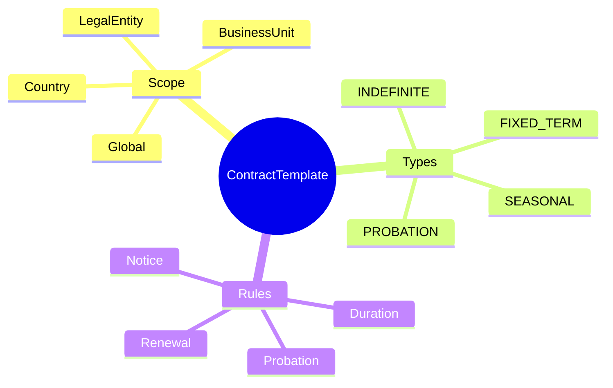
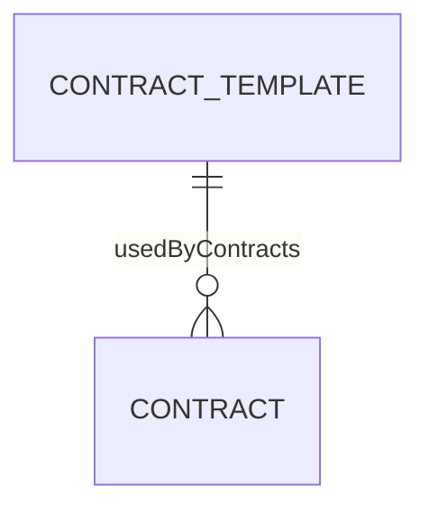
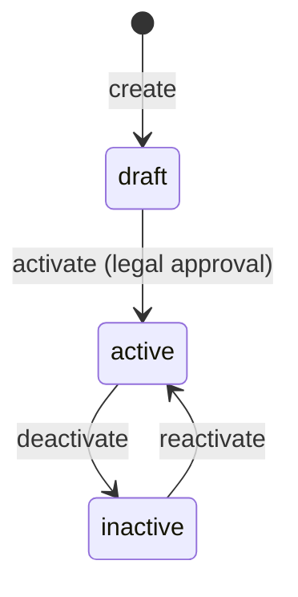
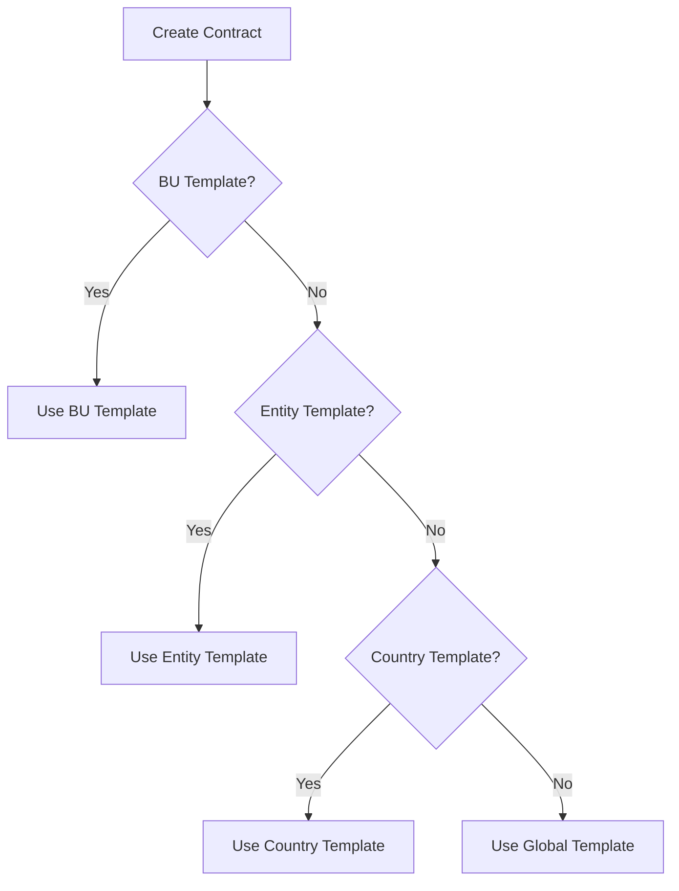

# ContractTemplate

## Overview

A **ContractTemplate** standardizes employment contract terms for consistent hiring. Templates define default values, business rules, and compliance requirements for different contract types and scopes (country, entity, BU). When creating a [[Contract]], the template provides defaults that can be customized.



## Business Context

### Key Stakeholders
- **Legal/Compliance**: Defines template terms, ensures compliance
- **HR Admin**: Uses templates when creating contracts
- **HR Policy**: Sets default rules per scope
- **Audit**: Reviews template usage

### Business Processes
This entity is central to:
- **Contract Creation**: Provides defaults for new contracts
- **Compliance**: Ensures contracts meet legal requirements
- **Standardization**: Consistent terms across organization
- **Localization**: Different rules per country/entity

### Business Value
Templates reduce contract creation time, ensure compliance with local labor laws, and maintain consistency while allowing scope-specific customization.

## Attributes Guide

### Identification
- **templateCode**: Unique identifier. Format: TMPL-VN-INDEF.
- **templateName**: Display name. e.g., "Vietnam INDEFINITE Contract Template".
- **contractTypeCode**: Which contract type this template applies to.

### Scope Hierarchy (Most Specific Wins)
- **countryCode**: Country this applies to. null = all countries.
- **legalEntityCode**: Entity this applies to. null = all entities in country.
- **businessUnitId**: BU this applies to. null = all BUs in entity.

When creating contract, system finds most specific matching template:
1. BU-specific template (highest priority)
2. Entity-specific template
3. Country-specific template
4. Global template (lowest priority)

### Status
- **statusCode**: DRAFT (being prepared), ACTIVE (usable), INACTIVE (retired).
- **isDefault**: If true, auto-selected for matching scope.

### Business Rules (metadata)
```json
{
  "duration": {"default_months": 12, "min_months": 6, "max_months": 36},
  "probation": {"required": true, "duration_days": 60},
  "renewal": {"allowed": true, "max_count": 2, "notice_days": 30},
  "notice_period": {"default_days": 30, "min_days": 15}
}
```

## Relationships Explained



### Contract Usage
- **usedByContracts** → [[Contract]]: All contracts created using this template. Tracked for audit and impact analysis when template changes.

## Lifecycle & Workflows

### State Definitions

| State | Business Meaning | System Impact |
|-------|------------------|---------------|
| **draft** | Being prepared | Cannot be used for contracts |
| **active** | Available for use | Selectable when creating contracts |
| **inactive** | Retired | Cannot be used for new contracts |

### State Diagram



### Template Selection Flow



## Actions & Operations

### create
**Who**: Legal/Compliance, HR Policy  
**When**: New template needed for scope/type  
**Required**: templateCode, templateName, contractTypeCode, effectiveStartDate  
**Process**:
1. Define scope (country/entity/BU or global)
2. Set business rules in metadata
3. Create in draft state
4. Legal review

### activate
**Who**: Legal/Compliance (approval required)  
**When**: Template approved  
**Process**:
1. Verify all required metadata
2. Transition to active
3. Available for contract creation

### setAsDefault
**Who**: HR Policy  
**When**: Designating primary template  
**Process**:
1. Clear isDefault on other templates for same scope+type
2. Set isDefault = true on this template

## Business Rules

### Data Integrity

#### Unique Code (uniqueCode)
**Rule**: Template code globally unique.  
**Reason**: Reference for audits, integrations.  
**Violation**: System prevents save.

### Business Logic

#### One Default Per Scope (oneDefaultPerScope)
**Rule**: One default template per contract type + scope.  
**Reason**: Clear auto-selection logic.  
**Implementation**: System clears other defaults when setting new default.

#### Scope Priority (scopePriority)
**Rule**: More specific scope takes precedence.  
**Reason**: Allows localization while maintaining global standards.  
**Example**: VN-specific overrides Global template.

## Examples

### Example 1: Global INDEFINITE Template
- **templateCode**: TMPL-GLOBAL-INDEF
- **contractTypeCode**: INDEFINITE
- **countryCode**: null (all)
- **legalEntityCode**: null (all)
- **isDefault**: true

### Example 2: Vietnam Fixed-Term Template
- **templateCode**: TMPL-VN-FIXED
- **contractTypeCode**: FIXED_TERM
- **countryCode**: VN
- **metadata**: `{"duration": {"max_months": 36}}`

## Related Entities

| Entity | Relationship | Description |
|--------|--------------|-------------|
| [[Contract]] | usedByContracts | Contracts using template |
