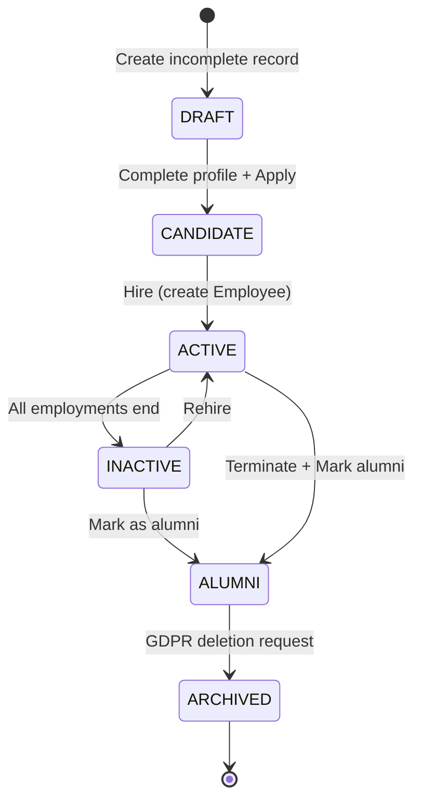

# Worker Management Guide

**Module**: CO (Core HR)  
**Sub-Module**: Person  
**Version**: 1.0.0

---

## Overview

Worker is the central entity in the Person domain, representing any individual who has or had a relationship with the organization. This includes current employees, contractors, candidates, and alumni.

### Key Characteristics

- **Immutable Identity**: Worker ID and date of birth never change
- **Lifecycle Persistence**: Worker record persists from candidate through employment to alumni
- **Multiple Relationships**: One worker can have multiple employment relationships across different legal entities
- **PII Sensitive**: Contains personally identifiable information requiring GDPR compliance

---

## Worker Lifecycle

### States



| State | Description | Determination |
|-------|-------------|---------------|
| **DRAFT** | Incomplete worker record | Missing required fields |
| **CANDIDATE** | Has application, no employment | Has recruiting.application, no employment.employee |
| **ACTIVE** | Has active employment | Has employment.employee with status='ACTIVE' |
| **INACTIVE** | No active employment, not alumni | Has employment history but all ended |
| **ALUMNI** | Former worker, retained for talent pool | All employments ended, marked as alumni |
| **ARCHIVED** | Soft deleted (GDPR) | PII anonymized, ID preserved |

### State Transitions

**DRAFT → CANDIDATE**:
- Complete all required fields
- Submit job application

**CANDIDATE → ACTIVE**:
- Hire via `HireEmployee` workflow
- Creates Employee record linked to Worker

**ACTIVE → INACTIVE**:
- All employment relationships end
- Worker record retained

**INACTIVE/ACTIVE → ALUMNI**:
- Mark worker as alumni for talent pool
- Enables alumni programs and rehire tracking

**ALUMNI → ARCHIVED**:
- Worker requests data deletion (GDPR)
- PII fields anonymized, ID preserved for referential integrity

---

## Core Concepts

### Worker vs Employee

| Aspect | Worker | Employee |
|--------|--------|----------|
| **Definition** | Person (individual) | Employment relationship |
| **Scope** | Organization-wide | Legal entity specific |
| **Lifecycle** | Candidate → Alumni | Hire → Terminate |
| **Cardinality** | 1 per person | N per worker (multi-entity) |
| **Data** | Personal info (name, DOB) | Employment info (hire date, status) |

**Example**:
- John Doe is a **Worker** (ID: 550e8400...)
- John has 2 **Employee** records:
  - Employee #1 at VNG Corp (ACTIVE)
  - Employee #2 at VNG Games (TERMINATED)

### Personal Data Structure

Worker owns all personal data through child entities:

```
Worker (AGGREGATE_ROOT)
├── Contact (1:N)
│   ├── Mobile: +84 90 123 4567
│   ├── Work Email: john.doe@company.com
│   └── Personal Email: john@gmail.com
├── Address (1:N)
│   ├── Home: 123 Main St, HCMC
│   └── Work: Office Tower, District 1
├── Document (1:N)
│   ├── National ID: 079090001234
│   └── Passport: N1234567
├── BankAccount (1:N)
│   └── Vietcombank: 0123456789 (primary)
├── WorkerRelationship (1:N)
│   ├── Spouse: Jane Doe
│   └── Child: Tom Doe (dependent)
├── WorkerQualification (1:N)
│   ├── BSc Computer Science, MIT
│   └── PMP Certification
├── WorkerSkill (1:N)
│   ├── Python (4/5, 5 years)
│   └── Project Management (3/5, 3 years)
├── WorkerCompetency (1:N)
│   ├── Leadership: 4.2/5
│   └── Communication: 3.8/5
└── WorkerInterest (1:N)
    ├── Interest: Data Science roles
    └── Preferred location: Singapore
```

---

## Common Workflows

### 1. Create Worker (Onboarding)

**Actors**: HR Admin, Recruiter

**Steps**:
1. Validate worker data (name, DOB, nationality)
2. Check for potential duplicates
3. Create worker record with generated UUID
4. Emit `WorkerCreated` event

**Business Rules**:
- Worker must be at least 16 years old
- First name and last name are required
- Date of birth is immutable after creation

**Example**:
```yaml
Input:
  first_name: "John"
  last_name: "Doe"
  date_of_birth: "1990-05-15"
  gender_code: "M"
  nationality_code: "VN"

Output:
  worker_id: "550e8400-e29b-41d4-a716-446655440000"
  status: "DRAFT"
```

### 2. Update Worker Profile

**Actors**: Worker (self-service), HR Admin

**Field Permissions**:

| Field | Worker (Self) | HR Admin |
|-------|---------------|----------|
| preferred_name | ✅ Yes | ✅ Yes |
| metadata (avatar, preferences) | ✅ Yes | ✅ Yes |
| marital_status_code | ❌ No | ✅ Yes |
| first_name, last_name | ❌ No | ✅ Yes* |
| date_of_birth | ❌ No | ❌ No** |

*Name changes require special approval workflow  
**DOB is immutable - requires data correction workflow

**Steps**:
1. Load current worker data
2. Check field-level authorization
3. Validate updates
4. Detect actual changes
5. Apply updates if changes exist
6. Create audit log
7. Emit `WorkerUpdated` event

### 3. Delete Worker (GDPR)

**Actors**: HR Admin

**Process**:
1. Verify no active employment
2. Archive complete worker data
3. Anonymize PII fields:
   - first_name → "REDACTED"
   - last_name → "REDACTED"
   - date_of_birth → null
   - metadata → {}
4. Preserve worker ID for referential integrity
5. Create audit log with deletion reason

**Retention**: Archived data retained for 7 years per compliance requirements

---

## Data Quality Rules

### Validation Rules

1. **Age Requirement**:
   - Worker must be at least 16 years old
   - DOB cannot be more than 100 years ago

2. **Name Format**:
   - Names must contain only letters, spaces, hyphens, apostrophes
   - No numbers or special characters

3. **Uniqueness**:
   - Only one primary contact per worker
   - Only one primary address per worker
   - Only one primary bank account per worker

4. **Referential Integrity**:
   - gender_code must exist in code_list(GENDER)
   - nationality_code must exist in country.code_alpha2
   - marital_status_code must exist in code_list(MARITAL_STATUS)

### Data Completeness

**Minimum Required** (DRAFT → CANDIDATE):
- first_name
- last_name
- date_of_birth
- gender_code
- nationality_code

**Recommended for Employment**:
- At least one contact (mobile or email)
- At least one address
- At least one identity document
- At least one bank account (for payroll)

---

## Security & Compliance

### Data Classification

- **PII Sensitive**: All worker data
- **Encryption**: Required for all PII fields
- **Access Control**: Role-based (HR_ADMIN, HR_MANAGER, SELF)

### GDPR Compliance

**Right to Access**:
- Workers can view their own data
- Export personal data in machine-readable format

**Right to Rectification**:
- Workers can update limited fields (preferred_name, metadata)
- HR Admin can update all mutable fields

**Right to be Forgotten**:
- Soft delete with PII anonymization
- Preserve ID for referential integrity
- Archive data for 7 years

**Data Minimization**:
- Collect only necessary personal data
- Metadata field for optional attributes

### Audit Trail

All worker changes are logged:
- Who made the change
- When the change occurred
- What fields changed (before/after values)
- Reason for change (if provided)

---

## Integration Points

### Upstream Dependencies

- **Master Data**: code_list, country, skill_master, competency_master
- **Geographic Data**: admin_area (for addresses)

### Downstream Consumers

- **Employment**: Employee, Contract, Assignment
- **Recruiting**: Application, Candidate
- **Payroll**: Uses worker data for payment processing
- **Total Rewards**: Uses worker data for compensation
- **Talent Marketplace**: Uses skills and interests for matching

---

## Best Practices

### 1. Worker Creation

✅ **DO**:
- Validate data before creation
- Check for duplicates (same name + DOB)
- Generate UUID for worker_id
- Emit WorkerCreated event

❌ **DON'T**:
- Create duplicate workers
- Allow underage workers (< 16 years)
- Skip validation

### 2. Profile Updates

✅ **DO**:
- Use field-level authorization
- Create audit log for all changes
- Detect and skip no-op updates
- Emit WorkerUpdated event

❌ **DON'T**:
- Allow workers to update restricted fields
- Skip change detection
- Forget audit logging

### 3. Data Deletion

✅ **DO**:
- Use soft delete (anonymization)
- Archive data before deletion
- Preserve worker ID
- Document deletion reason

❌ **DON'T**:
- Hard delete worker records
- Delete workers with active employment
- Skip archiving step

---

## Troubleshooting

### Common Issues

**Issue**: Cannot create worker - "Worker must be at least 16 years old"
- **Cause**: date_of_birth is less than 16 years ago
- **Solution**: Verify correct date of birth

**Issue**: Cannot update worker - "You do not have permission"
- **Cause**: Attempting to update restricted field without authorization
- **Solution**: Use HR Admin account or update only allowed fields

**Issue**: Cannot delete worker - "Worker has active employment"
- **Cause**: Worker has employment.employee with status='ACTIVE'
- **Solution**: Terminate all employments first

---

## Related Documents

- [Worker Entity](../00-ontology/domain/01-person/worker.entity.yaml)
- [Create Worker Workflow](../00-ontology/workflows/01-person/create-worker.workflow.yaml)
- [Update Worker Workflow](../00-ontology/workflows/01-person/update-worker-profile.workflow.yaml)
- [Person Glossary](../00-ontology/glossary/person.glossary.yaml)
- [Worker BDD Scenarios](../02-spec/05-BDD/01-person/worker.feature)
