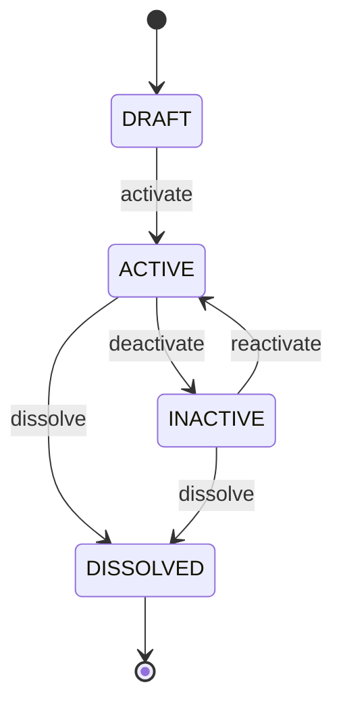

# Legal Entity Guide

**Module**: CO (Core)  
**Sub-Module**: Organization Structure  
**Classification**: AGGREGATE_ROOT

---

## Overview

A **Legal Entity** represents a company, branch, or subsidiary that has legal standing for compliance, tax, and regulatory purposes. Legal entities form the foundation of corporate structure and are essential for:

- Legal compliance and regulatory reporting
- Tax jurisdiction management  
- Contract signing authority
- Financial consolidation
- Corporate governance

---

## Key Concepts

### Legal Entity vs Business Unit

| Aspect | Legal Entity | Business Unit |
|--------|-------------|---------------|
| **Purpose** | Legal/compliance entity | Operational unit |
| **Quantity** | Few (stable) | Many (dynamic) |
| **Changes** | Rare (M&A, restructuring) | Frequent (reorganization) |
| **Examples** | VNG Corporation, VNG Branch HCM | Engineering Dept, Sales Team |

### Hierarchy Structure

Legal entities form a **corporate hierarchy**:

```
VNG Corporation (Root)
├── VNG Branch Ho Chi Minh City
├── VNG Branch Hanoi
└── VNG Subsidiary Singapore
    └── VNG Singapore Branch Malaysia
```

**Key Features**:
- `parent_id`: References parent legal entity
- `path`: Materialized path (e.g., `/vng_hq/vng_branch_hcm/`)
- **Closure Table**: `org_legal.entity_hierarchy` for efficient queries

### Closure Table Benefits

The closure table enables O(1) queries for:
- **Ancestors**: "Find all parent companies"
- **Descendants**: "Find all subsidiaries"
- **Subtree**: "Get entire branch structure"

**Trade-off**: Additional storage and maintenance overhead (acceptable for legal entities due to low volume and stability).

---

## Lifecycle



### States

- **DRAFT**: Being set up, not yet active
- **ACTIVE**: Operational and can be used
- **INACTIVE**: Temporarily inactive (e.g., pending restructuring)
- **DISSOLVED**: Permanently closed (terminal state)

### Transitions

**Activate** (DRAFT → ACTIVE):
- Requires: name_vi, type_id, at least one business license
- Effect: Legal entity becomes operational

**Deactivate** (ACTIVE → INACTIVE):
- Requires: reason
- Effect: Temporarily suspends operations

**Dissolve** (ACTIVE/INACTIVE → DISSOLVED):
- Requires: dissolution date, no active employees, no active business units
- Effect: Permanently closes legal entity

---

## Data Structure

### Core Attributes

| Attribute | Type | Required | Description |
|-----------|------|----------|-------------|
| `id` | UUID | Yes | Unique identifier |
| `code` | String | Yes | Business code (e.g., VNG_HQ) |
| `name_vi` | String | Yes | Vietnamese name |
| `name_en` | String | No | English name |
| `type_id` | UUID | Yes | Entity type (COMPANY, BRANCH, etc.) |
| `parent_id` | UUID | No | Parent legal entity |
| `path` | String | Yes | Hierarchical path |

### Child Entities

**EntityProfile** (1:1):
- Extended information (addresses, contacts, tax ID)
- Logo, legal names, group name
- CEO reference

**EntityRepresentative** (1:N):
- Legal representatives (CEO, authorized signatories)
- Document references (authorization letters)
- Effective dating

**EntityLicense** (1:N):
- Business licenses and permits
- Issue dates, issuing authorities
- Effective dating

**EntityBankAccount** (1:N):
- Corporate bank accounts
- Primary account designation
- Multi-currency support

---

## SCD Type 2 (History Tracking)

Legal entities use **SCD2** to track changes over time:

**Tracked Attributes**:
- `name_vi`, `name_en` (name changes)
- `type_id` (entity type changes)
- `parent_id`, `path` (hierarchy changes)

**How it Works**:
1. Close current record: Set `effective_end_date`, `is_current_flag = false`
2. Create new version: Same `id`, new `effective_start_date`, `is_current_flag = true`
3. Update closure table if hierarchy changed

**Use Cases**:
- M&A tracking
- Corporate restructuring
- Name changes (rebranding)

---

## Common Operations

### Create Legal Entity

```yaml
POST /api/v1/legal-entities
{
  "code": "VNG_BRANCH_DN",
  "name_vi": "Chi nhánh Công ty VNG tại Đà Nẵng",
  "name_en": "VNG Company Branch in Da Nang",
  "type_id": "type-branch-001",
  "parent_id": "vng-hq-id",
  "effective_start_date": "2025-01-01"
}
```

### Update Legal Entity (Name Change)

```yaml
PUT /api/v1/legal-entities/{id}
{
  "updates": {
    "name_vi": "Công ty TNHH VNG Đà Nẵng"
  },
  "effective_date": "2025-06-01",
  "reason": "Changed from branch to limited liability company"
}
```

### Query Hierarchy

```sql
-- Get all ancestors
SELECT a.* FROM legal_entity a
JOIN entity_hierarchy h ON h.ancestor_id = a.id
WHERE h.descendant_id = :legal_entity_id
AND h.depth > 0;

-- Get all descendants
SELECT d.* FROM legal_entity d
JOIN entity_hierarchy h ON h.descendant_id = d.id
WHERE h.ancestor_id = :legal_entity_id
AND h.depth > 0;
```

---

## Business Rules

**BR-ORG-001**: Legal entity code must follow naming convention (uppercase, alphanumeric, underscores, hyphens)

**BR-ORG-002**: Parent entity must be active when creating child entity

**BR-ORG-003**: Hierarchy depth must not exceed 10 levels

**BR-ORG-004**: Cannot delete legal entity with active children, business units, or employees

**BR-ORG-005**: Code cannot be changed after creation (immutable business key)

---

## Security & Compliance

### Access Control

Users can access legal entities based on:
- Role: `LEGAL_ADMIN`, `HR_ADMIN`, `FINANCE_ADMIN`
- Hierarchy: Users can access their legal entity and all descendants

### Sensitive Data

- Tax ID (in profile)
- Registration number (in profile)
- Bank account details

**Protection**: Field-level encryption, audit logging, GDPR compliance

---

## Integration Points

### Downstream Systems

- **Business Units**: Reference legal entity for legal jurisdiction
- **Employees**: Assigned to legal entity for payroll and compliance
- **Contracts**: Signed by legal entity representatives
- **Payroll**: Tax calculations based on legal entity jurisdiction

### Events

- `LegalEntityCreated`: New legal entity registered
- `LegalEntityUpdated`: Legal entity information changed
- `LegalEntityDeleted`: Legal entity dissolved

---

## Best Practices

1. **Keep hierarchy shallow**: Typically 2-4 levels
2. **Use closure table**: For frequent hierarchy queries
3. **Document changes**: Always provide reason for updates
4. **Validate licenses**: Ensure business licenses are current
5. **Plan for M&A**: Use SCD2 to track corporate changes

---

## Industry References

- **SAP SuccessFactors**: Legal Entity Management
- **Workday**: Company Hierarchy
- **Oracle HCM Cloud**: Legal Entities

---

## Related Documentation

- [Entity Definition](../../00-ontology/domain/03-org-structure/legal-entity.aggregate.yaml)
- [Business Rules](../../02-spec/04-BR/BR-03-org-structure.md)
- [BDD Scenarios](../../02-spec/05-BDD/03-org-structure/legal-entity.feature)
