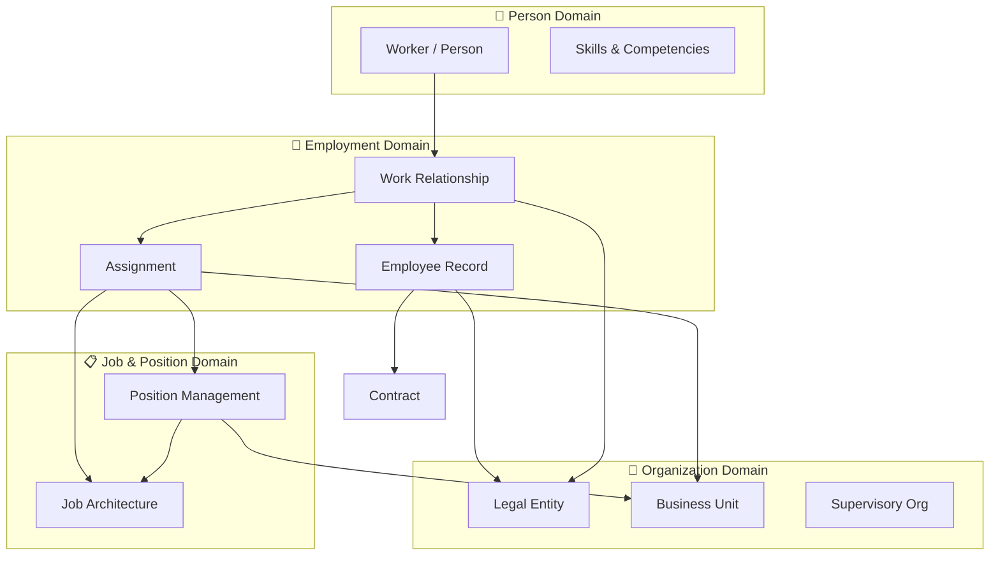
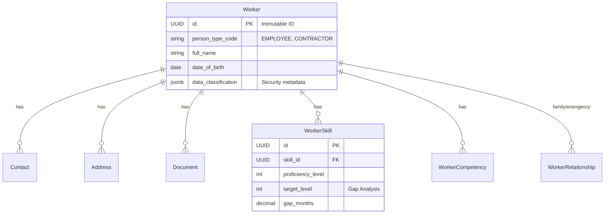
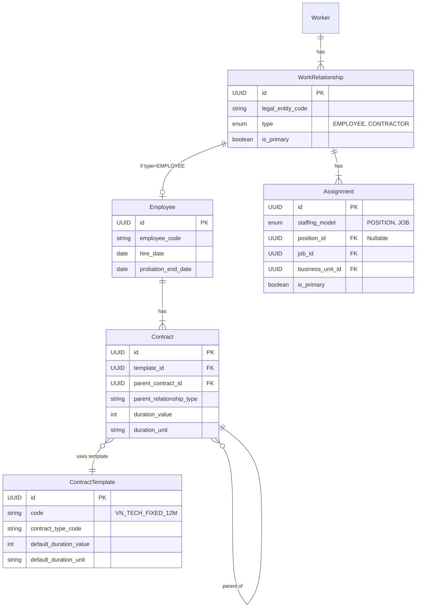
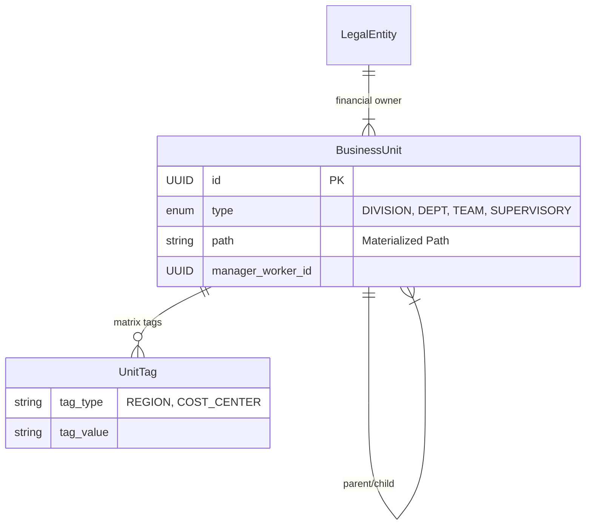
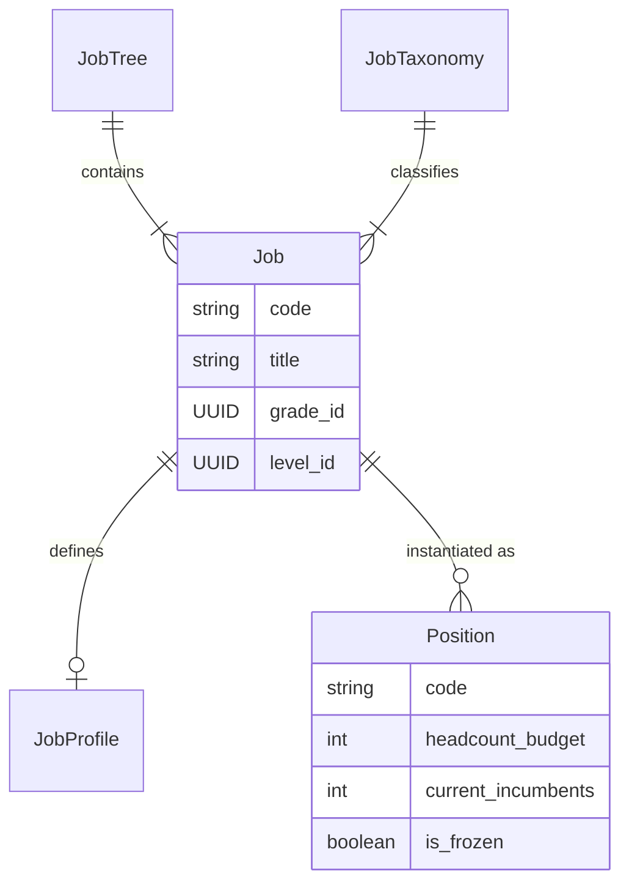

# Core Module - Data Model Guide

**Version**: 2.0  
**Last Updated**: 2025-12-09  
**Module**: Core (CO)

---

## 📚 Overview

The Core Module data model is the foundational backbone of the xTalent HR solution. It is designed to be **enterprise-grade**, **flexible**, and **scalable**, supporting complex organizational structures, global workforces, and dynamic employment relationships.

This guide provides a comprehensive technical deep dive into the entity relationships, schemas, and design patterns used in the Core module. It reflects the **v2.0** ontology which incorporates best practices from leading HR systems (Workday, SAP SuccessFactors, Oracle HCM).

---

## 🏗️ High-Level Architecture

The data model is organized into four primary domains that interact to form the complete HR picture:

---

## 👤 Domain 1: Person (The "Who")

The Person domain manages the individual's identity, independent of their relationship with the organization.

### Entity Relationship Diagram

### Key Entities

| Entity | Description | Key Attributes |
|--------|-------------|----------------|
| **Worker** | The central person entity. Immutable identity throughout lifetime. | `person_type_code`, `data_classification`, `national_id` |
| **Contact** | Phone, Email, Social Media. | `contact_type_code`, `is_primary`, `contact_value` |
| **Address** | Physical addresses (Home, Permanent). | `address_type_code`, `admin_area_id` (Ward/District) |
| **WorkerSkill** | Skills with proficiency and gap analysis. | `proficiency_level`, `target_level`, `gap_months` |
| **Document** | IDs, Passports, Visas, Degrees. | `document_type_code`, `expiry_date`, `file_url` |

### 💡 Deep Dive: Person Types
The `person_type_code` defines the system behavior for the worker:
- **EMPLOYEE**: Full HR features, payroll, benefits.
- **CONTRACTOR**: Limited features, invoicing focus, no payroll.
- **CONTINGENT**: Temporary/Agency workers.
- **NON_WORKER**: Board members, advisors (no employment, just identity).

### 💡 Deep Dive: Skill Gap Analysis (v2.0)
We track not just *current* skills but *target* skills to drive development:
- **Current Proficiency**: What they can do now (1-5).
- **Target Proficiency**: What the job requires (1-5).
- **Gap**: `Target - Current`.
- **Gap Months**: Estimated time to close the gap based on learning velocity.

---

## 💼 Domain 2: Employment (The "Relationship")

The Employment domain manages the relationship between the Person and the Organization. We use a **4-Level Hierarchy** to support complex scenarios.

### Entity Relationship Diagram

### Key Entities

| Entity | Description | Key Attributes |
|--------|-------------|----------------|
| **WorkRelationship** | The overall legal/business relationship. | `type`, `legal_entity_code`, `start_date` |
| **Employee** | Specific employment contract details (only for Employees). | `employee_code`, `hire_date`, `seniority_date` |
| **Assignment** | The actual job being performed in a specific unit. | `staffing_model`, `position_id`, `manager_assignment_id` |
| **ContractTemplate** | Pre-configured contract terms by type/country/unit. | `code`, `default_duration`, `legal_requirements` |
| **Contract** | Legal documents and terms with hierarchy support. | `template_id`, `parent_relationship_type`, `duration` |

### 💡 Deep Dive: The 4-Level Hierarchy
1.  **Worker**: The human.
2.  **WorkRelationship**: "I work for Company A". Can have multiple (e.g., Employee in US, Contractor in UK).
3.  **Employee**: "I have an employment contract with specific terms".
4.  **Assignment**: "I am doing this specific job in this department".

### 💡 Deep Dive: Staffing Models
Defined at the `Assignment` level:
-   **POSITION_BASED**: Strict control. Assignment links to a `Position`. Used for corporate roles.
    -   *Rule*: `position_id` is REQUIRED. `job_id` derived from Position.
-   **JOB_BASED**: Flexible. Assignment links directly to a `Job`. Used for high-volume/contractors.
    -   *Rule*: `position_id` is NULL. `job_id` is REQUIRED.

### 💡 Deep Dive: Contract Templates & Relationships
**ContractTemplate** provides standardized contract configurations:
- **Scope Hierarchy**: Global → Country → Legal Entity → Business Unit
- **Auto-calculation**: Duration, probation period, notice period
- **Compliance**: Country-specific rules (e.g., VN max 36 months for fixed-term)

**Contract Relationships** via `parent_relationship_type`:
- **AMENDMENT**: Modify existing terms (e.g., salary increase)
- **ADDENDUM**: Add new clauses (e.g., add bonus structure)
- **RENEWAL**: Extend contract period (e.g., re-sign for another year)
- **SUPERSESSION**: Replace contract type (e.g., Probation → Permanent)

---

## 🏢 Domain 3: Organization (The "Where")

Separates legal, operational, and supervisory structures.

### Entity Relationship Diagram

### Key Concepts

1.  **Legal Structure**: `LegalEntity` hierarchy. Used for tax, payroll, compliance.
2.  **Operational Structure**: `BusinessUnit` (Division -> Dept -> Team). How work is organized.
3.  **Supervisory Structure**: `BusinessUnit` with `type=SUPERVISORY`. Who reports to whom (approval chains).
    -   *Why?* Often the approval chain (VP -> Director) differs from the operational teams.

### 💡 Deep Dive: Matrix Organizations
We support matrix structures via:
1.  **Dotted Line Reporting**: `Assignment` has `dotted_line_supervisor_id`.
2.  **Unit Tags**: Tagging units with `REGION`, `PROJECT`, or `STRATEGIC_INITIATIVE` to create cross-cutting views.

---

## 📋 Domain 4: Job & Position (The "What")

Manages the catalog of roles and specific seats.

### Entity Relationship Diagram

### Key Concepts

-   **Multi-Tree Architecture**: Separate trees for Corporate vs. Business Unit jobs.
-   **Job Profile**: Detailed requirements (skills, competencies, education).
-   **Position Management**: Tracks headcount, vacancies, and hiring status.

---

## 🔄 Business Scenarios (Data Flow)

### Scenario 1: Hiring a Regular Employee
1.  **Person**: Create `Worker` (Type: PENDING).
2.  **Employment**: Create `WorkRelationship` (Type: EMPLOYEE).
3.  **Contract**: Create `Employee` record & `Contract` (Type: PROBATION).
4.  **Assignment**: Create `Assignment` (Model: POSITION_BASED, link to `Position`).
5.  **Status**: Update `Worker` to EMPLOYEE.

### Scenario 2: Hiring a Contractor
1.  **Person**: Create `Worker` (Type: CONTRACTOR).
2.  **Employment**: Create `WorkRelationship` (Type: CONTRACTOR).
3.  **Contract**: *Skip Employee record*. Create `Contract` (Type: SERVICE_AGREEMENT).
4.  **Assignment**: Create `Assignment` (Model: JOB_BASED, link directly to `Job`).

### Scenario 3: Internal Transfer
1.  **Old Assignment**: Set `end_date` = yesterday.
2.  **New Assignment**: Create new record with `start_date` = today.
    -   Link to new `BusinessUnit` and `Position`.
    -   Link to new `Manager`.
3.  **History**: Both assignments preserved for history.

---

## 🛠️ Technical Patterns & Best Practices

### 1. Temporal Data (SCD Type 2)
Almost all core entities use Slowly Changing Dimensions Type 2.
-   **Querying Current**: `WHERE is_current_flag = true`
-   **Querying History**: `WHERE effective_start_date <= :date AND (effective_end_date > :date OR effective_end_date IS NULL)`

### 2. Master Data (CodeLists)
-   Never hardcode values (e.g., 'Male', 'Female').
-   Use `CodeList` entity with `group_code` (e.g., `GENDER`, `MARITAL_STATUS`).
-   Supports localization (`display_en`, `display_vi`).

### 3. Security & Data Classification
-   Sensitive fields (DOB, National ID) are flagged in `data_classification` metadata.
-   Row-level security should use the **Supervisory Organization** hierarchy, not just Operational.

### 4. Global Assignments
-   Use `GlobalAssignment` entity to link a **Home** assignment (legal employer) to a **Host** assignment (working location).
-   Enables "Shadow Payroll" support.

---

## 🔗 References

-   [Core Ontology](../00-ontology/core-ontology.yaml) - The definitive source of truth.
-   [Glossary Index](../00-ontology/glossary-index.md) - Definitions of all terms.
-   [Database Schema](../03-design/README.md) - Physical database design.
