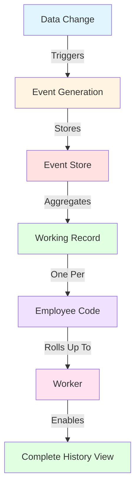

# Working Record Processing Guide

**Version**: 1.0  
**Last Updated**: 2025-12-22  
**Audience**: Solution Architects, Product Managers, Business Analysts  
**Reading Time**: 45-60 minutes

---

## 📋 Overview

This guide explains xTalent's **Working Record (WR) Processing Model** - a comprehensive event-driven approach to tracking, aggregating, and reporting employment lifecycle changes.

> [!NOTE]
> This guide builds upon the **Universal Business Event Framework** defined in the [Global Business Event Ontology](../../../00-global/ontology/business-event.yaml). The Business Event framework provides the platform-wide event infrastructure that powers working records across all xTalent modules.

### What You'll Learn

- Understanding working records and their role in HCM
- Event-driven architecture for employment tracking
- How system events aggregate into working records
- Working record structure and organization
- Worker-level aggregation and reporting
- Real-world employment lifecycle examples

### Key Concepts

**Working Record (WR)**: A comprehensive, chronological log of all meaningful employment-related events for an employee, maintained as a single continuous timeline per employment relationship.

**Event**: Any significant change in an employee's employment data (hire, promotion, transfer, compensation change, termination, etc.)

**WR Line**: A single working record timeline for one `employee_code` (one employment relationship)

**Worker Aggregation**: The ability to view all WR lines across all employment relationships for a single worker

---

## 🎯 Core Principles

### 1. Event-Driven Foundation

xTalent adopts an **event-sourcing inspired** approach where:

```
All Data Changes → Generate Events → Events Build Working Records
```

**Philosophy**: 
- Every employment change is captured as an immutable event
- Events are the source of truth
- Working records are derived aggregations of events
- Complete audit trail is maintained automatically

### 2. One WR Line Per Employee Code

```
Employee Code (EMP-2024-001) → One WR Line
  ├─ Event 1: Hire (2024-01-01)
  ├─ Event 2: Probation End (2024-03-01)
  ├─ Event 3: Promotion (2024-07-01)
  ├─ Event 4: Transfer (2024-10-01)
  └─ Event 5: Compensation Increase (2024-12-01)
```

**Key Points**:
- Each `employee_code` maintains **exactly one** working record line
- The WR line spans the entire employment relationship duration
- Events are ordered chronologically
- Both current and historical states are preserved

### 3. Worker-Level Aggregation

```
Worker (WORKER-001: Nguyễn Văn An)
  │
  ├─ WR Line 1: Employee Code EMP-2020-015 (First Employment)
  │   ├─ Start: 2020-01-01
  │   ├─ Events: 25 events
  │   └─ End: 2022-12-31 (Resigned)
  │
  └─ WR Line 2: Employee Code EMP-2024-050 (Rehire)
      ├─ Start: 2024-01-01
      ├─ Events: 8 events
      └─ End: null (Active)
```

**Capabilities**:
- View complete employment history across all employments
- Aggregate tenure calculations
- Cross-employment analytics and reporting
- Comprehensive audit trail

---

## 🏗️ Architecture Overview

### Conceptual Model



### Three-Layer Architecture

#### Layer 1: Event Generation Layer

**Purpose**: Capture every employment-related change as an immutable event

**Event Sources**:
- Hire/Termination actions
- Job assignment changes (promotion, transfer, demotion)
- Compensation changes
- Contract modifications
- Leave of absence start/end
- Work location changes
- Reporting relationship changes
- Personal data updates

**Event Structure**:
```yaml
Event:
  event_id: UUID
  event_type: "PROMOTION"
  event_category: "JOB_ASSIGNMENT"
  employee_id: UUID
  worker_id: UUID
  timestamp: "2024-07-01T09:00:00Z"
  effective_date: "2024-07-01"
  actor_id: UUID  # Who made the change
  
  # Event-specific payload
  payload:
    previous_job_id: "JOB-SENIOR-ENG"
    new_job_id: "JOB-LEAD-ENG"
    previous_grade: "G3"
    new_grade: "G4"
    reassignment_id: "ASG-2024-050"
    reason_code: "PERFORMANCE"
    
  metadata:
    approval_workflow_id: UUID
    approved_by: UUID
    approved_at: "2024-06-28T15:30:00Z"
    ip_address: "192.168.1.100"
    user_agent: "Mozilla/5.0..."
```

#### Layer 2: Event Aggregation Layer

**Purpose**: Transform chronological events into structured working records

**Aggregation Rules**:

1. **Event Filtering**: Determine which events affect working records
```yaml
Configured Event Types:
  - HIRE
  - TERMINATION
  - PROMOTION
  - DEMOTION
  - TRANSFER
  - COMPENSATION_CHANGE
  - CONTRACT_CHANGE
  - LEAVE_START
  - LEAVE_END
  - POSITION_CHANGE
  - LOCATION_CHANGE
  - REPORTING_CHANGE
```

2. **Event Ordering**: Chronological by `effective_date`, then `timestamp`

3. **State Calculation**: Derive current state from event sequence
```
Initial State (Hire) + Event 1 + Event 2 + ... + Event N = Current State
```

4. **Snapshot Creation**: Generate point-in-time state views
```yaml
Snapshot (as of 2024-07-01):
  employee_code: "EMP-2024-001"
  job_id: "JOB-LEAD-ENG"
  grade: "G4"
  business_unit_id: "BU-ENGINEERING"
  supervisor_id: "ASG-MGR-005"
  base_salary: 120000000
  location_id: "LOC-HCM-HQ"
  status: "ACTIVE"
```

#### Layer 3: Working Record Presentation Layer

**Purpose**: Provide queryable, reportable view of employment history

**Working Record Structure**:
```yaml
WorkingRecord:
  wr_id: UUID
  employee_id: UUID
  employee_code: "EMP-2024-001"
  worker_id: UUID
  
  # Employment span
  employment_start_date: "2024-01-01"
  employment_end_date: null
  is_current: true
  
  # Event timeline
  events:
    - event_id: "EVT-001"
      event_type: "HIRE"
      effective_date: "2024-01-01"
      summary: "Hired as Junior Engineer"
    
    - event_id: "EVT-012"
      event_type: "PROBATION_END"
      effective_date: "2024-03-01"
      summary: "Probation period completed"
    
    - event_id: "EVT-025"
      event_type: "PROMOTION"
      effective_date: "2024-07-01"
      summary: "Promoted to Lead Engineer (G3→G4)"
  
  # Current state (derived from events)
  current_state:
    job_id: "JOB-LEAD-ENG"
    business_unit_id: "BU-ENGINEERING"
    grade: "G4"
    base_salary: 120000000
    employment_status: "ACTIVE"
  
  # Statistics
  total_events: 15
  years_of_service: 0.95
  last_change_date: "2024-12-01"
```

---

## 📊 Event Taxonomy

### Event Categories

#### 1. Employment Lifecycle Events

| Event Type | Description | WR Impact | Example |
|------------|-------------|-----------|---------|
| **HIRE** | New hire / Rehire | Creates new WR line | First day of employment |
| **TERMINATION** | Employment ends | Closes WR line | Resignation, retirement, dismissal |
| **SUSPENSION** | Temporary suspension | Status change | Disciplinary suspension |
| **RETURN_FROM_SUSPENSION** | Resume after suspension | Status change | Return to active status |

#### 2. Job Assignment Events

| Event Type | Description | WR Impact | Example |
|------------|-------------|-----------|---------|
| **PROMOTION** | Upward job/grade change | Job, grade, possibly compensation | Senior → Lead Engineer |
| **DEMOTION** | Downward job/grade change | Job, grade, possibly compensation | Lead → Senior Engineer |
| **TRANSFER** | Move to different BU/location | BU, location, possibly job | Backend → Frontend team |
| **LATERAL_MOVE** | Same level, different role | Job, possibly BU | Engineer → Product Manager |
| **POSITION_CHANGE** | Different position assignment | Position, possibly job | POS-001 → POS-002 |

#### 3. Compensation Events

| Event Type | Description | WR Impact | Example |
|------------|-------------|-----------|---------|
| **SALARY_INCREASE** | Base salary increase | Compensation | Annual raise |
| **SALARY_DECREASE** | Base salary decrease | Compensation | Voluntary reduction |
| **BONUS_AWARD** | One-time bonus | Compensation record | Performance bonus |
| **EQUITY_GRANT** | Stock/option grant | Compensation record | Annual equity grant |
| **ALLOWANCE_CHANGE** | Allowance modification | Allowance details | Housing allowance update |

#### 4. Contract Events

| Event Type | Description | WR Impact | Example |
|------------|-------------|-----------|---------|
| **CONTRACT_AMENDMENT** | Contract terms modified | Contract details | Salary amendment |
| **CONTRACT_RENEWAL** | Contract extended | Contract dates | Fixed-term renewal |
| **CONTRACT_SUPERSESSION** | New contract replaces old | Contract type | Probation → Permanent |
| **PROBATION_START** | Probation period begins | Status, contract | New hire probation |
| **PROBATION_END** | Probation completed | Status, contract | Probation successful |

#### 5. Leave Events

| Event Type | Description | WR Impact | Example |
|------------|-------------|-----------|---------|
| **LEAVE_START** | Leave of absence begins | Status, assignment | Maternity leave start |
| **LEAVE_END** | Return from leave | Status, assignment | Return from maternity |
| **LEAVE_EXTENSION** | Leave extended | Leave dates | Extended sick leave |

#### 6. Organizational Events

| Event Type | Description | WR Impact | Example |
|------------|-------------|-----------|---------|
| **REPORTING_CHANGE** | New supervisor | Reporting relationship | Manager change |
| **LOCATION_CHANGE** | Work location change | Location | Office relocation |
| **BU_RESTRUCTURE** | BU reorganization | BU assignment | Dept merge/split |

#### 7. Personal Data Events

| Event Type | Description | WR Impact | Example |
|------------|-------------|-----------|---------|
| **NAME_CHANGE** | Legal name change | Personal data | Marriage name change |
| **CONTACT_UPDATE** | Contact info update | Contact data | Phone/email update |
| **ADDRESS_CHANGE** | Address update | Address data | Residential move |

---

## 🔄 Event-to-Working-Record Flow

### Step-by-Step Process

#### Step 1: Event Generation

**Trigger**: User performs an action (HR admin promotes an employee)

```yaml
Action: Promote employee EMP-2024-001
Input:
  employee_id: "EMP-2024-001"
  new_job_id: "JOB-LEAD-ENG"
  new_grade: "G4"
  effective_date: "2024-07-01"
  reason: "Exceptional performance"
```

**System**: Creates immutable event

```yaml
Event Generated:
  event_id: "EVT-2024-07-01-001"
  event_type: "PROMOTION"
  event_category: "JOB_ASSIGNMENT"
  employee_id: "EMP-2024-001"
  worker_id: "WORKER-001"
  created_at: "2024-06-28T10:00:00Z"
  effective_date: "2024-07-01"
  
  payload:
    previous_job_id: "JOB-SENIOR-ENG"
    new_job_id: "JOB-LEAD-ENG"
    previous_grade: "G3"
    new_grade: "G4"
    previous_assignment_id: "ASG-001"
    new_assignment_id: "ASG-002"
    reason_code: "PERFORMANCE"
```

#### Step 2: Event Storage

**System**: Persists event to event store

```sql
INSERT INTO hr_events.employment_event (
  event_id,
  event_type,
  employee_id,
  worker_id,
  effective_date,
  payload,
  created_at
) VALUES (...)
```

**Characteristics**:
- ✅ Immutable (no updates or deletes)
- ✅ Append-only log
- ✅ Complete audit trail
- ✅ Source of truth

#### Step 3: Working Record Update

**System**: Aggregates event into working record

```yaml
Before Update (WR for EMP-2024-001):
  events: [EVT-001, EVT-002, ..., EVT-024]  # 24 events
  current_state:
    job_id: "JOB-SENIOR-ENG"
    grade: "G3"
    
After Update:
  events: [EVT-001, EVT-002, ..., EVT-024, EVT-025]  # 25 events
  current_state:
    job_id: "JOB-LEAD-ENG"
    grade: "G4"
  last_change_date: "2024-07-01"
```

#### Step 4: State Snapshot (Optional)

**System**: Can create point-in-time snapshot for performance

```yaml
Snapshot @ 2024-07-01:
  snapshot_id: "SNAP-2024-07-01-001"
  employee_id: "EMP-2024-001"
  snapshot_date: "2024-07-01"
  
  state:
    job_id: "JOB-LEAD-ENG"
    grade: "G4"
    business_unit_id: "BU-ENGINEERING"
    base_salary: 120000000
    location_id: "LOC-HCM-HQ"
    supervisor_assignment_id: "ASG-MGR-005"
    employment_status: "ACTIVE"
```

**Purpose**:
- Fast queries "What was this employee's state on date X?"
- Avoid recalculating from events for historical queries
- Performance optimization for reporting

---

## 👤 Working Record Organization

### One WR Line Per Employee Code

**Concept**: Each `employee_code` (representing one employment relationship) has exactly one working record line.

#### Example: Single Employment

```yaml
Worker: WORKER-001 (Nguyễn Văn An)
  └─ Employee: EMP-2024-001
      └─ Working Record Line:
          wr_id: "WR-2024-001"
          employee_code: "EMP-2024-001"
          employment_start: "2024-01-01"
          employment_end: null
          
          events:
            - EVT-001: HIRE (2024-01-01)
            - EVT-002: PROBATION_END (2024-03-01)
            - EVT-003: PROMOTION (2024-07-01)
            - EVT-004: SALARY_INCREASE (2024-12-01)
```

#### Example: Multiple Employments (Rehire)

```yaml
Worker: WORKER-002 (Trần Thị Bình)
  │
  ├─ Employee: EMP-2020-050 (First Employment)
  │   └─ Working Record Line 1:
  │       wr_id: "WR-2020-050"
  │       employee_code: "EMP-2020-050"
  │       employment_start: "2020-01-01"
  │       employment_end: "2022-12-31"
  │       
  │       events:
  │         - EVT-100: HIRE (2020-01-01)
  │         - EVT-101: PROMOTION (2021-01-01)
  │         - EVT-102: TRANSFER (2022-06-01)
  │         - EVT-103: TERMINATION (2022-12-31)
  │
  └─ Employee: EMP-2024-075 (Rehire)
      └─ Working Record Line 2:
          wr_id: "WR-2024-075"
          employee_code: "EMP-2024-075"
          employment_start: "2024-01-01"
          employment_end: null
          
          events:
            - EVT-200: HIRE (2024-01-01)
            - EVT-201: SALARY_INCREASE (2024-07-01)
```

**Key Insights**:
- Same worker (WORKER-002) has **two separate WR lines**
- Each WR line corresponds to one `employee_code`
- Complete history is preserved for each employment
- Can aggregate across both WR lines at worker level

### Worker-Level Aggregation

**Purpose**: View complete employment history across all employment relationships

#### Aggregated View

```yaml
Worker: WORKER-002 (Trần Thị Bình)
  
  # Summary
  total_employments: 2
  first_hire_date: "2020-01-01"
  total_service_years: 3.95  # 3 years first + 0.95 years current
  current_status: "ACTIVE"
  
  # All WR Lines
  working_record_lines:
    - wr_line_1:
        employee_code: "EMP-2020-050"
        period: "2020-01-01 to 2022-12-31"
        duration_years: 3.0
        total_events: 25
        final_job: "JOB-SENIOR-ENG"
        final_grade: "G3"
        termination_reason: "VOLUNTARY_RESIGNATION"
    
    - wr_line_2:
        employee_code: "EMP-2024-075"
        period: "2024-01-01 to present"
        duration_years: 0.95
        total_events: 8
        current_job: "JOB-LEAD-ENG"
        current_grade: "G4"
        status: "ACTIVE"
  
  # Combined Event Timeline
  all_events: [
    # First Employment
    EVT-100 (2020-01-01): HIRE
    EVT-101 (2021-01-01): PROMOTION
    ...
    EVT-103 (2022-12-31): TERMINATION
    
    # Gap Period: 2023-01-01 to 2023-12-31
    
    # Second Employment
    EVT-200 (2024-01-01): HIRE
    EVT-201 (2024-07-01): SALARY_INCREASE
    ...
  ]
```

#### Aggregate Analytics

```yaml
Queries Enabled by Worker-Level Aggregation:

1. Total Service Time:
   "How many years has this worker been with the company?"
   → 3.95 years (across 2 employments)

2. Promotion History:
   "How many times has this worker been promoted?"
   → 3 times (2 in first employment, 1 in current)

3. Career Progression:
   "What was the career path?"
   → Junior (2020) → Senior (2021) → Lead (2024)

4. Compensation History:
   "What is the salary progression?"
   → 50M (2020) → 80M (2021) → 100M (2022) → 120M (2024)

5. Rehire Analysis:
   "Was this a successful rehire?"
   → Yes: Higher position (Lead vs Senior) and grade (G4 vs G3)
```

---

## 💼 Complete Employment Lifecycle Examples

### Example 1: Standard Employee Journey

**Scenario**: New hire → Probation → Promotion → Transfer → Salary Increase

```yaml
Worker: WORKER-003 (Lê Văn Cường)
Employee Code: EMP-2024-100

# Working Record Line
WR Line: WR-2024-100
  Employment Period: 2024-01-01 to present
  Total Events: 5

# Event Timeline

Event 1: HIRE
  Date: 2024-01-01
  Details:
    job_id: "JOB-JUNIOR-BACKEND"
    grade: "G1"
    business_unit_id: "BU-ENGINEERING"
    base_salary: 50000000
    contract_type: "PROBATION"
    location_id: "LOC-HCM-HQ"
  
  State After:
    employment_status: "PROBATION"
    job: "Junior Backend Engineer"
    grade: "G1"
    monthly_salary: 50000000

Event 2: PROBATION_END
  Date: 2024-03-01
  Details:
    probation_result: "SUCCESSFUL"
    contract_change: "PROBATION → PERMANENT"
  
  State After:
    employment_status: "ACTIVE"
    contract_type: "PERMANENT"
    # Job and salary remain same

Event 3: PROMOTION
  Date: 2024-07-01
  Details:
    previous_job: "JOB-JUNIOR-BACKEND"
    new_job: "JOB-SENIOR-BACKEND"
    previous_grade: "G1"
    new_grade: "G2"
    salary_increase: 30000000  # 50M → 80M
    reason: "PERFORMANCE"
  
  State After:
    job: "Senior Backend Engineer"
    grade: "G2"
    monthly_salary: 80000000

Event 4: TRANSFER
  Date: 2024-10-01
  Details:
    previous_bu: "BU-ENGINEERING"
    new_bu: "BU-PLATFORM"
    previous_location: "LOC-HCM-HQ"
    new_location: "LOC-HCM-D7"
    reason: "ORGANIZATIONAL_NEED"
  
  State After:
    business_unit: "Platform Team"
    location: "District 7 Office"
    # Job and salary remain same

Event 5: SALARY_INCREASE
  Date: 2024-12-01
  Details:
    previous_salary: 80000000
    new_salary: 90000000
    increase_percentage: 12.5
    reason: "ANNUAL_REVIEW"
    effective_date: "2024-12-01"
  
  State After:
    monthly_salary: 90000000

# Current State (Derived from all events)
As of 2024-12-22:
  employee_code: "EMP-2024-100"
  employment_status: "ACTIVE"
  job: "Senior Backend Engineer"
  grade: "G2"
  business_unit: "Platform Team"
  location: "District 7 Office"
  base_salary: 90000000
  years_of_service: 0.97
  contract_type: "PERMANENT"
```

### Example 2: Complex Scenario with Leave

**Scenario**: Promotion → Maternity Leave → Return → Salary Increase

```yaml
Worker: WORKER-004 (Phạm Thị Dung)
Employee Code: EMP-2023-050

# Working Record Line
WR Line: WR-2023-050
  Employment Period: 2023-01-01 to present
  Total Events: 8

# Key Events

Event 1: HIRE (2023-01-01)
  job: "Senior Product Manager"
  grade: "G3"
  salary: 100000000

Event 4: PROMOTION (2023-07-01)
  job: "Lead Product Manager"
  grade: "G4"
  salary: 120000000

Event 5: LEAVE_START (2024-03-01)
  leave_type: "MATERNITY"
  leave_duration: "6 months"
  expected_return: "2024-09-01"
  
  State During Leave:
    employment_status: "ON_LEAVE"
    job: "Lead Product Manager"  # Position held
    assignment_status: "SUSPENDED"
    salary: 120000000  # Still on payroll

Event 6: LEAVE_END (2024-09-01)
  return_type: "RETURN_FROM_MATERNITY"
  
  State After Return:
    employment_status: "ACTIVE"
    assignment_status: "ACTIVE"
    # Same job, grade, salary

Event 7: SALARY_INCREASE (2024-12-01)
  previous_salary: 120000000
  new_salary: 135000000
  reason: "POST_LEAVE_RETENTION"

# Timeline Visualization
2023-01-01 ━━━━━ HIRE
2023-07-01 ━━━━━ PROMOTION
2024-03-01 ┈┈┈┈┈ LEAVE_START (Maternity)
2024-09-01 ━━━━━ LEAVE_END (Return)
2024-12-01 ━━━━━ SALARY_INCREASE
2024-12-22 ━━━━━ Current (Active)
```

### Example 3: Rehire Scenario

**Scenario**: First Employment → Termination → Gap → Rehire at Higher Level

```yaml
Worker: WORKER-005 (Hoàng Văn Em)

# WR Line 1: First Employment
Employee Code: EMP-2020-025
WR Line: WR-2020-025
  Employment Period: 2020-01-01 to 2022-06-30
  Total Events: 12
  Duration: 2.5 years

Key Events - First Employment:
  - 2020-01-01: HIRE (Junior Engineer, G1, 40M)
  - 2020-07-01: PROBATION_END
  - 2021-01-01: PROMOTION (Senior Engineer, G2, 60M)
  - 2022-01-01: SALARY_INCREASE (60M → 70M)
  - 2022-06-30: TERMINATION (Voluntary resignation)

Final State - First Employment:
  job: "Senior Backend Engineer"
  grade: "G2"
  salary: 70000000
  status: "TERMINATED"
  termination_reason: "VOLUNTARY_RESIGNATION"
  rehire_eligible: true

# Gap Period: 2022-07-01 to 2023-12-31 (18 months)

# WR Line 2: Rehire
Employee Code: EMP-2024-080
WR Line: WR-2024-080
  Employment Period: 2024-01-01 to present
  Total Events: 3
  Duration: 0.97 years

Key Events - Second Employment:
  - 2024-01-01: HIRE (Lead Engineer, G4, 120M)  # Rehired at higher level
  - 2024-07-01: SALARY_INCREASE (120M → 135M)
  - 2024-10-01: PROMOTION (Principal Engineer, G5, 150M)

Current State - Second Employment:
  job: "Principal Backend Engineer"
  grade: "G5"
  salary: 150000000
  status: "ACTIVE"

# Worker-Level Aggregation
Worker WORKER-005 - Complete History:
  
  Total Employments: 2
  Total Service: 3.47 years (2.5 years + 0.97 years)
  
  Career Progression:
    2020: Junior Engineer (G1) - 40M
    2021: Senior Engineer (G2) - 60M
    2022: Senior Engineer (G2) - 70M [END]
    [18-month gap]
    2024: Lead Engineer (G4) - 120M [REHIRE]
    2024: Principal Engineer (G5) - 150M
  
  Salary Growth:
    First Employment: 40M → 70M (+75%)
    Second Employment: 120M → 150M (+25%)
    Overall: 40M → 150M (+275%)
  
  Rehire Analysis:
    Gap Duration: 18 months
    Rehire Level: 2 grades higher (G2 → G4)
    Salary Jump: +71% (70M → 120M)
    Assessment: Highly successful rehire
```

---

## 📈 Reporting and Analytics

### Working Record Queries

#### 1. Individual Employee History

```yaml
Query: "Show complete employment history for EMP-2024-001"

Result:
  employee_code: "EMP-2024-001"
  worker_name: "Nguyễn Văn An"
  current_status: "ACTIVE"
  hire_date: "2024-01-01"
  years_of_service: 0.97
  
  timeline:
    - 2024-01-01: "Hired as Junior Backend Engineer (G1, 50M)"
    - 2024-03-01: "Probation completed successfully"
    - 2024-07-01: "Promoted to Senior Backend Engineer (G2, 80M)"
    - 2024-10-01: "Transferred to Platform Team, District 7 Office"
    - 2024-12-01: "Annual salary increase (80M → 90M)"
  
  current_position:
    job: "Senior Backend Engineer"
    grade: "G2"
    business_unit: "Platform Team"
    salary: 90000000
```

#### 2. Worker Aggregated History

```yaml
Query: "Show all employment relationships for WORKER-002"

Result:
  worker_id: "WORKER-002"
  worker_name: "Trần Thị Bình"
  total_employments: 2
  total_service_years: 3.95
  
  employment_1:
    employee_code: "EMP-2020-050"
    period: "2020-01-01 to 2022-12-31"
    duration: 3.0 years
    start_position: "Junior Engineer (G1)"
    end_position: "Senior Engineer (G3)"
    total_promotions: 2
    status: "TERMINATED (Resigned)"
  
  employment_2:
    employee_code: "EMP-2024-075"
    period: "2024-01-01 to present"
    duration: 0.95 years
    start_position: "Senior Engineer (G3)"
    current_position: "Lead Engineer (G4)"
    total_promotions: 1
    status: "ACTIVE"
  
  career_summary:
    total_promotions: 3
    grades_progressed: "G1 → G2 → G3 → G4"
    salary_growth: "50M → 120M (+140%)"
```

#### 3. Event-Based Analytics

```yaml
Query: "How many promotions happened in 2024?"

Result:
  total_promotion_events: 125
  
  by_month:
    January: 15
    April: 8
    July: 45  # Mid-year review
    October: 12
    December: 45  # Year-end review
  
  by_grade_change:
    G1→G2: 40
    G2→G3: 45
    G3→G4: 30
    G4→G5: 10
```

#### 4. State Snapshot Queries

```yaml
Query: "What was employee EMP-2024-001's job on 2024-06-15?"

Method 1: Replay events up to date
  - Find all events with effective_date <= 2024-06-15
  - Replay events to build state
  - Result: "Junior Backend Engineer (G1)"

Method 2: Use snapshot (if available)
  - Find snapshot closest to 2024-06-15
  - Result from snapshot: "Junior Backend Engineer (G1)"
```

### Analytics Use Cases

#### Tenure Analysis

```yaml
Analysis: "Average tenure by termination type"

Data Source: Working Records (terminated employees only)

Query Logic:
  - Filter WR lines where employment_end_date IS NOT NULL
  - Calculate duration: employment_end_date - employment_start_date
  - Group by termination_type
  - Calculate averages

Results:
  VOLUNTARY_RESIGNATION: 2.3 years average
  INVOLUNTARY_TERMINATION: 1.1 years average
  RETIREMENT: 15.5 years average
  END_OF_CONTRACT: 1.8 years average
```

#### Promotion Velocity

```yaml
Analysis: "Time to first promotion by hire grade"

Data Source: Working Record events

Query Logic:
  - Find all HIRE events
  - Find first PROMOTION event for same employee_code
  - Calculate time difference
  - Group by hire grade

Results:
  Hired at G1: 18 months average to G2
  Hired at G2: 24 months average to G3
  Hired at G3: 30 months average to G4
```

#### Rehire Success Rate

```yaml
Analysis: "Rehire performance comparison"

Data Source: Workers with multiple WR lines

Metrics:
  - Average grade at first employment end: G2.5
  - Average grade at rehire: G3.2
  - Grade improvement: +0.7 levels
  - Promotion rate post-rehire: 65% (vs 45% overall)
  - Retention rate: 85% after 2 years (vs 70% overall)
  
Conclusion: Rehired employees perform better on average
```

---

## 🔧 Configuration and Customization

### Configurable Event Types

Organizations can configure which events generate working record entries:

```yaml
Working Record Configuration:

# Core Events (Always Tracked)
core_events:
  - HIRE
  - TERMINATION
  - PROMOTION
  - DEMOTION

# Optional Events (Configurable)
optional_events:
  - TRANSFER:
      enabled: true
      threshold: "cross_bu_only"  # Only track cross-BU transfers
  
  - SALARY_INCREASE:
      enabled: true
      threshold: ">= 10%"  # Only track increases >= 10%
  
  - LOCATION_CHANGE:
      enabled: false  # Not tracked in WR
  
  - REPORTING_CHANGE:
      enabled: true
      threshold: "senior_level_only"  # Only for G4+
  
  - LEAVE_START:
      enabled: true
      threshold: ">= 30 days"  # Only leaves >= 30 days
  
  - CONTRACT_AMENDMENT:
      enabled: true
      threshold: "material_changes_only"

# Event Retention Policy
retention:
  event_store:
    duration: "7 years"  # Legal compliance
    archive_after: "3 years"
  
  working_records:
    active_employees: "unlimited"
    terminated_employees: "7 years"
    purge_after: "10 years"  # GDPR compliance
```

### Snapshot Strategy

```yaml
Snapshot Configuration:

strategy: "hybrid"  # Options: none, periodic, on_demand, hybrid

periodic_snapshots:
  enabled: true
  frequency: "monthly"  # Create snapshot on 1st of each month
  retention: "24 months"

on_demand_snapshots:
  enabled: true
  triggers:
    - "TERMINATION"
    - "END_OF_YEAR"
    - "PROMOTION to G5+"
  retention: "unlimited"

performance_optimization:
  cache_current_state: true
  cache_duration: "1 hour"
  enable_materialized_views: true
```

---

## ✅ Best Practices

### 1. Event Design

**✅ DO**:
- Make events immutable (append-only)
- Include all context needed to understand the change
- Use clear, descriptive event types
- Capture actor (who made the change)
- Store both previous and new values

**❌ DON'T**:
- Delete or modify historical events
- Store sensitive data in event payload (use references)
- Create overly granular events (e.g., every field change)
- Omit effective dates

### 2. Working Record Maintenance

**✅ DO**:
- Rebuild WR from events if inconsistencies detected
- Validate event sequences for logical consistency
- Create snapshots for performance-critical queries
- Archive old events to cold storage

**❌ DON'T**:
- Manually edit working records (always go through events)
- Allow gaps in event sequences
- Delete working records for terminated employees prematurely

### 3. Query Optimization

**✅ DO**:
- Use snapshots for historical point-in-time queries
- Cache current state for active employees
- Create indexes on effective_date and event_type
- Use worker-level aggregation for cross-employment analytics

**❌ DON'T**:
- Replay all events for every query
- Run complex aggregations on raw event data without indexes
- Query event store directly for user-facing features

### 4. Compliance and Audit

**✅ DO**:
- Retain events for legal compliance period (7+ years)
- Implement proper access controls on event data
- Log all access to sensitive working records
- Support data portability (GDPR right to access)
- Implement right to erasure with proper retention

**❌ DON'T**:
- Expose raw event data to end users
- Purge events before legal retention period
- Allow unauthorized modification of working records

---

## 🎓 Summary

### Key Takeaways

1. **Event-Driven Architecture**: All employment changes generate immutable events that become the source of truth

2. **One WR Line Per Employee Code**: Each employment relationship (employee_code) maintains exactly one working record line with complete event history

3. **Worker-Level Aggregation**: View consolidated history across all employment relationships for a single worker

4. **Configurable Tracking**: Organizations define which events matter for working records based on business needs

5. **Complete Audit Trail**: Full history is preserved automatically through event sourcing

6. **Flexible Reporting**: Query point-in-time states, analyze trends, track career progression, and generate compliance reports

### Benefits

✅ **Complete Employment History**: Every change is captured and preserved  
✅ **Audit Compliance**: Immutable event log satisfies regulatory requirements  
✅ **Career Analytics**: Deep insights into employee progression and retention  
✅ **Rehire Intelligence**: Compare performance across employment periods  
✅ **Flexible Reporting**: Any historical state can be reconstructed  
✅ **Performance Optimized**: Snapshots enable fast queries on large datasets  

### Integration Points

- **HR Core**: WorkRelationship, Employee, Assignment entities
- **Total Rewards**: Compensation change events
- **Time & Absence**: Leave start/end events
- **Performance**: Promotion/demotion events
- **Talent**: Skills, competencies, career progression
- **Compliance**: Audit reports, data retention, GDPR

---

## 📚 Related Documentation

### Platform-Level
- [Business Event Ontology](../../../00-global/ontology/business-event.yaml) - Universal event framework ⭐

### Core Module
- [Employment Lifecycle Guide](./01-employment-lifecycle-guide.md) - 4-level employment hierarchy
- [Data Model Guide](./04-data-model-guide.md) - Core entity relationships
- [Contract Management Guide](./10-contract-management-guide.md) - Contract lifecycle and changes
- [Business Rules](../02-spec/04-business-rules.md) - Employment business rules

### Other Modules
- [TR Audit Specification](../../TR/02-spec/03.10-DS-audit.md) - Audit log specifications

---

**Document Status**: Complete  
**Version**: 1.0  
**Last Updated**: 2025-12-22  
**Author**: xTalent Documentation Team
