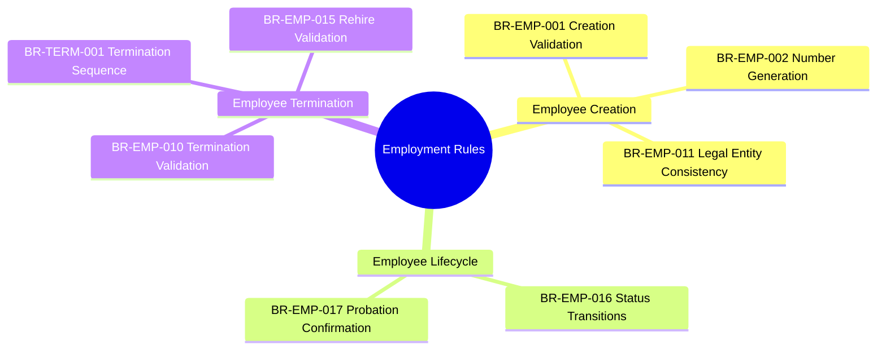
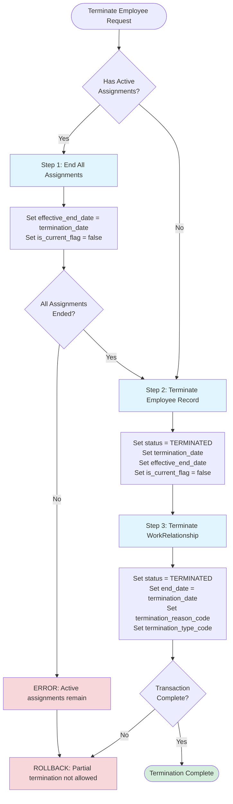
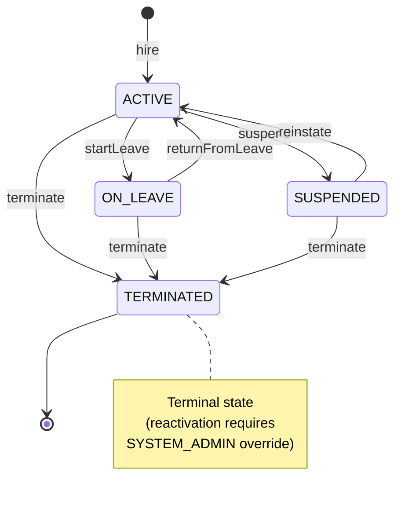

---
# === METADATA ===
id: BRS-CO-EMPLOYMENT
module: CO
sub_module: employment
title: "Employment Management Business Rules"
version: "1.0.0"
status: DRAFT
owner: "Core HCM Team"
last_updated: "2026-01-08"
tags:
  - employment
  - employee
  - termination
  - lifecycle

# === BUSINESS RULES DATA ===
business_rules:
  - id: BR-EMP-001
    title: "Employee Creation Validation"
    description: "Employee record must meet all prerequisites including valid worker and active work relationship."
    category: Validation
    severity: BLOCK
    priority: MUST
    status: ACTIVE
    condition: "WHEN creating new employee record"
    action: "Validate worker exists, work relationship is EMPLOYEE type and ACTIVE, employee number is unique, hire date equals work relationship start date"
    exception: "Rehire: Previous employee record must be terminated"
    related_entities:
      - "[[Employee]]"
      - "[[Worker]]"
      - "[[WorkRelationship]]"
    enforced_by:
      - "FR-EMP-001"

  - id: BR-EMP-002
    title: "Employee Number Generation"
    description: "Employee number auto-generation with unique format per configuration."
    category: Calculation
    severity: BLOCK
    priority: MUST
    status: ACTIVE
    condition: "WHEN creating employee record"
    action: "Auto-generate employee number in format EMP-{NNNNNN} or custom format from config; ensure uniqueness; prevent modification after creation"
    exception: "HR_ADMIN can provide custom employee number"
    related_entities:
      - "[[Employee]]"
    enforced_by:
      - "FR-EMP-001"
      - "FR-EMP-005"

  - id: BR-EMP-010
    title: "Employee Termination Validation"
    description: "Employee termination must meet all validation criteria and follow proper workflow."
    category: Workflow
    severity: BLOCK
    priority: MUST
    status: ACTIVE
    condition: "WHEN terminating employee"
    action: "Validate termination date (today or past, after hire date), termination reason and type required, all assignments ended, work relationship terminated, notice period documented"
    exception: "Emergency termination can bypass notice period"
    related_entities:
      - "[[Employee]]"
      - "[[Assignment]]"
      - "[[WorkRelationship]]"
    enforced_by:
      - "FR-EMP-010"

  - id: BR-EMP-011
    title: "Employee Legal Entity Consistency"
    description: "Employee legal entity and worker must match parent work relationship to ensure data integrity."
    category: Validation
    severity: BLOCK
    priority: MUST
    status: ACTIVE
    condition: "WHEN creating or updating employee record"
    action: "Validate Employee.legal_entity_code = WorkRelationship.legal_entity_code AND Employee.worker_id = WorkRelationship.worker_id; prevent changes after creation"
    exception: "None"
    related_entities:
      - "[[Employee]]"
      - "[[WorkRelationship]]"
      - "[[LegalEntity]]"
    enforced_by:
      - "FR-EMP-001"

  - id: BR-EMP-015
    title: "Rehire Validation"
    description: "Rehire validation rules for former employees."
    category: Workflow
    severity: WARN
    priority: SHOULD
    status: ACTIVE
    condition: "WHEN rehiring former employee"
    action: "Validate previous employee terminated, termination not for cause, minimum gap period met, generate new employee number, retain employment history"
    exception: "HR_ADMIN can override rehire restrictions"
    related_entities:
      - "[[Employee]]"
      - "[[Worker]]"
    enforced_by:
      - "FR-EMP-011"

  - id: BR-TERM-001
    title: "Termination Sequence"
    description: "Termination must follow strict sequence to maintain data integrity and prevent partial termination states."
    category: Workflow
    severity: BLOCK
    priority: MUST
    status: ACTIVE
    condition: "WHEN terminating employee"
    action: "Execute in order: (1) End all Assignments (set effective_end_date, is_current_flag=false), (2) Terminate Employee (set status=TERMINATED, termination_date, effective_end_date), (3) Terminate WorkRelationship (set end_date, termination_reason_code); all steps must complete atomically"
    exception: "None"
    related_entities:
      - "[[Employee]]"
      - "[[Assignment]]"
      - "[[WorkRelationship]]"
    enforced_by:
      - "FR-WR-010"
      - "FR-EMP-010"

  - id: BR-EMP-016
    title: "Employee Status Transitions"
    description: "Valid status transition rules for employee lifecycle states."
    category: Workflow
    severity: BLOCK
    priority: MUST
    status: ACTIVE
    condition: "WHEN changing employee status"
    action: "Validate status transition follows allowed paths: ACTIVE ↔ ON_LEAVE, ACTIVE ↔ SUSPENDED, SUSPENDED ↔ ON_LEAVE, any state → TERMINATED (terminal state)"
    exception: "SYSTEM_ADMIN can reactivate terminated employees with proper justification"
    related_entities:
      - "[[Employee]]"
    enforced_by:
      - "FR-EMP-003"

  - id: BR-EMP-017
    title: "Probation Confirmation"
    description: "Probation period must be confirmed or terminated before end date to prevent employment limbo."
    category: Workflow
    severity: WARN
    priority: SHOULD
    status: ACTIVE
    condition: "WHEN probation end date approaching (7 days before)"
    action: "Trigger notification to manager; require decision to confirm (convert to permanent) or terminate employment before probation_end_date"
    exception: "Auto-confirm if no action taken by probation_end_date (configurable)"
    related_entities:
      - "[[Employee]]"
      - "[[Contract]]"
    enforced_by:
      - "FR-EMP-004"

# === RELATED ONTOLOGY ===
related_ontology:
  - "[[Employee]]"
  - "[[Worker]]"
  - "[[WorkRelationship]]"
  - "[[Assignment]]"
  - "[[LegalEntity]]"
  - "[[Contract]]"
---

# Employment Management Business Rules

> **Module**: CO (Core HCM)  
> **Sub-module**: Employment Management  
> **Total Rules**: 8

---

## 1. Rule Scope



---

## 2. Rule Catalog

| ID | Rule | Category | Severity | Status |
|----|------|----------|----------|--------|
| `[[BR-EMP-001]]` | **Employee Creation Validation**<br>Employee record must meet all prerequisites | Validation | BLOCK | ACTIVE |
| `[[BR-EMP-002]]` | **Employee Number Generation**<br>Auto-generate unique employee number | Calculation | BLOCK | ACTIVE |
| `[[BR-EMP-011]]` | **Employee Legal Entity Consistency**<br>Legal entity and worker must match work relationship | Validation | BLOCK | ACTIVE |
| `[[BR-EMP-016]]` | **Employee Status Transitions**<br>Valid status transition rules | Workflow | BLOCK | ACTIVE |
| `[[BR-EMP-017]]` | **Probation Confirmation**<br>Probation must be confirmed or terminated | Workflow | WARN | ACTIVE |
| `[[BR-EMP-010]]` | **Employee Termination Validation**<br>Termination must meet all criteria | Workflow | BLOCK | ACTIVE |
| `[[BR-TERM-001]]` | **Termination Sequence**<br>Strict termination sequence for data integrity | Workflow | BLOCK | ACTIVE |
| `[[BR-EMP-015]]` | **Rehire Validation**<br>Validation rules for rehiring former employees | Workflow | WARN | ACTIVE |

---

## 3. Detailed Specifications

### [[BR-EMP-001]] Employee Creation Validation

*   **Priority**: MUST
*   **Description**: Employee record must meet minimum requirements before creation, including valid worker, active work relationship, and unique employee number.
*   **Condition**: 
    ```sql
    WHEN creating new employee record
    ```
*   **Validation Rules**:
    1. Worker must exist (`Worker.id` valid)
    2. Work relationship must exist and `type = 'EMPLOYEE'`
    3. Work relationship `status = 'ACTIVE'`
    4. Employee number must be unique
    5. Hire date must equal work relationship start date
    6. Probation end date must be > hire date (if specified)
    7. Worker cannot have multiple active employee records
*   **Exception**: 
    - Rehire scenario: Previous employee record must be in `TERMINATED` status
*   **Error Messages**:
    - `EMP_WORKER_REQUIRED`: "Worker is required"
    - `EMP_WR_REQUIRED`: "Active EMPLOYEE work relationship required"
    - `EMP_NUMBER_DUPLICATE`: "Employee number already exists"
    - `EMP_ACTIVE_EXISTS`: "Worker already has active employee record"
*   **Related Entities**: `[[Employee]]`, `[[Worker]]`, `[[WorkRelationship]]`
*   **Enforced By**: FR-EMP-001

---

### [[BR-EMP-002]] Employee Number Generation

*   **Priority**: MUST
*   **Description**: Employee number auto-generation with unique format per configuration.
*   **Condition**: 
    ```sql
    WHEN creating employee record
    ```
*   **Generation Rules**:
    1. Employee number is auto-generated if not provided
    2. Default format: `EMP-{NNNNNN}` (6-digit sequential)
    3. Custom format from configuration: `config.employee_number_format`
    4. Employee number must be unique across system
    5. Employee number cannot be changed after creation
*   **Exception**: 
    - HR_ADMIN can provide custom employee number (must still be unique)
*   **Error Messages**:
    - `EMP_NUMBER_GENERATION_FAILED`: "Failed to generate unique employee number"
    - `EMP_NUMBER_INVALID_FORMAT`: "Employee number does not match configured format"
    - `EMP_NUMBER_IMMUTABLE`: "Employee number cannot be changed after creation"
*   **Related Entities**: `[[Employee]]`
*   **Enforced By**: FR-EMP-001, FR-EMP-005

---

### [[BR-EMP-011]] Employee Legal Entity Consistency

*   **Priority**: MUST
*   **Description**: Employee legal entity and worker must match parent work relationship to ensure data integrity.
*   **Condition**: 
    ```sql
    WHEN creating or updating employee record
    ```
*   **Validation Rules**:
    1. `Employee.legal_entity_code = WorkRelationship.legal_entity_code`
    2. `Employee.worker_id = WorkRelationship.worker_id`
    3. Validation triggered on Employee create/update
    4. Cannot change `legal_entity_code` after creation
    5. Cannot change `worker_id` after creation
    6. Both fields must be UUID type (not string)
*   **Exception**: 
    - None - this is a critical data integrity rule
*   **Error Messages**:
    - `EMP_LEGAL_ENTITY_MISMATCH`: "Employee legal entity must match work relationship legal entity"
    - `EMP_WORKER_MISMATCH`: "Employee worker must match work relationship worker"
    - `EMP_LEGAL_ENTITY_IMMUTABLE`: "Cannot change legal entity after creation"
    - `EMP_WORKER_IMMUTABLE`: "Cannot change worker after creation"
*   **Related Entities**: `[[Employee]]`, `[[WorkRelationship]]`, `[[LegalEntity]]`
*   **Enforced By**: FR-EMP-001

---

### [[BR-EMP-016]] Employee Status Transitions

*   **Priority**: MUST
*   **Description**: Valid status transition rules for employee lifecycle states.
*   **Condition**: 
    ```sql
    WHEN changing employee status
    ```
*   **Valid Status Values**:
    - `ACTIVE`: Currently employed and working
    - `ON_LEAVE`: Approved temporary absence
    - `SUSPENDED`: Disciplinary or investigation
    - `TERMINATED`: Employment ended (terminal state)
*   **Allowed Transitions**:
    - `ACTIVE` → `ON_LEAVE` (allowed)
    - `ACTIVE` → `SUSPENDED` (allowed)
    - `ACTIVE` → `TERMINATED` (allowed)
    - `ON_LEAVE` → `ACTIVE` (allowed)
    - `ON_LEAVE` → `TERMINATED` (allowed)
    - `SUSPENDED` → `ACTIVE` (allowed)
    - `SUSPENDED` → `TERMINATED` (allowed)
    - `TERMINATED` → any (NOT allowed - terminal state)
*   **Exception**: 
    - SYSTEM_ADMIN can reactivate terminated employees with proper justification and audit trail
*   **Error Messages**:
    - `EMP_STATUS_INVALID_TRANSITION`: "Cannot change status from {from} to {to}"
    - `EMP_STATUS_REASON_REQUIRED`: "Status change reason is required"
    - `EMP_STATUS_TERMINATED_FINAL`: "Terminated status is final; contact system admin for reactivation"
*   **Related Entities**: `[[Employee]]`
*   **Enforced By**: FR-EMP-003

---

### [[BR-EMP-017]] Probation Confirmation

*   **Priority**: SHOULD
*   **Description**: Probation period must be confirmed or terminated before end date to prevent employment limbo.
*   **Condition**: 
    ```sql
    WHEN probation_end_date approaching (7 days before)
    OR WHEN probation_end_date reached
    ```
*   **Validation Rules**:
    1. Trigger notification to manager 7 days before `probation_end_date`
    2. Manager must take action: Confirm (convert to permanent) OR Terminate
    3. If confirmed: Update `employee_class_code` from `PROBATION` to `PERMANENT`
    4. If terminated: Follow termination workflow (BR-TERM-001)
    5. If no action taken by `probation_end_date`: Auto-confirm (configurable behavior)
*   **Exception**: 
    - Auto-confirm behavior can be disabled in configuration
    - Probation extension allowed once (max +90 days)
*   **Error Messages**:
    - `EMP_PROBATION_EXPIRED`: "Probation period expired; confirmation required"
    - `EMP_PROBATION_ACTION_REQUIRED`: "Manager action required before probation end date"
*   **Related Entities**: `[[Employee]]`, `[[Contract]]`
*   **Enforced By**: FR-EMP-004

---

### [[BR-EMP-010]] Employee Termination Validation

*   **Priority**: MUST
*   **Description**: Employee termination must meet all validation criteria and follow proper workflow.
*   **Condition**: 
    ```sql
    WHEN terminating employee
    ```
*   **Validation Rules**:
    1. Termination date is required
    2. Termination date must be today or past
    3. Termination date must be after hire date
    4. Termination reason is required (from code list)
    5. Termination type is required: `VOLUNTARY`, `INVOLUNTARY`, `MUTUAL`, `END_OF_CONTRACT`
    6. All active assignments must be ended
    7. Work relationship must be terminated
    8. Notice period must be documented (unless emergency termination)
*   **Exception**: 
    - Emergency termination (e.g., misconduct) can bypass notice period requirement
*   **Error Messages**:
    - `EMP_TERM_DATE_REQUIRED`: "Termination date is required"
    - `EMP_TERM_DATE_INVALID`: "Termination date must be today or past, and after hire date"
    - `EMP_TERM_REASON_REQUIRED`: "Termination reason is required"
    - `EMP_TERM_TYPE_REQUIRED`: "Termination type is required"
    - `EMP_ACTIVE_ASSIGNMENTS`: "Cannot terminate with active assignments"
*   **Related Entities**: `[[Employee]]`, `[[Assignment]]`, `[[WorkRelationship]]`
*   **Enforced By**: FR-EMP-010

---

### [[BR-TERM-001]] Termination Sequence

*   **Priority**: MUST
*   **Description**: Termination must follow strict sequence to maintain data integrity and prevent partial termination states.
*   **Condition**: 
    ```sql
    WHEN terminating employee
    ```
*   **Termination Steps** (Must execute in order):
    1. **Step 1**: End all active Assignments
       - Set `effective_end_date = termination_date`
       - Set `is_current_flag = false`
       - Validate: No assignments remain active
    2. **Step 2**: Terminate Employee record
       - Set `status_code = TERMINATED`
       - Set `termination_date`
       - Set `effective_end_date` (SCD Type 2)
       - Set `is_current_flag = false`
    3. **Step 3**: Terminate WorkRelationship
       - Set `status_code = TERMINATED`
       - Set `end_date = termination_date`
       - Set `termination_reason_code`
       - Set `termination_type_code`
*   **Transaction Rules**:
    - All steps must complete successfully or rollback (atomic transaction)
    - Termination dates must be consistent across all levels
    - Cannot have partial termination state (e.g., Employee terminated but WorkRelationship active)
*   **Exception**: 
    - None - sequence is mandatory for data integrity
*   **Error Messages**:
    - `TERM_SEQUENCE_VIOLATION`: "Termination sequence violated - must terminate in order: Assignment → Employee → WorkRelationship"
    - `TERM_PARTIAL_STATE`: "Cannot have partial termination state"
    - `TERM_DATE_INCONSISTENT`: "Termination dates must be consistent across all levels"
    - `TERM_ACTIVE_ASSIGNMENTS`: "Cannot terminate employee with active assignments"
*   **Related Entities**: `[[Employee]]`, `[[Assignment]]`, `[[WorkRelationship]]`
*   **Enforced By**: FR-WR-010, FR-EMP-010

---

### [[BR-EMP-015]] Rehire Validation

*   **Priority**: SHOULD
*   **Description**: Rehire validation rules for former employees.
*   **Condition**: 
    ```sql
    WHEN rehiring former employee (Worker has previous terminated Employee record)
    ```
*   **Validation Rules**:
    1. Previous employee record must be in `TERMINATED` status
    2. Previous termination must not be for cause (configurable list)
    3. Minimum gap period between termination and rehire (configurable, default: 30 days)
    4. Generate new employee number (previous number not reused)
    5. Previous employment history is retained and linked
    6. Rehire eligibility flag checked (`is_rehire_eligible = true`)
*   **Ineligible Termination Reasons** (configurable):
    - `TERMINATION_FOR_CAUSE`
    - `MISCONDUCT`
    - `POLICY_VIOLATION`
    - `DO_NOT_REHIRE`
*   **Exception**: 
    - HR_ADMIN can override rehire restrictions with proper justification and approval
*   **Error Messages**:
    - `EMP_REHIRE_PREVIOUS_ACTIVE`: "Previous employee record still active"
    - `EMP_REHIRE_INELIGIBLE`: "Employee ineligible for rehire due to termination reason: {reason}"
    - `EMP_REHIRE_GAP_REQUIRED`: "Minimum {days} days gap required between termination and rehire"
    - `EMP_REHIRE_FLAG_DISABLED`: "Rehire eligibility flag is disabled for this worker"
*   **Related Entities**: `[[Employee]]`, `[[Worker]]`
*   **Enforced By**: FR-EMP-011

---

## 4. Decision Logic

### Termination Sequence Workflow

This flowchart shows the mandatory sequence for employee termination to ensure data integrity:



### Employee Status Transition Diagram

This diagram shows all valid status transitions in the employee lifecycle:



---

## 5. Summary

This BRS document defines **8 business rules** for Employment Management:

- **3 Creation Rules**: Validation, number generation, legal entity consistency
- **2 Lifecycle Rules**: Status transitions, probation confirmation
- **3 Termination Rules**: Termination validation, sequence enforcement, rehire validation

All rules are enforced to ensure employee data integrity, proper lifecycle management, and compliance with termination workflows.
