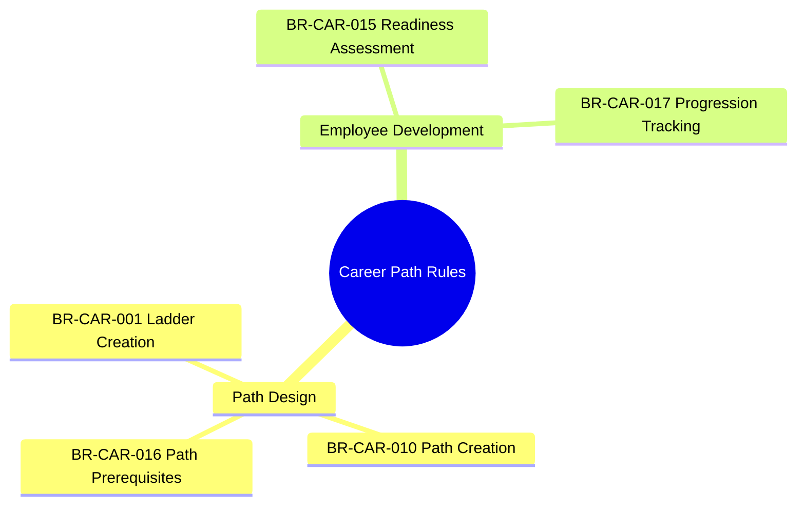
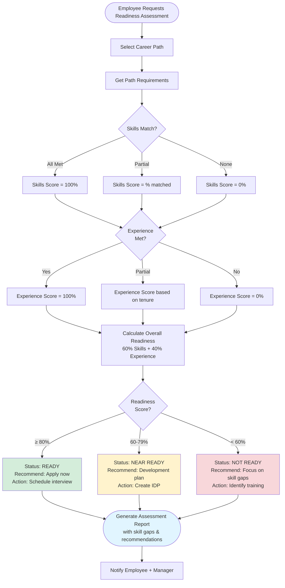

---
# === METADATA ===
id: BRS-CO-CAREER
module: CO
sub_module: career
title: "Career Path Management Business Rules"
version: "1.0.0"
status: DRAFT
owner: "Core HCM Team"
last_updated: "2026-01-08"
tags:
  - career
  - career-path
  - development
  - progression

# === BUSINESS RULES DATA ===
business_rules:
  - id: BR-CAR-001
    title: "Career Ladder Creation"
    description: "Career ladder must meet all creation requirements and validation rules."
    category: Validation
    severity: BLOCK
    priority: SHOULD
    status: ACTIVE
    condition: "WHEN creating career ladder"
    action: "Validate ladder name required, ladder type (MANAGEMENT/TECHNICAL/SPECIALIST/EXECUTIVE) required, description required, effective dates set"
    exception: "None"
    related_entities:
      - "[[CareerLadder]]"
    enforced_by:
      - "FR-CAR-001"

  - id: BR-CAR-010
    title: "Career Path Creation"
    description: "Career path must have valid starting/target levels and path type."
    category: Validation
    severity: BLOCK
    priority: SHOULD
    status: ACTIVE
    condition: "WHEN creating career path"
    action: "Validate starting level required, target level required, path type (VERTICAL/LATERAL/CROSS_FUNCTIONAL) required, typical duration recommended, path requirements specified"
    exception: "None"
    related_entities:
      - "[[CareerPath]]"
      - "[[CareerStep]]"
      - "[[Job]]"
    enforced_by:
      - "FR-CAR-005"

  - id: BR-CAR-015
    title: "Career Readiness Assessment"
    description: "Calculate employee readiness score for career path based on skills and experience."
    category: Calculation
    severity: INFO
    priority: SHOULD
    status: ACTIVE
    condition: "WHEN assessing career readiness"
    action: "Compare employee skills/experience to path requirements; calculate readiness score (0-100%); provide development recommendations; identify skill gaps"
    exception: "None"
    related_entities:
      - "[[CareerPath]]"
      - "[[Employee]]"
      - "[[WorkerSkill]]"
      - "[[WorkerCompetency]]"
    enforced_by:
      - "FR-CAR-011"

  - id: BR-CAR-016
    title: "Career Path Prerequisites"
    description: "Career path steps must define prerequisites and minimum requirements for progression eligibility."
    category: Validation
    severity: WARN
    priority: SHOULD
    status: ACTIVE
    condition: "WHEN defining career path OR assessing eligibility"
    action: "Validate prerequisites defined: minimum tenure in current role, required skills/competencies, required certifications, manager approval required; enforce prerequisites before progression"
    exception: "Lateral moves may have relaxed prerequisites"
    related_entities:
      - "[[CareerPath]]"
      - "[[CareerStep]]"
      - "[[Job]]"
    enforced_by:
      - "FR-CAR-006"

  - id: BR-CAR-017
    title: "Career Progression Tracking"
    description: "Track employee progress along career path and milestone completion."
    category: Workflow
    severity: INFO
    priority: COULD
    status: ACTIVE
    condition: "WHEN employee enrolled in career path"
    action: "Track current step in path, time in current step, completed milestones, skill development progress; send notifications for milestone achievements; update progression status"
    exception: "Tracking optional if employee not enrolled in formal career path"
    related_entities:
      - "[[CareerPath]]"
      - "[[Employee]]"
      - "[[Assignment]]"
    enforced_by:
      - "FR-CAR-012"

# === RELATED ONTOLOGY ===
related_ontology:
  - "[[CareerPath]]"
  - "[[CareerStep]]"
  - "[[CareerLadder]]"
  - "[[Job]]"
  - "[[Employee]]"
  - "[[WorkerSkill]]"
  - "[[WorkerCompetency]]"
  - "[[Assignment]]"
---

# Career Path Management Business Rules

> **Module**: CO (Core HCM)  
> **Sub-module**: Career Path Management  
> **Total Rules**: 5

---

## 1. Rule Scope



---

## 2. Rule Catalog

| ID | Rule | Category | Severity | Status |
|----|------|----------|----------|--------|
| `[[BR-CAR-001]]` | **Career Ladder Creation**<br>Validate ladder name, type, description | Validation | BLOCK | ACTIVE |
| `[[BR-CAR-010]]` | **Career Path Creation**<br>Validate levels and path type | Validation | BLOCK | ACTIVE |
| `[[BR-CAR-016]]` | **Career Path Prerequisites**<br>Define and enforce prerequisites | Validation | WARN | ACTIVE |
| `[[BR-CAR-015]]` | **Career Readiness Assessment**<br>Calculate readiness score | Calculation | INFO | ACTIVE |
| `[[BR-CAR-017]]` | **Career Progression Tracking**<br>Track employee progress | Workflow | INFO | ACTIVE |

---

## 3. Detailed Specifications

### [[BR-CAR-001]] Career Ladder Creation

*   **Priority**: SHOULD
*   **Description**: Career ladder must meet all creation requirements and validation rules.
*   **Condition**: 
    ```sql
    WHEN creating career ladder
    ```
*   **Validation Rules**:
    1. Ladder name is required (max 200 characters)
    2. Ladder type is required from code list: `MANAGEMENT`, `TECHNICAL`, `SPECIALIST`, `EXECUTIVE`
    3. Ladder description is required (provides context and purpose)
    4. Multiple ladders can coexist (not unique constraint)
    5. Effective dates are set (effective_start_date required)
    6. Status defaults to `DRAFT` until activated
*   **Ladder Types**:
    - `MANAGEMENT`: Leadership progression path
    - `TECHNICAL`: Individual contributor technical depth
    - `SPECIALIST`: Functional expertise (HR, Finance, etc.)
    - `EXECUTIVE`: C-suite/senior leadership
*   **Exception**: 
    - None
*   **Error Messages**:
    - `CAR_LADDER_NAME_REQUIRED`: "Ladder name is required"
    - `CAR_LADDER_TYPE_REQUIRED`: "Ladder type is required"
    - `CAR_LADDER_TYPE_INVALID`: "Invalid ladder type: {type}"
    - `CAR_LADDER_DESC_REQUIRED`: "Ladder description is required"
*   **Related Entities**: `[[CareerLadder]]`
*   **Enforced By**: FR-CAR-001

---

### [[BR-CAR-010]] Career Path Creation

*   **Priority**: SHOULD
*   **Description**: Career path must have valid starting/target levels and path type.
*   **Condition**: 
    ```sql
    WHEN creating career path
    ```
*   **Validation Rules**:
    1. Starting level (job or position) is required
    2. Target level (job or position) is required
    3. Path type is required from code list: `VERTICAL`, `LATERAL`, `CROSS_FUNCTIONAL`
    4. Typical duration is recommended (in months)
    5. Path requirements should be specified (skills, experience, certifications)
    6. Career path code must be unique
    7. At least 2 steps required (starting + target minimum)
*   **Path Types**:
    - `VERTICAL`: Upward progression (e.g., Junior → Senior → Lead)
    - `LATERAL`: Same level, different function (e.g., Backend → Frontend Engineer)
    - `CROSS_FUNCTIONAL`: Across departments (e.g., Engineering → Product Management)
*   **Exception**: 
    - None
*   **Error Messages**:
    - `CAR_PATH_LEVELS_REQUIRED`: "Starting and target levels are required"
    - `CAR_PATH_TYPE_REQUIRED`: "Path type is required"
    - `CAR_PATH_TYPE_INVALID`: "Invalid path type: {type}"
    - `CAR_PATH_CODE_DUPLICATE`: "Career path code already exists"
    - `CAR_PATH_MIN_STEPS`: "Career path requires at least 2 steps"
*   **Related Entities**: `[[CareerPath]]`, `[[CareerStep]]`, `[[Job]]`
*   **Enforced By**: FR-CAR-005

---

### [[BR-CAR-016]] Career Path Prerequisites

*   **Priority**: SHOULD
*   **Description**: Career path steps must define prerequisites and minimum requirements for progression eligibility.
*   **Condition**: 
    ```sql
    WHEN defining career path OR assessing eligibility
    ```
*   **Validation Rules**:
    1. **Minimum Tenure**: Minimum time in current role before eligible (e.g., 12 months)
    2. **Required Skills**: List of skills with minimum proficiency level
    3. **Required Competencies**: Core competencies for next level
    4. **Required Certifications**: Professional certifications if applicable
    5. **Manager Approval**: Whether manager approval required for progression
    6. **Educational Requirements**: Degree or education level if applicable
    7. Prerequisites enforced before allowing progression to next step
*   **Prerequisite Check Process**:
    - System evaluates employee against all prerequisites
    - Displays met/unmet status for each requirement
    - Blocks progression if critical prerequisites not met
    - Allows waiver with appropriate approval level
*   **Exception**: 
    - Lateral moves may have relaxed prerequisites (no tenure requirement)
    - Executive latitude for exceptional talent acceleration
*   **Error Messages**:
    - `CAR_PREREQ_TENURE_NOT_MET`: "Minimum tenure of {months} months required"
    - `CAR_PREREQ_SKILLS_NOT_MET`: "Required skills not met: {skill_list}"
    - `CAR_PREREQ_CERT_NOT_MET`: "Required certification missing: {cert_name}"
    - `CAR_PREREQ_APPROVAL_REQUIRED`: "Manager approval required for progression"
*   **Related Entities**: `[[CareerPath]]`, `[[CareerStep]]`, `[[Job]]`
*   **Enforced By**: FR-CAR-006

---

### [[BR-CAR-015]] Career Readiness Assessment

*   **Priority**: SHOULD
*   **Description**: Calculate employee readiness score for career path based on skills and experience.
*   **Condition**: 
    ```sql
    WHEN assessing career readiness
    ```
*   **Assessment Process**:
    1. **Skills Comparison**: Compare employee's current skills to path requirements
       - Match skills by skill_id
       - Compare proficiency levels
       - Calculate skills score: (matched skills / required skills) × 100%
    2. **Experience Comparison**: Compare employee's experience to path requirements
       - Check total work experience
       - Check time in current role
       - Check relevant domain experience
       - Calculate experience score based on tenure thresholds
    3. **Overall Readiness Score**: Weighted average (Skills: 60%, Experience: 40%)
    4. **Development Recommendations**: Generate personalized development plan
    5. **Skill Gap Identification**: List specific skills/competencies to develop
*   **Readiness Levels**:
    - **READY** (≥80%): Recommend applying for next role immediately
    - **NEAR READY** (60-79%): Recommend development plan and reassess in 3-6 months
    - **NOT READY** (<60%): Focus on skill gaps; reassess in 6-12 months
*   **Exception**: 
    - None (this is an informational/advisory rule, not blocking)
*   **Error Messages**:
    - None (analysis rule, no blocking errors)
*   **Related Entities**: `[[CareerPath]]`, `[[Employee]]`, `[[WorkerSkill]]`, `[[WorkerCompetency]]`
*   **Enforced By**: FR-CAR-011

---

### [[BR-CAR-017]] Career Progression Tracking

*   **Priority**: COULD
*   **Description**: Track employee progress along career path and milestone completion.
*   **Condition**: 
    ```sql
    WHEN employee enrolled in career path
    ```
*   **Tracking Components**:
    1. **Current Step**: Employee's current position in career path
    2. **Time in Step**: Duration in current step (in months)
    3. **Completed Milestones**: Achievements marked as complete
    4. **Skill Development Progress**: Skills acquired or improved
    5. **Progression Status**: 
       - `ON_TRACK`: Meeting expected timeline
       - `AHEAD`: Progressing faster than expected
       - `DELAYED`: Behind expected timeline
    6. **Milestone Notifications**: Alert employee and manager when milestones achieved
    7. **Progression Updates**: Notify when employee advances to next step
*   **Milestones** (examples):
    - Completed required certification
    - Demonstrated proficiency in key skill
    - Successfully led project
    - Received promotion to next level
*   **Exception**: 
    - Tracking optional if employee not enrolled in formal career path
    - Ad-hoc career movements not tracked in system
*   **Error Messages**:
    - `CAR_TRACK_NOT_ENROLLED`: "Employee not enrolled in career path"
    - `CAR_TRACK_PATH_INACTIVE`: "Career path is no longer active"
*   **Related Entities**: `[[CareerPath]]`, `[[Employee]]`, `[[Assignment]]`
*   **Enforced By**: FR-CAR-012

---

## 4. Decision Logic

### Career Readiness Assessment Workflow

This flowchart shows the process for assessing an employee's readiness for a career path:



---

## 5. Summary

This BRS document defines **5 business rules** for Career Path Management:

- **3 Path Design Rules**: Ladder creation, path creation, prerequisites definition
- **2 Employee Development Rules**: Readiness assessment, progression tracking

All rules are designed to support employee career development, internal mobility, and talent pipeline visibility within the organization.
