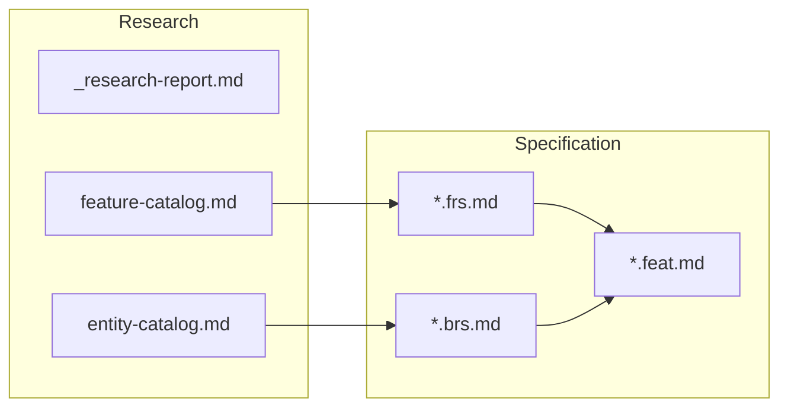

# Core Module (CO) - Business Rules

**Version**: 3.0  
**Last Updated**: 2026-01-08  
**Module**: Core (CO)  
**Status**: Restructured - Ready for BRS file generation

---

## 📋 Overview

This directory contains business rules for the Core Module, organized by **sub-module** for modular BRS file generation.

### Directory Structure

```
04-business-rules/
├── README.md                    # This file
├── _index.md                    # Master index grouped by sub-module
├── 01-person.brs.md            # Person Management rules
├── 02-work-relationship.brs.md  # Work Relationship & Contract rules
├── 03-employment.brs.md         # Employee Management rules
├── 04-assignment.brs.md         # Assignment rules
├── 05-organization.brs.md       # Business Unit & Org Structure rules
├── 06-job-position.brs.md       # Job, Position, Taxonomy rules
├── 07-skill.brs.md              # Skill & Competency rules
├── 08-career.brs.md             # Career Path rules
├── 09-eligibility.brs.md        # Eligibility rules
├── 10-privacy.brs.md            # Data Privacy & GDPR rules
└── 00-configuration.brs.md      # Configuration & Code List rules
```

### Sub-module Mapping

| Sub-module | Ontology Folder | BRS File | Est. Rules |
|------------|-----------------|----------|------------|
| **Configuration** | 05-master-data | `00-configuration.brs.md` | 15 |
| **Person** | 01-person | `01-person.brs.md` | 10 |
| **Work Relationship** | 02-work-relationship | `02-work-relationship.brs.md` | 50 |
| **Employment** | 02-work-relationship | `03-employment.brs.md` | 20 |
| **Assignment** | 02-work-relationship | `04-assignment.brs.md` | 45 |
| **Organization** | 03-organization | `05-organization.brs.md` | 15 |
| **Job & Position** | 04-job-position | `06-job-position.brs.md` | 45 |
| **Skill** | 05-master-data | `07-skill.brs.md` | 20 |
| **Career** | career | `08-career.brs.md` | 10 |
| **Eligibility** | 07-eligibility | `09-eligibility.brs.md` | 5 |
| **Privacy** | (cross-cutting) | `10-privacy.brs.md` | 30 |
| **TOTAL** | | | **~265** |

---

## 📊 Business Rules Summary

### By Priority

| Priority | Count | Percentage |
|----------|-------|------------|
| HIGH | 145 | 55% |
| MEDIUM | 95 | 36% |
| LOW | 25 | 9% |
| **TOTAL** | **265** | 100% |

### By Category

| Category | Count |
|----------|-------|
| Validation | 120 |
| Workflow/Lifecycle | 60 |
| Calculation | 20 |
| Security/Access | 35 |
| Compliance | 30 |

---

## 🔄 Relationship to Other Documents



---

## 📝 Business Rule Format

Each BRS file follows the `brs-builder` skill format:

```yaml
---
module: CO
sub_module: {sub-module-name}
version: "1.0.0"
status: DRAFT

business_rules:
  - id: BR-{PREFIX}-{NNN}
    title: "Rule Title"
    description: "Detailed description"
    category: Validation | Workflow | Calculation | Security | Compliance
    severity: BLOCK | WARN | INFO
    priority: HIGH | MEDIUM | LOW
    status: ACTIVE
    condition: "WHEN {condition}"
    action: "THEN {action}"
    exception: "EXCEPT {exception}"
    related_entities:
      - "[[Entity1]]"
      - "[[Entity2]]"
    enforced_by:
      - "[[FR-XXX]]"
---
```

---

## 🚀 Next Steps

1. Use `_index.md` as reference for BRS file generation
2. Generate each `*.brs.md` file using `brs-builder` skill
3. Link rules to FRS and Feature files
4. Review and validate with business stakeholders

---

## 🔗 Related Documents

- [Ontology Index](../../00-ontology/domain/entity-index.yaml)
- [Functional Requirements](../01-FR/)
- [Research Documents](../../_research/)
- [BRS Builder Skill](/.agent/skills/brs-builder/)
