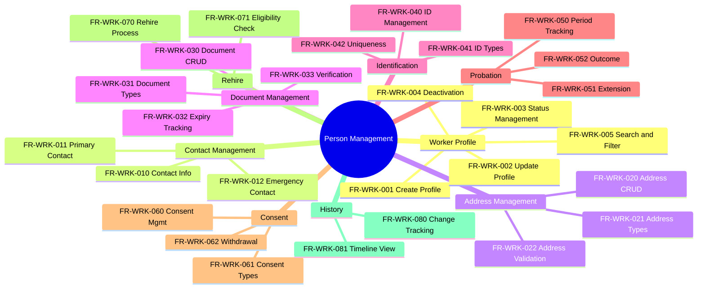

---
# === METADATA ===
id: FRS-CO-PERSON
module: CORE
sub_module: PERSON_MANAGEMENT
title: "Person Management Requirements"
version: "1.0.0"
status: DRAFT
owner: "Core HR Team"
last_updated: "2026-01-08"
tags:
  - worker
  - person
  - contact
  - address
  - document
  - consent
  - identity

# === REQUIREMENTS DATA ===
requirements:
  # Worker Profile (5 FRs)
  - id: FR-WRK-001
    title: "Create Worker Profile"
    description: "System must allow creation of worker profiles with required personal information."
    priority: MUST
    type: Functional
    risk: high
    status: TODO
    acceptance_criteria:
      - "Full name is required and validated (max 200 chars)"
      - "Date of birth is required and must be past date"
      - "Gender code selected from valid code list"
      - "Person type selected from valid code list"
      - "Worker code auto-generated in WORKER-NNNNNN format"
    dependencies:
      - "[[Worker]]"
      - "[[CodeList]]"
    implemented_by: []

  - id: FR-WRK-002
    title: "Update Worker Profile"
    description: "System must allow updating worker profiles with SCD Type 2 versioning for significant changes."
    priority: MUST
    type: Functional
    risk: medium
    status: TODO
    acceptance_criteria:
      - "All editable fields can be updated"
      - "Significant changes (name, DOB, national ID) create new version"
      - "Minor changes (email, phone) update current version"
      - "Previous versions retained for audit trail"
    dependencies:
      - "[[Worker]]"
    implemented_by: []

  - id: FR-WRK-003
    title: "Worker Status Management"
    description: "System must manage worker lifecycle status transitions."
    priority: MUST
    type: Workflow
    risk: high
    status: TODO
    acceptance_criteria:
      - "Status transitions follow defined workflow: ACTIVE → INACTIVE"
      - "Status change requires effective date"
      - "Status history maintained"
    dependencies:
      - "[[Worker]]"
    implemented_by: []

  - id: FR-WRK-004
    title: "Worker Deactivation"
    description: "System must support worker deactivation with dependency validation."
    priority: MUST
    type: Workflow
    risk: high
    status: TODO
    acceptance_criteria:
      - "Deactivation blocked if active work relationships exist"
      - "Deactivation blocked if active employee records exist"
      - "End date set on deactivation"
      - "Historical data preserved"
      - "Deactivated workers excluded from active lists"
    dependencies:
      - "[[Worker]]"
      - "[[WorkRelationship]]"
      - "[[Employee]]"
    implemented_by: []

  - id: FR-WRK-005
    title: "Worker Search & Filter"
    description: "System must provide comprehensive worker search and filtering capabilities."
    priority: MUST
    type: Functional
    risk: low
    status: TODO
    acceptance_criteria:
      - "Search by name (partial match)"
      - "Search by worker code (exact match)"
      - "Filter by status (active/inactive)"
      - "Filter by person type"
      - "Results paginated"
    dependencies:
      - "[[Worker]]"
    implemented_by: []

  # Contact Management (3 FRs)
  - id: FR-WRK-010
    title: "Contact Information Management"
    description: "System must manage worker contact information with format validation."
    priority: MUST
    type: Functional
    risk: medium
    status: TODO
    acceptance_criteria:
      - "Support multiple contact types: email, phone, mobile, fax"
      - "Email validated against RFC 5322 format"
      - "Phone validated against E.164 or local format"
      - "Multiple contacts per type allowed"
    dependencies:
      - "[[Worker]]"
      - "[[Contact]]"
    implemented_by: []

  - id: FR-WRK-011
    title: "Primary Contact Assignment"
    description: "System must support designating one contact as primary per type."
    priority: MUST
    type: Validation
    risk: low
    status: TODO
    acceptance_criteria:
      - "Only one primary contact per type per worker"
      - "Primary flag can be changed"
      - "At least one contact recommended for workers with employment"
    dependencies:
      - "[[Contact]]"
    implemented_by: []

  - id: FR-WRK-012
    title: "Emergency Contact Management"
    description: "System must support managing emergency contacts with relationship information."
    priority: SHOULD
    type: Functional
    risk: low
    status: TODO
    acceptance_criteria:
      - "Name and phone required for emergency contact"
      - "Relationship type captured"
      - "Multiple emergency contacts allowed"
      - "Priority/order can be specified"
    dependencies:
      - "[[Contact]]"
    implemented_by: []

  # Address Management (3 FRs)
  - id: FR-WRK-020
    title: "Address Management"
    description: "System must manage worker addresses with country-specific validation."
    priority: MUST
    type: Functional
    risk: medium
    status: TODO
    acceptance_criteria:
      - "Support multiple address types: home, mailing, legal"
      - "Country code required and validated"
      - "Country-specific required fields enforced"
      - "Administrative areas validated against AdminArea table"
    dependencies:
      - "[[Worker]]"
      - "[[Address]]"
      - "[[Country]]"
      - "[[AdminArea]]"
    implemented_by: []

  - id: FR-WRK-021
    title: "Address Type Classification"
    description: "System must support configurable address types."
    priority: MUST
    type: Configuration
    risk: low
    status: TODO
    acceptance_criteria:
      - "Address types configurable via code list"
      - "Default address types: HOME, MAILING, LEGAL, WORK"
      - "Custom address types can be added"
    dependencies:
      - "[[CodeList]]"
    implemented_by: []

  - id: FR-WRK-022
    title: "Address Validation"
    description: "System should validate address format based on country rules."
    priority: SHOULD
    type: Validation
    risk: low
    status: TODO
    acceptance_criteria:
      - "US addresses require state and ZIP code"
      - "VN addresses require province and district"
      - "Postal code format validated per country"
    dependencies:
      - "[[Address]]"
      - "[[Country]]"
    implemented_by: []

  # Document Management (4 FRs)
  - id: FR-WRK-030
    title: "Personal Document Management"
    description: "System must manage worker personal documents with expiry tracking."
    priority: MUST
    type: Functional
    risk: medium
    status: TODO
    acceptance_criteria:
      - "Support multiple document types (passport, visa, license, certificate)"
      - "Document number captured and validated"
      - "Issue date and expiry date tracked"
      - "Document attachments supported"
    dependencies:
      - "[[Worker]]"
      - "[[Document]]"
    implemented_by: []

  - id: FR-WRK-031
    title: "Document Type Configuration"
    description: "System must support configurable document types."
    priority: MUST
    type: Configuration
    risk: low
    status: TODO
    acceptance_criteria:
      - "Document types configurable via code list"
      - "Required vs optional documents per country/person type"
      - "Validation rules per document type"
    dependencies:
      - "[[CodeList]]"
    implemented_by: []

  - id: FR-WRK-032
    title: "Document Expiry Tracking"
    description: "System should track document expiry and generate alerts."
    priority: SHOULD
    type: Workflow
    risk: medium
    status: TODO
    acceptance_criteria:
      - "Alert generated at 90, 60, 30, 7 days before expiry"
      - "Alert sent to HR and employee"
      - "Critical document expiry blocks certain actions"
      - "Alert status tracked (sent, acknowledged)"
    dependencies:
      - "[[Document]]"
    implemented_by: []

  - id: FR-WRK-033
    title: "Document Verification"
    description: "System should support document verification workflow."
    priority: SHOULD
    type: Workflow
    risk: low
    status: TODO
    acceptance_criteria:
      - "Document marked as verified/unverified"
      - "Verification date and verifier recorded"
      - "Verification notes supported"
    dependencies:
      - "[[Document]]"
    implemented_by: []

  # Identification (3 FRs)
  - id: FR-WRK-040
    title: "Personal Identification Management"
    description: "System must manage worker identification documents with uniqueness validation."
    priority: MUST
    type: Functional
    risk: high
    status: TODO
    acceptance_criteria:
      - "Support multiple ID types (national ID, passport, SSN, tax ID)"
      - "ID number validated for format"
      - "Uniqueness enforced within ID type"
      - "Masking applied for display"
    dependencies:
      - "[[Worker]]"
    implemented_by: []

  - id: FR-WRK-041
    title: "ID Type Configuration"
    description: "System must support configurable ID types per country."
    priority: MUST
    type: Configuration
    risk: low
    status: TODO
    acceptance_criteria:
      - "ID types configurable via code list"
      - "Format validation rules per ID type"
      - "Required vs optional per country"
    dependencies:
      - "[[CodeList]]"
    implemented_by: []

  - id: FR-WRK-042
    title: "ID Uniqueness Validation"
    description: "System must enforce ID uniqueness across all workers."
    priority: MUST
    type: Validation
    risk: high
    status: TODO
    acceptance_criteria:
      - "National ID must be unique if provided"
      - "Passport number unique within country"
      - "Duplicate detection with warning"
    dependencies:
      - "[[Worker]]"
    implemented_by: []

  # Probation Tracking (3 FRs)
  - id: FR-WRK-050
    title: "Probation Period Tracking"
    description: "System must track probation periods for workers."
    priority: MUST
    type: Workflow
    risk: medium
    status: TODO
    acceptance_criteria:
      - "Probation start and end dates tracked"
      - "Probation duration configurable per employment type"
      - "Probation status calculated (in progress, completed, failed)"
      - "Alerts before probation end"
    dependencies:
      - "[[Worker]]"
      - "[[Contract]]"
    implemented_by: []

  - id: FR-WRK-051
    title: "Probation Extension"
    description: "System should support probation period extension."
    priority: SHOULD
    type: Workflow
    risk: low
    status: TODO
    acceptance_criteria:
      - "Extension supported with new end date"
      - "Extension reason required"
      - "Maximum extension limit configurable"
      - "Extension history maintained"
    dependencies:
      - "[[Worker]]"
    implemented_by: []

  - id: FR-WRK-052
    title: "Probation Outcome Recording"
    description: "System must record probation outcome."
    priority: MUST
    type: Functional
    risk: medium
    status: TODO
    acceptance_criteria:
      - "Outcome: PASSED, FAILED, EXTENDED"
      - "Outcome date recorded"
      - "Outcome reason/notes supported"
      - "Triggers downstream actions (confirmation, termination)"
    dependencies:
      - "[[Worker]]"
    implemented_by: []

  # Consent Management (3 FRs)
  - id: FR-WRK-060
    title: "Consent Management"
    description: "System must manage worker consent for data processing."
    priority: MUST
    type: Functional
    risk: high
    status: TODO
    acceptance_criteria:
      - "Multiple consent types supported"
      - "Consent date and grantor recorded"
      - "Consent version tracked"
      - "Consent proof stored"
    dependencies:
      - "[[Worker]]"
    implemented_by: []

  - id: FR-WRK-061
    title: "Consent Type Configuration"
    description: "System must support configurable consent types."
    priority: MUST
    type: Configuration
    risk: medium
    status: TODO
    acceptance_criteria:
      - "Consent types per purpose: processing, marketing, analytics"
      - "Mandatory vs optional consent types"
      - "Consent text configurable"
    dependencies:
      - "[[CodeList]]"
    implemented_by: []

  - id: FR-WRK-062
    title: "Consent Withdrawal"
    description: "System must support consent withdrawal workflow."
    priority: MUST
    type: Workflow
    risk: high
    status: TODO
    acceptance_criteria:
      - "Withdrawal request captured"
      - "Withdrawal date recorded"
      - "Downstream impact assessment triggered"
      - "Withdrawal confirmation sent"
    dependencies:
      - "[[Worker]]"
    implemented_by: []

  # Rehire (2 FRs)
  - id: FR-WRK-070
    title: "Rehire Processing"
    description: "System should support processing of rehired workers."
    priority: SHOULD
    type: Workflow
    risk: medium
    status: TODO
    acceptance_criteria:
      - "Previous worker record linked to new employment"
      - "Previous employment history accessible"
      - "Rehire date and gap period calculated"
      - "Tenure calculation configurable for rehires"
    dependencies:
      - "[[Worker]]"
      - "[[WorkRelationship]]"
    implemented_by: []

  - id: FR-WRK-071
    title: "Rehire Eligibility Check"
    description: "System should validate rehire eligibility based on termination reason."
    priority: SHOULD
    type: Validation
    risk: medium
    status: TODO
    acceptance_criteria:
      - "Termination reason checked for rehire eligibility"
      - "Do-not-rehire flag checked"
      - "Minimum gap period validated"
      - "Warning for flagged workers"
    dependencies:
      - "[[Worker]]"
    implemented_by: []

  # History (2 FRs)
  - id: FR-WRK-080
    title: "Worker History Tracking"
    description: "System must maintain complete history of worker data changes."
    priority: MUST
    type: Functional
    risk: medium
    status: TODO
    acceptance_criteria:
      - "All changes logged with timestamp and user"
      - "Previous values retained"
      - "History queryable by date range"
      - "Audit trail exportable"
    dependencies:
      - "[[Worker]]"
    implemented_by: []

  - id: FR-WRK-081
    title: "History Timeline View"
    description: "System should provide visual timeline of worker history."
    priority: SHOULD
    type: UI/UX
    risk: low
    status: TODO
    acceptance_criteria:
      - "Timeline shows key events chronologically"
      - "Event types filterable"
      - "Detail view on event click"
      - "Export as PDF"
    dependencies:
      - "[[Worker]]"
    implemented_by: []

# === ONTOLOGY REFERENCES ===
related_ontology:
  - "[[Worker]]"
  - "[[Contact]]"
  - "[[Address]]"
  - "[[Document]]"
  - "[[BankAccount]]"
  - "[[WorkRelationship]]"
  - "[[Employee]]"
  - "[[Country]]"
  - "[[AdminArea]]"
  - "[[CodeList]]"
  - "[[Contract]]"
---

# Functional Requirements: Person Management

> **Scope**: This FRS file defines all functional requirements for Person (Worker) Management in the Core module. These requirements cover worker profiles, contacts, addresses, documents, identification, probation, consent, and history tracking.

## 1. Functional Scope



## 2. Requirement Catalog

| ID | Requirement Detail | Priority | Type |
|----|-------------------|----------|------|
| `[[FR-WRK-001]]` | **Create Worker Profile**<br>Create worker profiles with required personal information | MUST | Functional |
| `[[FR-WRK-002]]` | **Update Worker Profile**<br>Update profiles with SCD Type 2 versioning | MUST | Functional |
| `[[FR-WRK-003]]` | **Worker Status Management**<br>Manage worker lifecycle status transitions | MUST | Workflow |
| `[[FR-WRK-004]]` | **Worker Deactivation**<br>Deactivate workers with dependency validation | MUST | Workflow |
| `[[FR-WRK-005]]` | **Worker Search & Filter**<br>Comprehensive search and filtering | MUST | Functional |
| `[[FR-WRK-010]]` | **Contact Information Management**<br>Manage contacts with format validation | MUST | Functional |
| `[[FR-WRK-011]]` | **Primary Contact Assignment**<br>Designate one primary contact per type | MUST | Validation |
| `[[FR-WRK-012]]` | **Emergency Contact Management**<br>Manage emergency contacts with relationship | SHOULD | Functional |
| `[[FR-WRK-020]]` | **Address Management**<br>Manage addresses with country-specific validation | MUST | Functional |
| `[[FR-WRK-021]]` | **Address Type Classification**<br>Configurable address types | MUST | Configuration |
| `[[FR-WRK-022]]` | **Address Validation**<br>Validate format based on country rules | SHOULD | Validation |
| `[[FR-WRK-030]]` | **Personal Document Management**<br>Manage documents with expiry tracking | MUST | Functional |
| `[[FR-WRK-031]]` | **Document Type Configuration**<br>Configurable document types | MUST | Configuration |
| `[[FR-WRK-032]]` | **Document Expiry Tracking**<br>Track expiry and generate alerts | SHOULD | Workflow |
| `[[FR-WRK-033]]` | **Document Verification**<br>Document verification workflow | SHOULD | Workflow |
| `[[FR-WRK-040]]` | **Personal Identification Management**<br>Manage IDs with uniqueness validation | MUST | Functional |
| `[[FR-WRK-041]]` | **ID Type Configuration**<br>Configurable ID types per country | MUST | Configuration |
| `[[FR-WRK-042]]` | **ID Uniqueness Validation**<br>Enforce ID uniqueness across workers | MUST | Validation |
| `[[FR-WRK-050]]` | **Probation Period Tracking**<br>Track probation periods | MUST | Workflow |
| `[[FR-WRK-051]]` | **Probation Extension**<br>Support probation extension | SHOULD | Workflow |
| `[[FR-WRK-052]]` | **Probation Outcome Recording**<br>Record probation outcome | MUST | Functional |
| `[[FR-WRK-060]]` | **Consent Management**<br>Manage consent for data processing | MUST | Functional |
| `[[FR-WRK-061]]` | **Consent Type Configuration**<br>Configurable consent types | MUST | Configuration |
| `[[FR-WRK-062]]` | **Consent Withdrawal**<br>Consent withdrawal workflow | MUST | Workflow |
| `[[FR-WRK-070]]` | **Rehire Processing**<br>Process rehired workers | SHOULD | Workflow |
| `[[FR-WRK-071]]` | **Rehire Eligibility Check**<br>Validate rehire eligibility | SHOULD | Validation |
| `[[FR-WRK-080]]` | **Worker History Tracking**<br>Maintain complete change history | MUST | Functional |
| `[[FR-WRK-081]]` | **History Timeline View**<br>Visual timeline of worker history | SHOULD | UI/UX |

## 3. Detailed Specifications

### [[FR-WRK-001]] Create Worker Profile

*   **Description**: System must allow creation of worker profiles with required personal information including name, date of birth, gender, and person type. Worker code is auto-generated.
*   **Acceptance Criteria**:
    *   Full name is required and validated (max 200 characters)
    *   Date of birth is required and must be a past date
    *   Gender code selected from GENDER code list
    *   Person type selected from PERSON_TYPE code list
    *   Worker code auto-generated in WORKER-NNNNNN format (BR-WRK-002)
    *   National ID unique if provided (BR-WRK-001)
*   **Dependencies**: [[Worker]], [[CodeList]]
*   **Enforces**: [[BR-WRK-001]], [[BR-WRK-002]]

---

### [[FR-WRK-004]] Worker Deactivation

*   **Description**: System must support worker deactivation with validation that no active dependencies exist.
*   **Acceptance Criteria**:
    *   Deactivation blocked if active work relationships exist
    *   Deactivation blocked if active employee records exist
    *   End date set on deactivation
    *   Historical data preserved for compliance
    *   Deactivated workers excluded from active worker lists/searches
*   **Dependencies**: [[Worker]], [[WorkRelationship]], [[Employee]]
*   **Enforces**: [[BR-WRK-010]]

---

### [[FR-WRK-010]] Contact Information Management

*   **Description**: System must manage worker contact information with format validation for email and phone.
*   **Acceptance Criteria**:
    *   Support multiple contact types: EMAIL, PHONE, MOBILE, FAX
    *   Email addresses validated against RFC 5322 format
    *   Phone numbers validated against E.164 or local format
    *   Multiple contacts per type allowed
    *   Primary contact per type designatable
*   **Dependencies**: [[Worker]], [[Contact]]
*   **Enforces**: [[BR-WRK-011]]

---

### [[FR-WRK-030]] Personal Document Management

*   **Description**: System must manage worker personal documents with expiry tracking and verification workflow.
*   **Acceptance Criteria**:
    *   Support multiple document types (passport, visa, license, certificate)
    *   Document number captured and validated per type
    *   Issue date and expiry date tracked
    *   Document attachments supported (PDF, images)
    *   Expiry alerts generated at configured thresholds
*   **Dependencies**: [[Worker]], [[Document]]
*   **Enforces**: [[BR-WRK-013]]

---

### [[FR-WRK-060]] Consent Management

*   **Description**: System must manage worker consent for data processing in compliance with GDPR/PDPA.
*   **Acceptance Criteria**:
    *   Multiple consent types supported (processing, marketing, analytics)
    *   Consent date, grantor, and version recorded
    *   Consent proof stored securely
    *   Withdrawal process supported with audit trail
    *   Consent status visible on worker profile
*   **Dependencies**: [[Worker]]
*   **Enforces**: Privacy requirements

---

## 4. Requirement Hierarchy

```mermaid
requirementDiagram

    %% === STYLING ===
    classDef epic fill:#e1bee7,stroke:#7b1fa2,stroke-width:2px
    classDef fr fill:#e3f2fd,stroke:#1565c0,stroke-width:2px
    classDef entity fill:#e8f5e9,stroke:#2e7d32,stroke-width:2px

    %% === CAPABILITY ===
    requirement PersonManagement {
        id: FRS_CO_PERSON
        text: "Manage worker profiles, contacts, addresses, documents, and consent"
        risk: high
        verifymethod: demonstration
    }:::epic

    %% === CORE REQUIREMENTS ===
    functionalRequirement CreateWorker {
        id: FR_WRK_001
        text: "Create worker profile with validation"
        risk: high
        verifymethod: test
    }:::fr

    functionalRequirement UpdateWorker {
        id: FR_WRK_002
        text: "Update worker with SCD Type 2"
        risk: medium
        verifymethod: test
    }:::fr

    functionalRequirement ManageContacts {
        id: FR_WRK_010
        text: "Manage contact information"
        risk: medium
        verifymethod: test
    }:::fr

    functionalRequirement ManageDocuments {
        id: FR_WRK_030
        text: "Manage personal documents"
        risk: medium
        verifymethod: test
    }:::fr

    functionalRequirement ManageConsent {
        id: FR_WRK_060
        text: "Manage consent for data processing"
        risk: high
        verifymethod: test
    }:::fr

    %% === ENTITIES ===
    element Worker {
        type: "Aggregate Root"
        docref: "worker.onto.md"
    }:::entity

    element Contact {
        type: "Entity"
        docref: "contact.onto.md"
    }:::entity

    element Document {
        type: "Entity"
        docref: "document.onto.md"
    }:::entity

    %% === RELATIONSHIPS ===
    PersonManagement - contains -> CreateWorker
    PersonManagement - contains -> UpdateWorker
    PersonManagement - contains -> ManageContacts
    PersonManagement - contains -> ManageDocuments
    PersonManagement - contains -> ManageConsent

    CreateWorker - traces -> Worker
    UpdateWorker - traces -> Worker
    ManageContacts - traces -> Contact
    ManageDocuments - traces -> Document
```

---

## 5. Business Rules Reference

| FR ID | Related Business Rules |
|-------|----------------------|
| FR-WRK-001 | [[BR-WRK-001]] Worker Creation Validation, [[BR-WRK-002]] Worker Code Generation |
| FR-WRK-002 | [[BR-WRK-005]] Worker Update Validation (SCD Type 2) |
| FR-WRK-004 | [[BR-WRK-010]] Worker Deactivation |
| FR-WRK-010 | [[BR-WRK-011]] Contact Validation |
| FR-WRK-020 | [[BR-WRK-012]] Address Validation |
| FR-WRK-030 | [[BR-WRK-013]] Document Expiry Tracking |
| FR-WRK-040 | [[BR-WRK-001]] National ID Uniqueness |
| FR-WRK-060 | Privacy rules (see 10-privacy.brs.md) |
