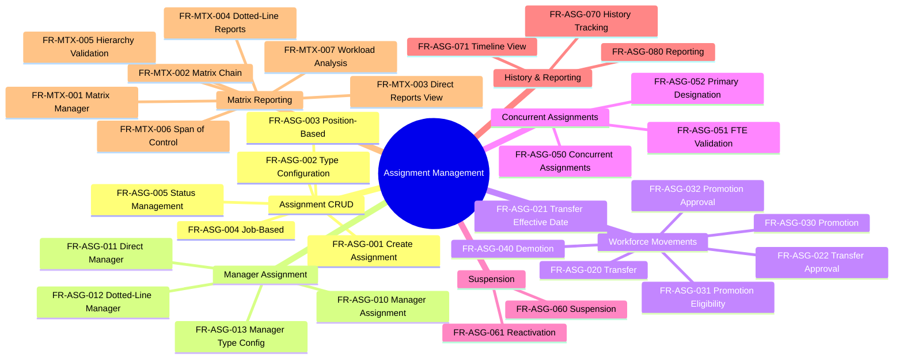

---
# === METADATA ===
id: FRS-CO-ASSIGNMENT
module: CO
sub_module: assignment
title: "Assignment Management Functional Requirements"
version: "1.0.0"
status: DRAFT
owner: "Core HCM Team"
last_updated: "2026-01-08"
tags:
  - assignment
  - staffing
  - transfer
  - promotion
  - matrix-reporting
  - fte

# === REQUIREMENTS DATA ===
requirements:
  # Assignment CRUD (5 FRs)
  - id: FR-ASG-001
    title: "Create Employee Assignment"
    description: "Enable creation of employee assignments to positions/jobs with complete validation"
    priority: MUST
    type: Functional
    risk: high
    status: Defined
    acceptance_criteria:
      - "Employee can be assigned to position or job based on staffing model"
      - "Assignment type selection: PRIMARY, CONCURRENT, TEMPORARY"
      - "FTE allocation specified (0.01-1.0)"
      - "Business unit and location required"
      - "Effective start date specified"
      - "Enforces [[BR-ASG-001]] creation validation"
      - "Position status updated to FILLED for position-based assignments"
    dependencies:
      - "[[Employee]]"
      - "[[Position]]"
      - "[[Job]]"
      - "[[BusinessUnit]]"
      - "[[Location]]"
    implemented_by: []

  - id: FR-ASG-002
    title: "Assignment Type Configuration"
    description: "Configure assignment type codes and rules"
    priority: MUST
    type: Configuration
    risk: low
    status: Defined
    acceptance_criteria:
      - "Assignment type code list managed: PRIMARY, CONCURRENT, TEMPORARY"
      - "Each type has distinct rules for FTE, duration, position"
      - "Active/inactive status per type"
      - "Type cannot be changed after assignment creation"
    dependencies:
      - "[[CodeList]]"
    implemented_by: []

  - id: FR-ASG-003
    title: "Position-Based Assignment"
    description: "Assign employee to specific position slot"
    priority: MUST
    type: Functional
    risk: med

ium
    status: Defined
    acceptance_criteria:
      - "Position must be VACANT to assign"
      - "Job derived from position.job_id automatically"
      - "Position status changes to FILLED on assignment"
      - "Supports max incumbents per position"
      - "Enforces [[BR-ASG-002]] staffing model rules"
    dependencies:
      - "[[Position]]"
      - "[[Assignment]]"
    implemented_by: []

  - id: FR-ASG-004
    title: "Job-Based Assignment"
    description: "Assign employee to job without specific position"
    priority: SHOULD
    type: Functional
    risk: medium
    status: Defined
    acceptance_criteria:
      - "Job specified directly without position"
      - "Used for matrix/project assignments"
      - "Position field must be NULL"
      - "No position status update"
      - "Enforces [[BR-ASG-002]] staffing model rules"
    dependencies:
      - "[[Job]]"
      - "[[Assignment]]"
    implemented_by: []

  - id: FR-ASG-005
    title: "Assignment Status Management"
    description: "Manage assignment lifecycle status transitions"
    priority: MUST
    type: Workflow
    risk: medium
    status: Defined
    acceptance_criteria:
      - "Valid statuses: ACTIVE, SUSPENDED, ENDED"
      - "ACTIVE → SUSPENDED allowed"
      - "SUSPENDED → ACTIVE allowed"
      - "ACTIVE/SUSPENDED → ENDED allowed (terminal state)"
      - "Status change reason required"
      - "Audit trail for status changes"
    dependencies:
      - "[[Assignment]]"
    implemented_by: []

  # Manager Assignment (4 FRs)
  - id: FR-ASG-010
    title: "Manager Assignment"
    description: "Assign solid line and dotted-line managers to employees"
    priority: MUST
    type: Functional
    risk: high
    status: Defined
    acceptance_criteria:
      - "Solid line manager required (except CEO)"
      - "Only one solid line manager per assignment"
      - "Multiple dotted-line managers allowed"
      - "Manager must be active employee"
      - "Enforces [[BR-ASG-004]] manager validation"
      - "Circular reporting prevention"
    dependencies:
      - "[[Assignment]]"
      - "[[Employee]]"
    implemented_by: []

  - id: FR-ASG-011
    title: "Direct Manager"
    description: "Manage direct (solid line) reporting relationship"
    priority: MUST
    type: Functional
    risk: high
    status: Defined
    acceptance_criteria:
      - "Exactly one direct manager per assignment"
      - "Manager assignment creates reporting chain"
      - "Manager change logged with effective date"
      - "Direct reports view available for manager"
      - "Org chart derived from direct reporting"
    dependencies:
      - "[[Assignment]]"
    implemented_by: []

  - id: FR-ASG-012
    title: "Dotted-Line Manager"
    description: "Support matrix reporting with dotted-line managers"
    priority: SHOULD
    type: Functional
    risk: medium
    status: Defined
    acceptance_criteria:
      - "Multiple dotted-line managers allowed"
      - "Dotted-line relationship type specified"
      - "Distinct from solid line reporting"
      - "Matrix reporting chain visible"
      - "Used for project/functional reporting"
    dependencies:
      - "[[Assignment]]"
    implemented_by: []

  - id: FR-ASG-013
    title: "Manager Type Configuration"
    description: "Configure manager relationship types"
    priority: SHOULD
    type: Configuration
    risk: low
    status: Defined
    acceptance_criteria:
      - "Manager types: DIRECT, FUNCTIONAL, PROJECT, ADMINISTRATIVE"
      - "Type determines reporting strength"
      - "Active/inactive status per type"
      - "Used in matrix reporting scenarios"
    dependencies:
      - "[[CodeList]]"
    implemented_by: []

  # Transfers/Promotions/Demotions (7 FRs)
  - id: FR-ASG-020
    title: "Employee Transfer"
    description: "Transfer employee to new position/business unit/location"
    priority: MUST
    type: Workflow
    risk: high
    status: Defined
    acceptance_criteria:
      - "Transfer type selection: LATERAL, PROMOTION, DEMOTION"
      - "Target position/job/business unit specified"
      - "Effective date specified (today or future)"
      - "Transfer reason required"
      - "Old assignment ended, new assignment created"
      - "Enforces [[BR-ASG-015]] transfer validation"
      - "Manager approval required (unless emergency)"
    dependencies:
      - "[[Assignment]]"
      - "[[Position]]"
      - "[[BusinessUnit]]"
    implemented_by: []

  - id: FR-ASG-021
    title: "Transfer Effective Date"
    description: "Validate and manage transfer effective dates"
    priority: MUST
    type: Validation
    risk: medium
    status: Defined
    acceptance_criteria:
      - "Effective date must be today or future"
      - "Old assignment ends day before effective date"
      - "New assignment starts on effective date"
      - "Future-dated transfers can be edited/canceled"
      - "Historical transfers cannot be modified"
    dependencies:
      - "[[Assignment]]"
    implemented_by: []

  - id: FR-ASG-022
    title: "Transfer Approval Workflow"
    description: "Manage approval workflow for employee transfers"
    priority: SHOULD
    type: Workflow
    risk: medium
    status: Planned
    acceptance_criteria:
      - "Manager approval required for standard transfers"
      - "Cross-BU transfers require both managers approval"
      - "Emergency transfers can bypass approval"
      - "Approval history tracked"
      - "Pending transfers visible in manager inbox"
    dependencies:
      - "[[Assignment]]"
      - "[[Approval]]"
    implemented_by: []

  - id: FR-ASG-030
    title: "Employee Promotion"
    description: "Promote employee to higher job level/grade"
    priority: MUST
    type: Workflow
    risk: high
    status: Defined
    acceptance_criteria:
      - "Target job level higher than current"
      - "Promotion effective date specified"
      - "Promotion reason documented"
      - "Manager approval required"
      - "Enforces [[BR-ASG-016]] promotion validation"
      - "Salary adjustment may be triggered"
    dependencies:
      - "[[Assignment]]"
      - "[[Job]]"
      - "[[JobLevel]]"
    implemented_by: []

  - id: FR-ASG-031
    title: "Promotion Eligibility Check"
    description: "Check employee eligibility for promotion"
    priority: SHOULD
    type: Validation
    risk: medium
    status: Planned
    acceptance_criteria:
      - "Minimum tenure in current level checked"
      - "Performance rating threshold validated"
      - "Skills/competencies for target job validated"
      - "Eligibility warnings displayed"
      - "Override allowed with justification"
    dependencies:
      - "[[Employee]]"
      - "[[JobProfile]]"
    implemented_by: []

  - id: FR-ASG-032
    title: "Promotion Approval Workflow"
    description: "Manage approval workflow for promotions"
    priority: SHOULD
    type: Workflow
    risk: medium
    status: Planned
    acceptance_criteria:
      - "Manager approval required"
      - "Multi-level approval for senior roles"
      - "Compensation approval integrated"
      - "Approval timeline tracked"
      - "Promotion notifications sent"
    dependencies:
      - "[[Approval]]"
    implemented_by: []

  - id: FR-ASG-040
    title: "Employee Demotion"
    description: "Demote employee to lower job level/grade"
    priority: SHOULD
    type: Workflow
    risk: high
    status: Defined
    acceptance_criteria:
      - "Target job level lower than current"
      - "Demotion reason required (min 50 characters)"
      - "Senior HR approval required"
      - "Enforces [[BR-ASG-017]] demotion validation"
      - "Compliance flag for review"
      - "Sensitive data handling"
    dependencies:
      - "[[Assignment]]"
      - "[[Job]]"
    implemented_by: []

  # Concurrent Assignments (3 FRs)
  - id: FR-ASG-050
    title: "Concurrent Assignments"
    description: "Enable employees to have multiple simultaneous assignments"
    priority: SHOULD
    type: Functional
    risk: medium
    status: Defined
    acceptance_criteria:
      - "Employee can have PRIMARY + CONCURRENT assignments"
      - "CONCURRENT assignments for projects/matrix roles"
      - "Each assignment has FTE allocation"
      - "Total FTE across assignments tracked"
      - "Enforces [[BR-ASG-018]] concurrent validation"
    dependencies:
      - "[[Assignment]]"
    implemented_by: []

  - id: FR-ASG-051
    title: "FTE Allocation Validation"
    description: "Validate FTE allocations across all assignments"
    priority: MUST
    type: Validation
    risk: high
    status: Defined
    acceptance_criteria:
      - "FTE must be 0.01-1.0 per assignment"
      - "FTE maximum 2 decimal places"
      - "Total FTE across active assignments ≤ 1.0"
      - "Temporary assignments can exceed 1.0 (warning)"
      - "Enforces [[BR-ASG-010]] FTE validation"
      - "FTE changes create new assignment version"
    dependencies:
      - "[[Assignment]]"
    implemented_by: []

  - id: FR-ASG-052
    title: "Primary Assignment Designation"
    description: "Designate one assignment as primary"
    priority: MUST
    type: Validation
    risk: high
    status: Defined
    acceptance_criteria:
      - "Exactly one PRIMARY assignment per employee"
      - "PRIMARY assignment determines main manager, cost center"
      - "Cannot delete PRIMARY if CONCURRENT exists"
      - "Changing PRIMARY updates system defaults"
      - "Primary assignment typically highest FTE"
    dependencies:
      - "[[Assignment]]"
    implemented_by: []

  # Suspension/Reactivation (2 FRs)
  - id: FR-ASG-060
    title: "Assignment Suspension"
    description: "Temporarily suspend assignment"
    priority: SHOULD
    type: Workflow
    risk: medium
    status: Defined
    acceptance_criteria:
      - "Suspension reason required"
      - "Suspended assignments excluded from active headcount"
      - "Position may become available for others"
      - "Suspension period tracked"
      - "Automatic alerts for long suspension"
    dependencies:
      - "[[Assignment]]"
    implemented_by: []

  - id: FR-ASG-061
    title: "Assignment Reactivation"
    description: "Reactivate suspended assignment"
    priority: SHOULD
    type: Workflow
    risk: medium
    status: Defined
    acceptance_criteria:
      - "Reactivation from SUSPENDED to ACTIVE"
      - "Position availability rechecked"
      - "Employee status validated"
      - "Reactivation reason documented"
      - "Included in headcount upon reactivation"
    dependencies:
      - "[[Assignment]]"
    implemented_by: []

  # History & Reporting (3 FRs)
  - id: FR-ASG-070
    title: "Assignment History Tracking"
    description: "Track complete history of all assignment changes"
    priority: MUST
    type: Functional
    risk: medium
    status: Defined
    acceptance_criteria:
      - "SCD Type 2 for assignment changes"
      - "Track all attribute changes with effective dates"
      - "Historical reporting chain preserved"
      - "Transfer/promotion history visible"
      - "Audit trail for compliance"
    dependencies:
      - "[[Assignment]]"
    implemented_by: []

  - id: FR-ASG-071
    title: "Assignment Timeline View"
    description: "Visual timeline of employee assignment history"
    priority: SHOULD
    type: UI/UX
    risk: low
    status: Planned
    acceptance_criteria:
      - "Timeline shows all assignments chronologically"
      - "Concurrent assignments displayed in parallel"
      - "Transfer/promotion events marked"
      - "Manager changes visible"
      - "Export timeline to PDF"
    dependencies:
      - "[[Assignment]]"
    implemented_by: []

  - id: FR-ASG-080
    title: "Assignment Reporting"
    description: "Generate assignment-related reports"
    priority: MUST
    type: Functional
    risk: medium
    status: Defined
    acceptance_criteria:
      - "Active assignments by business unit"
      - "FTE utilization report"
      - "Transfer/promotion statistics"
      - "Position vacancy report"
      - "Manager span of control report"
    dependencies:
      - "[[Assignment]]"
      - "[[BusinessUnit]]"
    implemented_by: []

  # Matrix Reporting (7 FRs)
  - id: FR-MTX-001
    title: "Matrix Manager Assignment"
    description: "Assign matrix managers for functional/project reporting"
    priority: SHOULD
    type: Functional
    risk: medium
    status: Defined
    acceptance_criteria:
      - "Support multiple manager types beyond solid line"
      - "Manager type specifies reporting purpose"
      - "Matrix managers can view but not manage direct reports"
      - "Enforces [[BR-ASG-004]] manager validation"
    dependencies:
      - "[[Assignment]]"
    implemented_by: []

  - id: FR-MTX-002
    title: "Matrix Reporting Chain"
    description: "Manage complex matrix reporting structures"
    priority: SHOULD
    type: Functional
    risk: high
    status: Defined
    acceptance_criteria:
      - "Multiple reporting chains supported (solid + dotted)"
      - "Reporting chain traversal per manager type"
      - "Circular reporting prevention across all chains"
      - "Manager hierarchy visualization"
    dependencies:
      - "[[Assignment]]"
    implemented_by: []

  - id: FR-MTX-003
    title: "Direct Reports View"
    description: "View all direct reports for a manager"
    priority: MUST
    type: Functional
    risk: medium
    status: Defined
    acceptance_criteria:
      - "List all employees with this manager as solid line"
      - "Filter by business unit, location, status"
      - "Sort by name, hire date, job"
      - "Export direct reports list"
      - "Drill down to assignment details"
    dependencies:
      - "[[Assignment]]"
      - "[[Employee]]"
    implemented_by: []

  - id: FR-MTX-004
    title: "Dotted-Line Reports View"
    description: "View all dotted-line reports for a matrix manager"
    priority: SHOULD
    type: Functional
    risk: low
    status: Defined
    acceptance_criteria:
      - "List all employees with this manager as dotted-line"
      - "Manager type indicated"
      - "Distinct from direct reports"
      - "Export dotted-line reports"
    dependencies:
      - "[[Assignment]]"
    implemented_by: []

  - id: FR-MTX-005
    title: "Reporting Hierarchy Validation"
    description: "Validate reporting hierarchy integrity"
    priority: MUST
    type: Validation
    risk: high
    status: Defined
    acceptance_criteria:
      - "No circular reporting chains"
      - "Manager must have active assignment"
      - "Employee cannot be own manager"
      - "Hierarchy depth limits enforced"
      - "Orphaned assignments prevented"
    dependencies:
      - "[[Assignment]]"
    implemented_by: []

  - id: FR-MTX-006
    title: "Span of Control Analysis"
    description: "Analyze manager span of control"
    priority: COULD
    type: Calculation
    risk: low
    status: Planned
    acceptance_criteria:
      - "Calculate direct reports count per manager"
      - "Identify managers exceeding recommended span"
      - "Span of control trends over time"
      - "Comparison across business units"
      - "Recommendations for organizational balance"
    dependencies:
      - "[[Assignment]]"
    implemented_by: []

  - id: FR-MTX-007
    title: "Manager Workload Analysis"
    description: "Analyze manager workload based on team size and composition"
    priority: COULD
    type: Calculation
    risk: low
    status: Planned
    acceptance_criteria:
      - "Factor team size, seniority distribution"
      - "Identify high workload managers"
      - "Workload score calculation"
      - "Alerts for workload imbalance"
      - "Suggest redistribution opportunities"
    dependencies:
      - "[[Assignment]]"
      - "[[Employee]]"
    implemented_by: []

# === ONTOLOGY REFERENCES ===
related_ontology:
  - "[[Assignment]]"
  - "[[Employee]]"
  - "[[Position]]"
  - "[[Job]]"
  - "[[BusinessUnit]]"
  - "[[Location]]"
  - "[[JobLevel]]"
  - "[[JobGrade]]"
---

# Assignment Management Functional Requirements

> **Module**: CO (Core HCM)  
> **Sub-module**: Assignment Management  
> **Total Requirements**: 31 FRs

---

## 1. Functional Scope



---

## 2. Requirement Catalog

| ID | Requirement Detail | Priority | Type |
|----|-------------------|----------|------|
| `[[FR-ASG-001]]` | **Create Employee Assignment**<br>Enable creation of employee assignments to positions/jobs with complete validation | MUST | Functional |
| `[[FR-ASG-002]]` | **Assignment Type Configuration**<br>Configure assignment type codes and rules | MUST | Configuration |
| `[[FR-ASG-003]]` | **Position-Based Assignment**<br>Assign employee to specific position slot | MUST | Functional |
| `[[FR-ASG-004]]` | **Job-Based Assignment**<br>Assign employee to job without specific position | SHOULD | Functional |
| `[[FR-ASG-005]]` | **Assignment Status Management**<br>Manage assignment lifecycle status transitions | MUST | Workflow |
| `[[FR-ASG-010]]` | **Manager Assignment**<br>Assign solid line and dotted-line managers to employees | MUST | Functional |
| `[[FR-ASG-011]]` | **Direct Manager**<br>Manage direct (solid line) reporting relationship | MUST | Functional |
| `[[FR-ASG-012]]` | **Dotted-Line Manager**<br>Support matrix reporting with dotted-line managers | SHOULD | Functional |
| `[[FR-ASG-013]]` | **Manager Type Configuration**<br>Configure manager relationship types | SHOULD | Configuration |
| `[[FR-ASG-020]]` | **Employee Transfer**<br>Transfer employee to new position/business unit/location | MUST | Workflow |
| `[[FR-ASG-021]]` | **Transfer Effective Date**<br>Validate and manage transfer effective dates | MUST | Validation |
| `[[FR-ASG-022]]` | **Transfer Approval Workflow**<br>Manage approval workflow for employee transfers | SHOULD | Workflow |
| `[[FR-ASG-030]]` | **Employee Promotion**<br>Promote employee to higher job level/grade | MUST | Workflow |
| `[[FR-ASG-031]]` | **Promotion Eligibility Check**<br>Check employee eligibility for promotion | SHOULD | Validation |
| `[[FR-ASG-032]]` | **Promotion Approval Workflow**<br>Manage approval workflow for promotions | SHOULD | Workflow |
| `[[FR-ASG-040]]` | **Employee Demotion**<br>Demote employee to lower job level/grade | SHOULD | Workflow |
| `[[FR-ASG-050]]` | **Concurrent Assignments**<br>Enable employees to have multiple simultaneous assignments | SHOULD | Functional |
| `[[FR-ASG-051]]` | **FTE Allocation Validation**<br>Validate FTE allocations across all assignments | MUST | Validation |
| `[[FR-ASG-052]]` | **Primary Assignment Designation**<br>Designate one assignment as primary | MUST | Validation |
| `[[FR-ASG-060]]` | **Assignment Suspension**<br>Temporarily suspend assignment | SHOULD | Workflow |
| `[[FR-ASG-061]]` | **Assignment Reactivation**<br>Reactivate suspended assignment | SHOULD | Workflow |
| `[[FR-ASG-070]]` | **Assignment History Tracking**<br>Track complete history of all assignment changes | MUST | Functional |
| `[[FR-ASG-071]]` | **Assignment Timeline View**<br>Visual timeline of employee assignment history | SHOULD | UI/UX |
| `[[FR-ASG-080]]` | **Assignment Reporting**<br>Generate assignment-related reports | MUST | Functional |
| `[[FR-MTX-001]]` | **Matrix Manager Assignment**<br>Assign matrix managers for functional/project reporting | SHOULD | Functional |
| `[[FR-MTX-002]]` | **Matrix Reporting Chain**<br>Manage complex matrix reporting structures | SHOULD | Functional |
| `[[FR-MTX-003]]` | **Direct Reports View**<br>View all direct reports for a manager | MUST | Functional |
| `[[FR-MTX-004]]` | **Dotted-Line Reports View**<br>View all dotted-line reports for a matrix manager | SHOULD | Functional |
| `[[FR-MTX-005]]` | **Reporting Hierarchy Validation**<br>Validate reporting hierarchy integrity | MUST | Validation |
| `[[FR-MTX-006]]` | **Span of Control Analysis**<br>Analyze manager span of control | COULD | Calculation |
| `[[FR-MTX-007]]` | **Manager Workload Analysis**<br>Analyze manager workload based on team size and composition | COULD | Calculation |

---

## 3. Detailed Specifications

### Assignment CRUD

#### [[FR-ASG-001]] Create Employee Assignment

*   **Description**: Enable HR administrators to create employee assignments to positions or jobs. Assignment creation is the core function that links employees to their organizational roles, reporting lines, and work locations.
*   **Acceptance Criteria**:
    *   Staffing model selection: POSITION_BASED or JOB_BASED
    *   Assignment type selection: PRIMARY, CONCURRENT, or TEMPORARY
    *   FTE allocation (0.01-1.0) with up to 2 decimal places
    *   Business unit and location required
    *   Effective start date specified
    *   Enforces [[BR-ASG-001]] - validates employee status, FTE limits, primary uniqueness
    *   Enforces [[BR-ASG-002]] - staffing model rules for position/job requirements
    *   Position status automatically updated to FILLED for position-based assignments
    *   Assignment created in ACTIVE status by default
*   **Dependencies**:
    *   Depends on: [[Employee]], [[Position]], [[Job]], [[BusinessUnit]], [[Location]]
    *   Enforces: [[BR-ASG-001]], [[BR-ASG-002]]
*   **Mapped Features**: (To be defined during implementation phase)

---

#### [[FR-ASG-003]] Position-Based Assignment

*   **Description**: Assign employee to a specific position slot. This is the standard staffing model where positions represent budgeted headcount slots.
*   **Acceptance Criteria**:
    *   Position must be in VACANT status to assign
    *   Job automatically derived from position.job_id
    *   Position status changes to FILLED upon assignment creation
    *   Supports positions with max_incumbents > 1 (shared positions)
    *   Position slot count decremented
    *   Enforces [[BR-ASG-002]] staffing model validation
*   **Dependencies**:
    *   Depends on: [[Position]], [[Assignment]]
    *   Enforces: [[BR-ASG-002]]
*   **Mapped Features**: (To be defined)

---

#### [[FR-ASG-051]] FTE Allocation Validation

*   **Description**: Validate Full-Time Equivalent (FTE) allocations to ensure employees are not overallocated and assignments have valid FTE values.
*   **Acceptance Criteria**:
    *   FTE must be between 0.01 and 1.0 per assignment
    *   FTE must have maximum 2 decimal places (e.g., 0.75, 0.50)
    *   Total FTE across all active assignments for employee cannot exceed 1.0
    *   TEMPORARY assignments can temporarily exceed 1.0 total (generates warning, not blocking error)
    *   FTE changes create new assignment version (SCD Type 2 for history)
    *   Enforces [[BR-ASG-010]] FTE validation rules
    *   Error messages: FTE_INVALID, FTE_DECIMAL_INVALID, FTE_TOTAL_EXCEEDED
*   **Dependencies**:
    *   Depends on: [[Assignment]]
    *   Enforces: [[BR-ASG-010]]
*   **Mapped Features**: (To be defined)

---

### Manager Assignment

#### [[FR-ASG-010]] Manager Assignment

*   **Description**: Assign reporting managers to employees, establishing the organizational hierarchy. Supports both solid line (direct) and dotted-line (matrix) reporting relationships.
*   **Acceptance Criteria**:
    *   Solid line manager required for all employees except CEO
    *   Only one solid line manager per assignment
    *   Multiple dotted-line managers allowed for matrix reporting
    *   Manager must be an active employee with active assignment
    *   Enforces [[BR-ASG-004]] - prevents self-reporting, circular reporting, inactive managers
    *   Manager assignment creates reporting chain for org chart
    *   Manager change logged with effective date
*   **Dependencies**:
    *   Depends on: [[Assignment]], [[Employee]]
    *   Enforces: [[BR-ASG-004]]
*   **Mapped Features**: (To be defined)

---

#### [[FR-MTX-003]] Direct Reports View

*   **Description**: Provide managers with a view of all their direct reports (employees where manager is solid line manager).
*   **Acceptance Criteria**:
    *   List all employees with this manager as solid line manager
    *   Filter by business unit, location, assignment status
    *   Sort by name, hire date, job title
    *   Export direct reports list to Excel/CSV
    *   Drill down to individual assignment details
    *   Shows FTE, job, location for each direct report
    *   Real-time headcount calculation
*   **Dependencies**:
    *   Depends on: [[Assignment]], [[Employee]]
*   **Mapped Features**: (To be defined)

---

### Workforce Movements

#### [[FR-ASG-020]] Employee Transfer

*   **Description**: Transfer employee to a new position, business unit, or location. Transfers are a core workforce movement that updates organizational placement.
*   **Acceptance Criteria**:
    *   Transfer type selection: LATERAL, PROMOTION, DEMOTION
    *   Target position/job and/or business unit specified
    *   Effective date must be today or future
    *   Transfer reason required for audit trail
    *   Old assignment ended (end_date = effective_date - 1 day)
    *   New assignment created (start_date = effective_date)
    *   Enforces [[BR-ASG-015]] - validates active assignment, transfer type, target validity
    *   Manager approval required unless emergency transfer
    *   Transfer logged with full audit trail
*   **Dependencies**:
    *   Depends on: [[Assignment]], [[Position]], [[BusinessUnit]]
    *   Enforces: [[BR-ASG-015]]
*   **Mapped Features**: (To be defined)

---

####[[FR-ASG-030]] Employee Promotion

*   **Description**: Promote employee to a higher job level or grade. Promotions are upward workforce movements that require validation and approval.
*   **Acceptance Criteria**:
    *   Target job level must be higher than current job level OR target job grade higher (if same level)
    *   Promotion effective date specified (today or future)
    *   Promotion reason documented for audit
    *   Manager approval required
    *   Enforces [[BR-ASG-016]] - validates higher level/grade
    *   Creates new assignment version with target job
    *   May trigger compensation review workflow (integration point)
    *   Promotion history visible in employee assignment timeline
*   **Dependencies**:
    *   Depends on: [[Assignment]], [[Job]], [[JobLevel]]
    *   Enforces: [[BR-ASG-016]]
*   **Mapped Features**: (To be defined)

---

## 4. Requirement Hierarchy

```mermaid
requirementDiagram

    %% === COLOR STYLING ===
    classDef epic fill:#e1bee7,stroke:#7b1fa2,stroke-width:2px
    classDef fr fill:#e3f2fd,stroke:#1565c0,stroke-width:2px
    classDef entity fill:#e8f5e9,stroke:#2e7d32,stroke-width:2px

    %% === ASSIGNMENT MANAGEMENT CAPABILITY ===
    requirement AssignmentMgmt {
        id: FRS_CO_ASG
        text: Assignment Management Capability
        risk: high
        verifymethod: demonstration
    }:::epic

    %% === ASSIGNMENT CRUD ===
    functionalRequirement CreateAssignment {
        id: FR_ASG_001
        text: Create Employee Assignment
        risk: high
        verifymethod: test
    }:::fr

    functionalRequirement PositionBased {
        id: FR_ASG_003
        text: Position-Based Assignment
        risk: medium
        verifymethod: test
    }:::fr

    functionalRequirement FTEValidation {
        id: FR_ASG_051
        text: FTE Allocation Validation
        risk: high
        verifymethod: test
    }:::fr

    %% === MANAGER ASSIGNMENT ===
    functionalRequirement ManagerAssignment {
        id: FR_ASG_010
        text: Manager Assignment
        risk: high
        verifymethod: test
    }:::fr

    functionalRequirement DirectReports {
        id: FR_MTX_003
        text: Direct Reports View
        risk: medium
        verifymethod: test
    }:::fr

    %% === WORKFORCE MOVEMENTS ===
    functionalRequirement Transfer {
        id: FR_ASG_020
        text: Employee Transfer
        risk: high
        verifymethod: test
    }:::fr

    functionalRequirement Promotion {
        id: FR_ASG_030
        text: Employee Promotion
        risk: high
        verifymethod: test
    }:::fr

    functionalRequirement Demotion {
        id: FR_ASG_040
        text: Employee Demotion
        risk: high
        verifymethod: test
    }:::fr

    %% === ENTITIES ===
    element Assignment {
        type: Entity
        docref: assignment.onto.md
    }:::entity

    element Employee {
        type: Entity
        docref: employee.onto.md
    }:::entity

    element Position {
        type: Entity
        docref: position.onto.md
    }:::entity

    element Job {
        type: Entity
        docref: job.onto.md
    }:::entity

    element BusinessUnit {
        type: Entity
        docref: business-unit.onto.md
    }:::entity

    %% === RELATIONSHIPS ===
    AssignmentMgmt - contains -> CreateAssignment
    AssignmentMgmt - contains -> PositionBased
    AssignmentMgmt - contains -> FTEValidation
    AssignmentMgmt - contains -> ManagerAssignment
    AssignmentMgmt - contains -> DirectReports
    AssignmentMgmt - contains -> Transfer
    AssignmentMgmt - contains -> Promotion
    AssignmentMgmt - contains -> Demotion

    CreateAssignment - traces -> Assignment
    CreateAssignment - traces -> Employee
    CreateAssignment - traces -> Position
    CreateAssignment - traces -> Job
    
PositionBased - traces -> Position
    FTEValidation - traces -> Assignment
    ManagerAssignment - traces -> Assignment
    DirectReports - traces -> Employee
    Transfer - traces -> Assignment
    Transfer - traces -> BusinessUnit
    Promotion - traces -> Job
    Demotion - traces -> Job
```

---

## 5. Summary

This FRS defines **31 functional requirements** for Assignment Management:

- **Assignment CRUD** (5 FRs): Core assignment operations, position/job-based staffing, status management
- **Manager Assignment** (4 FRs): Solid line and matrix reporting relationships
- **Workforce Movements** (7 FRs): Transfers, promotions, demotions with validation and approval
- **Concurrent Assignments** (3 FRs): Multiple assignments per employee with FTE validation
- **Suspension** (2 FRs): Temporary suspension and reactivation
- **History & Reporting** (3 FRs): Assignment history tracking, timeline views, reports
- **Matrix Reporting** (7 FRs): Complex reporting structures, span of control, workload analysis

All requirements are testable, traceable to business rules, and mapped to ontology entities for implementation.
