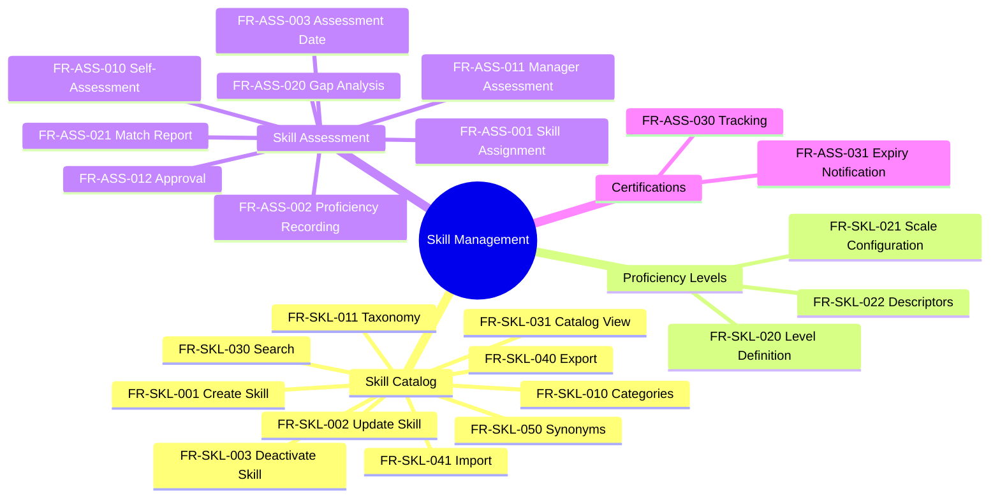

---
# === METADATA ===
id: FRS-CO-SKILL
module: CORE
sub_module: SKILL_MANAGEMENT
title: "Skill Management Requirements"
version: "1.0.0"
status: DRAFT
owner: "Core HR Team"
last_updated: "2026-01-08"
tags:
  - skill
  - competency
  - proficiency
  - assessment
  - certification
  - talent

# === REQUIREMENTS DATA ===
requirements:
  # Skill Catalog (13 FRs)
  - id: FR-SKL-001
    title: "Create Skill"
    description: "System must allow creation of skills in the skill catalog."
    priority: MUST
    type: Functional
    risk: medium
    status: TODO
    acceptance_criteria:
      - "Skill name is required and unique within category"
      - "Skill category is required"
      - "Skill description supported"
      - "Skill type (technical, soft, language) captured"
      - "Skill code auto-generated or manual entry"
    dependencies:
      - "[[SkillMaster]]"
      - "[[SkillCategory]]"
    implemented_by: []

  - id: FR-SKL-002
    title: "Update Skill"
    description: "System must allow updating skill information."
    priority: MUST
    type: Functional
    risk: low
    status: TODO
    acceptance_criteria:
      - "All editable fields can be updated"
      - "Skill name uniqueness validated on update"
      - "Change history maintained"
    dependencies:
      - "[[SkillMaster]]"
    implemented_by: []

  - id: FR-SKL-003
    title: "Deactivate Skill"
    description: "System must support skill deactivation."
    priority: MUST
    type: Workflow
    risk: low
    status: TODO
    acceptance_criteria:
      - "Deactivation sets end date and inactive flag"
      - "Deactivated skills excluded from active lists"
      - "Historical skill assignments preserved"
    dependencies:
      - "[[SkillMaster]]"
    implemented_by: []

  - id: FR-SKL-010
    title: "Skill Category Management"
    description: "System must support hierarchical skill categories."
    priority: MUST
    type: Configuration
    risk: low
    status: TODO
    acceptance_criteria:
      - "Categories configurable (e.g., Technical, Soft Skills, Languages)"
      - "Parent-child hierarchy supported"
      - "Category code and name required"
    dependencies:
      - "[[SkillCategory]]"
    implemented_by: []

  - id: FR-SKL-011
    title: "Skill Taxonomy"
    description: "System should support skill taxonomy with parent-child relationships."
    priority: SHOULD
    type: Functional
    risk: medium
    status: TODO
    acceptance_criteria:
      - "Skills can have parent skills"
      - "Skill hierarchy visualized"
      - "Maximum depth limit enforced"
    dependencies:
      - "[[SkillMaster]]"
    implemented_by: []

  - id: FR-SKL-020
    title: "Proficiency Level Definition"
    description: "System must support configurable proficiency levels."
    priority: MUST
    type: Configuration
    risk: medium
    status: TODO
    acceptance_criteria:
      - "Multiple proficiency scales supported (e.g., 1-5, Beginner-Expert)"
      - "Level code, name, and description defined"
      - "Proficiency levels ordered"
    dependencies:
      - "[[CodeList]]"
    implemented_by: []

  - id: FR-SKL-021
    title: "Proficiency Scale Configuration"
    description: "System must support different proficiency scales per skill type."
    priority: MUST
    type: Configuration
    risk: low
    status: TODO
    acceptance_criteria:
      - "Default scale configurable globally"
      - "Skill-specific scale override supported"
      - "Common scales: 1-5, Beginner/Intermediate/Advanced/Expert"
    dependencies:
      - "[[CodeList]]"
    implemented_by: []

  - id: FR-SKL-022
    title: "Proficiency Descriptors"
    description: "System should support detailed proficiency level descriptors."
    priority: SHOULD
    type: Configuration
    risk: low
    status: TODO
    acceptance_criteria:
      - "Each proficiency level has detailed description"
      - "Behavioral indicators per level supported"
      - "Descriptors help in self-assessment"
    dependencies:
      - "[[CodeList]]"
    implemented_by: []

  - id: FR-SKL-030
    title: "Skill Search & Filter"
    description: "System must provide skill search and filtering."
    priority: MUST
    type: Functional
    risk: low
    status: TODO
    acceptance_criteria:
      - "Search by skill name (partial match)"
      - "Filter by category"
      - "Filter by skill type"
      - "Filter by status (active/inactive)"
      - "Results paginated"
    dependencies:
      - "[[SkillMaster]]"
    implemented_by: []

  - id: FR-SKL-031
    title: "Skill Catalog View"
    description: "System should provide browsable skill catalog view."
    priority: SHOULD
    type: UI/UX
    risk: low
    status: TODO
    acceptance_criteria:
      - "Skills displayed by category"
      - "Hierarchical tree view supported"
      - "Skill details accessible on click"
      - "Quick add to employee skills"
    dependencies:
      - "[[SkillMaster]]"
    implemented_by: []

  - id: FR-SKL-040
    title: "Skill Data Export"
    description: "System should support skill catalog export."
    priority: SHOULD
    type: Integration
    risk: low
    status: TODO
    acceptance_criteria:
      - "Export to Excel, CSV formats"
      - "All skill attributes included"
      - "Category hierarchy preserved in export"
    dependencies:
      - "[[SkillMaster]]"
    implemented_by: []

  - id: FR-SKL-041
    title: "Skill Data Import"
    description: "System should support bulk skill import."
    priority: SHOULD
    type: Integration
    risk: medium
    status: TODO
    acceptance_criteria:
      - "Import from Excel, CSV templates"
      - "Validation of required fields"
      - "Duplicate detection and handling"
      - "Import summary report generated"
    dependencies:
      - "[[SkillMaster]]"
    implemented_by: []

  - id: FR-SKL-050
    title: "Skill Synonyms Management"
    description: "System could support skill synonyms for search."
    priority: COULD
    type: Functional
    risk: low
    status: TODO
    acceptance_criteria:
      - "Multiple synonyms per skill supported"
      - "Synonyms included in search"
      - "Synonym management UI provided"
    dependencies:
      - "[[SkillMaster]]"
    implemented_by: []

  # Skill Assessment (11 FRs)
  - id: FR-ASS-001
    title: "Employee Skill Assignment"
    description: "System must allow assigning skills to employees."
    priority: MUST
    type: Functional
    risk: medium
    status: TODO
    acceptance_criteria:
      - "Select skill from catalog"
      - "Proficiency level required"
      - "Assessment date captured"
      - "Multiple skills per employee supported"
    dependencies:
      - "[[WorkerSkill]]"
      - "[[SkillMaster]]"
    implemented_by: []

  - id: FR-ASS-002
    title: "Skill Proficiency Recording"
    description: "System must record skill proficiency levels."
    priority: MUST
    type: Functional
    risk: medium
    status: TODO
    acceptance_criteria:
      - "Proficiency level from configured scale"
      - "Current vs target proficiency tracked"
      - "Proficiency history maintained"
    dependencies:
      - "[[WorkerSkill]]"
    implemented_by: []

  - id: FR-ASS-003
    title: "Skill Assessment Date"
    description: "System must track when skills were assessed."
    priority: MUST
    type: Functional
    risk: low
    status: TODO
    acceptance_criteria:
      - "Assessment date required for each skill"
      - "Last assessment date displayed"
      - "Skill age calculated (days since assessment)"
      - "Re-assessment reminders configurable"
    dependencies:
      - "[[WorkerSkill]]"
    implemented_by: []

  - id: FR-ASS-010
    title: "Self-Assessment"
    description: "System should allow employees to self-assess skills."
    priority: SHOULD
    type: Workflow
    risk: medium
    status: TODO
    acceptance_criteria:
      - "Employee selects skills and proficiency levels"
      - "Self-assessment flagged for review"
      - "Manager approval workflow triggered"
      - "Self-assessment vs validated proficiency compared"
    dependencies:
      - "[[WorkerSkill]]"
    implemented_by: []

  - id: FR-ASS-011
    title: "Manager Assessment"
    description: "System should allow managers to assess employee skills."
    priority: SHOULD
    type: Workflow
    risk: medium
    status: TODO
    acceptance_criteria:
      - "Manager views employee skill list"
      - "Manager can add/update/remove skills"
      - "Manager can adjust proficiency levels"
      - "Assessment comments supported"
    dependencies:
      - "[[WorkerSkill]]"
    implemented_by: []

  - id: FR-ASS-012
    title: "Assessment Approval"
    description: "System should support skill assessment approval workflow."
    priority: SHOULD
    type: Workflow
    risk: low
    status: TODO
    acceptance_criteria:
      - "Self-assessments require manager approval"
      - "Approval/rejection tracked"
      - "Rejected assessments require revision"
      - "Approved skills become validated"
    dependencies:
      - "[[WorkerSkill]]"
    implemented_by: []

  - id: FR-ASS-020
    title: "Skill Gap Analysis"
    description: "System should calculate skill gaps against job requirements."
    priority: SHOULD
    type: Calculation
    risk: medium
    status: TODO
    acceptance_criteria:
      - "Compare employee skills vs job profile requirements"
      - "Identify missing skills"
      - "Calculate proficiency gaps for matched skills"
      - "Gap score/percentage calculated"
      - "Gap analysis report generated"
    dependencies:
      - "[[WorkerSkill]]"
      - "[[JobProfile]]"
    implemented_by: []

  - id: FR-ASS-021
    title: "Skill Match Report"
    description: "System should generate skill match reports."
    priority: SHOULD
    type: Functional
    risk: low
    status: TODO
    acceptance_criteria:
      - "Find employees by required skills"
      - "Match percentage calculated"
      - "Filter by minimum proficiency level"
      - "Export match results"
    dependencies:
      - "[[WorkerSkill]]"
    implemented_by: []

  - id: FR-ASS-030
    title: "Certification Tracking"
    description: "System should track professional certifications."
    priority: SHOULD
    type: Functional
    risk: medium
    status: TODO
    acceptance_criteria:
      - "Link certifications to skills"
      - "Certification number, issue date, expiry date captured"
      - "Issuing organization recorded"
      - "Certification documents attached"
    dependencies:
      - "[[WorkerSkill]]"
      - "[[Document]]"
    implemented_by: []

  - id: FR-ASS-031
    title: "Certification Expiry Notification"
    description: "System should notify of expiring certifications."
    priority: SHOULD
    type: Workflow
    risk: low
    status: TODO
    acceptance_criteria:
      - "Alerts at 90, 60, 30 days before expiry"
      - "Notification to employee and manager"
      - "Expired certifications flagged"
      - "Renewal tracking supported"
    dependencies:
      - "[[WorkerSkill]]"
    implemented_by: []

# === ONTOLOGY REFERENCES ===
related_ontology:
  - "[[SkillMaster]]"
  - "[[SkillCategory]]"
  - "[[WorkerSkill]]"
  - "[[JobProfile]]"
  - "[[Document]]"
  - "[[CodeList]]"
---

# Functional Requirements: Skill Management

> **Scope**: This FRS file defines all functional requirements for Skill Management in the Core module. These requirements cover skill catalog management, proficiency levels, skill assessment, and certification tracking.

## 1. Functional Scope



## 2. Requirement Catalog

| ID | Requirement Detail | Priority | Type |
|----|-------------------|----------|------|
| `[[FR-SKL-001]]` | **Create Skill**<br>Create skills in the skill catalog | MUST | Functional |
| `[[FR-SKL-002]]` | **Update Skill**<br>Update skill information | MUST | Functional |
| `[[FR-SKL-003]]` | **Deactivate Skill**<br>Skill deactivation workflow | MUST | Workflow |
| `[[FR-SKL-010]]` | **Skill Category Management**<br>Hierarchical skill categories | MUST | Configuration |
| `[[FR-SKL-011]]` | **Skill Taxonomy**<br>Parent-child skill relationships | SHOULD | Functional |
| `[[FR-SKL-020]]` | **Proficiency Level Definition**<br>Configurable proficiency levels | MUST | Configuration |
| `[[FR-SKL-021]]` | **Proficiency Scale Configuration**<br>Different scales per skill type | MUST | Configuration |
| `[[FR-SKL-022]]` | **Proficiency Descriptors**<br>Detailed level descriptors | SHOULD | Configuration |
| `[[FR-SKL-030]]` | **Skill Search & Filter**<br>Search and filter skills | MUST | Functional |
| `[[FR-SKL-031]]` | **Skill Catalog View**<br>Browsable skill catalog | SHOULD | UI/UX |
| `[[FR-SKL-040]]` | **Skill Data Export**<br>Export skill catalog | SHOULD | Integration |
| `[[FR-SKL-041]]` | **Skill Data Import**<br>Bulk skill import | SHOULD | Integration |
| `[[FR-SKL-050]]` | **Skill Synonyms Management**<br>Skill synonyms for search | COULD | Functional |
| `[[FR-ASS-001]]` | **Employee Skill Assignment**<br>Assign skills to employees | MUST | Functional |
| `[[FR-ASS-002]]` | **Skill Proficiency Recording**<br>Record proficiency levels | MUST | Functional |
| `[[FR-ASS-003]]` | **Skill Assessment Date**<br>Track assessment dates | MUST | Functional |
| `[[FR-ASS-010]]` | **Self-Assessment**<br>Employee self-assess skills | SHOULD | Workflow |
| `[[FR-ASS-011]]` | **Manager Assessment**<br>Manager assess employee skills | SHOULD | Workflow |
| `[[FR-ASS-012]]` | **Assessment Approval**<br>Skill assessment approval | SHOULD | Workflow |
| `[[FR-ASS-020]]` | **Skill Gap Analysis**<br>Calculate skill gaps | SHOULD | Calculation |
| `[[FR-ASS-021]]` | **Skill Match Report**<br>Generate skill match reports | SHOULD | Functional |
| `[[FR-ASS-030]]` | **Certification Tracking**<br>Track professional certifications | SHOULD | Functional |
| `[[FR-ASS-031]]` | **Certification Expiry Notification**<br>Notify of expiring certifications | SHOULD | Workflow |

## 3. Detailed Specifications

### [[FR-SKL-001]] Create Skill

*   **Description**: System must allow creation of skills in the centralized skill catalog for use across the organization.
*   **Acceptance Criteria**:
    *   Skill name is required and must be unique within category
    *   Skill category is required (from configured categories)
    *   Skill description supported (optional, rich text)
    *   Skill type captured (technical, soft, language, certification)
    *   Skill code can be auto-generated or manually entered
    *   Effective dates supported for skill lifecycle
*   **Dependencies**: [[SkillMaster]], [[SkillCategory]]
*   **Enforces**: Skill validation rules

---

### [[FR-SKL-020]] Proficiency Level Definition

*   **Description**: System must support configurable proficiency levels to measure skill competency.
*   **Acceptance Criteria**:
    *   Multiple proficiency scales supported (numeric 1-5, or named levels)
    *   Common scales: 1-5, Beginner/Intermediate/Advanced/Expert, None/Basic/Proficient/Advanced/Expert
    *   Level code, name, and description defined for each level
    *   Proficiency levels ordered (for scoring and comparison)
    *   Default scale configurable globally
    *   Skill-specific scale override supported
*   **Dependencies**: [[CodeList]]
*   **Enforces**: None

---

### [[FR-ASS-001]] Employee Skill Assignment

*   **Description**: System must allow assigning skills from the catalog to employees with proficiency levels.
*   **Acceptance Criteria**:
    *   Select skill from centralized skill catalog
    *   Proficiency level required (from configured scale)
    *   Assessment date captured automatically
    *   Multiple skills per employee supported
    *   Skill source tracked (self-assessment, manager, certification)
    *   Validation status tracked (pending, validated)
*   **Dependencies**: [[WorkerSkill]], [[SkillMaster]], [[Employee]]
*   **Enforces**: Skill assignment rules

---

### [[FR-ASS-020]] Skill Gap Analysis

*   **Description**: System should calculate skill gaps by comparing employee skills against job profile requirements.
*   **Acceptance Criteria**:
    *   Compare employee skills vs job profile required skills
    *   Identify skills present in job but missing from employee
    *   Calculate proficiency gaps for matched skills (e.g., employee has level 2, job requires level 4)
    *   Overall gap score/percentage calculated
    *   Gap analysis report generated with recommendations
    *   Export gap analysis results
*   **Dependencies**: [[WorkerSkill]], [[JobProfile]], [[Employee]]
*   **Enforces**: None

---

## 4. Requirement Hierarchy

```mermaid
requirementDiagram

    %% === STYLING ===
    classDef epic fill:#e1bee7,stroke:#7b1fa2,stroke-width:2px
    classDef fr fill:#e3f2fd,stroke:#1565c0,stroke-width:2px
    classDef entity fill:#e8f5e9,stroke:#2e7d32,stroke-width:2px

    %% === CAPABILITY ===
    requirement SkillManagement {
        id: FRS_CO_SKILL
        text: "Manage skill catalog and employee skill assessments"
        risk: medium
        verifymethod: demonstration
    }:::epic

    %% === CATALOG REQUIREMENTS ===
    functionalRequirement CreateSkill {
        id: FR_SKL_001
        text: "Create skill in catalog"
        risk: medium
        verifymethod: test
    }:::fr

    functionalRequirement ProficiencyConfig {
        id: FR_SKL_020
        text: "Configure proficiency levels"
        risk: medium
        verifymethod: test
    }:::fr

    %% === ASSESSMENT REQUIREMENTS ===
    functionalRequirement SkillAssignment {
        id: FR_ASS_001
        text: "Assign skills to employees"
        risk: medium
        verifymethod: test
    }:::fr

    functionalRequirement GapAnalysis {
        id: FR_ASS_020
        text: "Calculate skill gaps"
        risk: medium
        verifymethod: test
    }:::fr

    %% === ENTITIES ===
    element SkillMaster {
        type: "Entity"
        docref: "skill-master.onto.md"
    }:::entity

    element WorkerSkill {
        type: "Entity"
        docref: "worker-skill.onto.md"
    }:::entity

    element JobProfile {
        type: "Entity"
        docref: "job-profile.onto.md"
    }:::entity

    %% === RELATIONSHIPS ===
    SkillManagement - contains -> CreateSkill
    SkillManagement - contains -> ProficiencyConfig
    SkillManagement - contains -> SkillAssignment
    SkillManagement - contains -> GapAnalysis

    CreateSkill - traces -> SkillMaster
    SkillAssignment - traces -> WorkerSkill
    GapAnalysis - traces -> WorkerSkill
    GapAnalysis - traces -> JobProfile
```

---

## 5. Business Rules Reference

| FR ID | Related Business Rules |
|-------|----------------------|
| FR-SKL-001 | Skill creation validation rules |
| FR-SKL-020 | Proficiency level configuration rules |
| FR-ASS-001 | Skill assignment validation rules |
| FR-ASS-020 | Skill gap calculation rules |
