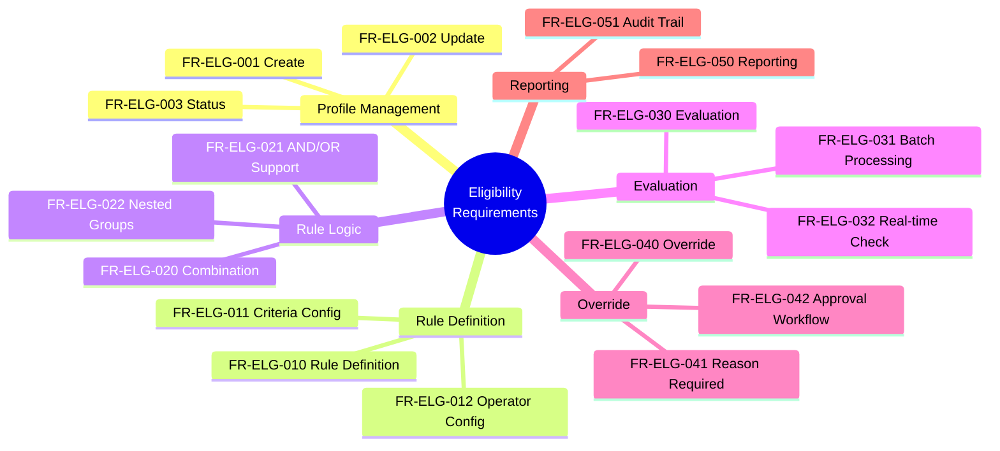
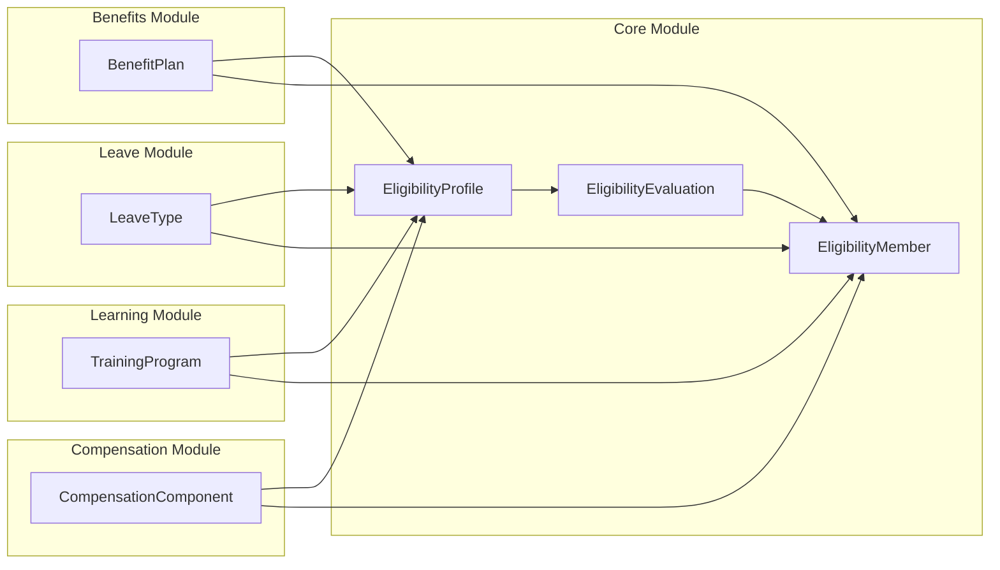

---
# === METADATA ===
id: FRS-CO-ELIG
module: CORE
sub_module: ELIGIBILITY_MANAGEMENT
title: "Eligibility Management Functional Requirements"
version: "1.0.0"
status: DRAFT
owner: "Core Platform Team"
last_updated: "2026-01-08"
tags:
  - eligibility
  - eligibility-profile
  - eligibility-evaluation
  - cross-module
  - benefit-eligibility

# === FUNCTIONAL REQUIREMENTS DATA ===
functional_requirements:
  # Profile Management
  - id: FR-ELG-001
    title: "Create Eligibility Profile"
    description: "System shall allow authorized users to create eligibility profiles with program context, rule definitions, and profile type (DEFAULT/OVERRIDE)."
    priority: MUST
    type: Functional
    risk: high
    status: Defined
    acceptance_criteria:
      - "User can create eligibility profile with required fields: code, name, program_context, profile_type"
      - "System validates program context (module + program_id)"
      - "System validates profile_type is DEFAULT or OVERRIDE"
      - "User can define one or more eligibility rules"
      - "System requires effective_start_date"
      - "System assigns default priority (10 for DEFAULT, custom for OVERRIDE)"
      - "System validates rule expression syntax"
      - "Profile created in DRAFT status by default"
    dependencies:
      - "[[EligibilityProfile]]"
      - "[[Program]]"
    related_rules:
      - "[[BR-ELIG-001]]"

  - id: FR-ELG-002
    title: "Update Eligibility Profile"
    description: "System shall allow authorized users to update eligibility profiles while maintaining version history and effective dating."
    priority: MUST
    type: Functional
    risk: medium
    status: Defined
    acceptance_criteria:
      - "User can update profile name, description, rules"
      - "System prevents code changes (code is immutable)"
      - "User can add, modify, or remove eligibility rules"
      - "System validates all rule expressions"
      - "Changes effective immediately or future-dated"
      - "System maintains version history (SCD-2)"
      - "System triggers re-evaluation if rules changed"
      - "Update creates audit trail"
    dependencies:
      - "[[EligibilityProfile]]"

  - id: FR-ELG-003
    title: "Eligibility Profile Status Management"
    description: "System shall support eligibility profile lifecycle with DRAFT, ACTIVE, INACTIVE states and state transitions."
    priority: MUST
    type: Workflow
    risk: medium
    status: Defined
    acceptance_criteria:
      - "New profiles created in DRAFT status"
      - "User can activate DRAFT profile to ACTIVE"
      - "System validates rule syntax before activation"
      - "User can deactivate ACTIVE profile to INACTIVE"
      - "User can reactivate INACTIVE profile to ACTIVE"
      - "INACTIVE profiles do not run evaluations"
      - "System prevents deletion of profiles with history"
      - "Status changes create audit trail"
    dependencies:
      - "[[EligibilityProfile]]"

  # Rule Definition
  - id: FR-ELG-010
    title: "Eligibility Rule Definition"
    description: "System shall provide UI for defining eligibility rules with field selection, operator configuration, and value specification."
    priority: MUST
    type: Functional
    risk: high
    status: Defined
    acceptance_criteria:
      - "User can select data fields from employee/assignment/contract model"
      - "System provides available operators per field type"
      - "User can specify comparison values"
      - "User can combine multiple conditions"
      - "System validates rule expression syntax"
      - "User can preview rule logic in UI"
      - "System stores rules as JSON structure"
      - "Rules support nested conditions"
    dependencies:
      - "[[EligibilityProfile]]"
    related_rules:
      - "[[BR-ELIG-002]]"

  - id: FR-ELG-011
    title: "Rule Criteria Configuration"
    description: "System shall support configuration of available rule criteria including field definitions and data types."
    priority: MUST
    type: Configuration
    risk: medium
    status: Defined
    acceptance_criteria:
      - "System defines available fields for eligibility rules"
      - "Fields include: employment_type, grade, country, business_unit, tenure, FTE, etc."
      - "System defines data type for each field"
      - "Admin can add custom fields"
      - "System validates field references in rules"
      - "Field catalog documented for users"
    dependencies:
      - "[[EligibilityProfile]]"
      - "[[Employee]]"
      - "[[Assignment]]"

  - id: FR-ELG-012
    title: "Rule Operator Configuration"
    description: "System shall support configuration of available operators (EQUALS, IN, GT, LT, CONTAINS, etc.) for rule expressions."
    priority: MUST
    type: Configuration
    risk: low
    status: Defined
    acceptance_criteria:
      - "System supports operators: EQUALS, NOT_EQUALS, IN, NOT_IN, GT, GTE, LT, LTE, CONTAINS"
      - "Operators available based on field data type"
      - "Numeric fields: GT, GTE, LT, LTE, EQUALS"
      - "String fields: EQUALS, CONTAINS, IN"
      - "Date fields: GT, GTE, LT, LTE"
      - "Boolean fields: EQUALS"
      - "System validates operator compatibility"
    dependencies:
      - "[[EligibilityProfile]]"

  # Rule Combination Logic
  - id: FR-ELG-020
    title: "Rule Combination Logic"
    description: "System shall support AND/OR logical operators for combining multiple rule conditions."
    priority: MUST
    type: Validation
    risk: high
    status: Defined
    acceptance_criteria:
      - "User can combine conditions with AND logic (all must be true)"
      - "User can combine conditions with OR logic (any must be true)"
      - "System supports mixed AND/OR in same rule"
      - "System validates logical operator precedence"
      - "User can group conditions with parentheses"
      - "System evaluates nested conditions correctly"
      - "UI provides clear visualization of logic"
    dependencies:
      - "[[EligibilityProfile]]"

  - id: FR-ELG-021
    title: "AND/OR Logic Support"
    description: "System shall provide UI controls for building complex AND/OR logic trees in eligibility rules."
    priority: MUST
    type: Functional
    risk: medium
    status: Defined
    acceptance_criteria:
      - "User can add condition groups"
      - "User can specify AND/OR between groups"
      - "User can nest groups up to 3 levels"
      - "UI displays logic tree visually"
      - "User can reorder conditions"
      - "System validates parentheses balancing"
      - "User can test logic with sample data"
    dependencies:
      - "[[EligibilityProfile]]"

  - id: FR-ELG-022
    title: "Nested Rule Groups"
    description: "System shall support nested rule groups for complex eligibility criteria."
    priority: SHOULD
    type: Functional
    risk: medium
    status: Planned
    acceptance_criteria:
      - "User can create nested condition groups"
      - "System supports up to 5 nesting levels"
      - "Each group can have its own AND/OR operator"
      - "UI provides tree view of nested structure"
      - "System evaluates nested logic correctly"
      - "User can collapse/expand groups"
    dependencies:
      - "[[EligibilityProfile]]"

  # Eligibility Evaluation
  - id: FR-ELG-030
    title: "Eligibility Evaluation"
    description: "System shall execute eligibility evaluation using Default + Override model and return boolean result with reason codes."
    priority: MUST
    type: Calculation
    risk: high
    status: Defined
    acceptance_criteria:
      - "System can evaluate eligibility for employee + program combination"
      - "System checks for OVERRIDE profile first"
      - "System falls back to DEFAULT profile if no override"
      - "System returns is_eligible (true/false)"
      - "System returns reason_codes (which rules passed/failed)"
      - "System evaluates rules against current employee data"
      - "System supports as-of-date evaluation"
      - "Evaluation creates EligibilityEvaluation record"
      - "System logs all evaluations"
    dependencies:
      - "[[EligibilityProfile]]"
      - "[[EligibilityEvaluation]]"
      - "[[Employee]]"
    related_rules:
      - "[[BR-ELIG-003]]"

  - id: FR-ELG-031
    title: "Batch Eligibility Processing"
    description: "System shall support batch processing for evaluating eligibility across multiple employees."
    priority: SHOULD
    type: Workflow
    risk: medium
    status: Planned
    acceptance_criteria:
      - "User can trigger batch evaluation for program"
      - "System evaluates all active employees"
      - "System processes in batches (e.g., 1000 at a time)"
      - "User receives progress notifications"
      - "System updates EligibilityMember records"
      - "Batch operation can be scheduled"
      - "System provides summary report after completion"
    dependencies:
      - "[[EligibilityProfile]]"
      - "[[EligibilityEvaluation]]"
      - "[[EligibilityMember]]"
    related_rules:
      - "[[BR-ELIG-004]]"

  - id: FR-ELG-032
    title: "Real-time Eligibility Check"
    description: "System shall provide real-time eligibility check API for on-demand evaluation."
    priority: SHOULD
    type: Functional
    risk: medium
    status: Planned
    acceptance_criteria:
      - "API accepts employee_id + program_id"
      - "System returns is_eligible immediately"
      - "System includes reason_codes in response"
      - "API supports as-of-date parameter"
      - "Response includes cache status"
      - "System evaluates in under 100ms"
      - "API is callable from other modules"
    dependencies:
      - "[[EligibilityProfile]]"
      - "[[EligibilityEvaluation]]"

  # Override Management
  - id: FR-ELG-040
    title: "Eligibility Override"
    description: "System shall allow HR administrators to manually override eligibility results with proper justification."
    priority: SHOULD
    type: Functional
    risk: high
    status: Defined
    acceptance_criteria:
      - "HR admin can create OVERRIDE eligibility profile"
      - "Override profile targets specific employees"
      - "User must provide override reason"
      - "Override takes precedence over default evaluation"
      - "Override has effective date range"
      - "System logs all override actions"
      - "Override can make ineligible employees eligible"
      - "Override can make eligible employees ineligible"
    dependencies:
      - "[[EligibilityProfile]]"
      - "[[EligibilityMember]]"

  - id: FR-ELG-041
    title: "Override Reason Requirement"
    description: "System shall require and validate override reasons for all manual eligibility changes."
    priority: MUST
    type: Validation
    risk: medium
    status: Defined
    acceptance_criteria:
      - "System requires override reason when creating OVERRIDE profile"
      - "Reason must be minimum 10 characters"
      - "System provides predefined reason codes"
      - "User can enter free text reason"
      - "Reason stored permanently with override record"
      - "Reason displayed in audit trail"
      - "System prevents override without reason"
    dependencies:
      - "[[EligibilityProfile]]"

  - id: FR-ELG-042
    title: "Override Approval Workflow"
    description: "System shall support approval workflow for high-risk eligibility overrides."
    priority: SHOULD
    type: Workflow
    risk: medium
    status: Planned
    acceptance_criteria:
      - "User submits override request"
      - "System routes to HR manager for approval"
      - "Approver can view employee data and override reason"
      - "Approver can approve or reject"
      - "Rejection includes reason"
      - "Approved override becomes active"
      - "System notifies requester of decision"
      - "All steps logged in audit trail"
    dependencies:
      - "[[EligibilityProfile]]"
      - "[[WorkflowInstance]]"

  # Reporting & Audit
  - id: FR-ELG-050
    title: "Eligibility Reporting"
    description: "System shall provide standard reports on eligibility profiles, evaluations, and member lists."
    priority: SHOULD
    type: Functional
    risk: low
    status: Planned
    acceptance_criteria:
      - "Report: Active eligibility profiles by program"
      - "Report: Eligible employees by program"
      - "Report: Eligibility evaluation history"
      - "Report: Override audit trail"
      - "Reports support filtering by date, program, status"
      - "Reports exportable to Excel/PDF"
      - "Reports show eligibility rule details"
      - "Reports include reason codes"
    dependencies:
      - "[[EligibilityProfile]]"
      - "[[EligibilityEvaluation]]"
      - "[[EligibilityMember]]"

  - id: FR-ELG-051
    title: "Eligibility Audit Trail"
    description: "System shall maintain comprehensive audit trail of all eligibility-related actions and evaluations."
    priority: MUST
    type: Functional
    risk: medium
    status: Defined
    acceptance_criteria:
      - "System logs all profile create/update/delete actions"
      - "System logs all eligibility evaluations"
      - "System logs all override actions"
      - "System records user, timestamp for each action"
      - "Audit trail is immutable"
      - "User can query audit trail by employee, program, date"
      - "Audit trail includes before/after snapshots"
      - "Audit data retained per compliance policy"
    dependencies:
      - "[[EligibilityProfile]]"
      - "[[EligibilityEvaluation]]"
      - "[[AuditLog]]"

# === RELATED ONTOLOGY ===
related_ontology:
  - "[[EligibilityProfile]]"
  - "[[EligibilityMember]]"
  - "[[EligibilityEvaluation]]"
  - "[[Employee]]"
  - "[[Assignment]]"
  - "[[Program]]"
  - "[[WorkflowInstance]]"
  - "[[AuditLog]]"

# === RELATED BRS ===
related_brs:
  - "[09-eligibility.brs.md](../04-business-rules/09-eligibility.brs.md)"
---

# Functional Requirements: Eligibility Management

> **Scope**: This FRS file defines all functional requirements for the cross-cutting Eligibility Management framework in the Core module. These requirements govern how eligibility profiles are created, rules are defined, evaluations are executed, and how the framework supports multiple modules (Benefits, Leave, Learning, Compensation).

## 1. Functional Scope



## 2. Requirement Catalog

| ID | Requirement | Priority | Type | Status |
|----|-------------|----------|------|--------|
| **PROFILE MANAGEMENT** ||||
| `[[FR-ELG-001]]` | **Create Eligibility Profile**<br/>Create profiles with program context, rules, profile type (DEFAULT/OVERRIDE) | MUST | Functional | Defined |
| `[[FR-ELG-002]]` | **Update Eligibility Profile**<br/>Update profiles with version history and effective dating | MUST | Functional | Defined |
| `[[FR-ELG-003]]` | **Eligibility Profile Status Management**<br/>Lifecycle: DRAFT, ACTIVE, INACTIVE states | MUST | Workflow | Defined |
| **RULE DEFINITION** ||||
| `[[FR-ELG-010]]` | **Eligibility Rule Definition**<br/>Define rules with field selection, operators, values | MUST | Functional | Defined |
| `[[FR-ELG-011]]` | **Rule Criteria Configuration**<br/>Configure available fields and data types | MUST | Configuration | Defined |
| `[[FR-ELG-012]]` | **Rule Operator Configuration**<br/>Configure operators: EQUALS, IN, GT, LT, CONTAINS | MUST | Configuration | Defined |
| **RULE LOGIC** ||||
| `[[FR-ELG-020]]` | **Rule Combination Logic**<br/>AND/OR operators for combining conditions | MUST | Validation | Defined |
| `[[FR-ELG-021]]` | **AND/OR Logic Support**<br/>UI for building complex logic trees | MUST | Functional | Defined |
| `[[FR-ELG-022]]` | **Nested Rule Groups**<br/>Support nested condition groups (up to 5 levels) | SHOULD | Functional | Planned |
| **EVALUATION** ||||
| `[[FR-ELG-030]]` | **Eligibility Evaluation**<br/>Execute Default + Override model, return is_eligible + reasons | MUST | Calculation | Defined |
| `[[FR-ELG-031]]` | **Batch Eligibility Processing**<br/>Batch evaluation across multiple employees | SHOULD | Workflow | Planned |
| `[[FR-ELG-032]]` | **Real-time Eligibility Check**<br/>On-demand API for eligibility check | SHOULD | Functional | Planned |
| **OVERRIDE** ||||
| `[[FR-ELG-040]]` | **Eligibility Override**<br/>Manual override with justification | SHOULD | Functional | Defined |
| `[[FR-ELG-041]]` | **Override Reason Requirement**<br/>Require and validate override reasons | MUST | Validation | Defined |
| `[[FR-ELG-042]]` | **Override Approval Workflow**<br/>Approval workflow for high-risk overrides | SHOULD | Workflow | Planned |
| **REPORTING** ||||
| `[[FR-ELG-050]]` | **Eligibility Reporting**<br/>Reports on profiles, evaluations, members | SHOULD | Functional | Planned |
| `[[FR-ELG-051]]` | **Eligibility Audit Trail**<br/>Comprehensive audit of all actions | MUST | Functional | Defined |

## 3. Detailed Specifications

### [[FR-ELG-001]] Create Eligibility Profile

**Priority**: MUST  
**Type**: Functional  
**Status**: Defined

**Description**:  
System shall allow authorized users (HR Policy, Benefits Admin) to create eligibility profiles that define who is eligible for specific programs across modules (Benefits, Leave, Learning, Compensation).

**Acceptance Criteria**:
- [ ] User can create eligibility profile with required fields: code, name, program_context, profile_type
- [ ] System validates program context consists of module (BENEFITS, LEAVE, LEARNING, COMPENSATION) + program_id
- [ ] System validates profile_type is either DEFAULT or OVERRIDE
- [ ] User can define one or more eligibility rules using rule builder
- [ ] System requires effective_start_date specification
- [ ] System assigns default priority: 10 for DEFAULT profiles, custom value for OVERRIDE profiles
- [ ] System validates rule expression syntax before saving ([[BR-ELIG-001]], [[BR-ELIG-002]])
- [ ] Profile created in DRAFT status by default
- [ ] User can specify optional fields: description, effective_end_date
- [ ] System creates audit trail of creation

**Related Rules**: [[BR-ELIG-001]]  
**Related Entities**: [[EligibilityProfile]], [[Program]]

---

### [[FR-ELG-010]] Eligibility Rule Definition

**Priority**: MUST  
**Type**: Functional  
**Status**: Defined

**Description**:  
System shall provide intuitive UI for defining complex eligibility rules using field selection, operator configuration, and value specification with syntax validation.

**Acceptance Criteria**:
- [ ] User can select data fields from employee/assignment/contract data model
- [ ] Available fields include: employment_type, grade, country_code, business_unit_id, hire_date, tenure_months, FTE, job_family, etc.
- [ ] System provides appropriate operators based on field data type
- [ ] User can specify comparison values (single value, list, or range)
- [ ] User can combine multiple conditions using AND/OR logic
- [ ] System validates rule expression syntax in real-time
- [ ] User can preview rule logic in human-readable format
- [ ] System stores rules as structured JSON ([[BR-ELIG-002]])
- [ ] Rules support nested conditions (groups within groups)
- [ ] User can test rules against sample employee data

**Related Rules**: [[BR-ELIG-002]]  
**Related Entities**: [[EligibilityProfile]], [[Employee]], [[Assignment]]

---

### [[FR-ELG-020]] Rule Combination Logic

**Priority**: MUST  
**Type**: Validation  
**Status**: Defined

**Description**:  
System shall support AND/OR logical operators for combining multiple rule conditions with proper precedence and parentheses grouping.

**Acceptance Criteria**:
- [ ] User can combine conditions with AND logic (all conditions must be true)
- [ ] User can combine conditions with OR logic (any condition must be true)
- [ ] System supports mixed AND/OR operators in same rule
- [ ] System validates and enforces logical operator precedence
- [ ] User can group conditions with parentheses for explicit precedence
- [ ] System evaluates nested conditions correctly following standard logic rules
- [ ] UI provides clear visual representation of logic tree structure
- [ ] System validates parentheses are balanced and properly nested
- [ ] User can switch between AND/OR for any condition group
- [ ] System provides examples of logic combinations

**Related Entities**: [[EligibilityProfile]]

---

### [[FR-ELG-030]] Eligibility Evaluation

**Priority**: MUST  
**Type**: Calculation  
**Status**: Defined

**Description**:  
System shall execute eligibility evaluation using Default + Override model, checking OVERRIDE profiles first before falling back to DEFAULT profiles, and return binary result with detailed reason codes.

**Acceptance Criteria**:
- [ ] System can evaluate eligibility for any employee + program combination
- [ ] System checks for active OVERRIDE profile for specific employee first
- [ ] If override exists and is active, system evaluates override rules only
- [ ] If no override or override doesn't apply, system evaluates DEFAULT profile rules
- [ ] System returns is_eligible boolean (true/false)
- [ ] System returns reason_codes array explaining which rules passed/failed
- [ ] System evaluates rules against current employee data (employment_type, grade, country, etc.)
- [ ] System supports as-of-date evaluation for historical checks ([[BR-ELIG-003]])
- [ ] Each evaluation creates persistent EligibilityEvaluation record
- [ ] System logs all evaluations with timestamp and result
- [ ] Evaluation completes within 100ms for real-time use cases

**Related Rules**: [[BR-ELIG-003]]  
**Related Entities**: [[EligibilityProfile]], [[EligibilityEvaluation]], [[Employee]]

---

### [[FR-ELG-031]] Batch Eligibility Processing

**Priority**: SHOULD  
**Type**: Workflow  
**Status**: Planned

**Description**:  
System shall support batch processing for re-evaluating eligibility across multiple employees when profile rules change or on scheduled basis.

**Acceptance Criteria**:
- [ ] User can trigger batch evaluation for specific program
- [ ] System evaluates all active employees against program's eligibility profile
- [ ] System processes employees in configurable batches (default 1000 at a time)
- [ ] User receives progress notifications during batch processing
- [ ] System updates EligibilityMember records based on evaluation results ([[BR-ELIG-004]])
- [ ] Batch operation can be scheduled (e.g., nightly, weekly)
- [ ] System provides summary report after completion showing added/removed members
- [ ] Batch can be paused and resumed
- [ ] Failed evaluations logged for manual review
- [ ] System supports dry-run mode to preview changes

**Related Rules**: [[BR-ELIG-004]]  
**Related Entities**: [[EligibilityProfile]], [[EligibilityEvaluation]], [[EligibilityMember]]

---

### [[FR-ELG-040]] Eligibility Override

**Priority**: SHOULD  
**Type**: Functional  
**Status**: Defined

**Description**:  
System shall allow HR administrators to manually override automatic eligibility results for specific employees with proper justification and audit trail.

**Acceptance Criteria**:
- [ ] HR admin can create OVERRIDE eligibility profile targeting specific employee(s)
- [ ] Override profile can include or exclude specific employees
- [ ] User must provide override reason (minimum 10 characters)
- [ ] Override profile takes precedence over DEFAULT profile during evaluation
- [ ] Override has effective date range (start and optional end date)
- [ ] System logs all override creation, modification, deletion actions
- [ ] Override can make ineligible employees eligible (inclusion override)
- [ ] Override can make eligible employees ineligible (exclusion override)
- [ ] User can specify priority for multiple overlapping overrides
- [ ] Override reason displayed in audit reports

**Related Entities**: [[EligibilityProfile]], [[EligibilityMember]]

---

### [[FR-ELG-051]] Eligibility Audit Trail

**Priority**: MUST  
**Type**: Functional  
**Status**: Defined

**Description**:  
System shall maintain comprehensive, immutable audit trail of all eligibility-related actions, evaluations, and changes for compliance and troubleshooting.

**Acceptance Criteria**:
- [ ] System logs all profile create/update/delete actions
- [ ] System logs all eligibility evaluations with employee_id, program_id, result, reason_codes
- [ ] System logs all override actions with reason and approver
- [ ] System records user, timestamp, IP address for each audit event
- [ ] Audit trail is immutable (no delete/edit capability)
- [ ] User can query audit trail by employee, program, date range, action type
- [ ] Audit trail includes before/after snapshots for profile updates
- [ ] Audit data retained according to compliance policy (minimum 7 years)
- [ ] Audit trail exportable for compliance reporting
- [ ] System provides audit dashboard showing recent activity

**Related Entities**: [[EligibilityProfile]], [[EligibilityEvaluation]], [[AuditLog]]

---

## 4. Requirement Hierarchy

```mermaid
%%{init: {'theme':'base'}}%%
requirementDiagram

    %% === REQUIREMENTS ===
    requirement EligibilityFramework {
        id: FRS_CO_ELIG
        text: Cross-Module Eligibility Framework
        risk: high
        verifymethod: demonstration
    }

    functionalRequirement ProfileCreate {
        id: FR_ELG_001
        text: Create Eligibility Profile
        risk: high
        verifymethod: test
    }

    functionalRequirement RuleDefinition {
        id: FR_ELG_010
        text: Define Eligibility Rules
        risk: high
        verifymethod: test
    }

    functionalRequirement RuleCombination {
        id: FR_ELG_020
        text: AND/OR Logic
        risk: high
        verifymethod: test
    }

    functionalRequirement Evaluation {
        id: FR_ELG_030
        text: Eligibility Evaluation
        risk: high
        verifymethod: test
    }

    functionalRequirement BatchProcessing {
        id: FR_ELG_031
        text: Batch Processing
        risk: medium
        verifymethod: test
    }

    functionalRequirement Override {
        id: FR_ELG_040
        text: Manual Override
        risk: high
        verifymethod: test
    }

    functionalRequirement AuditTrail {
        id: FR_ELG_051
        text: Audit Trail
        risk: medium
        verifymethod: test
    }

    %% === ELEMENTS (Ontology) ===
    element EligibilityProfileEntity {
        type: "Aggregate Root"
        docref: "eligibility-profile.onto.md"
    }

    element EligibilityEvaluationEntity {
        type: "Entity"
        docref: "eligibility-evaluation.onto.md"
    }

    element EligibilityMemberEntity {
        type: "Entity"
        docref: "eligibility-member.onto.md"
    }

    element EmployeeEntity {
        type: "Aggregate Root"
        docref: "employee.onto.md"
    }

    %% === RELATIONSHIPS ===
    EligibilityFramework - contains -> ProfileCreate
    EligibilityFramework - contains -> RuleDefinition
    EligibilityFramework - contains -> Evaluation
    EligibilityFramework - contains -> Override
    EligibilityFramework - contains -> AuditTrail

    ProfileCreate - derives -> RuleDefinition
    RuleDefinition - derives -> RuleCombination
    ProfileCreate - refines -> Evaluation
    Evaluation - derives -> BatchProcessing
    Evaluation - refines -> Override

    ProfileCreate - traces -> EligibilityProfileEntity
    RuleDefinition - traces -> EligibilityProfileEntity
    Evaluation - traces -> EligibilityEvaluationEntity
    Evaluation - traces -> EligibilityMemberEntity
    Evaluation - traces -> EmployeeEntity
    Override - traces -> EligibilityProfileEntity
```

---

## 5. Cross-Module Integration

### Consuming Modules

The Eligibility framework is designed to be used by multiple modules:

| Module | Use Case | Program Examples |
|--------|----------|------------------|
| **Benefits (TR)** | Benefit plan eligibility | Health Insurance, Retirement Plan, Life Insurance |
| **Leave (TA)** | Leave type eligibility | Parental Leave, Sabbatical, Bereavement |
| **Learning (LE)** | Training program eligibility | Leadership Development, Technical Certification |
| **Compensation (PR)** | Compensation component eligibility | Annual Bonus, Stock Options, Allowances |

### Integration Points



---

## 6. Traceability Matrix

| FR ID | Related BRs | Related Entities | Implemented | Tested |
|-------|-------------|------------------|-------------|--------|
| FR-ELG-001 | BR-ELIG-001 | EligibilityProfile, Program | ⬜ | ⬜ |
| FR-ELG-002 | - | EligibilityProfile | ⬜ | ⬜ |
| FR-ELG-003 | - | EligibilityProfile | ⬜ | ⬜ |
| FR-ELG-010 | BR-ELIG-002 | EligibilityProfile, Employee, Assignment | ⬜ | ⬜ |
| FR-ELG-011 | - | EligibilityProfile, Employee, Assignment | ⬜ | ⬜ |
| FR-ELG-012 | - | EligibilityProfile | ⬜ | ⬜ |
| FR-ELG-020 | - | EligibilityProfile | ⬜ | ⬜ |
| FR-ELG-021 | - | EligibilityProfile | ⬜ | ⬜ |
| FR-ELG-022 | - | EligibilityProfile | ⬜ | ⬜ |
| FR-ELG-030 | BR-ELIG-003 | EligibilityProfile, EligibilityEvaluation, Employee | ⬜ | ⬜ |
| FR-ELG-031 | BR-ELIG-004 | EligibilityProfile, EligibilityEvaluation, EligibilityMember | ⬜ | ⬜ |
| FR-ELG-032 | - | EligibilityProfile, EligibilityEvaluation | ⬜ | ⬜ |
| FR-ELG-040 | - | EligibilityProfile, EligibilityMember | ⬜ | ⬜ |
| FR-ELG-041 | - | EligibilityProfile | ⬜ | ⬜ |
| FR-ELG-042 | - | EligibilityProfile, WorkflowInstance | ⬜ | ⬜ |
| FR-ELG-050 | - | EligibilityProfile, EligibilityEvaluation, EligibilityMember | ⬜ | ⬜ |
| FR-ELG-051 | - | EligibilityProfile, EligibilityEvaluation, AuditLog | ⬜ | ⬜ |

---

**Document Control**:
- **Version**: 1.0.0
- **Last Updated**: 2026-01-08
- **Status**: DRAFT
- **Owner**: Core Platform Team
- **Approved By**: [Pending Approval]
