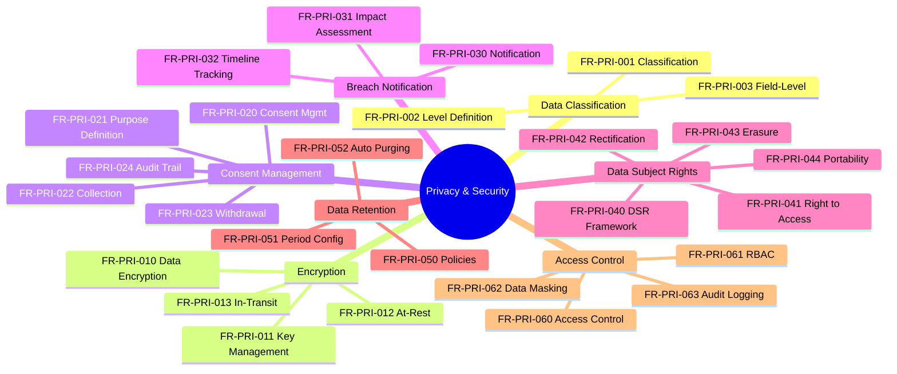

---
# === METADATA ===
id: FRS-CO-PRIVACY
module: CORE
sub_module: PRIVACY_SECURITY
title: "Privacy & Security Requirements"
version: "1.0.0"
status: DRAFT
owner: "Core HR Team"
last_updated: "2026-01-08"
tags:
  - privacy
  - security
  - gdpr
  - pdpa
  - data-classification
  - encryption
  - consent
  - compliance

# === REQUIREMENTS DATA ===
requirements:
  # Data Classification (3 FRs)
  - id: FR-PRI-001
    title: "Data Classification"
    description: "System must classify all data fields by sensitivity level."
    priority: MUST
    type: Configuration
    risk: high
    status: TODO
    acceptance_criteria:
      - "All data fields classified: PUBLIC, INTERNAL, CONFIDENTIAL, RESTRICTED"
      - "Classification based on GDPR/PDPA sensitivity"
      - "Classification metadata stored and queryable"
    dependencies:
      - "[[Worker]]"
      - "[[Employee]]"
    implemented_by: []

  - id: FR-PRI-002
    title: "Classification Level Definition"
    description: "System must define and configure classification levels."
    priority: MUST
    type: Configuration
    risk: medium
    status: TODO
    acceptance_criteria:
      - "Four classification levels: PUBLIC, INTERNAL, CONFIDENTIAL, RESTRICTED"
      - "Level definitions documented"
      - "Access requirements per level defined"
    dependencies:
      - "[[CodeList]]"
    implemented_by: []

  - id: FR-PRI-003
    title: "Field-Level Classification"
    description: "System must support field-level data classification."
    priority: MUST
    type: Functional
    risk: high
    status: TODO
    acceptance_criteria:
      - "Each field tagged with classification level"
      - "Classification enforceable at API level"
      - "Classification visible to developers and administrators"
    dependencies: []
    implemented_by: []

  # Encryption (4 FRs)
  - id: FR-PRI-010
    title: "Data Encryption"
    description: "System must encrypt sensitive data at rest and in transit."
    priority: MUST
    type: Functional
    risk: high
    status: TODO
    acceptance_criteria:
      - "CONFIDENTIAL and RESTRICTED data encrypted at rest"
      - "All data encrypted in transit (TLS 1.2+)"
      - "Encryption standards: AES-256 for at-rest, TLS 1.3 for transit"
    dependencies: []
    implemented_by: []

  - id: FR-PRI-011
    title: "Encryption Key Management"
    description: "System must manage encryption keys securely."
    priority: MUST
    type: Configuration
    risk: high
    status: TODO
    acceptance_criteria:
      - "Keys stored in secure key vault (e.g., AWS KMS, Azure Key Vault)"
      - "Key rotation policy enforced (90-180 days)"
      - "Key access logged"
    dependencies: []
    implemented_by: []

  - id: FR-PRI-012
    title: "At-Rest Encryption"
    description: "System must encrypt data at rest in databases and file storage."
    priority: MUST
    type: Functional
    risk: high
    status: TODO
    acceptance_criteria:
      - "Database encryption enabled (TDE or equivalent)"
      - "File storage encryption enabled"
      - "Backup encryption enabled"
    dependencies: []
    implemented_by: []

  - id: FR-PRI-013
    title: "In-Transit Encryption"
    description: "System must encrypt all data in transit."
    priority: MUST
    type: Functional
    risk: high
    status: TODO
    acceptance_criteria:
      - "HTTPS enforced for all web traffic"
      - "TLS 1.2 minimum, TLS 1.3 recommended"
      - "Certificate validation enforced"
      - "Internal service communication encrypted"
    dependencies: []
    implemented_by: []

  # Consent Management (5 FRs)
  - id: FR-PRI-020
    title: "Employee Consent Management"
    description: "System must manage employee consent for data processing."
    priority: MUST
    type: Functional
    risk: high
    status: TODO
    acceptance_criteria:
      - "Consent captured per purpose (processing, marketing, analytics)"
      - "Consent date and version recorded"
      - "Consent proof stored"
      - "Withdrawal process supported"
    dependencies:
      - "[[Worker]]"
    implemented_by: []

  - id: FR-PRI-021
    title: "Consent Purpose Definition"
    description: "System must define consent purposes."
    priority: MUST
    type: Configuration
    risk: medium
    status: TODO
    acceptance_criteria:
      - "Consent purposes configurable"
      - "Common purposes: DATA_PROCESSING, MARKETING, ANALYTICS, THIRD_PARTY_SHARING"
      - "Purpose descriptions clear and compliant"
    dependencies:
      - "[[CodeList]]"
    implemented_by: []

  - id: FR-PRI-022
    title: "Consent Collection Workflow"
    description: "System must support consent collection workflow."
    priority: MUST
    type: Workflow
    risk: high
    status: TODO
    acceptance_criteria:
      - "Consent collection at onboarding"
      - "Re-consent on policy changes"
      - "Consent language in employee's preferred language"
      - "Proof of consent stored (timestamp, IP, device)"
    dependencies:
      - "[[Worker]]"
    implemented_by: []

  - id: FR-PRI-023
    title: "Consent Withdrawal"
    description: "System must support consent withdrawal."
    priority: MUST
    type: Workflow
    risk: high
    status: TODO
    acceptance_criteria:
      - "Withdrawal request workflow"
      - "Withdrawal effective date recorded"
      - "Impact assessment triggered"
      - "Confirmation sent to employee"
    dependencies:
      - "[[Worker]]"
    implemented_by: []

  - id: FR-PRI-024
    title: "Consent Audit Trail"
    description: "System must maintain consent audit trail."
    priority: MUST
    type: Functional
    risk: medium
    status: TODO
    acceptance_criteria:
      - "All consent actions logged"
      - "Log includes: action, timestamp, user, purpose, version"
      - "Audit trail queryable and exportable"
    dependencies: []
    implemented_by: []

  # Data Breach Notification (3 FRs)
  - id: FR-PRI-030
    title: "Data Breach Notification"
    description: "System must support data breach notification workflow."
    priority: MUST
    type: Workflow
    risk: high
    status: TODO
    acceptance_criteria:
      - "Breach incident logging"
      - "Notification workflow to DPO, affected individuals, authorities"
      - "72-hour notification deadline tracked"
      - "Breach severity assessment"
    dependencies: []
    implemented_by: []

  - id: FR-PRI-031
    title: "Breach Impact Assessment"
    description: "System should support breach impact assessment."
    priority: SHOULD
    type: Functional
    risk: medium
    status: TODO
    acceptance_criteria:
      - "Number of affected individuals calculated"
      - "Data types involved identified"
      - "Severity score calculated"
      - "Recommended actions generated"
    dependencies: []
    implemented_by: []

  - id: FR-PRI-032
    title: "Notification Timeline Tracking"
    description: "System must track notification timelines for compliance."
    priority: MUST
    type: Workflow
    risk: high
    status: TODO
    acceptance_criteria:
      - "Breach discovery date recorded"
      - "72-hour GDPR deadline calculated"
      - "Notification dates tracked (DPO, individuals, authority)"
      - "Compliance status visible"
    dependencies: []
    implemented_by: []

  # Data Subject Rights (5 FRs)
  - id: FR-PRI-040
    title: "Data Subject Rights"
    description: "System must support GDPR/PDPA data subject rights."
    priority: MUST
    type: Functional
    risk: high
    status: TODO
    acceptance_criteria:
      - "Rights workflow: Access, Rectification, Erasure, Portability"
      - "Request logging and tracking"
      - "30-day response deadline tracked"
      - "Request status visible to employee and HR"
    dependencies:
      - "[[Worker]]"
    implemented_by: []

  - id: FR-PRI-041
    title: "Right to Access"
    description: "System must support right to access (GDPR Art. 15)."
    priority: MUST
    type: Functional
    risk: high
    status: TODO
    acceptance_criteria:
      - "Employee can request complete data export"
      - "Export includes all personal data held"
      - "Export format: PDF or machine-readable (JSON, CSV)"
      - "Delivered within 30 days"
    dependencies:
      - "[[Worker]]"
    implemented_by: []

  - id: FR-PRI-042
    title: "Right to Rectification"
    description: "System must support right to rectification (GDPR Art. 16)."
    priority: MUST
    type: Functional
    risk: medium
    status: TODO
    acceptance_criteria:
      - "Employee can request data corrections"
      - "Request routed to HR for approval"
      - "Approved changes applied with audit trail"
      - "Confirmation sent to employee"
    dependencies:
      - "[[Worker]]"
    implemented_by: []

  - id: FR-PRI-043
    title: "Right to Erasure"
    description: "System must support right to erasure/be forgotten (GDPR Art. 17)."
    priority: MUST
    type: Workflow
    risk: high
    status: TODO
    acceptance_criteria:
      - "Erasure request workflow"
      - "Legal retention period validation"
      - "Data purged from all systems if approved"
      - "Confirmation of erasure sent"
    dependencies:
      - "[[Worker]]"
    implemented_by: []

  - id: FR-PRI-044
    title: "Right to Portability"
    description: "System should support right to data portability (GDPR Art. 20)."
    priority: SHOULD
    type: Functional
    risk: medium
    status: TODO
    acceptance_criteria:
      - "Export in machine-readable format (JSON, XML, CSV)"
      - "Data structured and standardized"
      - "Directly transferable to another system"
    dependencies:
      - "[[Worker]]"
    implemented_by: []

  # Data Retention (3 FRs)
  - id: FR-PRI-050
    title: "Data Retention Policies"
    description: "System should support configurable data retention policies."
    priority: SHOULD
    type: Configuration
    risk: medium
    status: TODO
    acceptance_criteria:
      - "Retention policies per data type/entity"
      - "Retention period configurable (e.g., 7 years for payroll)"
      - "Policy effective dates tracked"
    dependencies: []
    implemented_by: []

  - id: FR-PRI-051
    title: "Retention Period Configuration"
    description: "System should configure retention periods by jurisdiction."
    priority: SHOULD
    type: Configuration
    risk: medium
    status: TODO
    acceptance_criteria:
      - "Retention periods per country/jurisdiction"
      - "Legal requirements documented"
      - "Override capability for legal holds"
    dependencies:
      - "[[Country]]"
    implemented_by: []

  - id: FR-PRI-052
    title: "Automated Data Purging"
    description: "System could support automated data purging."
    priority: COULD
    type: Workflow
    risk: low
    status: TODO
    acceptance_criteria:
      - "Scheduled purge jobs"
      - "Retention period expiry detection"
      - "Archive before purge"
      - "Purge confirmation and logging"
    dependencies: []
    implemented_by: []

  # Access Control (5 FRs)
  - id: FR-PRI-060
    title: "Access Control"
    description: "System must enforce role-based access control."
    priority: MUST
    type: Functional
    risk: high
    status: TODO
    acceptance_criteria:
      - "Access based on role and data classification"
      - "Principle of least privilege enforced"
      - "Access denied by default"
      - "Access matrix documented"
    dependencies: []
    implemented_by: []

  - id: FR-PRI-061
    title: "Role-Based Access Control"
    description: "System must implement RBAC for data access."
    priority: MUST
    type: Configuration
    risk: high
    status: TODO
    acceptance_criteria:
      - "Roles defined: EMPLOYEE, MANAGER, HR, DPO, SYSTEM_ADMIN"
      - "Permissions assigned per role"
      - "Role assignments audited"
      - "Role-field access matrix enforced"
    dependencies: []
    implemented_by: []

  - id: FR-PRI-062
    title: "Data Masking"
    description: "System should support data masking for sensitive fields."
    priority: SHOULD
    type: Functional
    risk: medium
    status: TODO
    acceptance_criteria:
      - "Sensitive fields masked in UI (e.g., ID: ***-1234)"
      - "Full value accessible with permission"
      - "Masking applied in exports unless authorized"
    dependencies: []
    implemented_by: []

  - id: FR-PRI-063
    title: "Audit Logging"
    description: "System must log all access to sensitive data."
    priority: MUST
    type: Functional
    risk: high
    status: TODO
    acceptance_criteria:
      - "All data access logged: user, timestamp, action, data accessed"
      - "Logs immutable"
      - "Logs retained per compliance requirements (minimum 2 years)"
      - "Logs queryable for investigations"
    dependencies: []
    implemented_by: []

# === ONTOLOGY REFERENCES ===
related_ontology:
  - "[[Worker]]"
  - "[[Employee]]"
  - "[[CodeList]]"
  - "[[Country]]"
---

# Functional Requirements: Privacy & Security

> **Scope**: This FRS file defines all functional requirements for Privacy & Security in the Core module. These requirements cover GDPR/PDPA compliance including data classification, encryption, consent management, breach notification, data subject rights, retention policies, and access control.

## 1. Functional Scope



## 2. Requirement Catalog

| ID | Requirement Detail | Priority | Type |
|----|-------------------|----------|------|
| `[[FR-PRI-001]]` | **Data Classification**<br>Classify all data fields by sensitivity level | MUST | Configuration |
| `[[FR-PRI-002]]` | **Classification Level Definition**<br>Define and configure classification levels | MUST | Configuration |
| `[[FR-PRI-003]]` | **Field-Level Classification**<br>Support field-level data classification | MUST | Functional |
| `[[FR-PRI-010]]` | **Data Encryption**<br>Encrypt sensitive data at rest and in transit | MUST | Functional |
| `[[FR-PRI-011]]` | **Encryption Key Management**<br>Manage encryption keys securely | MUST | Configuration |
| `[[FR-PRI-012]]` | **At-Rest Encryption**<br>Encrypt data in databases and file storage | MUST | Functional |
| `[[FR-PRI-013]]` | **In-Transit Encryption**<br>Encrypt all data in transit | MUST | Functional |
| `[[FR-PRI-020]]` | **Employee Consent Management**<br>Manage employee consent for data processing | MUST | Functional |
| `[[FR-PRI-021]]` | **Consent Purpose Definition**<br>Define consent purposes | MUST | Configuration |
| `[[FR-PRI-022]]` | **Consent Collection Workflow**<br>Support consent collection workflow | MUST | Workflow |
| `[[FR-PRI-023]]` | **Consent Withdrawal**<br>Support consent withdrawal | MUST | Workflow |
| `[[FR-PRI-024]]` | **Consent Audit Trail**<br>Maintain consent audit trail | MUST | Functional |
| `[[FR-PRI-030]]` | **Data Breach Notification**<br>Support data breach notification workflow | MUST | Workflow |
| `[[FR-PRI-031]]` | **Breach Impact Assessment**<br>Support breach impact assessment | SHOULD | Functional |
| `[[FR-PRI-032]]` | **Notification Timeline Tracking**<br>Track notification timelines for compliance | MUST | Workflow |
| `[[FR-PRI-040]]` | **Data Subject Rights**<br>Support GDPR/PDPA data subject rights | MUST | Functional |
| `[[FR-PRI-041]]` | **Right to Access**<br>Support right to access (GDPR Art. 15) | MUST | Functional |
| `[[FR-PRI-042]]` | **Right to Rectification**<br>Support right to rectification (GDPR Art. 16) | MUST | Functional |
| `[[FR-PRI-043]]` | **Right to Erasure**<br>Support right to erasure (GDPR Art. 17) | MUST | Workflow |
| `[[FR-PRI-044]]` | **Right to Portability**<br>Support right to data portability (GDPR Art. 20) | SHOULD | Functional |
| `[[FR-PRI-050]]` | **Data Retention Policies**<br>Support configurable data retention policies | SHOULD | Configuration |
| `[[FR-PRI-051]]` | **Retention Period Configuration**<br>Configure retention periods by jurisdiction | SHOULD | Configuration |
| `[[FR-PRI-052]]` | **Automated Data Purging**<br>Support automated data purging | COULD | Workflow |
| `[[FR-PRI-060]]` | **Access Control**<br>Enforce role-based access control | MUST | Functional |
| `[[FR-PRI-061]]` | **Role-Based Access Control**<br>Implement RBAC for data access | MUST | Configuration |
| `[[FR-PRI-062]]` | **Data Masking**<br>Support data masking for sensitive fields | SHOULD | Functional |
| `[[FR-PRI-063]]` | **Audit Logging**<br>Log all access to sensitive data | MUST | Functional |

## 3. Detailed Specifications

### [[FR-PRI-001]] Data Classification

*   **Description**: System must classify all data fields by sensitivity level according to GDPR/PDPA requirements to enable appropriate security controls and access restrictions.
*   **Acceptance Criteria**:
    *   All data fields classified using four levels: PUBLIC, INTERNAL, CONFIDENTIAL, RESTRICTED
    *   Classification based on GDPR/PDPA Personal Data sensitivity guidelines
    *   Classification metadata stored in data dictionary and queryable
    *   Classification visible to developers, administrators, and compliance teams
    *   Classification drives encryption, access control, and masking decisions
*   **Dependencies**: [[Worker]], [[Employee]]
*   **Enforces**: GDPR/PDPA compliance requirements

---

### [[FR-PRI-010]] Data Encryption

*   **Description**: System must encrypt sensitive data at rest (in databases and storage) and in transit (over networks) to prevent unauthorized access.
*   **Acceptance Criteria**:
    *   CONFIDENTIAL and RESTRICTED data encrypted at rest using AES-256
    *   All data encrypted in transit using TLS 1.2 minimum, TLS 1.3 recommended
    *   Database-level encryption (TDE) or application-level encryption
    *   File storage encryption for documents and attachments
    *   Encryption standards documented and auditable
*   **Dependencies**: None
*   **Enforces**: Security and compliance requirements

---

### [[FR-PRI-020]] Employee Consent Management

*   **Description**: System must manage employee consent for data processing activities in compliance with GDPR/PDPA consent requirements.
*   **Acceptance Criteria**:
    *   Consent captured per purpose: DATA_PROCESSING, MARKETING, ANALYTICS, THIRD_PARTY_SHARING
    *   Consent date, version, and grantor (employee) recorded
    *   Proof of consent stored including timestamp, IP address, device information
    *   Withdrawal process supported with impact assessment
    *   Consent status visible on employee profile
    *   Re-consent triggered on privacy policy changes
*   **Dependencies**: [[Worker]]
*   **Enforces**: GDPR Art. 7, PDPA consent requirements

---

### [[FR-PRI-041]] Right to Access

*   **Description**: System must support employee's right to access their personal data (GDPR Article 15) by providing complete data export capability.
*   **Acceptance Criteria**:
    *   Employee can submit data access request through self-service portal
    *   System generates complete export of all personal data held
    *   Export formats: PDF (human-readable) or machine-readable (JSON, CSV)
    *   Export includes data from all modules (Core, Payroll, Time, Benefits)
    *   Request processed and delivered within 30 days (GDPR requirement)
    *   Request logged in audit trail
*   **Dependencies**: [[Worker]]
*   **Enforces**: GDPR Article 15, PDPA right to access

---

### [[FR-PRI-060]] Access Control

*   **Description**: System must enforce role-based access control (RBAC) with access decisions based on user role and data classification level.
*   **Acceptance Criteria**:
    *   Access control matrix defined: Role × Classification Level → Allow/Deny
    *   Principle of least privilege enforced (minimum necessary access)
    *   Access denied by default (explicit grant required)
    *   Role definitions: EMPLOYEE, MANAGER, HR, DPO, SYSTEM_ADMIN
    *   Field-level access control enforced at API and UI layers
    *   Access violations logged and alerted
*   **Dependencies**: None
*   **Enforces**: Security best practices, compliance requirements

---

## 4. Requirement Hierarchy

```mermaid
requirementDiagram

    %% === STYLING ===
    classDef epic fill:#e1bee7,stroke:#7b1fa2,stroke-width:2px
    classDef fr fill:#e3f2fd,stroke:#1565c0,stroke-width:2px
    classDef entity fill:#e8f5e9,stroke:#2e7d32,stroke-width:2px

    %% === CAPABILITY ===
    requirement PrivacySecurity {
        id: FRS_CO_PRIVACY
        text: "GDPR/PDPA compliance with data protection and privacy controls"
        risk: high
        verifymethod: demonstration
    }:::epic

    %% === CORE REQUIREMENTS ===
    functionalRequirement DataClassification {
        id: FR_PRI_001
        text: "Classify data by sensitivity"
        risk: high
        verifymethod: test
    }:::fr

    functionalRequirement DataEncryption {
        id: FR_PRI_010
        text: "Encrypt data at rest and in transit"
        risk: high
        verifymethod: test
    }:::fr

    functionalRequirement ConsentManagement {
        id: FR_PRI_020
        text: "Manage employee consent"
        risk: high
        verifymethod: test
    }:::fr

    functionalRequirement RightToAccess {
        id: FR_PRI_041
        text: "Support right to access"
        risk: high
        verifymethod: test
    }:::fr

    functionalRequirement AccessControl {
        id: FR_PRI_060
        text: "Enforce RBAC"
        risk: high
        verifymethod: test
    }:::fr

    %% === ENTITIES ===
    element Worker {
        type: "Aggregate Root"
        docref: "worker.onto.md"
    }:::entity

    element Employee {
        type: "Aggregate Root"
        docref: "employee.onto.md"
    }:::entity

    %% === RELATIONSHIPS ===
    PrivacySecurity - contains -> DataClassification
    PrivacySecurity - contains -> DataEncryption
    PrivacySecurity - contains -> ConsentManagement
    PrivacySecurity - contains -> RightToAccess
    PrivacySecurity - contains -> AccessControl

    DataClassification - traces -> Worker
    DataClassification - traces -> Employee
    ConsentManagement - traces -> Worker
    RightToAccess - traces -> Worker
```

---

## 5. Business Rules Reference

| FR ID | Related Business Rules |
|-------|----------------------|
| FR-PRI-001 | Data classification rules (see 10-privacy.brs.md) |
| FR-PRI-010 | Encryption requirements |
| FR-PRI-020 | Consent management rules |
| FR-PRI-041 | Data subject rights rules |
| FR-PRI-060 | Access control matrix |

---

## 6. Compliance Mapping

| Requirement | GDPR Article | PDPA Section |
|-------------|--------------|--------------|
| FR-PRI-020 to FR-PRI-024 | Article 7 (Consent) | Section 13 (Consent) |
| FR-PRI-030 to FR-PRI-032 | Article 33-34 (Breach Notification) | Section 26 (Data Breach) |
| FR-PRI-041 | Article 15 (Right to Access) | Section 21 (Access) |
| FR-PRI-042 | Article 16 (Right to Rectification) | Section 22 (Correction) |
| FR-PRI-043 | Article 17 (Right to Erasure) | N/A |
| FR-PRI-044 | Article 20 (Right to Portability) | N/A |
| FR-PRI-063 | Article 30 (Records of Processing) | Section 24 (Accountability) |
