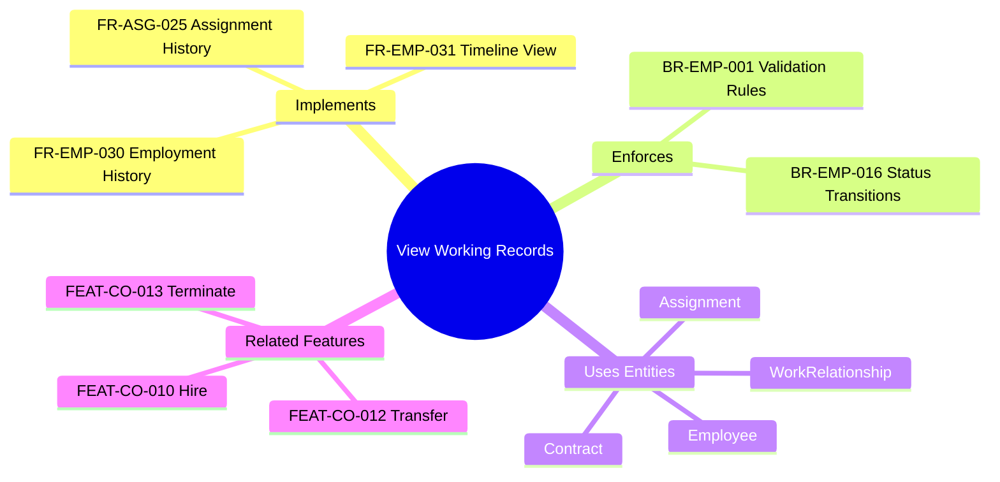
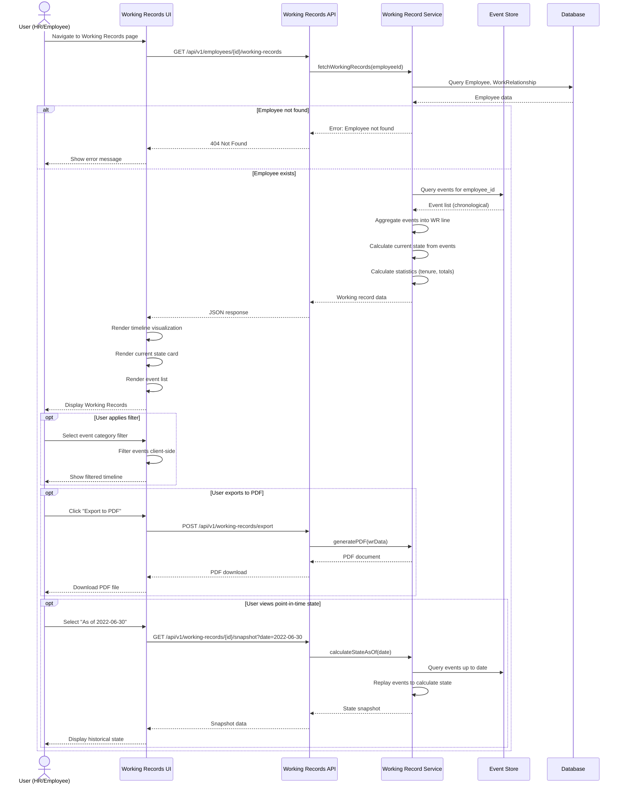

---
# === METADATA ===
id: FEAT-CO-014
type: FEATURE
module: CORE
sub_module: EMPLOYMENT
title: "View Working Records (Hồ Sơ Làm Việc)"
version: "1.0.0"
status: DRAFT
priority: MEDIUM
phase: 1

# === ACTORS ===
actors:
  - HR Administrator
  - HR Manager
  - Employee
  - Auditor

# === TRIGGERS ===
triggers:
  - "User clicks 'View Working Records' on employee profile"
  - "User navigates to Working Records page"
  - "Manager requests employment history for team member"

# === PRE-CONDITIONS ===
preconditions:
  - "User is authenticated and authorized"
  - "Employee record exists"
  - "User has permission to view employment data"

# === POST-CONDITIONS ===
postconditions:
  - "Complete Working Record timeline displayed"
  - "All employment events shown chronologically"
  - "Current employment state is accurate"

# === USER STORY ===
user_story:
  as: "HR Administrator"
  i_want: "view a comprehensive timeline of all employment-related events for an employee"
  so_that: "I can track their complete employment history, understand career progression, and make informed decisions"

# === ACCEPTANCE CRITERIA (Gherkin) ===
acceptance_criteria:
  - scenario: "View working records for active employee"
    given: "Employee EMP-2024-001 has 15 employment events (hire, promotions, transfers)"
    when: "HR Admin opens working records for EMP-2024-001"
    then: "All 15 events are displayed chronologically with full details AND current employment state is shown"
  
  - scenario: "View working records for rehired employee"
    given: "Worker has two employment periods (EMP-2020-050 terminated, EMP-2024-075 active)"
    when: "HR Admin views working records"
    then: "Both Working Record lines are displayed AND total service time is calculated across both employments"
  
  - scenario: "Filter events by category"
    given: "Employee has 25 events across multiple categories (job assignment, compensation, leave)"
    when: "User filters by 'Job Assignment' events only"
    then: "Only promotion, transfer, and position change events are displayed"
  
  - scenario: "Export working records"
    given: "Employee has complete working record history"
    when: "User clicks 'Export to PDF'"
    then: "Complete working record timeline is exported as PDF document"
  
  - scenario: "View point-in-time state"
    given: "Employee has 20 events from 2020-2024"
    when: "User selects 'View state as of 2022-06-30'"
    then: "Employment state (job, salary, location) as of that date is displayed"

# === DATA CONTRACT ===
data_contract:
  input:
    employeeId: "string"
    workerId: "string?"
    dateRange:
      startDate: "date?"
      endDate: "date?"
    filters:
      eventCategories: "string[]?"
      eventTypes: "string[]?"
    viewOptions:
      includeAllEmployments: "boolean"
      groupByEmployment: "boolean"
      asOfDate: "date?"
  
  output:
    workingRecords:
      - wrId: "string"
        employeeId: "string"
        employeeCode: "string"
        workerId: "string"
        employmentStartDate: "date"
        employmentEndDate: "date?"
        isCurrent: "boolean"
        totalEvents: "number"
        yearsOfService: "number"
        events:
          - eventId: "string"
            eventType: "string"
            eventCategory: "string"
            effectiveDate: "date"
            timestamp: "datetime"
            summary: "string"
            details: "object"
        currentState:
          jobId: "string"
          jobTitle: "string"
          grade: "string"
          businessUnitId: "string"
          businessUnitName: "string"
          baseSalary: "number"
          locationId: "string"
          employmentStatus: "string"
    aggregatedSummary:
      totalEmployments: "number"
      totalServiceYears: "number"
      totalEvents: "number"
      firstHireDate: "date"
      currentStatus: "string"

# === REFERENCES TO EXTERNAL DOCS ===
requirements:
  - "[[FR-EMP-020]]"  # Employment History Tracking
  - "[[FR-EMP-030]]"  # Employment History Tracking (detailed)
  - "[[FR-EMP-031]]"  # Employment Timeline View
  - "[[FR-ASG-025]]"  # Track assignment history

business_rules:
  - "[[BR-EMP-001]]"  # Employee Creation Validation
  - "[[BR-EMP-016]]"  # Employee Status Transitions

related_ontology:
  - "[[Employee]]"
  - "[[WorkRelationship]]"
  - "[[Assignment]]"
  - "[[Contract]]"
  - "[[Worker]]"

related_features:
  - "[[FEAT-CO-010]]"  # Hire Employee
  - "[[FEAT-CO-012]]"  # Transfer Employee
  - "[[FEAT-CO-013]]"  # Terminate Employment

concept_guides:
  - "01-concept/12-working-record-processing-guide.md"
---

# View Working Records (Hồ Sơ Làm Việc)

> **Feature**: Comprehensive employment history tracking and visualization through event-driven working records

## 1. Overview



## 2. User Story

**As an** HR Administrator  
**I want to** view a comprehensive timeline of all employment-related events for an employee  
**So that** I can track their complete employment history, understand career progression, and make informed decisions about promotions, compensation, and development

## 3. Business Context

### Purpose
Working Records (Hồ Sơ Làm Việc) provides a complete, chronological view of an employee's journey within the organization. This event-driven system captures every significant employment change—from hiring to termination—creating an immutable audit trail that supports:

- **HR Decision Making**: Understand career progression for promotion and development decisions
- **Compliance & Auditing**: Complete audit trail for labor law compliance
- **Talent Analytics**: Track patterns in career paths, tenure, and turnover
- **Employee Self-Service**: Transparency in employment history

### Key Stakeholders
- **HR Administrators**: Track employment lifecycle, process changes
- **HR Managers**: Analyze career progression, make talent decisions
- **Employees**: View personal employment history
- **Auditors**: Verify compliance, investigate discrepancies

## 4. Acceptance Criteria

### Scenario 1: View working records for active employee

```gherkin
Given Employee EMP-2024-001 has 15 employment events
  | Event Type          | Date       |
  | HIRE                | 2024-01-01 |
  | PROBATION_END       | 2024-03-01 |
  | PROMOTION           | 2024-07-01 |
  | SALARY_INCREASE     | 2024-12-01 |
  | TRANSFER            | 2024-10-01 |
When HR Admin opens working records for EMP-2024-001
Then All 15 events are displayed chronologically with full details
  AND current employment state shows:
    | Field              | Value              |
    | Job                | Lead Engineer      |
    | Grade              | G4                 |
    | Business Unit      | Platform Team      |
    | Status             | ACTIVE             |
    | Years of Service   | 0.95               |
```

### Scenario 2: View working records for rehired employee

```gherkin
Given Worker WORKER-002 has two employment periods:
  | Employee Code | Period              | Status      | Events |
  | EMP-2020-050  | 2020-01-01 to 2022-12-31 | TERMINATED  | 25     |
  | EMP-2024-075  | 2024-01-01 to present    | ACTIVE      | 8      |
When HR Admin views working records for WORKER-002
Then Both Working Record lines are displayed
  AND total service time is calculated: 3.95 years
  AND gap period is shown: 1.0 years (2023-01-01 to 2023-12-31)
  AND career progression across both employments is visible
```

### Scenario 3: Filter events by category

```gherkin
Given Employee has 25 events across multiple categories:
  | Category        | Count |
  | JOB_ASSIGNMENT  | 8     |
  | COMPENSATION    | 6     |
  | LEAVE           | 4     |
  | CONTRACT        | 5     |
  | PERSONAL_DATA   | 2     |
When User filters by "Job Assignment" events only
Then Only 8 events are displayed (promotions, transfers, position changes)
  AND event count shows "8 of 25 events"
  AND filter tags are clearly visible
```

### Scenario 4: Export working records

```gherkin
Given Employee has complete working record history (30 events)
When User clicks "Export to PDF"
Then PDF document is generated containing:
  | Section                | Content                              |
  | Header                 | Employee name, code, photo           |
  | Summary                | Hire date, tenure, current status    |
  | Timeline               | All events chronologically           |
  | Current State          | Job, grade, salary, location         |
  | Footer                 | Generated timestamp, authorized by   |
```

### Scenario 5: View point-in-time state

```gherkin
Given Employee has 20 events from 2020-01-01 to 2024-12-31
When User selects "View state as of 2022-06-30"
Then Employment state as of that date is displayed:
  | Field         | Value (as of 2022-06-30)  |
  | Job           | Senior Engineer             |
  | Grade         | G2                          |
  | Salary        | 70,000,000 VND              |
  | Business Unit | Backend Team                |
  | Location      | HCM Office                  |
  AND user can navigate forward/backward through time
  AND current date indicator is clearly marked
```

## 5. Data Contract

### Input Schema (JSON5)

```json5
{
  // Employee/Worker identification (at least one required)
  employeeId: "e7f45c23-1234-5678-90ab-cdef12345678",  // UUID
  workerId: "w9a12b34-5678-90cd-ef12-3456789abcdef",   // UUID (optional, for worker-level view)
  
  // Date range filter (optional)
  dateRange: {
    startDate: "2020-01-01",      // ISO date
    endDate: "2024-12-31",        // ISO date
  },
  
  // Event filters (optional)
  filters: {
    eventCategories: ["JOB_ASSIGNMENT", "COMPENSATION"],  // Array of category codes
    eventTypes: ["PROMOTION", "SALARY_INCREASE"],         // Array of event type codes
  },
  
  // View options
  viewOptions: {
    includeAllEmployments: true,        // For workers with multiple employments
    groupByEmployment: true,            // Group events by employment period
    asOfDate: "2022-06-30",            // Point-in-time snapshot (optional)
  }
}
```

### Output Schema (JSON5)

```json5
{
  // Working record lines (one per employment)
  workingRecords: [
    {
      wrId: "wr-2024-001",
      employeeId: "e7f45c23-1234-5678-90ab-cdef12345678",
      employeeCode: "EMP-2024-001",
      workerId: "w9a12b34-5678-90cd-ef12-3456789abcdef",
      
      // Employment period
      employmentStartDate: "2024-01-01",
      employmentEndDate: null,              // null = active
      isCurrent: true,
      
      // Statistics
      totalEvents: 15,
      yearsOfService: 0.95,
      
      // Event timeline
      events: [
        {
          eventId: "evt-2024-001",
          eventType: "HIRE",
          eventCategory: "EMPLOYMENT_LIFECYCLE",
          effectiveDate: "2024-01-01",
          timestamp: "2024-01-01T09:00:00Z",
          summary: "Hired as Junior Engineer",
          details: {
            jobId: "job-junior-eng",
            grade: "G1",
            baseSalary: 50000000,
            businessUnitId: "bu-engineering",
            locationId: "loc-hcm-hq",
          }
        },
        {
          eventId: "evt-2024-007",
          eventType: "PROMOTION",
          eventCategory: "JOB_ASSIGNMENT",
          effectiveDate: "2024-07-01",
          timestamp: "2024-06-28T10:00:00Z",
          summary: "Promoted to Lead Engineer (G2→G4)",
          details: {
            previousJobId: "job-senior-eng",
            newJobId: "job-lead-eng",
            previousGrade: "G2",
            newGrade: "G4",
            salaryIncrease: 40000000,  // 80M → 120M
            reasonCode: "PERFORMANCE",
          }
        }
        // ... more events
      ],
      
      // Current state (derived from events)
      currentState: {
        jobId: "job-lead-eng",
        jobTitle: "Lead Backend Engineer",
        grade: "G4",
        businessUnitId: "bu-platform",
        businessUnitName: "Platform Team",
        baseSalary: 120000000,
        locationId: "loc-hcm-d7",
        employmentStatus: "ACTIVE",
      }
    }
  ],
  
  // Aggregated summary (for worker-level view with multiple employments)
  aggregatedSummary: {
    totalEmployments: 2,
    totalServiceYears: 3.95,    // Across all employments
    totalEvents: 33,
    firstHireDate: "2020-01-01",
    currentStatus: "ACTIVE",
  }
}
```

## 6. Activities Flow



## 7. UI Sketch

### Desktop View - Working Records Timeline

```
┌─────────────────────────────────────────────────────────────────────────────────┐
│  [← Back to Employee Profile]    Working Records - Nguyễn Văn An (EMP-2024-001) │
├─────────────────────────────────────────────────────────────────────────────────┤
│                                                                                   │
│  ┌─────────────────────────────────────────────────────────────────────────────┐│
│  │  📊 CURRENT STATE                                      [Export PDF] [⚙️]    ││
│  ├─────────────────────────────────────────────────────────────────────────────┤│
│  │  Job: Lead Backend Engineer (G4)          Hired: 2024-01-01                 ││
│  │  Business Unit: Platform Team              Tenure: 11 months                ││
│  │  Location: District 7 Office              Status: 🟢 ACTIVE                 ││
│  │  Base Salary: 120,000,000 VND             Total Events: 15                  ││
│  └─────────────────────────────────────────────────────────────────────────────┘│
│                                                                                   │
│  ┌─────────────────────────────────────────────────────────────────────────────┐│
│  │  🔍 FILTERS & OPTIONS                                                       ││
│  ├─────────────────────────────────────────────────────────────────────────────┤│
│  │  Event Category: [All ▼] [JOB_ASSIGNMENT] [COMPENSATION] [LEAVE] [CONTRACT]││
│  │  Date Range: [2024-01-01] to [2024-12-31]                                  ││
│  │  View as of date: [ ] Enable ─── [Select Date...]                          ││
│  └─────────────────────────────────────────────────────────────────────────────┘│
│                                                                                   │
│  ┌─────────────────────────────────────────────────────────────────────────────┐│
│  │  📅 EMPLOYMENT TIMELINE                                    Showing 15 events ││
│  ├─────────────────────────────────────────────────────────────────────────────┤│
│  │                                                                              ││
│  │  2024 ───────────────────────────────────────────────────────────────────→  ││
│  │   │                                                                          ││
│  │   ●  01/01 - HIRE                                                           ││
│  │   │  Hired as Junior Engineer (G1) • Backend Team • 50M VND                 ││
│  │   │  Contract: PROBATION • Manager: Mai Thị Bình                            ││
│  │   │                                                                          ││
│  │   ●  03/01 - PROBATION_END                                                  ││
│  │   │  Probation successfully completed • Contract: PERMANENT                 ││
│  │   │                                                                          ││
│  │   ●  07/01 - PROMOTION ⭐                                                   ││
│  │   │  Promoted to Lead Engineer (G2→G4) • Salary: 80M → 120M (+50%)          ││
│  │   │  Reason: Exceptional Performance • Business Unit: Platform Team         ││
│  │   │  [View Details]                                                         ││
│  │   │                                                                          ││
│  │   ●  10/01 - TRANSFER                                                       ││
│  │   │  Transferred to Platform Team • Location: HCM HQ → District 7           ││
│  │   │  Same job/grade maintained                                              ││
│  │   │                                                                          ││
│  │   ●  12/01 - SALARY_INCREASE 💰                                            ││
│  │   │  Annual review increase: 120M → 135M (+12.5%)                           ││
│  │   │                                                                          ││
│  │   └  Present (Active)                                                       ││
│  │                                                                              ││
│  └─────────────────────────────────────────────────────────────────────────────┘│
│                                                                                   │
│  [Load More Events]                                           📄 15 of 15 events │
└─────────────────────────────────────────────────────────────────────────────────┘
```

### Mobile View - Condensed Timeline

```
┌────────────────────────────┐
│ ☰  Working Records    [•••]│
├────────────────────────────┤
│                            │
│ 📊 CURRENT STATE           │
│ ┌──────────────────────────┤
│ │ Lead Engineer (G4)       │
│ │ Platform Team            │
│ │ 🟢 ACTIVE • 11 mo tenure │
│ │ 120M VND                 │
│ └──────────────────────────┤
│                            │
│ 🔍 Filters: [All Events ▼]│
│                            │
│ ─────── TIMELINE ──────────│
│                            │
│ ● DEC 01, 2024             │
│   SALARY_INCREASE 💰       │
│   120M → 135M (+12.5%)     │
│   [Details →]              │
│                            │
│ ● OCT 01, 2024             │
│   TRANSFER                 │
│   → District 7 Office      │
│   [Details →]              │
│                            │
│ ● JUL 01, 2024             │
│   PROMOTION ⭐            │
│   Lead Engineer (G2→G4)    │
│   [Details →]              │
│                            │
│ ● MAR 01, 2024             │
│   PROBATION_END            │
│   [Details →]              │
│                            │
│ ● JAN 01, 2024             │
│   HIRE                     │
│   Junior Engineer (G1)     │
│   [Details →]              │
│                            │
│ [Export PDF] [Share]       │
└────────────────────────────┘
```

## 8. Business Rules

### Data Access Rules
- **[[BR-EMP-001]]**: Only authorized users can view working records
- Employees can view their own working records
- HR staff can view all employee working records within their business unit
- Auditors have read-only access to all working records

### Event Display Rules
- Events must be displayed in chronological order (oldest to newest, or newest to oldest)
- Each event must show: date, type, summary, and key details
- Sensitive information (salary) requires additional permission

### Worker-Level Aggregation Rules
- When viewing working records for a Worker with multiple employments:
  - Each employment has a separate Working Record line
  - Total service time is calculated across all employments
  - Gap periods between employments are clearly indicated

## 9. Data Requirements

### Primary Entities
- **[[Employee]]**: Core employee record with current state
- **[[WorkRelationship]]**: Employment relationship data
- **[[Assignment]]**: Job assignments and transfers
- **[[Contract]]**: Employment contracts

### Event Data
- All employment events are stored in the Event Store
- Events are immutable (append-only)
- Event categories: EMPLOYMENT_LIFECYCLE, JOB_ASSIGNMENT, COMPENSATION, CONTRACT, LEAVE, ORGANIZATIONAL, PERSONAL_DATA

### Calculated Fields
- **Years of Service**: Calculated from hire date to current date (or termination date)
- **Total Events**: Count of all events for the employment
- **Current State**: Derived by replaying all events chronologically

## 10. Technical Notes

### Performance Considerations
- Event queries should be indexed by `employee_id` and `effective_date`
- Consider caching current state snapshots to avoid recalculating from events
- For workers with many events (100+), implement pagination

### Export Functionality
- PDF export should include: employee photo, summary, complete timeline, current state
- Export should be watermarked with generation timestamp and authorized by user

### Point-in-Time Queries
- Enable "time travel" queries: "What was this employee's state on 2022-06-30?"
- Implement by replaying events up to the specified date
- Cache historical snapshots for common query dates (month-end, year-end)

## 11. Related Features

| Feature | Relationship | Description |
|---------|--------------|-------------|
| [[FEAT-CO-010]] | Creates events | Hire Employee creates HIRE events in working records |
| [[FEAT-CO-012]] | Creates events | Transfer creates TRANSFER and ASSIGNMENT events |
| [[FEAT-CO-013]] | Creates events | Termination creates TERMINATION event and closes WR line |
| [[FEAT-CO-011]] | Creates events | Contract creation/modification creates CONTRACT events |

## 12. Success Metrics

- **User Adoption**: % of HR staff using Working Records feature weekly
- **Data Completeness**: % of employees with complete event history
- **Query Performance**: Average page load time < 2 seconds
- **Export Usage**: Number of PDF exports per month
- **Audit Trail**: 100% of employment changes captured as events
